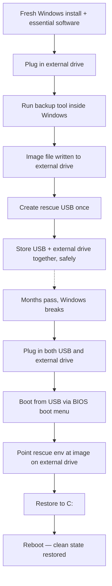

The pain point most people hit: Windows eventually gets messed up, you reinstall, and then spend an evening reinstalling Chrome, your editor, drivers, tools, fonts, and tweaking settings one by one. There's a cleaner solution that almost everyone has heard of but few have actually internalized: **system image backups**. This note walks through the full mental model — what it is, what the moving pieces actually do, and how to choose a tool.

## What a system image actually is

A **system image** (or *disk image*) is a single compressed file that captures the entire state of your C: drive: Windows itself, drivers, installed software, settings, registry, and files — bit for bit. Restoring it puts the drive back exactly the way it was at snapshot time, in 20-40 minutes.

The intended workflow:

1. Fresh Windows install
2. Install all your essential software (browser, editor, dev tools, drivers, etc.)
3. Capture a system image — this is your **"golden image"**
4. Months later, when Windows is broken or you just want a clean slate, restore the image
5. You're back to step 2's state, no manual reinstalling

## The two pieces of hardware involved

These get conflated constantly, so worth pinning down:

| Item | Size | Role |
|---|---|---|
| **Rescue USB** | Small (~1-8 GB) | A bootable USB containing the backup tool's recovery environment. Used only when *restoring* (since Windows can't overwrite itself while running) or when Windows is too broken to boot. |
| **External drive** | Large (HDD or SSD, 2-3× your used C: space) | Holds the actual image file. Plugged in during backup and restore. |

They serve different jobs. Some people combine them onto one large USB SSD, but conceptually they're separate.

## The full workflow



### Step 1 — Create the backup (Windows is healthy)

1. Plug the external drive into your machine
2. Open the backup tool as a normal Windows app
3. Set **source = C: drive**, **destination = external drive**
4. Start — the tool streams a compressed image onto the external drive
5. Unplug the drive when done and store it safely

Notes:

- The image is compressed. A C: drive with 100 GB used typically produces a 50-70 GB image.
- Speed is bottlenecked by the USB link. USB 3.0+ to an SSD finishes in ~20-40 min; USB 2.0 to a spinning HDD can take hours.

### Step 2 — Create the rescue USB (once, before disaster)

Inside the backup tool, find the "Create Rescue Media" (or similar) button. It writes a bootable recovery environment onto a small USB stick. Do this **immediately** after you install the tool, not later. If you only realize you need it when Windows won't boot, you'll be making it on someone else's computer.

The rescue USB is tied to the tool, not the image. You can reuse the same rescue USB to restore *any* image made by that tool.

### Step 3 — Restore (when Windows dies)

1. Plug in **both** the rescue USB and the external drive
2. Power on and tell the BIOS/UEFI to boot from the USB
3. The rescue environment loads (looks like a stripped-down Windows or Linux)
4. Point it at the image file on the external drive
5. Restore to C:, wait ~20-40 min
6. Unplug USB, reboot → clean state restored

The BIOS boot menu key varies by manufacturer:

- Dell — F12
- HP — F9
- Lenovo — F12 or Fn+F12
- ASUS — F8
- Most custom PCs — F11, or Del to enter BIOS first

When unsure, search "[your machine model] boot menu key".

## Gotchas worth knowing

- **Restore wipes C:.** Anything created *after* the snapshot — new documents, downloads, fresh installs — is gone unless backed up separately. Pair the system image with a file-level backup for `Documents`/`Desktop` (OneDrive, Syncthing, a second backup job).
- **BitLocker.** If your drive is BitLocker-encrypted, have the recovery key ready (Microsoft account → devices → BitLocker keys).
- **Secure Boot.** Some rescue tools need Secure Boot temporarily disabled in BIOS before they'll boot.
- **Test the restore once.** A backup you've never restored is a backup you don't know works. Every backup tool has worked perfectly for thousands of users *and* failed silently for a few. Try restoring to a spare drive or VM the first time, while the stakes are zero.
- **Keep multiple snapshots.** External drive sized at 2-3× your used C: space lets you keep a few generations — useful if a recent snapshot itself contains a problem.

## Picking a tool

The workflow is essentially identical across all tools. Differences are UI polish, compression quality, and how aggressively they upsell.

| Tool | Cost | Notes |
|---|---|---|
| **AOMEI Backupper Standard** | Free tier | Friendliest UI for first-timers. Wizard-driven, big labeled buttons. Chinese vendor, free version nags about upgrades. |
| **Veeam Agent for Windows** | Free for personal | Made by a serious enterprise backup vendor. Rock-solid. UI is slightly denser. |
| **Macrium Reflect X** | ~$70 | Historically the gold standard. Free version is discontinued. |
| **Clonezilla** | Free, open source | Boot from USB, image to external drive. Less friendly UI; CLI-flavored menus. |
| **Windows built-in ("Backup and Restore (Windows 7)")** | Free | Still in Windows 10/11. Works but Microsoft has deprecated it — risky to depend on long-term. |

**Beginner recommendation:** start with **AOMEI Backupper Standard**. If the nagware gets annoying, switch to **Veeam Agent for Windows Free**. Don't overthink it — the cost of switching is just remaking the rescue USB.

## A lighter alternative — scripted installs

Worth knowing even if you go with imaging: instead of (or alongside) a system image, you can script the software install.

- **winget** is built into Windows 11 and lets you install many apps unattended:

  ```powershell
  winget install Google.Chrome Microsoft.VisualStudioCode Git.Git
  ```

- **Chocolatey** is the older, larger-ecosystem alternative.

You maintain a small text file listing your apps. After a fresh Windows install, one command reinstalls everything. No 60 GB image to carry around, but you do lose your settings/registry/customizations — the script only restores the *apps*, not their state.

Many people combine both: a system image for OS + settings, and a winget script as a backup recipe (and as documentation of what they actually installed).

## TL;DR

- A **system image** is a compressed snapshot of your whole C: drive.
- You need an **external drive** (for the image) and a small **rescue USB** (to boot the recovery environment) — they're separate things.
- **Create the backup from inside Windows**, create the rescue USB once and stash it with the external drive.
- **Restore by booting from the rescue USB** and pointing it at the external drive.
- Beginner-friendly tool: **AOMEI Backupper Standard**. Reliable alternative: **Veeam Agent for Windows Free**.
- **Test the restore once.** Otherwise you don't have a backup — you have hope.
