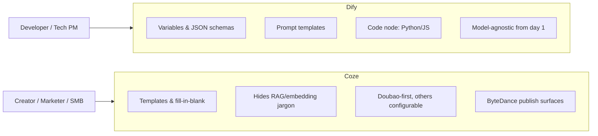

# Coze vs Dify

Coze (扣子) is ByteDance's AI agent / bot development platform. It sits in the same product category as Dify, OpenAI's GPTs, and n8n's AI workflow features — a no-code/low-code canvas for building LLM-powered apps. This note compares Coze and Dify across audience, features, ecosystem, and the self-hosted story.

## TL;DR

| | **Coze** | **Dify** |
|---|---|---|
| **Positioning** | "GPTs + Zapier for everyone" | Self-hosted LLM ops platform for builders |
| **Audience** | Creators, marketers, hobbyists, SMBs | Developers, technical PMs, internal tooling teams |
| **Models default** | Doubao (豆包) via Volcengine | Model-agnostic from day one |
| **Open-source since** | July 2025 | 2023 |
| **Ecosystem moat** | ByteDance: Douyin, TikTok, Feishu, Doubao app | None — neutral by design |
| **Self-hosted maturity** | New, rougher edges | Mature, well-documented |

## What Coze Is

- **Two front doors**: `coze.com` (international, originally GPT-4-backed) and `coze.cn` (China, Doubao-backed).
- **Visual canvas**: drag-and-drop nodes for LLM calls, conditionals, code blocks, knowledge retrieval, API calls, loops.
- **Two build modes**:
  - **Bot mode** — pick a model, write a system prompt, attach tools/plugins/knowledge bases. Conversational by default.
  - **Workflow mode** — full graph editor for deterministic pipelines.
- **Knowledge base (RAG)** — upload docs, auto-chunk + embed, attach to a bot.
- **Plugin marketplace** — pre-built integrations (web search, image gen, etc.) plus custom plugins via OpenAPI schema.
- **Publish targets** — web chat, API, Discord, Telegram, Feishu/Lark, WeChat, and ByteDance-native surfaces.

If you've used Dify, the canvas paradigm will feel immediately familiar.

## How It Differs from Dify

### Audience and tone

**Dify** doesn't *force* you to write code, but it exposes developer-flavored concepts: variables, JSON schemas for tool definitions, Jinja-style prompt templates, vector DB settings, model knobs like temperature and top-p. It also has a **Code node** where you *can* drop Python or JavaScript snippets into a workflow.

**Coze** is smoother for non-developers. More templates, more "fill in the blank" copy, less jargon. The bot-building flow assumes you've never heard of "embeddings" or "RAG" — it just says "upload your knowledge."

### ByteDance ecosystem (Coze's real moat)

This is where Coze isn't really competing with Dify — it's competing inside ByteDance's walled garden:

- **Doubao (豆包) models** — native, cheap, fast; ByteDance's answer to GPT-4-class models.
- **Douyin / TikTok** — publish bots as creator tools, comment-reply bots, livestream assistants.
- **Feishu / Lark** — one-click deploy as a Lark bot for enterprise workflows.
- **Juliang / Ocean Engine (巨量引擎)** — ByteDance's ad platform; bots for ad ops.
- **Doubao app** — bots built on Coze can be discovered inside the consumer Doubao app, like a GPT Store.

Dify has none of this by design — it's deliberately neutral so you can wire it to OpenAI, Claude, local models via Ollama, or anything else.

## Is Coze Open-Source / Self-Hostable?

Yes — but with a big asterisk.

### What's open-sourced (July 2025, Apache 2.0)

- **Coze Studio** (`coze-dev/coze-studio`) — the agent/workflow builder: canvas, bot creation, knowledge base, plugin system. This is the main thing.
- **Coze Loop** (`coze-dev/coze-loop`) — agent observability and evaluation (prompt versioning, tracing, eval datasets), analogous to Langfuse or LangSmith.

Both are self-hostable via Docker Compose on your own infra.

### Caveats vs. Dify

- **Maturity gap** — Dify has been open-source since 2023 with a large community and well-documented deployment. Coze open-sourced ~2.5 years later; fewer guides, rougher edges, smaller community.
- **Feature parity gap** — the hosted Coze (coze.com / coze.cn) has features missing from the open-source release: some plugins, some publish targets (Douyin/TikTok integrations, Doubao app store), certain enterprise features.
- **Model defaults** — wired for Doubao/Volcengine out of the box. OpenAI, Claude, and local models are supported but not the default path.
- **Docs** — primarily Chinese; English translations lag.

### Practical guidance

- ✅ **Pick Dify (self-hosted)** if you want polish, neutrality, and a strong community today.
- ✅ **Pick Coze (self-hosted)** if you specifically want the Coze UX, you're integrating with ByteDance models, or you're okay tolerating some rough edges.
- ✅ **Pick Coze (hosted)** if you want fast time-to-value and your distribution lives inside Douyin/Feishu/Doubao.

## Mental Model

The cleanest one-liner:

> **Dify = self-hosted LLM ops platform for builders.**
> **Coze = ByteDance's "GPTs + Zapier" for everyone, with deep ecosystem hooks.**

They overlap heavily on the canvas-and-RAG primitives, but diverge on *who they're for* and *where finished bots get distributed*.
