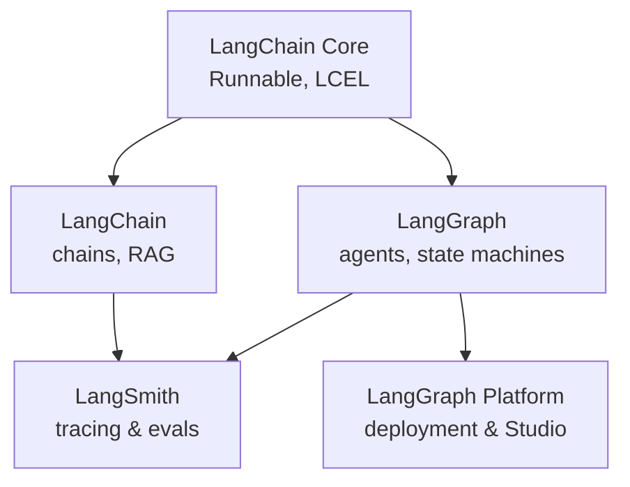

The LangChain ecosystem is genuinely confusing on first contact — the naming is bad and the marketing blurs what each piece actually is. This post first lays out the ecosystem cleanly, then uses it to explore a deeper question: **why are famous AI agent products almost all autonomous/ReAct-style, while agent frameworks tend to look like workflow engines?**

## 1. The LangChain ecosystem, mapped

Everything is built by LangChain Inc. and splits cleanly along two axes: **open-source library vs. hosted product**, and **build vs. observe vs. deploy**.

### Open-source libraries

| Library | Role | When to use |
|---|---|---|
| **LangChain Core** | Minimal interfaces — `Runnable`, LCEL. Comes as a transitive dependency. | You don't install it directly. |
| **LangChain** | Original framework — prompts, models, chains, retrievers, tools. The "glue code" library. | Linear flows: `prompt → model → parser`, RAG pipelines, swapping models. |
| **LangGraph** | Newer library for stateful, multi-step, multi-agent workflows. Built as a graph/state machine. | Agents, loops, branching, human-in-the-loop. |

### Hosted/commercial products

| Product | Role |
|---|---|
| **LangSmith** | Observability — traces, evals, prompt playground, datasets. Works with LangChain, LangGraph, *and* raw SDK code. |
| **LangGraph Platform** | Deployment/hosting for LangGraph apps. Includes persistence, scheduling, REST API, and **LangGraph Studio** (visualization UI). Absorbed the older **LangServe**. |

### How they fit together



### Other pieces you'll run into

- **LangServe** — older API-server library, mostly absorbed into LangGraph Platform.
- **LangChain Hub** — registry for sharing prompts.
- **LangGraph Studio** — UI for inspecting graph runs, bundled with Platform.
- **Integration packages** — `langchain-openai`, `langchain-anthropic`, `langchain-community`, etc. These split provider-specific code from core.

### LangGraph is becoming the center of gravity

LangChain (2022) started as the whole thing. LangGraph (2024) came later because the original agent abstractions — `AgentExecutor` and friends — couldn't handle real complexity (loops, branching, state, human-in-the-loop, multi-agent). Today the company's positioning is:

- **LangChain** → linear flows, stable, mature, integration-rich.
- **LangGraph** → recommended for *anything stateful or agentic*. Active development goes here.

Newer tutorials default to LangGraph even for simple agents. The old `AgentExecutor` path is effectively a dead end.

### Practical starting points

- Just RAG or a single-shot LLM call? → **LangChain**
- Anything multi-step with decisions? → Go straight to **LangGraph**
- Debugging? → **LangSmith**
- Deploying? → **LangGraph Platform**

## 2. Two kinds of AI agents

Across GitHub you can sort agent projects into two broad categories:

### Autonomous / model-driven agents

**Examples:** Claude Code, OpenAI Codex, Cursor Agent, Aider, Cline, Continue, Devin, OpenHands (was OpenDevin), SWE-agent, AutoGPT (historical), GPT Researcher.

- The **LLM decides** what to do next at each step.
- Loop is simple: `model → tool call → observe → model → ...`
- Hard problems: **context management**, tool design, sandboxing, recovery, UX.
- Control flow is *emergent* from the model's choices.

### Workflow / developer-orchestrated agents

**Examples:** LangGraph, Dify, n8n, Flowise, Temporal-style flows.

- The **developer defines the graph/DAG**; the LLM fills specific nodes.
- Loop is explicit: `node A → (condition) → node B or C → ...`
- Hard problems: **state management**, branching, retries, human-in-the-loop, observability.
- Control flow is *declared* up front.

### A spectrum, not a binary

```
Fully autonomous  ←—————————————————→  Fully scripted
 (model decides)                        (developer decides)

Claude Code                Mixed            n8n / Zapier
Codex             LangGraph agent loop      Dify simple flows
                  Dify with agent node
```

The single question that maps your intuition to a real distinction is: **who decides what happens next — the model, or the developer?**

### A third axis people miss: product vs. framework

- **Claude Code, Codex, Cursor** → *products*. You use them.
- **LangGraph** → *framework*. You build with it.
- **Dify** → in between. A *platform* with a UI, like no-code LangGraph.

So "Claude Code vs. LangGraph" is a category error. The fair comparison is "Claude Code vs. an agent you built yourself in LangGraph."

## 3. Why famous agent products are almost all autonomous

If you sort by GitHub stars, virtually every well-known agent product is autonomous/ReAct-style. This is not coincidence — it tells you something real about where the field has landed.

1. **Models got good enough.** Once GPT-4 / Claude 3.5+ became reliable at tool use and multi-step reasoning, elaborate scaffolding became unnecessary. The simplest loop started working. The bitter lesson applies: hand-engineered structure gets eaten by better models.
2. **Generality wins for products.** A scripted workflow only handles cases its author anticipated. An autonomous agent can attempt anything its tools allow. For a product sold to many users with varied tasks, this matters.
3. **The interesting problems moved.** Once the loop is trivial, the hard work is tool design, sandboxing, context/memory management, permissions, UX. None of that is what graph frameworks help with.
4. **Workflow agents shine where products don't ship.** Internal business automations — support triage, document processing, RAG with branching — are a huge fraction of real LLM-app spend. They just don't become GitHub stars.

### Honest summary

- **Public-facing agent products** → autonomous/ReAct, almost universally.
- **Internal business automations** → workflow frameworks, very common.
- **LangGraph / Dify / n8n** → mostly used to build the *internal* kind, even though they *can* build either.

## 4. Why autonomous agents resist frameworks

The natural follow-up: if autonomous agents are the dominant *product* shape, why isn't there a successful framework for them? Why are they written from scratch on raw SDKs?

### The loop is trivial; the value is everywhere else

The core of an autonomous agent is genuinely ~20 lines:

```python
while not done:
    response = model.call(messages, tools)
    if response.tool_calls:
        results = execute_tools(response.tool_calls)
        messages.append(results)
    else:
        done = True
```

There's almost nothing for a framework to abstract here. What's actually hard about building a Claude Code or a Cursor is product-specific:

- **Tool design** — which exact tools, with which parameters, with which descriptions. Most of an agent's quality lives here, deeply tied to your domain.
- **System prompt** — often thousands of tuned tokens. Product-specific.
- **Context management** — what to truncate, summarize, compact, when. Tied to your model and task.
- **Sandboxing & permissions** — tied to your runtime.
- **UI/UX** — streaming, diff display, approvals, undo. Product-specific.

A framework helps with none of this. Worse, it gets in the way — every abstraction layer is friction between you and the model.

### Workflow agents are the opposite

For workflow agents, **the graph itself is the product**. The hard parts are exactly what a framework abstracts:

- State across nodes
- Conditional branching
- Retries, persistence, checkpointing
- Visual editors so non-coders can build
- Observability of which node ran when

The abstraction *is* the value.

### The general principle

> Frameworks help when the structure is the hard part. Autonomous agents have no structure — they're just a loop. The hard part is everything around the loop, which is product-specific and can't be abstracted.

### Caveat: thin agent SDKs do exist

A few minimal SDKs target the autonomous-agent space:

- **OpenAI Agents SDK** — successor to Swarm.
- **Anthropic Claude Agent SDK** — the same primitives Claude Code uses.
- **Pydantic AI**, **smolagents** (Hugging Face) — lightweight alternatives.

Notice these are deliberately *thin*. They give you the loop, retries, tool schemas, tracing — and stop there. They don't try to be LangGraph. Even framework-makers ship *minimal* autonomous-agent libraries, which tells you the same thing: there isn't much to put in one.

## 5. Stop conditions: declarative vs. emergent

A common intuition: workflow agents must have explicit terminal states, while autonomous agents are infinite loops. The first half is right; the second half is wrong.

### Workflow agents — developer-defined termination

The graph must have terminal nodes:

- **LangGraph** → edges to the special `END` node
- **Dify** → explicit "End" nodes
- **n8n** → terminal nodes with no downstream
- **From-scratch** → your code has a `return` somewhere

Even if an inner node is an autonomous sub-agent, that sub-agent must return control to the workflow — so *it* needs its own stop condition too.

### Autonomous agents — model-decided termination

Claude Code, Codex, Cursor are **not** infinite loops. They terminate when:

1. **The model emits a final response with no tool calls** — primary stop signal. The model itself decides "I'm done." Terminal; just chosen at run time.
2. **Max iterations / token budget hit** — hard safety cap.
3. **User interrupts** — escape hatch.
4. **Tool returns a "done" signal** — some agents have an explicit `finish` tool.

### The real distinction

```
Workflow agent:     stop condition = predicate in the graph
                    (decided at design time, by the developer)

Autonomous agent:   stop condition = model returns no tool calls
                    (decided at run time, by the model)
```

Both terminate. The difference is **declarative vs. emergent**.

### Turn-based vs. task-based

Most autonomous agents you interact with are also turn-based:

- User sends a message → agent loops until done → returns → waits.
- The "loop" is bounded per turn, not infinite across the session.

The infinite-feeling part is just that a session can have many turns.

### Designing hybrid systems

If you embed an autonomous agent inside a workflow (a common production pattern), think about **three** stop conditions, not one:

1. **Inner loop stop** — when does the autonomous node decide it's done? (Model judgment + max iterations.)
2. **Node-level stop** — what counts as success vs. failure output from this node, so downstream branching can work?
3. **Workflow-level stop** — which graph paths lead to terminal nodes?

A common bug is forgetting #2: the autonomous node "finishes" but its output is ambiguous, so the workflow can't decide where to go next. The fix is usually constraining the autonomous node to return structured output instead of free text.

## 6. Takeaways

- The **LangChain ecosystem** has two core building libraries (**LangChain** for linear flows, **LangGraph** for stateful/agentic), one observability product (**LangSmith**), and one deployment product (**LangGraph Platform**). Everything else is packaging.
- **LangGraph is where the company's strategic weight is going.** For anything beyond a single-shot chain, start there.
- Agents split into **autonomous** (model decides control flow) and **workflow** (developer decides). Real production systems are usually hybrid.
- **Famous agent products are autonomous** because models got good enough that the loop became trivial; the value moved to tool design, context, UX — none of which a framework can abstract.
- **Frameworks dominate workflow agents** because the structure *is* the hard part.
- **All agents stop.** The difference is whether the stop is declarative (workflow) or emergent (autonomous).
