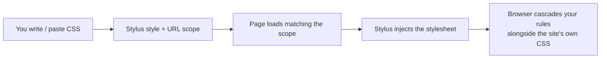
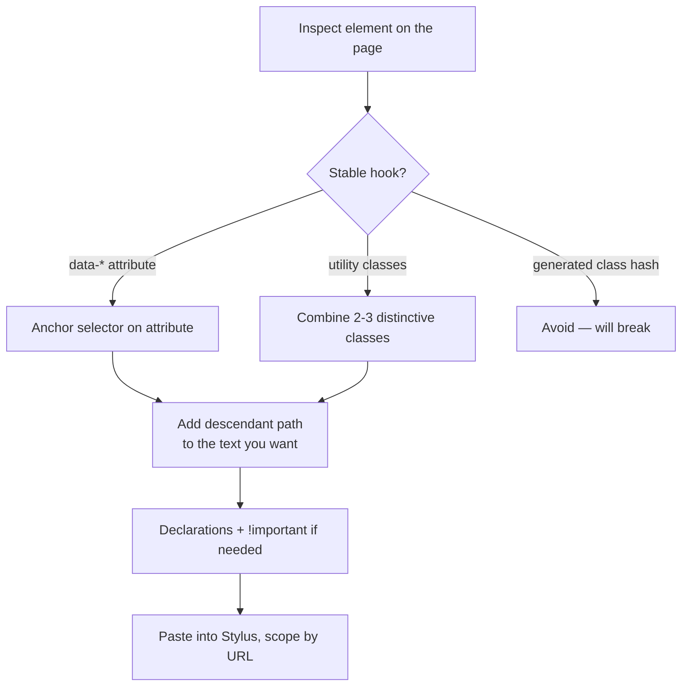

Stylus is a browser extension whose model is small enough to describe in one sentence: you write CSS, Stylus injects it into matching pages, and the browser treats your rules like any other stylesheet. That tiny surface is exactly why the *interesting* part is not Stylus itself but the **CSS you paste into it**. This note covers both — what the tool does, and how to parse the selectors you'll typically be copying around.

## What Stylus is

Stylus is a **userstyles manager**. Its job is to inject custom CSS into web pages, scoped to URLs you choose.

- 🧬 **Origin**: a fork of the older *Stylish* extension, created after Stylish started telemetry-harvesting browsing data. Stylus is open source and doesn't phone home.
- 🌐 **Style repositories**: pulls community styles from `userstyles.world` (the post-Stylish replacement) and the older `userstyles.org`.
- 🎯 **Scoping**: per style, you choose where it applies — by URL, domain, prefix, or regex.
- 🧩 **CSS features**: standard CSS plus `@-moz-document` rules and basic preprocessing (Stylus/Less/uso variables).

It's the standard pick when you want per-site CSS without writing a full extension.

## The mental model: CSS injection

The flow is identical every time:



The browser doesn't know the difference between your stylesheet and the site's own. Your rules just **cascade in**, typically winning via specificity or `!important`.

## What you can and can't do

| ✅ Possible with Stylus | ❌ Not possible (needs Tampermonkey / a real extension) |
|---|---|
| Dark mode / recoloring (`background`, `color`) | Changing behavior or event handlers |
| Hiding elements (`display: none` on ads, sticky banners) | Fetching or modifying data |
| Resizing / reflow (widths, fonts, spacing) | Rewriting page text |
| Overriding fonts site-wide | DOM mutations |

The boundary is sharp: **only CSS, no JavaScript**. You can only change *how existing elements look*.

## Reading the selectors you'll actually paste

Most Stylus styles you copy from forums look intimidating because they pile selectors onto modern utility-class HTML (Tailwind, shadcn/ui, Radix). The mechanics are still vanilla CSS. Here's a real example — a snippet to bump the font size inside the active tab of a Radix-style tabs component:

```css
/* Target the text wrapper strictly inside the active tab panel */
div[data-state="active"] div.flex.flex-col.gap-2 p,
div[data-state="active"] div.flex.flex-col.gap-2 span,
div[data-state="active"] div.flex.flex-col.gap-2 div {
    font-size: 1.3rem !important;
    line-height: 1.6 !important;
}
```

### The selector list

Commas separate **independent selectors that share the same declarations**. Three rules here, all of the form:

```
div[data-state="active"] div.flex.flex-col.gap-2 <p|span|div>
```

### Spaces are descendant combinators

A space between parts means *"descendant of"*. So this:

```
div[data-state="active"] div.flex.flex-col.gap-2 p
```

is three nested conditions, read left-to-right:

1. **`div[data-state="active"]`** — a `<div>` whose `data-state` attribute equals `"active"`. UI libraries like Radix/shadcn use this to mark the visible tab panel (`active` vs `inactive`).
2. **`div.flex.flex-col.gap-2`** — a descendant `<div>` carrying *all three* Tailwind classes (`flex`, `flex-col`, `gap-2`) — a vertical flex container with a small gap.
3. **`p`** — any `<p>` inside that wrapper.

In plain English: *"inside the active tab panel, find the vertical flex container, and style every `<p>` inside it."*

### Matches vs non-matches

✅ Matches — two **separate** nested divs:

```html
<div data-state="active">
  <div class="flex flex-col gap-2">
    <p>Hello</p>              <!-- styled -->
  </div>
</div>
```

❌ Does NOT match — `data-state` and the classes are on the **same** div, but the selector requires two divs:

```html
<div data-state="active" class="flex flex-col gap-2">
  <p>Hello</p>                <!-- not styled -->
</div>
```

### Compound vs descendant — the spacing trap

This is the single most common source of confusion:

| Selector | Meaning |
|---|---|
| `div.flex.flex-col.gap-2` (no spaces between class parts) | **One** element that has **all three** classes |
| `div .flex .flex-col .gap-2` (spaces) | Four nested elements |

The element can carry additional classes — it just needs **at least** these three.

### Descendant ≠ direct child

A space means *anywhere inside*, not "immediate child". The `<p>` can be wrapped in arbitrary intermediate elements and still match. For "direct child only", use `>` instead (e.g. `div > p`).

### The declarations

```css
font-size: 1.3rem !important;
line-height: 1.6 !important;
```

- `1.3rem` — 1.3× the **root** font size (usually 16px → ~20.8px). `rem` ignores parent sizing, so the result is predictable.
- `line-height: 1.6` — unitless, meaning 1.6× the element's own font size. Roomier vertical spacing.
- `!important` — forces these rules to win over the site's own CSS. Necessary because **Tailwind utility classes are very specific**, and a naive override would lose the cascade fight.

## Why styles are written this defensively

The pattern of long, attribute-anchored, `!important`-loaded rules isn't an accident — it's a response to two realities of modern web apps:

1. **Utility-class CSS (Tailwind)** scatters styling across hundreds of single-purpose classes. There's no semantic `.tab-content` to target; you have to fingerprint elements by the *combinations* they happen to use.
2. **Component libraries (Radix/shadcn)** attach state to attributes like `data-state`, `data-orientation`, `aria-selected`. These attributes become the only reliable way to scope styles to "the active tab" or "the open dialog".

So a good userstyle leans on:

- ✅ Attribute selectors (`[data-state="active"]`) — stable across versions
- ✅ Combinations of utility classes — reasonably specific
- ⚠️ `!important` — pragmatic, but means you can't easily override your own rules later
- ❌ Brittle nth-child / generated class names — break on the next deploy

## Quick recipe



The whole skill of writing userstyles, once you understand Stylus's tiny model, reduces to **reading selectors well** and **picking stable hooks** in the page's HTML.
