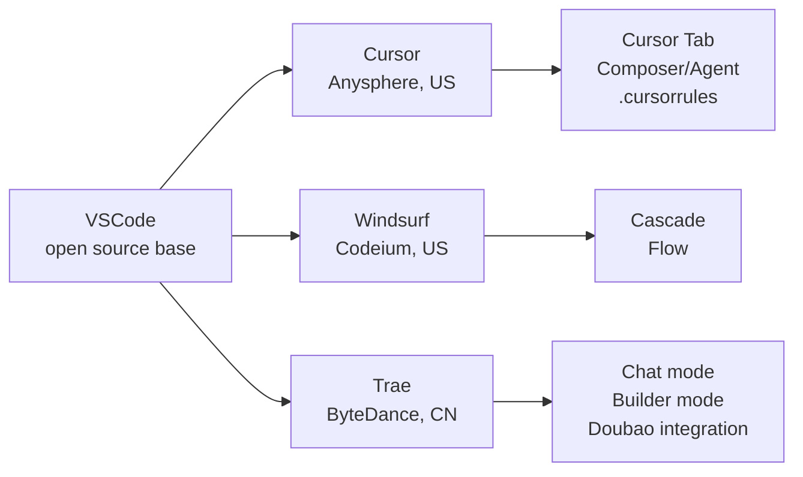
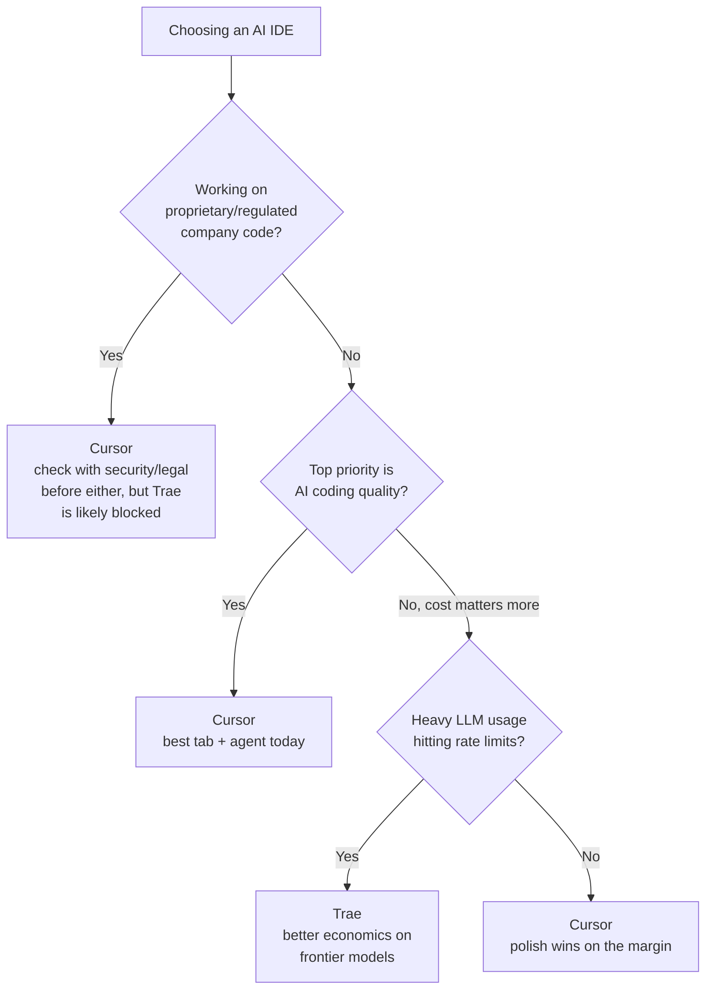

## What is Trae?

Trae is an AI-native IDE released by ByteDance (the TikTok/Doubao parent company) in early 2025. Structurally it sits in the same category as Cursor and Windsurf:

- **VSCode fork** — built on the VSCode codebase, so the editor itself feels familiar.
- **AI coding features layered on top** — Chat mode for asking questions about code, Builder mode for agentic multi-step tasks, tab completion, codebase indexing.
- **Two distributions** — a global build (trae.ai) and a separate China build (Trae CN) with different model backends (Doubao for the China version).

So positioning-wise, Trae is a direct Cursor competitor. The ByteDance angle at launch was aggressive free-tier access to frontier models (Claude 3.5/3.7 Sonnet, GPT-4o) to pull users away from Cursor's paid plans.

## The Landscape

All three share the same editor DNA. The differentiation lives in the AI layer: model access, tab-completion quality, agent loop maturity, and codebase retrieval.

## The Core Tradeoff

Trae's two-sided pitch is:

| Dimension | Trae advantage | Trae concern |
|---|---|---|
| Cost | Cheaper/free access to frontier LLMs | — |
| Data | — | Telemetry and data collection under Chinese jurisdiction |

That's the headline tension. Everything else is a refinement of these two axes.

### On the pricing advantage

- It was *very* cheap or free at launch as a user-acquisition play. This is the standard playbook — subsidize heavily to grab market share, then monetize later. Free Claude access has been tightened over time, so current pricing is worth checking before you decide.
- Cursor's $20/mo isn't expensive in absolute terms, but for heavy users hitting rate limits, Trae's economics can look meaningfully better.

### On the data/telemetry concern

It's not just a vague "China company" worry — the concrete shape of the risk matters:

- **AI IDEs have deep access.** Your entire codebase gets indexed, code snippets get sent to model providers, and telemetry can include file paths, prompts, and edit patterns. This is true of any AI IDE, but the *destination* of that data is what differs.
- **Jurisdiction.** ByteDance is subject to China's Cybersecurity Law and Data Security Law, which can compel data sharing with authorities. This is the same legal regime that drives TikTok scrutiny in the US/EU.
- **Cursor isn't free of telemetry either** — it sends code to Anthropic/OpenAI. But the jurisdiction and corporate accountability differ.

**Practical heuristic:**

- ✅ Solo dev, side projects, OSS — risk is low; cost savings probably win.
- ⚠️ At a company with proprietary code, IP, regulated data, or government contracts — most security teams would block it outright. Check with security/legal before installing; many enterprises have already added Trae to their blocklist.

## AI Coding Ability: Which is Better?

Honest answer: **Cursor is still ahead on raw AI coding ability**, though the gap has narrowed. Cursor has been heads-down on this since 2023, has a strong ML team, and ships fast. Trae launched in 2025 and is still catching up — ByteDance has the resources to close the gap, but product maturity takes time.

### Where Cursor leads

- **Tab completion / Cursor Tab.** Their custom-trained model for multi-line, multi-file predictive edits is genuinely best-in-class. Trae's tab is competent but more conventional.
- **Agent mode maturity.** Cursor's Composer/Agent has had more iteration — better at long multi-step tasks, tool use, and recovering from errors mid-task.
- **Codebase understanding.** Indexing and retrieval feel sharper; `@`-mentions, symbol search, and context gathering are more refined.
- **Ecosystem polish.** MCP support, `.cursorrules` files, background agents, bugbot, etc. — more surface area, more battle-tested.

### Where Trae is competitive or ahead

- **Model access cost.** If you want to run Claude Sonnet heavily, Trae's economics are better.
- **Builder mode UX.** Some users prefer its task-oriented flow over Cursor's chat-centric agent.
- **Chinese-language coding context.** If you work with Chinese codebases/docs/comments, Trae handles it more naturally.

## Decision Guide

**TL;DR**

- If AI coding quality is your top priority and cost isn't a blocker → **Cursor**.
- If you're cost-sensitive, doing personal projects, or specifically want to try ByteDance's approach → **Trae** is reasonable, just don't expect Cursor-level polish yet.
- If you're at a company with sensitive code → talk to security before either, and assume Trae will not pass review.
