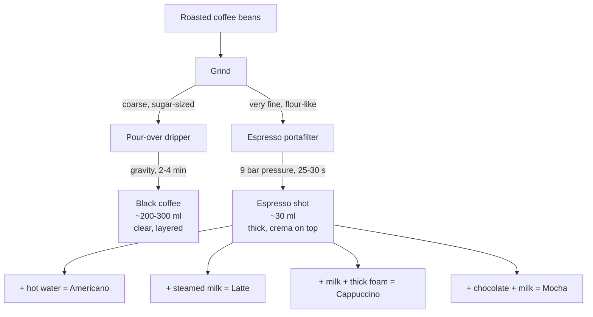

This post collects what I think is the most useful "mental model" for coffee: the kind a curious beginner builds when they keep asking *why* until the answers click. It walks from the simplest brewing method (pour-over), through espresso, through one very natural "why can't I just…" question, and ends with the difference between a latte and a cappuccino.

## 1. What is pour-over coffee?

Pour-over is the most stripped-down way to make coffee: hot water is poured by hand over a bed of ground coffee, and gravity pulls it through a paper or mesh filter into a cup below.

The basic flow:

1. **Grind** the roasted beans into even particles (roughly the size of granulated sugar).
2. **Rinse the filter** with hot water — removes the paper taste and preheats everything.
3. **Bloom** ☕ — pour a small amount of hot water (about 2× the weight of the grounds) and wait ~20–30 seconds while the grounds release CO₂ and puff up.
4. **Pour** the rest of the water in a slow, steady spiral.
5. The water dissolves flavor compounds on the way through and drips into the carafe as a clear, sediment-free coffee.

What makes pour-over interesting is that *you* control the variables — water temperature, pour rate, total time, grind size — and each one nudges the cup toward different flavors. People like it because:

- **Flavor is clean and layered.** The paper filter strips out oils and fines, so acidity and aromatics come through cleanly.
- **The ritual is satisfying.** It rewards attention.
- **Low cost of entry.** A kettle, a dripper, and a paper filter is all you need.

## 2. "Isn't this basically homemade soy milk?"

A reasonable comparison — and on the surface, yes:

> Put ground stuff in hot water. Filter out the solids. Drink the liquid.

The blooming step in pour-over even rhymes with letting soy grounds hydrate before grinding/boiling.

But the *goals* are opposite, and that changes everything:

| Aspect | Pour-over coffee | Homemade soy milk |
|---|---|---|
| Raw material | Roasted seeds — hard, fibrous, with flavor compounds bound to cell walls | Raw beans — protein- and oil-rich |
| What you want from the bean | A **selective** wash: pull out specific aromatics, acids, sweetness; **leave** the bitter/woody stuff behind | A **total** breakdown: rupture the cells, get *all* the protein and fat into the liquid |
| Process | Extraction | Pulverization + cooking |
| Sensitivity | ±2 °C of water or a few seconds of pour can flip "good" → "bad" | Boil it, blend it, strain it — done |
| Goal | **Flavor layers** | **Uniform nutrition** |

So the *physical actions* are similar, but pour-over is closer to brewing tea than to making soy milk — you're trying to *selectively* coax certain compounds out, not turn the solid into the liquid.

## 3. The one-line essence

Strip away the romance, and pour-over really is:

> **Crush beans → put them on a filter → pour water through them.**

That's it. Adjusting water temperature and pour speed is what separates "fine" from "actually delicious," but the skeleton is that simple.

## 4. "Wait — isn't that how Starbucks makes coffee?"

Almost everything on the Starbucks menu — latte, Americano, cappuccino, mocha — is **not** pour-over. The base for those drinks is **espresso**, which is a completely different method.

Side by side:

| Feature | Pour-over | Espresso (Starbucks default) |
|---|---|---|
| Driving force | **Gravity** — water seeps through | **~9 bar pressure** — water is forced through |
| Grind | Coarse, like granulated sugar | Very fine, like flour |
| Brew time | 2–4 minutes | 20–30 seconds |
| Output | A full cup (~200–300 ml), clear black coffee | A small shot (~30 ml), thick, with a golden **crema** on top |

Starbucks does also sell a "brewed coffee of the day" — that comes from a large **batch drip machine**, which works on the same gravity-filtering principle as pour-over but is automated. True hand-poured cups only show up at the high-end Reserve bars.

## 5. Pour-over vs. espresso: same skeleton, different physics

This is worth lingering on, because the next question I had was: *"Espresso just grinds finer, pushes harder, and goes faster — but underneath it's still crush, filter, pour water through, right?"*

Yes — that's exactly right. The skeleton is identical. But the **pressure** rewrites the rules.

A useful analogy: imagine a sponge.

- **Pour-over** is misting the sponge with a spray bottle. Water trickles down, picks up what's loose, drips out.
- **Espresso** is putting the sponge in a sealed chamber and forcing high-pressure water through it. Things that wouldn't normally dissolve — including microscopic oil droplets — get **emulsified out** and end up in the cup.

Two consequences of that pressure:

1. **Extraction is dramatically more efficient.** In 25–30 seconds, espresso pulls out more flavor compounds per gram than pour-over does in 3 minutes. The result is concentrated, not just "stronger by volume."
2. **You get crema** — that golden foam layer on top of an espresso shot. Pour-over has no crema because paper filters remove oils. Pressure-emulsified oils + dissolved CO₂ = crema, which carries aroma and changes the mouthfeel completely.

So both methods follow the same recipe; they're just two very different cooking techniques applied to it. Pour-over is closer to gentle steaming — preserve the original character. Espresso is closer to a pressure cooker — go for intensity and a transformed product.

## 6. "Why can't I just grind the beans super fine and drink it like milk powder?"

This is a great question because it exposes a thing most people never explicitly notice: **brewing coffee is extraction, not dissolution.**

- **Milk powder** is *soluble*. Its proteins, sugars, and fats actually disperse and dissolve into water. After you stir, the powder is gone — you're drinking a true solution.
- **Coffee grounds** are *not soluble*. The bean's structure is mostly **cellulose** (plant fiber), which doesn't dissolve in water at all. Hot water only **rinses out** the flavor compounds that were clinging to the cell walls. The fibrous skeleton stays as a solid.

If you tried "fine-grind + water + drink it all," here's what you'd get:

1. **Gritty mouthfeel.** No matter how fine you grind, those are still solid particles. It feels like drinking sand.
2. **Out-of-control bitterness.** Bitter compounds (like large-molecule chlorogenic acid derivatives) extract more slowly than the pleasant ones. If the grounds keep soaking, those bitters keep accumulating. After a few minutes the cup tastes like burnt medicine. That's why every brew method strictly controls contact time — overshoot, and the coffee turns harsh.
3. **Sediment problem.** Even if you forced yourself to drink it, the fines settle into a sludge at the bottom that gets progressively more bitter.

### The one exception: Turkish coffee

There *is* a tradition that grinds coffee finer than flour and boils it together with the water:

- The grounds (finer than flour, basically dust) are simmered in a long-handled pot called a **cezve**, often with sugar.
- The whole pot is poured into the cup — grounds and all.
- Then you **wait**. The grounds settle as a thick mud at the bottom; you drink the clear liquid above and leave the sludge behind.

So even Turkish coffee — the closest method to your "just dissolve it" intuition — still relies on separation, just through **sedimentation** instead of a filter. The grounds are never *consumed*; they're just discarded by gravity instead of by paper.

The takeaway:

> Filtering isn't an inconvenient extra step. It's the step that turns a slurry into a drink.

## 7. Latte vs. cappuccino

Both are espresso + steamed milk + milk foam. The difference is **how those three pieces are proportioned and textured**.

| Component | Latte | Cappuccino |
|---|---|---|
| Espresso | 1 part | 1 part |
| Steamed (liquid) milk | ~2 parts | ~1 part |
| Foam | Thin, ~0.5 cm, silky microfoam | Thick, 1–2 cm, airy and stiff |
| Cup size | Larger (~240–360 ml) | Smaller (~150–200 ml) |
| First sip | Smooth liquid | A pillow of foam, then liquid |
| Latte art | Hearts, rosettas — foam is fluid enough to pattern | Usually just a white dot — foam is too stiff to draw with |

In other words:

- **Latte** ≈ "a glass of milk that happens to taste like coffee." Mostly liquid milk; foam is just a thin crown. Mellow, milky, smooth.
- **Cappuccino** ≈ "espresso wearing a cloud." Less liquid, but a big airy foam dome that makes the cup feel full. Coffee flavor cuts through more clearly because there's less milk diluting it.

### "So does a latte have *less* milk than a cappuccino?"

This one trips people up. **No — a latte has *more* milk**, in the sense that matters: total liquid milk.

The cappuccino *looks* bigger or equal because the foam is voluminous, but foam is mostly **air**. By mass, a latte contains substantially more milk than a cappuccino. That's exactly why a latte tastes milkier and a cappuccino tastes more coffee-forward despite both starting from the same single shot of espresso.

A small culture note ✅: in Italy, cappuccino is essentially a breakfast drink — the thick foam is considered too heavy after a meal. Latte is drunk all day. Outside Italy, nobody enforces this.

---

## Mental model in one picture

If you only remember one thing:

> **Coffee brewing = "selectively rinse flavor compounds out of an insoluble solid, then separate the solid from the liquid."**
>
> Methods differ on (a) *how* the water is driven through (gravity vs. pressure), (b) *how fine* the grind is, and (c) *how* the grounds are eventually separated (paper filter, metal filter, sedimentation).
>
> Everything else — latte vs. cappuccino, Americano vs. espresso — is what you do *after* that black liquid is in the cup.
