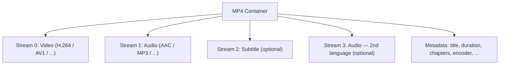

If you've only ever thought of an `.mp4` as "a video file," ffmpeg's command-line will feel arbitrary. Once you see MP4 as a **container** holding **streams**, the flags start to make sense: `-vn` drops a stream, `-acodec copy` lifts a stream out byte-for-byte, and `ffprobe` shows you what's inside before you touch anything.

This post walks the full mental model end-to-end, then uses it to extract audio from a real MP4 in seconds.

## Container vs. codec — the core distinction

The single most useful concept:

- A **container** is the file format on disk — `.mp4`, `.mkv`, `.webm`, `.mov`, `.wav`. It's the envelope.
- A **codec** is the algorithm that compressed the audio or video data inside — AAC, H.264, AV1, Opus, MP3. It's what's in the envelope.

An `.mp4` file *usually* holds video encoded with H.264 (or increasingly AV1) and audio encoded with AAC, but the container and the codec are independent choices.

### Why codecs exist

Raw media is huge. One minute of CD-quality stereo audio is ~10 MB uncompressed. A codec shrinks that to ~1 MB (MP3) or smaller (Opus), often imperceptibly. Common audio codecs:

| Codec | Notes                                                |
| ----- | ---------------------------------------------------- |
| AAC   | Standard in MP4; good quality, efficient             |
| MP3   | Older, universally supported                         |
| Opus  | Modern, excellent quality at low bitrates            |
| PCM   | Uncompressed (what `.wav` files usually contain)     |

## The data structure of a video file

Every modern container — MP4, MKV, WebM, MOV — fits the same shape:

```
VideoFile {
  streams: [Stream, Stream, Stream, ...]
  metadata: { title, duration, chapters, ... }
}

Stream {
  type: video | audio | subtitle | data
  codec: "h264" | "aac" | "srt" | ...
  data: <compressed bytes>
  metadata: { language, bitrate, ... }   // per-stream
}
```



Three refinements worth internalizing:

1. **Streams are interleaved on disk.** The bytes aren't `[all video][all audio]`. They're chopped into small chunks in time order: `[video 0s][audio 0s][video 1s][audio 1s]…`. That's why a player can start playing before the full file has downloaded.
2. **The container stores an index.** It maps timestamps to byte offsets so seeking ("jump to 3:42") is instant.
3. **Containers restrict which codecs they accept.**

   | Container | Accepts                                            |
   | --------- | -------------------------------------------------- |
   | `.mp4`    | Limited set (H.264/H.265/AV1 video, AAC audio, …)  |
   | `.mkv`    | Almost anything — the "universal" container        |
   | `.webm`   | VP8/VP9/AV1 video, Opus/Vorbis audio only          |

   When ffmpeg complains "codec not supported in container," this is the rule it's enforcing.

## Inspecting structure with ffprobe

`ffprobe` ships with ffmpeg and reads a file's structure without touching it.

**Human-readable summary:**

```bash
ffprobe input.mp4
```

**Structured JSON** — best for seeing the `{ streams: [...], format: {...} }` shape directly:

```bash
ffprobe -v quiet -print_format json -show_format -show_streams input.mp4
```

**Just the streams in a table:**

```bash
ffprobe -v error -show_entries stream=index,codec_type,codec_name -of table input.mp4
```

### Reading real ffprobe output

Running the JSON form on an actual MP4 returned (trimmed):

```json
{
  "streams": [
    {
      "index": 0,
      "codec_name": "av1",
      "codec_type": "video",
      "width": 852,
      "height": 480,
      "r_frame_rate": "25/1",
      "duration": "905.320000",
      "bit_rate": "222585",
      "nb_frames": "22633"
    },
    {
      "index": 1,
      "codec_name": "aac",
      "codec_type": "audio",
      "sample_rate": "48000",
      "channels": 2,
      "channel_layout": "stereo",
      "duration": "905.322667",
      "bit_rate": "172058",
      "nb_frames": "42437"
    }
  ],
  "format": {
    "format_long_name": "QuickTime / MOV",
    "nb_streams": 2,
    "duration": "905.322667",
    "size": "45171448",
    "bit_rate": "399163"
  }
}
```

Mapping this back to the mental model:

- The **container** is MOV/MP4 family, ~15 minutes, ~45 MB, ~400 kbps total.
- **Stream 0** is video: AV1 codec, 480p, 25 fps, ~223 kbps.
- **Stream 1** is audio: AAC, 48 kHz stereo, ~172 kbps.

**Sanity check:** 223 + 172 ≈ 399. The per-stream bitrates add up to the total. ✅

A clue worth noticing: the file's `encoder`/`description` metadata sometimes reveals server-side re-encoding (e.g., a video platform transcoding to AV1 to cut their bandwidth bill). That's why a file you downloaded may not have the codec you'd expect from the source.

## Extracting audio with ffmpeg

Now the command finally makes sense:

```bash
ffmpeg -i input.mp4 -vn -acodec copy output.m4a
```

### Anatomy

```
ffmpeg  -i  input.mp4  -vn  -acodec copy  output.m4a
  │     │       │       │        │             │
  │     │       │       │        │             └── output file (last positional arg)
  │     │       │       │        └── audio codec: "copy" = don't re-encode
  │     │       │       └── video: no — drop the video stream
  │     │       └── input file
  │     └── "-i" flag marks the input
  └── the program
```

| Part           | Meaning                                                                       |
| -------------- | ----------------------------------------------------------------------------- |
| `ffmpeg`       | The program                                                                   |
| `-i file`      | Marks `file` as an **input**                                                  |
| `-vn`          | **V**ideo **N**o — drop the video stream                                      |
| `-acodec copy` | **A**udio **codec** = `copy` — copy compressed audio bytes as-is              |
| `output.m4a`   | Output file (anything without `-i` before it is an output)                    |

The general ffmpeg shape:

```
ffmpeg [global options] -i input1 [-i input2 ...] [output options] output_file
```

### Why `copy` is the trick

Normally `-acodec` takes a codec name (`libmp3lame`, `aac`, `libopus`). The special value `copy` skips the encode/decode cycle entirely — ffmpeg just lifts the compressed audio bytes out of the input container and drops them into the output container.

Consequences:

- ✅ **Fast** — no CPU-heavy re-encoding, just byte shuffling.
- ✅ **Lossless** — zero quality loss; the bytes are identical.
- ⚠️ **Output extension must match the codec.** AAC bytes belong in `.m4a` (the standard audio-only container for AAC). Writing them into `output.mp3` would fail.

### Why `-vn` matters

Without `-vn`, ffmpeg would try to include the video stream too. Since `.m4a` is an audio-only container, that would error. `-vn` says "ignore the video stream entirely."

### Other audio-extraction recipes

**Convert to MP3** (re-encode, slight quality loss, universally playable):

```bash
ffmpeg -i input.mp4 -vn -acodec libmp3lame -q:a 2 output.mp3
```

`-q:a 2` is high-quality VBR (~190 kbps). Use `-b:a 192k` for a fixed bitrate.

**Convert to WAV** (uncompressed, huge file, useful for editing):

```bash
ffmpeg -i input.mp4 -vn -acodec pcm_s16le output.wav
```

| Goal                          | Command                                             | Output       |
| ----------------------------- | --------------------------------------------------- | ------------ |
| Fastest, lossless, AAC source | `-vn -acodec copy`                                  | `.m4a`       |
| MP3 for universal playback    | `-vn -acodec libmp3lame -q:a 2`                     | `.mp3`       |
| Uncompressed for editing      | `-vn -acodec pcm_s16le`                             | `.wav`       |

### Choosing the output path

`output.m4a` writes to your current working directory (wherever the terminal is). To place the file deliberately, use an absolute path:

```bash
ffmpeg -i /some/dir/video.mp4 -vn -acodec copy /some/dir/video.m4a
```

Matching the input's basename and only swapping the extension (`.mp4` → `.m4a`) keeps the relationship between source and extract obvious in a file listing.

## Reading ffmpeg's output

When you run the extraction, the log tells you exactly what happened:

```
Stream mapping:
  Stream #0:1 -> #0:0 (copy)
```

This says: input stream 1 (the audio) became output stream 0, copied without re-encoding. The `(copy)` is the confirmation that no encode happened.

```
size=   19182kB time=00:15:05.30 bitrate= 173.6kbits/s speed= 129x
```

- **`speed=129x`** — processed at 129× real-time. ~7 seconds for 15 minutes of audio. That speed is the giveaway that `-acodec copy` worked; a real encode would be much slower.
- **Size matches prediction** — 172 kbps × 905 s ≈ 19 MB. The math from the ffprobe output came out exactly right.

```
video:0kB audio:19015kB subtitle:0kB other streams:0kB
```

Zero video data made it into the output — `-vn` did its job.

## The mental model, distilled

- A video file is a **container** holding an **array of streams** plus **metadata**.
- Each stream has its own **codec**, **bitrate**, and per-stream metadata.
- `ffprobe` shows you that structure without modifying anything.
- `ffmpeg` operates on streams: `-vn` drops one, `-acodec copy` lifts one out byte-for-byte.
- Compressed audio bytes are codec-specific; the output container's extension must match.

Once those five ideas click, most of ffmpeg's command surface — extracting, remuxing, swapping audio tracks, attaching subtitles — becomes the same handful of operations on a `streams + metadata` data structure.
