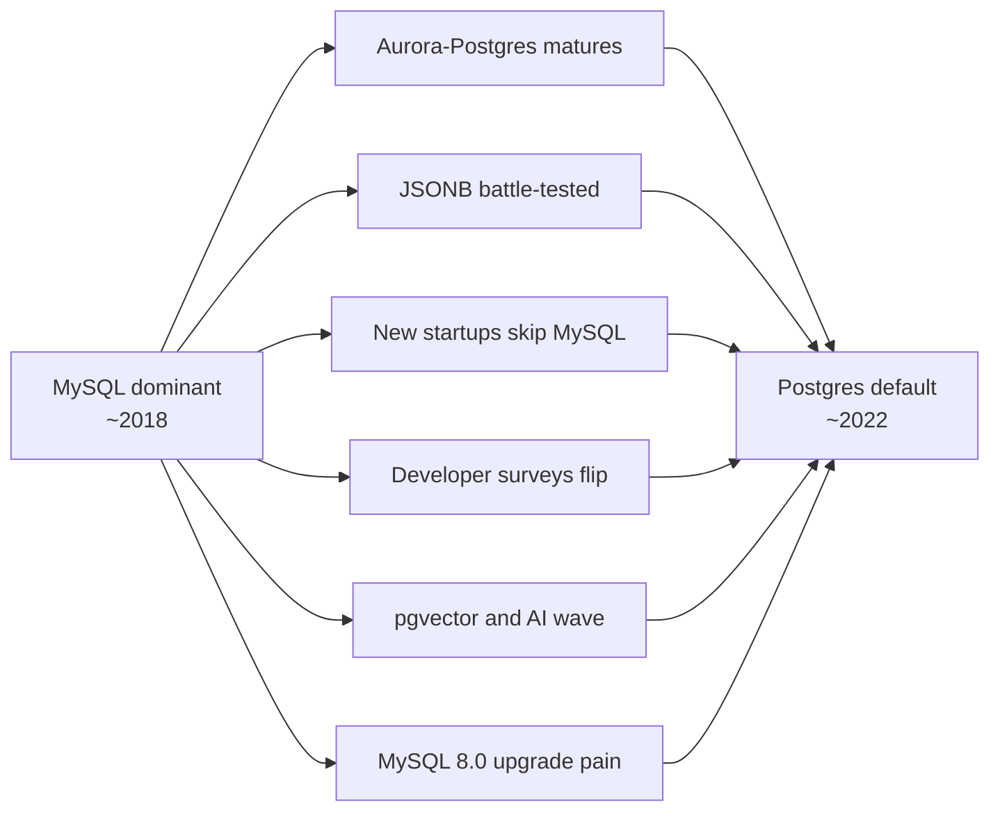
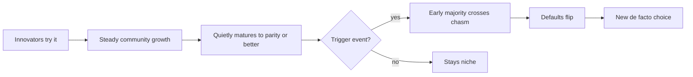

## The puzzle

Some years ago, if you needed a relational database, **MySQL was the default**. Today, for new projects — especially in the Western startup ecosystem — **PostgreSQL is the default**.

What happened? Did Postgres ship a killer feature? Did MySQL stagnate? Was it a single dramatic event, or something slower?

The honest answer is more interesting than any of those.

## The simplistic story (mostly wrong)

The popular narrative goes something like this:

1. Oracle acquired MySQL via Sun in 2010
2. The community panicked, MariaDB forked off
3. Oracle neglected MySQL
4. Postgres shipped JSONB, extensions, and won

This is the *cartoon* version. Each beat has some truth, but the timing is way off — and it misses what actually decided things.

## The real timeline

MySQL stayed dominant through roughly **2018**, not 2010. The Oracle acquisition created *anxiety*, not an immediate exodus.

### Why MySQL stayed on top through ~2018

- **Massive operational know-how.** Facebook, Alibaba, Tencent, Booking.com, GitHub, Uber, Shopify all ran MySQL at huge scale with custom forks and tooling. You don't throw that away.
- **Alibaba specifically** built AliSQL and later PolarDB-MySQL — deeply invested. Same with Facebook's MyRocks, Google's MySQL work, Tencent's TXSQL.
- **Replication maturity.** MySQL async replication + read replicas was battle-tested before Postgres' streaming replication felt equally proven. Postgres logical replication only arrived in PG10 (late 2017).
- **Sharding ecosystem.** Vitess (YouTube → Slack, Square, GitHub), MyCat, ShardingSphere — the horizontal-scale playbook was a *MySQL* playbook.
- **Cloud RDS.** AWS RDS launched MySQL-first in 2009; Aurora-MySQL in 2014. Aurora-Postgres only arrived in 2017.
- **Hiring.** Far more DBAs and backend engineers knew MySQL inside-out.

So MySQL was not just legacy momentum — it was actively winning at scale.

### What actually flipped, 2019–2022

- **Managed Postgres matured.** Aurora-Postgres and Cloud SQL Postgres became boring/reliable at serious scale.
- **JSONB had years to bake.** By 2019 it was production-grade, not novelty. The "we need MongoDB for flexibility" argument died.
- **New startups skipped MySQL entirely.** Supabase (2020), Neon (2021), and the YC pipeline defaulted to Postgres. Tutorials, Rails/Django/Prisma docs, Next.js examples — all Postgres-first.
- **Developer surveys flipped.** Stack Overflow's survey had MySQL #1 for years. By 2023 Postgres overtook it among professional developers; by 2024 it was #1 overall.
- **AI/embeddings.** `pgvector` (2021, exploded 2023) put Postgres in every LLM tutorial.
- **Distributed SQL bet on Postgres.** CockroachDB and YugabyteDB chose the Postgres wire protocol. TiDB went MySQL-compatible, but it's now the exception.

## Was there a killer feature in 2019–2022?

**No.** Honestly, no.

| Postgres release | Year | Highlights |
|---|---|---|
| PG12 | 2019 | Pluggable storage groundwork, generated columns |
| PG13 | 2020 | Incremental sort, parallel vacuum, B-tree dedup |
| PG14 | 2021 | Logical replication polish, performance |
| PG15 | 2022 | `MERGE`, logical replication filters |

All useful, none of them "now we can do something we couldn't before." Solid engineering, no single version you can point to and say "this is the one."

### And MySQL 8.0 (2018) was actually huge

This is the irony — MySQL's biggest catch-up release dropped *at the start* of the window:

- Window functions, recursive CTEs
- Real JSON functions, JSON table functions
- Hash joins (8.0.18, 2019)
- Better optimizer, histograms
- Atomic DDL, transactional data dictionary
- Roles, better auth
- Invisible indexes, descending indexes

On a feature-list spreadsheet, MySQL had closed most of the SQL gap. Purely technically, **MySQL did not update more slowly during this window**.

So if it wasn't a breakthrough and wasn't MySQL stagnating — what decided it?

## What actually decided it

### 1. MySQL 8.0 had a rough rollout

Major version jump from 5.7 with breaking changes (default auth plugin, `utf8mb4` default, removed query cache). Shops sat on 5.7 for years. The modern MySQL took years to actually land in production — meanwhile Postgres' yearly releases felt smooth and predictable.

### 2. Extensions, not core features, were the real moat

The decisive things 2019–2022 weren't in `postgres` itself — they were *around* it:

- **PostGIS** — gold standard for geo
- **Citus** (acquired by Microsoft, 2019) — scale-out
- **TimescaleDB** — time-series
- **pgvector** (2021) — embeddings
- `pg_partman`, `pg_cron`, `pg_stat_statements`

You can't just `CREATE EXTENSION vector` in MySQL. The extension culture made Postgres a **platform**, not just a database.

### 3. The managed-service flywheel

Supabase, Neon, Render, Fly, Railway — all Postgres-first. This shaped what *new* projects started with, and starter templates compound.

### 4. ORM and framework defaults shifted

Prisma launched Postgres-first. Rails/Django/Phoenix tutorials switched to Postgres examples. New developers learned Postgres first.

### 5. Governance and trust

Open community vs. Oracle — a slow drip, not an event. But by ~2020 a decade of "what's Oracle going to do" anxiety had compounded.

## A useful mental model: the crypto analogy

There's a parallel here to crypto markets that's sharper than it might first seem:

> **Fundamentals move slowly. Perception moves suddenly.**

Postgres in 2015 was already ~90% of what Postgres in 2022 was, technically. JSONB, transactional DDL, rich types, mature replication — all there. But mindshare lagged the fundamentals by 5–7 years.

Then a tipping point hit (Supabase, Neon, pgvector, ORM defaults) and the perception caught up to reality almost overnight.

### Where the analogy breaks down

Unlike crypto, dev tools have *real* reinforcing loops, not just sentiment:

- **Network effects compound** — more users → more Stack Overflow answers → more libraries → easier hiring → more users
- **Switching costs are sticky** — once a company picks Postgres, they stay for 10+ years
- **Defaults are load-bearing** — `npx create-next-app` choosing Postgres in a tutorial isn't a price signal, it's a small permanent nudge that compounds

So once the Postgres flywheel started spinning, the lock-in is much harder than any crypto position.

## The general pattern: crossing the chasm

This dynamic has a name — Geoffrey Moore called it **"crossing the chasm"** (1991). The chasm is the gap between:

- **Early adopters** — weird people who try strange tools because they're interesting
- **Early majority** — cautious people who only switch when they have a *reason*

Most promising tools die in this chasm. They're loved by 5% of developers and ignored by everyone else, forever. Some make it across.

### The trigger doesn't have to be big

This is the subtle part. People expect the catalyst to be a dramatic breakthrough, but usually it's just something that gives cautious people *cover* to switch:

- "MySQL 8.0 upgrade is painful, so we evaluated alternatives" → permission to try Postgres
- "Next.js defaults to Tailwind" → permission to use Tailwind without justifying it
- "GitHub uses Rust for X" → permission to propose Rust at your company

The early majority isn't looking for the *best* tool. They're looking for a *defensible* tool. The trigger is whatever makes the choice defensible in a code review or a tech-radar meeting.

## Other tools that followed the same pattern

Once you see it, this pattern is everywhere:

| Tool | Existed since | Became default | Trigger |
|---|---|---|---|
| **TypeScript** | 2012 | ~2018–2020 | VS Code's TS-native experience, React types, framework defaults |
| **VS Code** | 2015 | ~2018 | Extension marketplace + LSP standard pulled the ecosystem in |
| **Tailwind CSS** | 2017 | ~2022 | Framework starter templates defaulted to it |
| **Rust** | 2015 (1.0) | ~2022 | Wave of hit projects (ripgrep, ruff, biome, turbopack, kernel) |
| **Git** | 2005 | 2008–2013 | GitHub picked it; network effect unbeatable |
| **Python for ML** | 1991 | ~2018 | NumPy → pandas → scikit-learn → TF → PyTorch stacked up |
| **Vite** | 2020 | ~2023 | Framework templates flipped from webpack |
| **Neovim** | 2014 | ~2022+ | Lua config + LSP (LazyVim, AstroNvim) hit critical mass |

In every case:

- ✅ The tool was technically solid *years* before it was popular
- ✅ No single "killer feature" landed at the moment of takeoff
- ✅ Adoption flipped via **ecosystem accumulation + a default-setter**
- ✅ Once the flywheel started, it became self-reinforcing within ~2–3 years

## What this means practically

The MySQL → Postgres story isn't really about databases. It's about how dev tools win.

### For evaluating tools today

Look for tools currently in the "stage 2" phase — good fundamentals, steady community growth, still considered "niche" or "interesting but not default." Current candidates worth watching with this lens:

- **Bun** — JS runtime
- **Zig** — systems language
- **Elixir / Phoenix LiveView** — backend with real-time built in
- **htmx** — HTML-over-the-wire
- **DuckDB** — embedded analytical SQL
- **Astro** — content-first web framework

Not predictions — just tools sitting in the same phase Postgres was in around 2015.

### For career strategy

The developers who picked up Git in 2007, TypeScript in 2016, Rust in 2018, or Postgres in 2015 didn't make a *risky* bet. They paid attention to fundamentals while the rest of the market was still pricing in the old defaults — and got a 2–3 year head start on skills that became mainstream.

### For the original question

So why did developers shift from MySQL to Postgres?

> The technical race was basically a tie by 2018. **Postgres won the non-technical race over the next four years** — community, ecosystem, defaults, mindshare, managed-service bets.

No killer feature. No MySQL collapse. Just a tool that quietly got good, an ecosystem that kept compounding, and a chasm-crossing moment when the early majority finally gave themselves permission to switch.

That's how most dev-tool transitions actually happen.
