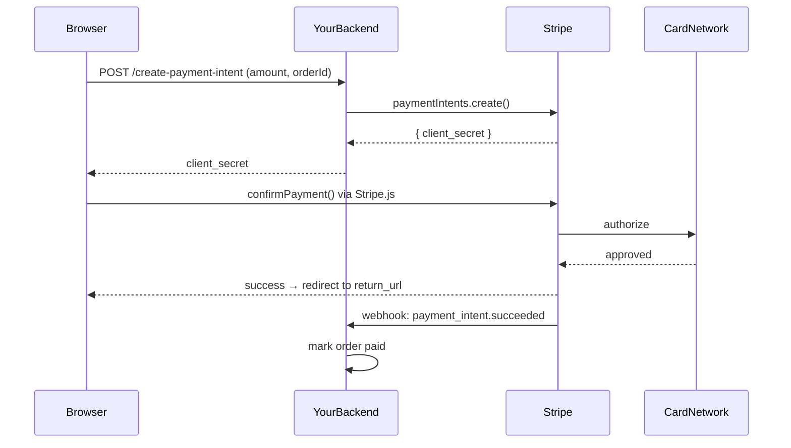

For an engineer at a young startup, "how do we accept money from customers?" sounds like a coding question. It mostly isn't. The hard parts are regulatory, operational, and strategic — the API is just how those decisions surface in your editor. This post walks through why Stripe became the default answer, the minimum integration, when it stops being the right answer, and the historical shift from PayPal that explains how we got here.

## The problem a startup actually faces

If a company exposes its bank account and asks customers to wire money directly:

- 💸 **Conversion dies.** No card payments, no impulse buys, no mobile checkout.
- 🌍 **International is impossible.** Cross-border bank transfers require correspondent banking, FX, local payment-method support (iDEAL, SEPA, Boleto, JCB).
- 🛡️ **You inherit risk.** Fraud screening, chargebacks, refunds — none of this exists for raw bank transfers, so customer disputes have no protocol.
- 🧾 **For marketplaces, you may become a regulated money transmitter** — which in the US means licensing in every state. Total cost to reach nationwide coverage: roughly **$2–10M and 18+ months.**

A regular B2C SaaS doesn't trigger AML obligations directly by taking bank transfers, but the operational friction alone kills the business model. So the question becomes: which payment processor, not whether.

## Why Stripe wins for startups

Most engineers first see "elegant API" and stop there. The actual reasons are deeper.

### 1. PCI-DSS scope offloading

If your server ever sees a raw card number, you fall under PCI-DSS — audits, security controls, real ongoing cost ($5k–50k/year for small companies). Stripe Elements / Checkout runs in an iframe served by Stripe, so card data goes **browser → Stripe directly**. You only ever handle an opaque token. Months of compliance work simply disappear.

### 2. Stripe is the regulated entity, not you

The single most underrated value Stripe delivers:

> **"We are the licensed financial institution. You are not."**

That role includes being the merchant of record for card-network relationships, holding money-transmitter licenses (via Stripe Connect for marketplaces), being PCI-compliant, carrying settlement capital, and absorbing some fraud losses. You rent all of that as a service.

### 3. They solve the hard adjacent problems

| Product | What it replaces |
|---|---|
| **Radar** | An in-house fraud-scoring team |
| **3D Secure / SCA** | EU regulatory compliance work |
| **Billing** | Subscription engine, proration, dunning, retries |
| **Connect** | Money-transmitter licensing in 50 US states |
| **Tax** | Sales tax / VAT calculation across jurisdictions |
| **Webhooks** | Reliable async event delivery |

### 4. Developer experience

Clean REST API, idempotency keys built in, official SDKs, predictable sandbox, real-feeling test cards, docs that became an industry benchmark. You can take a real payment in an afternoon. The "boss" doesn't care, but the engineer ships in a week instead of a quarter — and **speed-to-market is itself a strategic decision.**

### 5. Trust and conversion

Customers recognize the checkout. Lower abandonment than a no-name processor. The Stripe logo at checkout is free conversion lift.

### 6. Transparent pricing

~**2.9% + $0.30** per US card charge. No monthly fee, no setup fee, no minimum. You only pay when you make money. Compare to traditional merchant accounts, which often require underwriting, a personal guarantee, and PCI fees.

## The minimum code flow

The modern pattern is **PaymentIntent**, not the older Charges API. The whole loop is three pieces:



### Backend — create the intent

```js
import Stripe from "stripe";
const stripe = new Stripe(process.env.STRIPE_SECRET_KEY);

app.post("/create-payment-intent", async (req, res) => {
  const intent = await stripe.paymentIntents.create({
    amount: 1999,          // cents — $19.99
    currency: "usd",
    automatic_payment_methods: { enabled: true },
  }, {
    idempotencyKey: req.body.orderId,  // safe retry on network failure
  });
  res.json({ clientSecret: intent.client_secret });
});
```

### Frontend — confirm with Elements

Card details never touch your server.

```js
const stripe = Stripe("pk_test_...");
const elements = stripe.elements({ clientSecret });
elements.create("payment").mount("#payment-element");

const { error } = await stripe.confirmPayment({
  elements,
  confirmParams: { return_url: "https://example.com/done" },
});
```

### Webhook — the piece people forget

Don't trust the browser to tell you the payment succeeded. Trust Stripe's signed webhook.

```js
app.post("/webhook", express.raw({type: "application/json"}), (req, res) => {
  const event = stripe.webhooks.constructEvent(
    req.body,
    req.headers["stripe-signature"],
    process.env.WEBHOOK_SECRET,
  );
  if (event.type === "payment_intent.succeeded") {
    // mark the order paid in your DB
  }
  res.json({ received: true });
});
```

That's the full minimum: **create intent → confirm on frontend → fulfill on webhook.** Subscriptions, refunds, Connect — all variations on this same shape.

## When NOT to use Stripe

- 🇨🇳 **Mainland China.** Stripe doesn't operate there directly. Local picks: Alipay, WeChat Pay, PingPong.
- 📈 **High volume (>$50–100M/yr).** Adyen, Braintree, or direct acquiring relationships become cheaper.
- 🪙 **Crypto-adjacent or unusual verticals.** Stripe is conservative about what it underwrites.
- 🧾 **Global SaaS where you want tax fully handled.** **Paddle** or **Lemon Squeezy** act as merchant of record — they pay the VAT, then remit your net. Bigger cut, less paperwork.

## How big companies handle this

The natural follow-up: do Apple, Amazon, Google use Stripe? Mostly no — but not in the way you might think.

### Nobody bypasses the card networks

Critical baseline: **everyone still pays Visa / Mastercard / Amex interchange fees.** Even Apple. The card networks are the rails. What changes at scale is who sits between you and those rails.

```
Startup stack:    You → Stripe → Acquiring Bank → Card Network → Issuing Bank
Apple's stack:    Apple ──────→ Acquiring Bank → Card Network → Issuing Bank
```

Stripe is removed. That's the structural difference.

### Build vs buy is gradient, not binary

| Stage | Annual revenue | Typical payment stack |
|---|---|---|
| Early startup | <$10M | Stripe / PayPal — pay 2.9% for speed + offloaded compliance |
| Growth | $10M–100M | Still Stripe, often with negotiated rates |
| Scale | $100M–1B | Migrate to Adyen / Braintree, or hybrid Stripe + direct |
| Mega-cap | $1B+ | Direct acquirer relationships, in-house orchestration, often launch their own payment products |

Real-world examples in the scale tier: **Uber, Spotify, Netflix, eBay, McDonald's** mostly run on **Adyen** — essentially "Stripe for enterprise" with ~1.5% blended cost instead of 2.9%. They didn't build from scratch either.

### The economics flip hard

- Stripe blended cost: ~2.9% + $0.30
- Direct acquiring with an in-house team: ~1.7–2.0%
- **Savings: ~1% of payment volume**

For Amazon's $500B+ revenue, 1% = **$5B/year** — enough to fund 1,000 payment engineers and lawyers. For a $10M startup, 1% = $100k — doesn't pay one senior engineer. Break-even is somewhere around **$50–100M/year in payment volume**.

### They also turned payments into a product

The part most people miss: Apple, Amazon, Google didn't just *handle* their own payments — they **built payment products and sell them.**

- **Apple Pay** — wallet on top of card networks; Apple takes ~0.15% per transaction from issuing banks
- **Amazon Pay** — checkout button competing with PayPal/Stripe
- **Google Pay** — same idea for Android
- **Apple Card** — credit-card issuer (with Goldman Sachs originally as bank partner)
- **Amazon Lending** — loans to marketplace sellers using sales data

They went from "customer of Stripe" → "competitor to Stripe."

### And they became regulated entities themselves

Amazon, PayPal, Google, Apple **all hold money-transmitter licenses** across US states. They run entire legal teams doing AML reporting, KYC, sanctions screening. What Stripe Connect does for a startup marketplace in five minutes of API integration, Amazon does with a 500-person compliance department. Both work — different scale, different cost structure.

The interesting outlier is **Shopify**: huge, but partnered with Stripe *under the hood* for Shopify Payments. They could afford to build, but their core competence is commerce software, not payment infrastructure. Even at scale, "buy" is sometimes still the right call.

## The PayPal → Stripe shift: how Stripe grew under PayPal's nose

If you started a business before ~2012, PayPal was the de facto choice. The shift is one of the cleanest "second mover wins" stories in tech, and it's almost entirely about **developer experience meeting macro timing.**

### They came from different eras solving different problems

- **PayPal (1998)** — built for the eBay era. Peer-to-peer payments between strangers on auction sites. The core product was a *consumer wallet*. Merchant tools were bolted on later and never the priority.
- **Stripe (2010)** — built for the cloud / SaaS / mobile era. Software companies embedding payments inside their own product. From day one, the customer was the developer.

Different design constraints, and it shaped everything downstream.

### What PayPal did badly for modern merchants

1. **The dreaded redirect.** Click "Pay with PayPal" → leave merchant site → log in → confirm → bounce back. Every step lost 5–10% of customers.
2. **Forced PayPal accounts.** Customers needed (or were pushed toward) creating a PayPal account, adding friction.
3. **API from 2003 and felt it.** SOAP/XML, ugly docs, unreliable sandbox. Days of work for what should have been an afternoon.
4. **Account freezes.** PayPal became infamous for freezing merchant funds for 180 days with no warning. Entire startups got killed overnight. This destroyed trust with founders specifically.
5. **No subscriptions worth using.** As SaaS exploded 2010–2015, every startup needed recurring billing. PayPal's was clunky and unreliable.
6. **No marketplace product.** Want to build Uber-for-X? PayPal had nothing comparable to Stripe Connect.
7. **UX bleed.** PayPal-branded interstitials looked old next to a modern SaaS app. The brand became a downgrade.

### What Stripe did right

The Collison brothers (Patrick and John) were programmers themselves. Their entire playbook was: *"if a developer can integrate it in an afternoon, they'll tell other developers."* Bottom-up adoption.

- **"7 lines of code" marketing.** The original homepage showed a tiny code snippet. That was the whole pitch.
- **The "Collison Install."** Patrick and John would meet a YC founder, grab their laptop, and install Stripe on the spot.
- **Beautiful docs.** Became an industry benchmark — companies still copy them today.
- **Card collection stays on your site.** Stripe.js / Elements — no redirects, no brand interruption.
- **Test mode that actually worked.** Predictable test cards, real-feeling sandbox.
- **Subscriptions as a first-class product** — right when SaaS exploded.
- **Connect for marketplaces** (~2012). Airbnb, Lyft, Instacart, DoorDash, Postmates — all the two-sided platforms of that generation.
- **Hired devrel, sponsored hacker conferences, blogged real engineering content.** PayPal sold to merchants. Stripe sold to developers, who *then influenced* merchant decisions.

### The macro shifts that lifted Stripe

| Shift | What PayPal had | What Stripe had |
|---|---|---|
| **SaaS / subscriptions** explode | Clunky recurring billing | First-class subscriptions |
| **Mobile apps** become dominant | Web-only redirect flow | Native SDKs, in-app payments |
| **Marketplace economy** (Uber etc.) | Nothing | Stripe Connect |

PayPal was optimized for "eBay buyer pays eBay seller." Stripe was optimized for "SaaS app charges $29/month on a credit card the user enters in a React form." Different worlds.

### PayPal tried to react

In **2013, PayPal bought Braintree for $800M** — the developer-friendly alternative used by early Uber and Airbnb, and the owner of **Venmo**. The plan: keep PayPal as the consumer brand, push Braintree as the developer-facing API.

It half-worked. Braintree is real and respected. Venmo became huge. But Braintree never matched Stripe in documentation quality, API polish, product velocity, or developer mindshare. By the time PayPal had its developer story together (~2015), Stripe had already won the YC / startup / new-builder market — which became the next decade of growth-stage and enterprise customers.

### The deeper cultural difference

> **PayPal is a financial-services company that happens to have an API.**
> **Stripe is a developer-tools company that happens to do payments.**

That distinction shows up in every product decision. PayPal's instinct: "what would a bank do?" Stripe's instinct: "what would the developer want to type?" Over 15 years, those instincts compound into very different products and very different brands.

## The lesson

Three things sit underneath this entire space:

1. **For a startup, you're not buying an API — you're renting a regulated financial institution.** That's why the boss says yes to 2.9%.
2. **At scale, the math inverts.** A 1% saving on a billion dollars hires a lot of engineers. Big companies build (or partner with Adyen / acquirers) for that reason, not because Stripe is bad.
3. **PayPal didn't get disrupted on price or features — they got disrupted on developer experience during a generational shift in who was building software.** When the buyer changed from "the procurement person at an e-commerce store" to "the engineer founding a startup at home," Stripe was holding exactly the product that engineer wanted.

The product wasn't worse. The customer changed.
