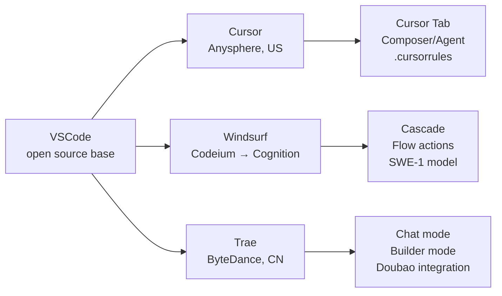
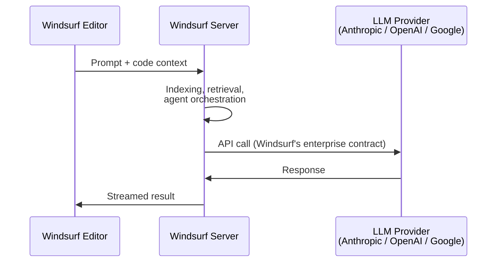

## What is Windsurf?

Windsurf is an AI-native code editor made by **Codeium**, structurally in the same category as Cursor and Trae:

- **VSCode fork** — inherits the VSCode UI, keybindings, settings, and most of the extension ecosystem (some Microsoft-proprietary extensions like the official C/C++ or Remote extensions are restricted to official VSCode builds).
- **AI layer on top** — built-in chat, inline edits, tab completion, codebase indexing.
- **Cascade agent** — the flagship feature, an agentic mode that can read, edit, and run terminal commands across many files in one long-running flow.

So if you already know Cursor, Windsurf feels very familiar — same editor bones, similar AI features, slightly different emphasis on agent autonomy.

## The Landscape

## Open Source?

**No** — Windsurf itself is proprietary, though built on open-source foundations.

| Layer | License |
| --- | --- |
| VSCode core (the fork base) | Open source, MIT (Code - OSS on GitHub) |
| Windsurf's additions (AI features, Cascade, UI, branding) | Closed source / proprietary |
| Account requirement | Sign-in required; AI features call back to Windsurf servers |

Same model as Cursor. If you want a fully open-source AI coding editor in this space, the closest options are:

- **Void** — open-source Cursor alternative, MIT licensed
- **Continue.dev** — open-source AI extension inside regular VSCode (not a fork)
- **Cline / Roo Code** — open-source agentic coding extensions for VSCode

## Who Trains the LLM?

Mostly third-party providers, but with a nuance compared to Cursor.

- **Cursor**: pure API consumer. Routes to Anthropic (Claude), OpenAI (GPT), Google (Gemini). They train smaller proprietary models for tab-completion and apply-edits, but heavy reasoning is all third-party.
- **Windsurf/Codeium**: started as an autocomplete company training their *own* models. They still ship proprietary models (e.g. SWE-1) alongside offering Claude/GPT/Gemini via API for heavy work.

In day-to-day use, most users pick Claude or GPT through Windsurf — the frontier reasoning comes from Anthropic/OpenAI/Google. But unlike Cursor, the company itself has LLM training capability.

⚠️ After the 2025 Google deal (see history below), much of Codeium's core model-training talent left for Google. The in-house frontier model story is weaker now than it was; the IDE business continues.

## How Billing and Requests Flow

Same model as Cursor: **you pay Windsurf a subscription, not the LLM provider directly.**

Why it's done this way:

- 💰 **Bundled pricing** — Windsurf buys LLM capacity in bulk and resells it as "credits" or "flow actions," usually cheaper per-call than retail API rates, but capped per month.
- 🧠 **Server-side features** — codebase indexing, embeddings, context retrieval, agent orchestration all run on Windsurf's servers.
- 📊 **Routing/metering** — they can pick models, prompt-engineer, cache, and meter usage.

**Privacy implication**: your code snippets get sent to Windsurf's servers before reaching the LLM provider. They publish a zero-data-retention policy and offer enterprise options, but the trust chain is `you → Windsurf → Anthropic/OpenAI`. Same chain as Cursor.

**BYO-key**: Windsurf has historically been more restrictive than Cursor here — primarily a subscription product, with BYO-key options limited or enterprise-only depending on plan/version.

## Company History

The arc in one line: **GPU infra startup → free Copilot competitor → VSCode fork with agent → talent/IP largely absorbed by Google → product folded into Cognition.**

### 2021 — Founded as Exafunction
Founded by Varun Mohan and Douglas Chen (both ex-Nuro, MIT alums). Original business: GPU infrastructure / inference optimization for ML workloads. Not a coding tool.

### 2022 — Pivot to Codeium
Their GPU-serving tech was a good fit for running code-completion models cheaply. Launched **Codeium** as a free AI autocomplete extension for VSCode, JetBrains, Vim, etc. — positioned as a free alternative to GitHub Copilot. Trained their own completion models in-house, which kept costs low enough to offer a generous free tier.

### 2023 — Growth as an extension
Codeium gained traction with individual devs and enterprises (on-prem/self-hosted offering for companies that couldn't send code to Copilot). Added chat features. Raised Series B at ~$500M valuation.

### 2024 — Series C and the Windsurf launch
- Series C at ~$1.25B valuation (early 2024).
- **November 2024**: launched **Windsurf Editor** — their own VSCode fork. Introduced **Cascade**, pitched as "agentic IDE" vs Cursor's "AI-first editor."
- Codeium-the-extension continued alongside Windsurf-the-editor.

### 2025 — The Google deal and aftermath
- Mid-2025: OpenAI reportedly tried to acquire Windsurf for ~$3B; deal fell through.
- **July 2025**: Google struck a deal — ~$2.4B in a licensing + hire arrangement. Varun Mohan, Douglas Chen, and core research/model-training staff moved to Google DeepMind to work on agentic coding (Gemini).
- Windsurf the product/company continued operating independently with remaining staff, new CEO (Jeff Wang), IDE business intact — but in-house frontier model ambitions effectively went to Google.
- Later in 2025: Windsurf was **acquired by Cognition** (the company behind Devin), consolidating two of the major agentic-coding players.

### 2026 (current)
Operates as part of Cognition. Windsurf the editor continues; the Cascade agent and Devin's autonomous agent share engineering DNA now.

## Windsurf vs Cursor — AI Coding Capability

Honest summary: **Cursor is generally considered better for most users today**, but it's closer than headlines suggest, and Windsurf wins in specific scenarios.

### Where Cursor leads ✅

- **Inline editing & tab completion** — Cursor's Cmd/Ctrl+K inline edits and Cursor Tab multi-line predictive completion are widely viewed as best in class.
- **Polish & iteration speed** — ships features faster; Composer (their agent) has caught up to and arguably surpassed Cascade.
- **Community & ecosystem** — bigger user base means more tutorials, `.cursorrules` files, shared workflows, faster bug fixes.
- **Model routing** — exposes new frontier models quickly with finer control over which model handles what.

### Where Windsurf leads ✅

- **Autonomous long-horizon agent work** — Cascade was designed agent-first. For "go fix this across 12 files and run the tests," Windsurf historically felt more willing to drive itself for longer without nagging.
- **Enterprise/on-prem** — Codeium's legacy gives Windsurf stronger self-hosted and air-gapped offerings — meaningful for regulated industries.
- **Free tier** — generally more generous than Cursor's.

### Roughly tied ⚖️

- Codebase indexing & retrieval quality
- Chat-based Q&A about your code
- Multi-file edits with a competent frontier model
- Pricing for paid individual plans (~$15–20/mo)

### Side-by-side

| Dimension | Cursor | Windsurf |
| --- | --- | --- |
| Editor base | VSCode fork | VSCode fork |
| Flagship agent | Composer | Cascade |
| Inline edit UX | Strongest | Good |
| Tab completion | Strongest (Cursor Tab) | Good |
| Agent autonomy | Strong, catching up | Designed agent-first |
| Self-hosted / enterprise | Limited | Strong (Codeium legacy) |
| Frontier model access | Anthropic / OpenAI / Google | Same, plus in-house SWE-1 |
| Open source | No | No |
| BYO API key | More permissive | More restricted |
| Company stability (2026) | Independent, well-funded | Owned by Cognition; post-Google-deal |

## The Honest Meta-Point

With Claude Sonnet 4.6 / Opus 4.7 doing most of the heavy lifting in both products, the **model** matters more than the **editor wrapper**. The gap between Cursor and Windsurf is much smaller than the gap between "using either of them" vs "not using AI at all." Pick based on workflow fit, not a leaderboard.

Plus the elephant in the room: after the Google deal stripped out Windsurf's core model-training team in 2025, and the subsequent Cognition acquisition, Windsurf's roadmap is less certain than Cursor's. Cursor remains independent and well-funded. If you're choosing today for a long-term workflow investment, that stability matters.

## Recommendation

- 🟢 **Already comfortable in Cursor** → stay.
- 🟢 **Starting fresh, want the more refined experience** → try Cursor first.
- 🟡 **Need stronger autonomous agent behavior, or enterprise/self-hosted deployment** → try Windsurf.

## See Also

- [Trae vs Cursor — AI-Native IDE Comparison](/posts/2026-05-19-trae-vs-cursor/) — the ByteDance entrant and the data-jurisdiction angle.
