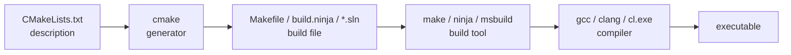

C and C++ have no standard build tool. Every platform, compiler, and IDE wants different inputs, so the community grew a stack of tools that sit on top of each other. CMake is the layer most projects use today. This note unpacks what each layer actually does, where the words "build file" and "configure" come from, and how to read a typical CMake invocation.

## What CMake Is

CMake is a **cross-platform build system generator**. You write a `CMakeLists.txt` describing your project — sources, targets, dependencies, compile options — and CMake generates the actual build files for your platform: Makefiles on Linux, Ninja files, Visual Studio solutions, Xcode projects.

The typical flow:

```bash
cmake -S . -B build      # configure: read CMakeLists.txt, generate build files
cmake --build build      # build: invokes make/ninja/msbuild under the hood
```

It's the de facto standard for modern C/C++ projects — LLVM, KDE, OpenCV, and most modern C++ libraries use it.

## What "Build File" Means

A build file is a script that tells a build tool *how* to turn source code into a final artifact: what to compile, in what order, with which flags, and how to link it.

Different tools use different build files:

| Tool                   | Build file                |
| ---------------------- | ------------------------- |
| Make                   | `Makefile`                |
| Ninja                  | `build.ninja`             |
| MSBuild (Visual Studio) | `*.vcxproj`, `*.sln`     |
| Xcode                  | `*.xcodeproj`             |
| CMake                  | `CMakeLists.txt` (generates the others) |

A minimal `Makefile` example:

```make
hello: hello.c
	gcc -o hello hello.c
```

This says: "to produce `hello`, run `gcc -o hello hello.c` whenever `hello.c` changes."

Writing these directly is painful and non-portable — a Makefile won't work on Windows, a Visual Studio project won't work on Linux. CMake lets you describe the project once and generate the right build file for whatever platform you're on.

## The Two-Layer Model

The same `CMakeLists.txt` can produce a Makefile on Linux, a Ninja file in CI, and a Visual Studio solution on a Windows dev machine — without rewriting anything.

```text
CMakeLists.txt  --(cmake)-->  Makefile / build.ninja / *.sln  --(make/ninja/msbuild)-->  executable
   (portable)                      (platform-specific)                  (final artifact)
```

You pick the backend with `-G`:

```bash
cmake -S . -B build -G "Unix Makefiles"   # generates build/Makefile
cmake -S . -B build -G "Ninja"            # generates build/build.ninja
cmake -S . -B build -G "Xcode"            # generates build/*.xcodeproj
cmake -S . -B build -G "Visual Studio 17" # generates build/*.sln + *.vcxproj
```

`cmake --build build` is a convenience wrapper that figures out which backend was generated and invokes the right tool (`make`, `ninja`, `msbuild`) for you.

## Terminology: Generator vs. Build Tool vs. Compiler

The terminology is genuinely fuzzy. Here's the more precise vocabulary:

- **Build system generator** — CMake, Meson, GN, Premake. Reads a high-level description, writes a low-level build file. Doesn't compile anything itself.
- **Build tool / build system** — Make, Ninja, MSBuild. Reads a low-level build file, actually invokes the compiler, tracks dependencies, decides what to rebuild.
- **Compiler/linker** — gcc, clang, msvc. The thing CMake and Make both ultimately drive.

In casual usage people call both CMake and Make "build tools" because they sit in the same pipeline. CMake is sometimes called a **meta-build system** to emphasize that it's one layer up — it builds the thing that does the building.

Languages with a standard toolchain (Go, Rust, Java with Maven/Gradle) don't need this two-layer setup — `cargo build` is generator, build tool, and compiler driver rolled into one. C/C++ has the split because it has no standard build tool, so a portable layer on top was necessary.

## The Five Pieces of the Pipeline

```text
CMakeLists.txt   →   cmake        →   Makefile          →   make           →   gcc          →   executable
(description)        (generator)      (build file)          (build tool)       (compiler)
```

Each layer has a clear job:

1. **`CMakeLists.txt`** — *what* you want built (targets, sources, dependencies), written portably.
2. **`cmake`** — translates the portable description into a platform-specific build file.
3. **`Makefile`** — concrete recipe: "to make X, run command Y when input Z changes."
4. **`make`** — executes the recipe, tracks timestamps, decides what needs rebuilding, invokes the compiler.
5. **`gcc`** — does the actual compilation and linking, producing the binary.

Swap any of the middle pieces and the pipeline still works:

```text
CMakeLists.txt → cmake -G Ninja → build.ninja → ninja → clang → executable
CMakeLists.txt → cmake -G "Visual Studio" → *.sln → msbuild → cl.exe → executable.exe
```



## The Older "configure" — Autotools

Before CMake, the dominant system on Unix was **GNU Autotools**. The classic incantation:

```bash
./configure
make
make install
```

In that world, `./configure` plays the same role as `cmake`: it's the **generator** step. It's a shell script that probes your system (does this header exist? what size is `int`? where is libssl?) and generates a `Makefile` tailored to your machine.

The word "configure" survives in CMake terminology: `cmake -S . -B build` is officially called the **configure step** (probing the system, resolving `find_package`), as opposed to the **build step** (`cmake --build build`). Same concept, different tool.

### The full Autotools pipeline

Autotools is famously baroque. Here's the full picture.

```text
                    ┌─── DEVELOPER SIDE (runs once, ships results in tarball) ───┐

configure.ac  ──(autoconf)──→  configure          [shell script]
                                    │
Makefile.am   ──(automake)──→  Makefile.in        [Makefile template]
                                    │
configure.ac  ──(aclocal)──→   aclocal.m4         [m4 macro collection]
                                    │
configure.ac  ──(autoheader)──→ config.h.in       [C header template]

                    └────────────────────────────────────────────────────────────┘

                    ┌─── USER SIDE (runs at install time) ───────────────────────┐

./configure  ──reads→  Makefile.in, config.h.in
             ──probes→ system (compilers, headers, libs, sizes, etc.)
             ──writes→ Makefile        (filled-in from Makefile.in)
                       config.h        (filled-in from config.h.in)
                       config.status   (replays the configure decisions)

make         ──reads→  Makefile
             ──invokes→ gcc → executable

make install ──copies→ binaries, headers, man pages into /usr/local/...

                    └────────────────────────────────────────────────────────────┘
```

The layers, in order:

1. **`configure.ac`** — developer writes this. It's a script in **m4 macros** (a 1977 macro language), declaring "I need a C compiler, check for `pthread.h`, check `sizeof(long)`, etc."
2. **`Makefile.am`** — developer writes this. High-level: "build target `foo` from `foo.c bar.c`."
3. **`autoconf`** — expands `configure.ac` (plus `aclocal.m4`) into a giant portable POSIX shell script called `configure`. This script is *thousands of lines* and must run on every Unix from 1990 onward.
4. **`automake`** — converts `Makefile.am` into `Makefile.in`, a Makefile with `@PLACEHOLDERS@` for things `configure` will fill in.
5. **`autoheader`** — generates `config.h.in`, a C header template with `#undef HAVE_PTHREAD_H` etc.
6. **`aclocal`** — gathers m4 macros (yours + system ones from `/usr/share/aclocal`) into `aclocal.m4` so `autoconf` can find them.

There's also **`libtool`** layered on top if you build shared libraries, and **`autoreconf`** as a meta-tool that runs all the above in the right order.

The genius of Autotools: the user only ever sees `./configure && make && make install`. By the time the tarball ships, all the generation is baked in, and the user just needs `sh` and `make` — no autotools required on their machine.

### Why CMake won

- **m4** is a macro language with terrible error messages.
- Five tools must run in the right order, with arcane interdependencies.
- The generated `configure` script is unreadable shell.
- Cross-compiling requires careful incantations.
- Debugging means reading expanded m4 output.

CMake collapsed all of that into one tool reading one file.

## Building a Real CMake Project from GitHub

Standard recipe:

```bash
git clone <repo>
cd <repo>
cmake -S . -B build           # configure
cmake --build build           # build
```

The executable usually ends up somewhere under `build/` (often `build/<target-name>` or `build/bin/`). Check the README for the exact path.

### Common gotchas

**1. Install dependencies first.** CMake will tell you what's missing during configure (e.g., "Could not find OpenSSL"). On Ubuntu/Debian:

```bash
sudo apt install build-essential cmake
sudo apt install libssl-dev libfoo-dev    # whatever it complains about
```

**2. Out-of-source builds.** The `-B build` puts all generated files in a `build/` subdirectory. This keeps the source tree clean and lets you `rm -rf build` to start over.

**3. Common flags:**

```bash
cmake -S . -B build -DCMAKE_BUILD_TYPE=Release    # optimized build
cmake -S . -B build -DCMAKE_BUILD_TYPE=Debug      # with debug symbols
cmake --build build -j8                           # parallel build (8 jobs)
```

**4. Install (optional):**

```bash
sudo cmake --install build                        # copies to /usr/local/...
```

Or to a custom prefix:

```bash
cmake -S . -B build -DCMAKE_INSTALL_PREFIX=$HOME/.local
cmake --install build                             # no sudo needed
```

**5. If something fails:**

- Read the configure-step error carefully — it usually names the missing package.
- `rm -rf build && cmake -S . -B build ...` to retry from scratch (cached configure state is sticky).
- Check the repo's README or `BUILDING.md` — some projects need extra flags or submodules (`git submodule update --init --recursive`).

**Older-style projects** sometimes use in-source builds:

```bash
mkdir build && cd build
cmake ..
make -j8
```

Same thing, just written before `-S/-B` flags existed (~2018).

## Decoding `cmake -S . -B build`

`-B build` means **B**uild directory = `build` — it tells CMake where to put all generated files.

```text
cmake -S <source-dir> -B <build-dir>
       │                │
       │                └─ where to WRITE generated files (Makefile, object files, cache, etc.)
       └─ where to READ CMakeLists.txt from
```

So `cmake -S . -B build` means:

- `-S .` → read `CMakeLists.txt` from the current directory
- `-B build` → write all generated stuff into `./build/` (creating it if needed)

If you omit `-S`, CMake assumes the current directory:

```bash
cmake -B build      # equivalent to: cmake -S . -B build
```

### Why a separate build directory

CMake generates a *lot* of files: `Makefile`, `CMakeCache.txt`, `CMakeFiles/` (with object files and dependency info), and eventually the compiled binaries. Dumping all that next to your source code would:

- pollute the source tree (hard to see what's yours vs. generated)
- make `.gitignore` painful
- prevent having multiple builds side-by-side

With out-of-source builds you can do:

```bash
cmake -S . -B build-debug   -DCMAKE_BUILD_TYPE=Debug
cmake -S . -B build-release -DCMAKE_BUILD_TYPE=Release
```

Two independent builds from the same source, no conflicts. `rm -rf build` gives you a guaranteed clean slate without touching your code.

The older equivalent in old tutorials:

```bash
mkdir build && cd build
cmake ..              # source is "..", build is "." (current dir)
```

The `-S`/`-B` flags (added in CMake 3.13, ~2018) just made it explicit so you don't have to `cd` around.

## Decoding `cmake --build build -j --config Release`

This is the **build step** — after configure, you actually compile.

```text
cmake --build build -j --config Release
       │            │   │  │       │
       │            │   │  │       └─ build type ("Release" = optimized)
       │            │   │  └─ flag for multi-config generators
       │            │   └─ parallel build (use all CPU cores)
       │            └─ the build directory (same one from -B build)
       └─ "invoke the underlying build tool"
```

### `cmake --build <dir>`

A portable wrapper. Instead of knowing whether `<dir>` contains a Makefile, Ninja file, or Visual Studio solution, CMake remembers what it generated and calls the right tool (`make`, `ninja`, `msbuild`) for you. Same command works on Linux/Mac/Windows.

### `-j` (or `--parallel`)

Run multiple compile jobs in parallel. With no number, it picks a sensible default (usually all CPU cores). You can also write `-j 8` for exactly 8 jobs. Equivalent to `make -j` underneath.

### `--config Release`

There are two kinds of generators:

- **Single-config** (Make, Ninja): the build type is baked in at *configure* time:

  ```bash
  cmake -S . -B build -DCMAKE_BUILD_TYPE=Release
  cmake --build build                    # already Release, --config ignored
  ```

- **Multi-config** (Visual Studio, Xcode, Ninja Multi-Config): one configure step produces a build that can do Debug *or* Release; you pick at *build* time:

  ```bash
  cmake -S . -B build -G "Visual Studio 17"
  cmake --build build --config Release   # build Release
  cmake --build build --config Debug     # also build Debug from same dir
  ```

So `--config Release` only matters for multi-config generators. On single-config (the default on Linux), it's silently ignored — which is why you often see commands include it anyway: it's harmless and makes the command portable.

### The full common workflow

```bash
cmake -S . -B build -DCMAKE_BUILD_TYPE=Release    # configure
cmake --build build -j --config Release           # build
```

The first line picks the build type for single-config generators; the second line picks it for multi-config generators. Including both means the same script works everywhere.

## Cheat Sheet

| Step          | Command                                                 | What happens                                         |
| ------------- | ------------------------------------------------------- | ---------------------------------------------------- |
| Configure     | `cmake -S . -B build -DCMAKE_BUILD_TYPE=Release`        | Reads `CMakeLists.txt`, probes system, generates Makefile/ninja file in `build/` |
| Build         | `cmake --build build -j --config Release`               | Invokes underlying build tool, parallel, optimized   |
| Install       | `cmake --install build`                                 | Copies binaries/headers to install prefix            |
| Clean rebuild | `rm -rf build && cmake -S . -B build ...`               | Wipe cached configure state and start over           |
| Multi-config  | `cmake -S . -B build-debug -DCMAKE_BUILD_TYPE=Debug`    | Keep parallel debug/release builds side by side      |
