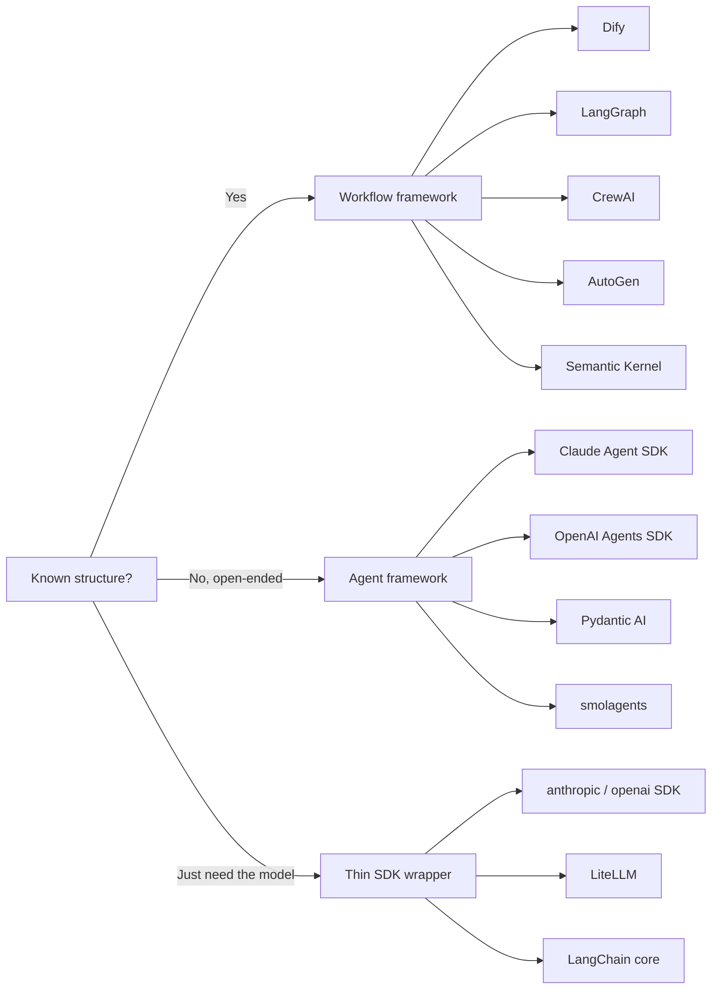

The "LLM framework" landscape on GitHub is noisy. Dify, LangGraph, CrewAI, AutoGen, Claude Agent SDK, OpenAI Agents SDK, LiteLLM, Semantic Kernel — they're often listed together as if they're alternatives, but they're not. Some are workflow engines that happen to call LLMs; others are agent harnesses where the LLM is the runtime; others are barely more than a typed HTTP client.

This post draws a clean line through the space. The split is **not** by language, license, or popularity — it's by **who decides the control flow**.

> Scope note: this is about LLM **dev frameworks** — libraries you build on. End-user products (Claude Code, Codex, SillyTavern) are out of scope; they're applications, not frameworks.

## The taxonomy at a glance



| Category | Defining trait | Who controls flow | Examples |
|---|---|---|---|
| Workflow framework | Structure authored at design time | You | Dify, LangGraph, CrewAI, AutoGen, Semantic Kernel |
| Agent framework | Structure decided at runtime via loop + tools | LLM | Claude Agent SDK, OpenAI Agents SDK, Pydantic AI, smolagents |
| Thin SDK wrapper | No orchestration; direct model call | N/A (you're just calling the API) | `anthropic`, `openai`, LiteLLM, LangChain core |

## ⚙️ Category 1 — Workflow frameworks

**Mental model:** Apache Airflow with LLM operators. You know the steps; LLMs fill in some of the nodes.

You author a DAG, task list, or conversation rulebook. LLM calls live inside the structure as components. The framework's job is **orchestration**: state passing, retries, branching, observability.

These frameworks differ mostly by **abstraction level**:

- **Dify** — highest. Visual canvas, prompt IDE, RAG built in. The unit of thought is an *application*. Aimed at teams shipping LLM products without writing much code.
- **CrewAI** — medium. Define agents (role + goal + tools) and tasks; pick sequential or hierarchical execution. The unit of thought is a *team of role-playing agents*. The "agent" framing is partly marketing — under the hood it's still a workflow.
- **AutoGen** — medium. Like CrewAI but coordination happens through **conversation** rather than task lists. The canonical pattern is GroupChat: multiple agents in a room, a manager picks who speaks next. Note: v0.2 (conversation-centric) and v0.4 (actor-model rewrite) are almost different products.
- **LangGraph** — lowest. Explicit graph of nodes and edges with a typed state schema. Full control over branching, loops, checkpoints, human-in-the-loop. The unit of thought is a *state machine*.
- **Semantic Kernel** (Microsoft) — SDK with planners and skills. Often confused with AutoGen; different product.

### A concrete workflow example (CrewAI)

A research → write → review pipeline:

```python
from crewai import Agent, Task, Crew, Process
from crewai_tools import SerperDevTool

search = SerperDevTool()

researcher = Agent(role="Analyst", goal="Find facts on {topic}",
                   backstory="Meticulous, distrusts vague claims.",
                   tools=[search])
writer     = Agent(role="Writer", goal="Turn notes into prose",
                   backstory="Favors concrete examples.")
editor     = Agent(role="Editor", goal="Catch weak claims",
                   backstory="Skeptical, detail-oriented.")

t1 = Task(description="Research {topic}.",
          expected_output="8-12 findings with URLs.", agent=researcher)
t2 = Task(description="Write a 400-word briefing.",
          expected_output="Markdown briefing.", agent=writer, context=[t1])
t3 = Task(description="Review and polish.",
          expected_output="Final briefing.", agent=editor, context=[t2])

Crew(agents=[researcher, writer, editor], tasks=[t1, t2, t3],
     process=Process.sequential).kickoff(inputs={"topic": "small language models"})
```

The structure (`t1 → t2 → t3`) is fixed at design time. The LLMs only fill in the nodes.

**Best for:** known problems, high volume, when you need determinism, auditability, and bounded cost/latency.

## 🤖 Category 2 — Agent frameworks

**Mental model:** "Here's a goal, here are tools, go." The LLM is the conductor; software (tools) is what it calls.

The architectural inversion:

```text
Workflow paradigm:
  your code → LLM(prompt) → your code → LLM(prompt) → result

Agent paradigm:
  LLM ⇄ tools (shell, files, browser, APIs) → loop until done
```

In a workflow, software calls LLM. In an agent, **LLM calls software** — and decides which software to call, in what order, until it decides it's done.

The frameworks in this category:

- **Claude Agent SDK** (Anthropic) — the framework Claude Code itself is built on, exposed for developers. You get the agent loop, tool calling, subagent spawning, context management, permission system, MCP integration.
- **OpenAI Agents SDK** — OpenAI's equivalent. Agent handoffs, guardrails, tracing.
- **Pydantic AI** — type-safe agent framework, Python.
- **smolagents** (Hugging Face) — minimal agent loop, code-execution oriented.

### Why agent frameworks are necessarily thin

A workflow framework's job is to **impose structure on the LLM**. An agent framework's job is to **provide an environment for the LLM to act in**. Different jobs → different shape.

| | Workflow framework | Agent framework |
|---|---|---|
| Core abstraction | Graph / DAG / role+task | Loop + tool registry |
| What you write | Nodes, edges, state schema | Tool definitions, system prompt |
| Who controls flow | You, at design time | LLM, at runtime |
| Framework thickness | Thick — lots of orchestration | Thin — mostly plumbing |
| Failure shape | Node error | Loop never terminates / wrong tool sequence |

The moment a framework starts predetermining "agent A talks to agent B, then C reviews," it has drifted back into the workflow paradigm — which is exactly what happened with CrewAI's "agent" framing.

**Best for:** open-ended problems where you don't know the steps in advance — coding agents, research, ops investigation, domain copilots, computer-using assistants.

## 🔌 Category 3 — Thin SDK wrappers

**Mental model:** "I want to call an LLM. That's it."

No orchestration. No graph. No agent loop. Just a typed function call to a model provider, possibly with niceties like provider-swapping or streaming helpers.

Two sub-shapes worth distinguishing:

- **Provider SDK** — `anthropic`, `openai` Python clients. One provider, maximum control, what you reach for when you don't need anything else.
- **Model abstraction** — LiteLLM, LangChain core. Same shape as raw SDK calls, but normalizes across providers (swap Claude / GPT / Llama with one line).

> 💡 **LangChain confusion**: the `langchain` library is category 3 (helpers, chains, model abstraction). `langgraph` is category 1 (workflow framework). People say "I use LangChain" and mean very different things.

**Best for:** simple classify/extract/generate tasks, learning, max control, or embedding an LLM into existing code that already has its own structure.

## The deep distinction: who decides the control flow?

The taxonomy looks tidy, but the *real* axis underneath is a single dimension:

```text
Design-time control                                  Runtime control
←──────────────────────────────────────────────────────────────────→
Dify · LangGraph · CrewAI-seq · CrewAI-hier · LangGraph-ReAct · Claude Agent SDK / Codex / Computer Use
```

- At the **left**, the human author writes the graph; the LLM is a component.
- At the **right**, the LLM has an open-ended goal, rich tools, and a loop — it decides what to do, when, and when it's done.

Most "agent frameworks" you'll see on GitHub are actually somewhere in the middle-left — workflows with role-playing prompts on top. **True agents** in the Claude Code / Computer Use sense have three traits:

1. **Open-ended goal** — "fix this bug," not a predefined task list.
2. **Rich, general tools** — shell, file edit, browser, code execution. These compose into arbitrary actions.
3. **Self-determined termination** — the LLM decides when it's done.

Until those three are present, you're still in the workflow paradigm, just with extra vocabulary.

## Where AutoGen fits

A quick note since people ask: AutoGen is workflow paradigm with a **conversation** metaphor instead of CrewAI's task list or LangGraph's graph.

| | CrewAI | AutoGen |
|---|---|---|
| Coordination | Task list, sequential/hierarchical | Conversation / group chat |
| Mental model | "Crew with assigned tasks" | "Agents in a room talking" |
| Sweet spot | Pipelines with clear role handoff | Iterative back-and-forth (code+critique, debate) |
| Code execution | Via tools | First-class (`UserProxyAgent` runs code) |

CrewAI feels like assigning a project to a team. AutoGen feels like putting people in a meeting room. Both are still workflow frameworks at heart.

## Skills and the future of the boundary

The interesting open question: **does the agent paradigm slowly absorb the workflow paradigm?**

The argument for "yes" hinges on **skills**. A skill is a *procedure dispatched by judgment* — the agent decides when to invoke it, but inside, execution can be as deterministic as any workflow node. Skills give you workflow-like predictability *inside* the agent paradigm without collapsing back into a workflow.

If models keep getting more reliable and skills mature, workflows may end up as a **compilation target** rather than a top-level paradigm — the way assembly didn't die when high-level languages arrived, it just got demoted to a layer you rarely hand-author.

But three constraints aren't about model quality, so workflows won't disappear:

- **Cost at volume** — 50M support tickets/day can't afford an agent loop per ticket. A classifier costs ~$0.0001; an agent loop costs cents. That ratio doesn't close.
- **Latency** — in-IDE autocomplete, real-time routing, search reranking need sub-second responses. Agent loops aren't latency-bounded.
- **Auditability** — regulated domains need provable, reproducible decision paths. "The agent reasoned its way to…" is harder to defend than "step 3 evaluated condition X."

So the likely outcome: **agents become the default top-level architecture for open-ended, judgment-heavy work; workflows shrink to the high-volume, narrow, latency-bound 80% underneath**.

## One-line decision rule

> Known structure → category 1. Open-ended goal → category 2. Just need the model → category 3.

That's the whole map. Most confusion in this space comes from frameworks (and their marketing) blurring categories — calling themselves "agent frameworks" when they're really workflow frameworks with role-playing prompts. Once you ask "who decides the control flow?" the labels stop mattering.

## See also

- [LangChain ecosystem and agent types](/posts/langchain-ecosystem-and-agent-types) — deeper dive on where LangChain vs LangGraph sit
- [Coze vs Dify](/posts/coze-vs-dify) — workflow framework comparison
- [Dify and the state of LLM docs](/posts/dify-and-llm-docs-state) — workflow framework from a docs perspective
