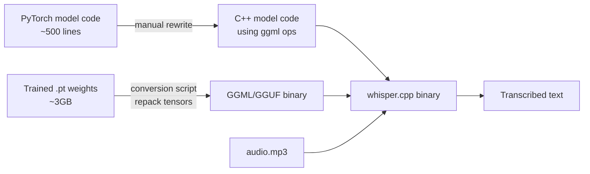

## What Whisper actually is

OpenAI Whisper is an **automatic speech recognition (ASR)** model released in September 2022. Core function: **audio in, text out**. You give it an mp3/wav/m4a/flac, it gives you the spoken words as plain text.

A few useful nuances:

- **Output formats** — plain text, `.srt` / `.vtt` subtitles with timestamps, or JSON with segment-level timing
- **Translation mode** — with `--task translate`, it transcribes *and* translates non-English audio into English in one step
- **Speech-only** — trained on speech, so it handles music lyrics poorly and either ignores or hallucinates pure sound effects

Architecturally it's an encoder-decoder Transformer: audio gets chunked into 30-second windows, converted to log-Mel spectrograms, fed through the encoder, and the decoder predicts text tokens. Trained on 680k hours of weakly-supervised multilingual audio scraped from the web — unusually large and diverse for its time, which is why it's robust to accents, noise, and technical jargon.

## Why a 2022 model became the de facto choice

Many ASR models exist. Whisper became the default for a specific combination of reasons:

1. **First *good* open-weights model.** Before Whisper, top ASR was locked behind paid APIs (Google Speech-to-Text, AWS Transcribe, Azure). Open-source alternatives (Mozilla DeepSpeech, Kaldi, wav2vec 2.0) were English-heavy or required fine-tuning. Whisper was the first model you could `pip install` and get cloud-API-quality results for free.
2. **Robust on messy audio.** Most ASR models were trained on clean audiobook data and broke on accents/noise. Whisper's noisy web-scraped training set generalized to podcasts, YouTube, phone calls, meetings.
3. **Multilingual out of the box.** ~99 languages in one model, plus translation-to-English. Competitors shipped per-language models.
4. **MIT license.** Commercial use, modification, redistribution all allowed.
5. **Timing + ecosystem flywheel.** Released as the AI wave took off. Within months: `whisper.cpp` (runs on a phone), `faster-whisper` (4× speedup), `WhisperX` (word-level timestamps + speakers). Each fork made Whisper the obvious choice for a new use case.
6. **OpenAI didn't squeeze it.** Released and largely walked away — no aggressive monetization, no deprecation. It stayed stable as infrastructure.

Newer models (NVIDIA Parakeet, AssemblyAI's models, Distil-Whisper) match or beat Whisper on benchmarks today. But Whisper hit the **open-weights + good-enough + multilingual + permissive license** combination first, and the ecosystem locked in. By the time competitors caught up, Whisper *was* the verb.

## Whisper is a family, not one model

| Model    | Parameters | Speed (rel. realtime) | Use case                        |
| -------- | ---------- | --------------------- | ------------------------------- |
| `tiny`   | 39M        | ~32×                  | Phone/edge, quick drafts        |
| `base`   | 74M        | ~16×                  | Lightweight transcription       |
| `small`  | 244M       | ~6×                   | Decent quality, CPU-friendly    |
| `medium` | 769M       | ~2×                   | Good balance                    |
| `large`  | 1550M      | 1×                    | Best accuracy                   |

Each size also had an English-only variant (`.en` suffix) slightly better on English at the cost of multilingual capability.

**Version updates** (same sizes, retrained):

- `large-v1` — original (Sept 2022)
- `large-v2` — Dec 2022, retrained longer
- `large-v3` — Nov 2023, added Cantonese, better non-English, uses 128 mel bins instead of 80
- `large-v3-turbo` (often just `turbo`) — Oct 2024, distilled 4-layer decoder, ~8× faster than `large-v3` with minimal accuracy loss

**Community-derived:**

- `distil-whisper` — Hugging Face's distilled versions
- `faster-whisper` — not a new model, re-implementation using CTranslate2
- `whisper.cpp` — same models, C++ runtime

When someone says "I used Whisper," the real question is *which* one — `tiny` on a Raspberry Pi and `large-v3` on a GPU are very different experiences.

## What actually gets released

When OpenAI "released Whisper," two distinct things shipped to two distinct places:

**On GitHub** (https://github.com/openai/whisper):

- Model **architecture** — the PyTorch class defining the encoder-decoder Transformer
- **Inference code** — how to load the trained weights, process audio, run transcription, decode tokens
- Audio preprocessing (mel spectrogram, chunking)
- Tokenizer
- CLI + Python API

**Not on GitHub:**

- Training code (loss function, optimizer, data pipeline)
- Training data (the 680k hours of audio — much of it scraped, likely copyrighted)
- Full training logs / hyperparameters

**On a CDN:**

- The **trained weights** (`.pt` files), one per model size. `tiny.pt` ≈ 75MB, `large-v3.pt` ≈ 3GB.

So you can run the model and fine-tune it (the community wrote its own training code for this) — but you can't reproduce the training from scratch with OpenAI's exact pipeline. This is the standard "open-weights" pattern from big labs (Llama, Mistral, etc.): **architecture + inference + weights, no training code or data.**

### Why code and weights ship separately

- **Code** is small, text-based, diffable. Git handles it well.
- **Weights** are huge binary blobs. Git is terrible at them (100MB file limit on GitHub).

Where weights typically live:

- **Hugging Face Hub** — the de facto "GitHub for models," Git-LFS under the hood. Whisper weights are mirrored as `openai/whisper-large-v3`.
- **Cloud storage** (S3, CDNs) — OpenAI's original hosting.
- **Torrent / IPFS** — occasionally for very large models.

File formats:

- `.pt` / `.pth` — PyTorch native (a pickled Python dict of tensors)
- `.safetensors` — newer, safer (no arbitrary code execution); Hugging Face pushes this
- `.bin` — generic, often PyTorch under the hood
- `.gguf` — used by `llama.cpp` / `whisper.cpp` for quantized CPU inference

## The "I just want to transcribe an mp3" spectrum

Setting up Whisper from scratch is genuinely error-prone: check GPU, install matching CUDA + cuDNN + PyTorch versions, `pip install openai-whisper`, download weights, hope ffmpeg is installed. For most people that's overkill. The realistic options:

| Level | Approach                                | Setup pain | When it's right                            |
| ----- | --------------------------------------- | ---------- | ------------------------------------------ |
| 1     | Raw PyTorch + GPU                       | High       | Hundreds of hours, custom pipelines        |
| 2     | `whisper.cpp` (CPU, no GPU)             | Low        | Local + simple, privacy matters            |
| 3     | Desktop apps (MacWhisper, Buzz, etc.)   | None       | Drag-and-drop, occasional use              |
| 4     | Cloud APIs (OpenAI, Groq, AssemblyAI)   | None       | One-offs, batch jobs, building a product   |
| 5     | Web demos (Hugging Face Spaces)         | None       | Tiny files, testing                        |

Rough recommendations:

- ✅ One-off mp3, just need text → OpenAI API or a web demo
- ✅ Regular use, privacy matters → `whisper.cpp` or MacWhisper
- ✅ Many hours, batch → cloud API (Groq is cheap + fast)
- ✅ Building a product → cloud API first, self-host later

The "install CUDA + PyTorch + download weights" path is really only for people already deep into ML tooling.

## whisper.cpp: same model, different runtime

`whisper.cpp` is a **C++ reimplementation of Whisper** by Georgi Gerganov — the same developer behind `llama.cpp`.

- Same Whisper models, same accuracy
- Rewritten from Python/PyTorch into pure C/C++
- No Python, no PyTorch, no CUDA required
- Compiles to a single binary (a few MB)

**Why it exists.** The original Whisper requires Python + PyTorch + ideally a GPU. That's a heavy stack for what is, at inference time, just matrix multiplication. Gerganov rewrote it in C++ with hand-optimized CPU code (AVX, ARM NEON), so it runs fast on regular hardware.

**Why it became popular.**

- Runs **anywhere**: Mac, Linux, Windows, Raspberry Pi, iPhone, Android, even in the browser via WebAssembly
- No dependencies — download, compile, run
- Fast on CPU — a modern laptop transcribes faster than realtime with `medium`
- **Quantization** support — shrinks `large` from ~3GB to ~1GB with minimal quality loss
- Apple Silicon optimized via Metal/CoreML

Typical usage:

```bash
git clone https://github.com/ggerganov/whisper.cpp
cd whisper.cpp
make

# download a model
bash ./models/download-ggml-model.sh medium

# transcribe
./main -m models/ggml-medium.bin -f audio.wav
```

Model files use a custom format (**GGML**, now **GGUF**) — same weights as OpenAI's, just repackaged for the C++ runtime.

`whisper.cpp` and `llama.cpp` started a whole movement of "port the model to C++ so normal people can run it locally." Most local-AI desktop apps (Ollama, LM Studio, MacWhisper) are built on top of these C++ runtimes.

## How do you port a trained model? Architecture vs. weights

A neural network has two parts that are **surprisingly decoupled**:

1. **Architecture** — the *recipe*. "Multiply input by matrix W1, add bias b1, apply GELU, multiply by W2..." This is maybe a few hundred lines describing the *shape* of computation. For Whisper, ~500 lines of PyTorch.
2. **Parameters (weights)** — the *numbers*. Billions of floating-point values that fill those matrices. For `large-v3`, ~1.5B numbers totaling ~3GB.

A common misconception is that "neurons" are written one by one. They aren't — a neuron isn't a piece of code, it's just a row in a matrix. When you "add a million neurons," you make a matrix bigger. The code stays the same.

### The pattern



What Gerganov actually did:

1. **Read OpenAI's PyTorch code** (~500 lines defining Whisper).
2. **Rewrote that architecture in C++** using his `ggml` tensor library — same operations (matmul, attention, layer norm), different language.
3. **Wrote a Python conversion script** that reads OpenAI's `.pt` weights and repacks them into his GGML binary format — reshuffling tensor layouts to match what the C++ kernels expect. This is a one-time data conversion, not an automatic code translator.
4. **Loaded the converted weights** into the C++ architecture and ran inference.

There is **no automatic PyTorch→C++ translator.** Architecture: manually rewritten (small, one-time effort). Weights: mechanically converted (a script that reshuffles bytes).

### Why this is hard

What sounds like "just rewrite it" actually means:

- **Every operator from scratch** — matmul, attention, GELU, layer norm, mel spectrogram, etc. Hand-vectorized for SIMD, cache-friendly memory layouts, multi-threaded.
- **A tensor library** — `ggml` is essentially a mini-PyTorch in C. Shapes, strides, broadcasting, allocation, computation graphs.
- **Numerical equivalence** — C++ output must match PyTorch to many decimal places, or accuracy degrades. Floating-point order-of-operations matters.
- **Weight format conversion** — read pickled Python, transpose/repack into the C++ layout, write to GGML/GGUF.
- **Quantization** — converting `float32` weights to `int8` or `int4` without quality loss is its own research area.
- **Hardware backends** — to be fast everywhere: AVX2/AVX-512, NEON, Metal, CUDA, Vulkan, OpenCL. Each is a separate kernel implementation.
- **Audio pipeline** — Whisper specifically needs mel spectrogram computation (FFTs). Gerganov implemented that too.

The deeper insight: PyTorch optimizes for **research velocity** — easy to define new architectures and train them. Once a model is trained and frozen, ~95% of that flexibility is dead weight. A C++ rewrite throws it away and keeps only inference math, which is why it can be 10–100× smaller and run on a phone.

### Why architecture-once, weights-converted works forever

Once you've reimplemented the ~20 operation types Whisper uses, you can run *any* Whisper variant — `tiny`, `large-v3`, future versions — by loading different weight files. You don't rewrite anything when a new size drops. This is also why `llama.cpp` could add support for Mistral, Qwen, etc. within days of release — mostly a converter script plus minor architecture tweaks.

## ggml: the engine underneath

`ggml` is the tensor library that powers `whisper.cpp`, `llama.cpp`, and a large fraction of the local-AI ecosystem. A useful mental model:

> **`ggml` is a stripped-down, inference-only, C version of PyTorch's tensor operations.**

Key difference from PyTorch: **no autograd.** PyTorch needs gradients because it's built for training. `ggml` is inference-only — weights are already trained and frozen, so the entire backward-pass machinery is cut out. That's a big reason it can be so much smaller and simpler.

### Backends supported

| Backend                | Hardware                                            | Notes                                  |
| ---------------------- | --------------------------------------------------- | -------------------------------------- |
| CPU (scalar)           | Any CPU                                             | Slowest, but works everywhere          |
| CPU + SIMD             | Modern x86 (AVX2, AVX-512), ARM (NEON)              | 4–10× faster than scalar               |
| Metal                  | Apple Silicon GPU (M1/M2/M3/M4)                     | Very fast on Macs                      |
| CUDA                   | NVIDIA GPUs                                         | Same backend PyTorch uses              |
| ROCm/HIP               | AMD GPUs                                            | NVIDIA-CUDA equivalent for AMD         |
| Vulkan                 | Any GPU with Vulkan drivers (Intel, AMD, NVIDIA)    | Universal GPU backend                  |
| SYCL                   | Intel GPUs                                          | Intel's compute API                    |
| OpenCL                 | Older/embedded GPUs                                 | Legacy support                         |
| WebAssembly            | Browser                                             | Runs in Chrome/Firefox/Safari          |
| CoreML / ANE           | Apple Neural Engine                                 | Specialized chip on iPhones/Macs       |

### "It can be slow but it works"

Compare to PyTorch + CUDA:

- PyTorch GPU acceleration → **NVIDIA only** (CUDA), barely-working AMD (ROCm), experimental Apple (MPS)
- Needs matching CUDA + driver + cuDNN versions
- Won't run at all on a 10-year-old laptop, a Pi, or a phone

With `ggml`:

- A $35 Raspberry Pi can run `whisper-tiny` — slowly, but it runs
- A 2015 MacBook with no discrete GPU can transcribe podcasts
- An iPhone can run Whisper offline (how several transcription apps work)

PyTorch was designed for **researchers with $10k GPUs**. `ggml` was designed for **everyone with any computer**. The trade-off:

- PyTorch — maximum performance on supported hardware, narrow hardware support
- `ggml` — "good enough" performance on *all* hardware, maximum reach

This is the shift that made "local AI" a real category in 2023 instead of a cloud-only technology. Before `ggml`/`llama.cpp`, running modern AI models locally required a gaming PC or a Mac Studio. After, it's possible on a phone. That isn't a 2× improvement — it's a different category of accessibility.

## The bigger picture

Three takeaways from how Whisper actually ships and runs:

1. **"Open-weights" ≠ "open-source."** Architecture + inference code + weights are public. Training code and data usually aren't. This is the standard pattern across major labs.
2. **A trained model = small code + big data.** Architecture is short and stable. Weights are huge and frozen. Porting = rewrite the small code, convert the big data. Once you internalize this, most of the ML ecosystem becomes legible.
3. **Runtime portability beats peak performance for most users.** PyTorch + CUDA wins on a workstation. `ggml` wins everywhere else — and "everywhere else" turned out to be where the demand was.
