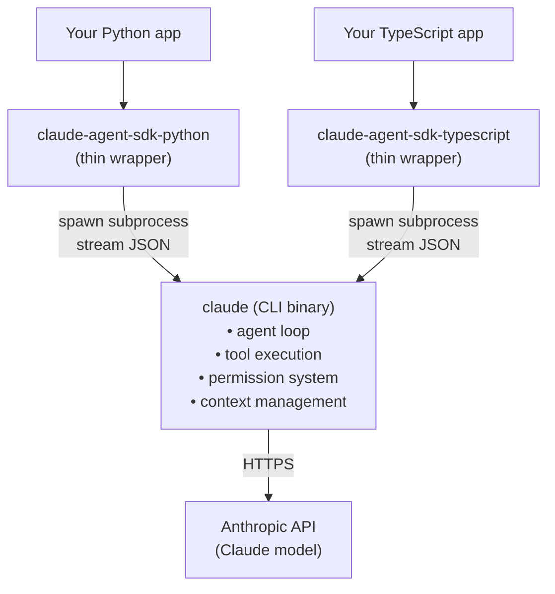
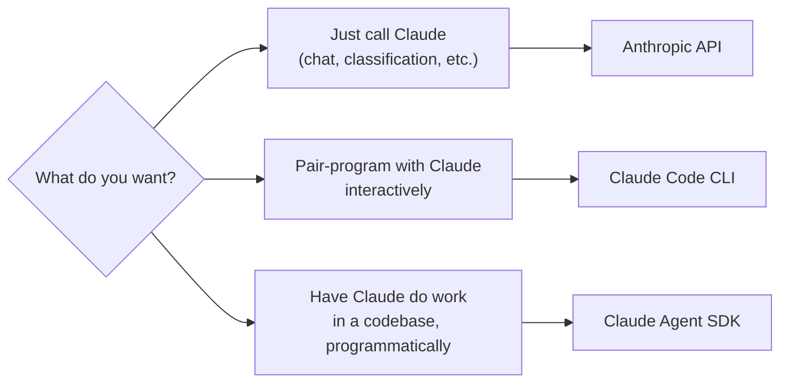

If you've poked at Anthropic's developer surface, you've probably bumped into three names:

- **Anthropic API** — raw model calls
- **Claude Code** — the CLI/desktop coding assistant
- **Claude Agent SDK** (formerly *Claude Code SDK*) — a library for building your own agents

The natural assumption is that the SDK is the *foundation* and Claude Code is *built on top* of it. That's the layering most platforms use. It is also, in this case, wrong. This post pins down what each one actually is and how they relate.

## The three things, briefly

### Anthropic API

The model-level HTTP API. You send messages, you get text back. Nothing else — no tools, no file access, no agent loop. If you want behavior beyond "chat completion," you build it yourself.

### Claude Code

The **end-user product**. A CLI you install and run interactively in your terminal (also available as a desktop app and IDE extensions). It's an *agent* — Claude in a loop with tools (Read, Edit, Write, Bash, Grep, WebFetch…), a permission system, context management, slash commands, subagents, hooks, and MCP integration.

```bash
npm install -g @anthropic-ai/claude-code
claude
> fix the failing tests in this repo
```

Built for humans.

### Claude Agent SDK

A **library** you import into your own program. Same tools, same agent loop, exposed as a programmable API instead of a terminal UI.

```python
from claude_agent_sdk import query

async for message in query(prompt="Refactor utils.py to use type hints"):
    print(message)
```

That one `query()` call internally: spins up Claude, gives it the tools, runs the loop, manages permissions, streams results back.

Built for programs.

## The layering (the part everyone gets wrong)

The intuitive guess is:

```
Claude Code  ──built on──▶  Claude Agent SDK  ──built on──▶  Anthropic API
```

Reasonable, but inverted. The real picture:



In other words:

- The **Claude Code CLI is the engine.** All the agent machinery — tools, permissions, context, subagents — lives inside that binary.
- The **SDKs are thin clients** that spawn the `claude` CLI as a subprocess and drive it via streaming JSON messages.
- The CLI itself is what talks to the **Anthropic API** over HTTPS.

So when you call `read_file` through the Python SDK, here's what actually happens: your Python code asks the SDK to run a prompt → the SDK spawns the `claude` CLI subprocess → the CLI's agent loop decides to use the Read tool → the CLI reads the file → the result flows back through JSON → your Python code receives it.

The SDKs don't *contain* the tools. They borrow them.

## Implications of that layering

Once the mental model clicks, several things make sense:

| Observation | Why |
|---|---|
| Both SDKs require the `claude` CLI to be installed | They literally spawn it as a subprocess. |
| New Claude Code features (tools, hooks, slash commands) show up "for free" in the SDKs | Because the SDKs delegate to the CLI — updating the CLI updates the SDKs. |
| Python and TS SDKs have feature parity | They're sibling wrappers around the same backend, not independent reimplementations. |
| The SDKs are small repos | Most of the heavy lifting is in the CLI. |

## What the SDK adds on top

The SDK isn't *only* a remote control. It also lets you plug your own code into Claude Code's loop:

- **Custom tools** — define a tool in Python/TS; the CLI calls back into your process when Claude wants to use it (via in-process MCP).
- **Hooks** — run your code before/after tool calls.
- **Permission callbacks** — your code decides yes/no instead of showing a terminal prompt.
- **System prompts, tool allow/deny lists, permission modes** (`default`, `acceptEdits`, `bypassPermissions`, `plan`) configured programmatically.

So: remote control of Claude Code, **plus** extension hooks back into your program.

## When to reach for which



- **Anthropic API** — chatbots, content generation, classification, embeddings. No filesystem, no shell, no agent loop.
- **Claude Code** — interactive coding sessions. You drive it; it edits and runs things in your repo.
- **Claude Agent SDK** — CI bots, scheduled jobs, code-review agents, migration scripts, custom internal tools. Anywhere "an LLM with shell + file access" is the right primitive but a human-in-the-terminal isn't.

## Why the rename

The SDK used to be called *Claude Code SDK*, which implied it only built coding tools. But the same harness — agent loop, tool use, permissions, context management — works for research bots, customer-support agents, data pipelines, anything. The rename to **Claude Agent SDK** reflects that it's a general agent-building toolkit; Claude Code is just one (very polished) product built on it.

That framing is more accurate as marketing, but it can muddy the layering. The CLI is still the engine.

## Open source status

Both SDKs are public on GitHub under [github.com/anthropics](https://github.com/anthropics):

| Repo | License | Notes |
|---|---|---|
| `claude-agent-sdk-typescript` | No `LICENSE` file — README points to Anthropic's Commercial Terms of Service | Source-available, not open source in the OSI sense |
| `claude-agent-sdk-python` | MIT (© 2025 Anthropic, PBC) | Genuinely open source |

Note: even with the Python SDK being MIT, *using* it to call Claude still falls under Anthropic's Commercial Terms — that governs the API/model usage, not the SDK code itself.

The Claude Code CLI itself is distributed as a binary via npm; the public `anthropics/claude-code` repo is mainly an issue tracker and docs.

## The one-line summary

> **Claude Code is the agent. The Claude Agent SDK is how you script it from your own program. Both call the Anthropic API underneath — but only the CLI does so directly; the SDK goes through the CLI.**
