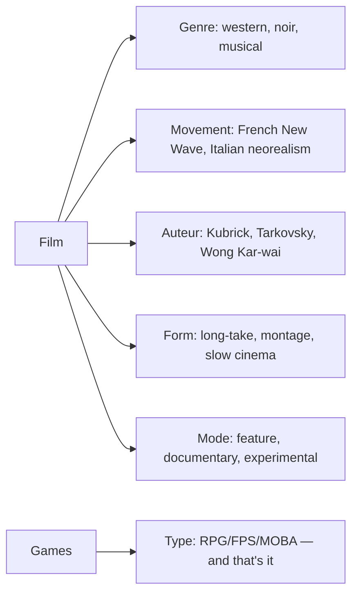
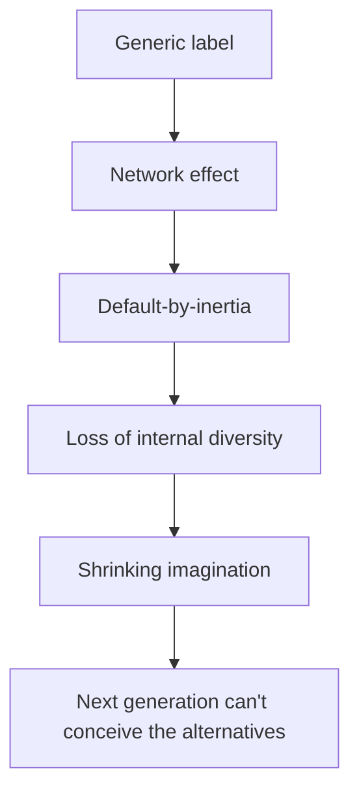

Three categories — **electronic games**, **programming languages**, and **human languages** — share a structural failure that is rarely named explicitly. In each, a single label papers over enormous internal diversity; in each, a hegemonic winner emerged less from merit than from historical accident, power, and network effect; and in each, the hegemony quietly limits what its users can think.

This essay walks the three cases in parallel and ends at their common conclusion.

## 1. "Video Game" Is At Least Six Different Things

The most popular AAA "games" of the last decade — *Cyberpunk 2077*, *Red Dead Redemption 2*, *The Witcher 3*, *Elden Ring* — invite an obvious question: **are they really games?**

The history of human play, from Go and chess to football, *Counter-Strike*, and *Dota*, points at one durable definition: **a rule system, optional opposition, repeatable matches, and a measurable outcome**. Johan Huizinga's *Homo Ludens* fits the same shape — bounded time and space, voluntary rules, clear results. You win a round, you start another. Skill accumulates across rounds.

That is not what playing *Red Dead Redemption 2* feels like. Once you finish, the motivation to "play again" is not the motivation to play another chess game; it is the motivation to **reread a novel** or **rewatch a film**. The game-studies field has spent two decades arguing about this under the label **ludology vs. narratology**, but the cleaner framing is that **the same technical substrate** — 3D rendering, physics, input, Unity/Unreal, GPU shading — **is being used to produce different kinds of objects**.

A more honest taxonomy organizes "electronic games" by **the pre-electronic human activity they descend from**:

| Category | Example | Ancestral human activity | Core experience |
| --- | --- | --- | --- |
| Care / cultivation | *Stardew Valley*, *Animal Crossing* | Playing house, dollhouses, raising pets, bonsai | The calm of tending and building |
| Vicarious life | *The Witcher 3*, *Cyberpunk 2077*, *RDR2* | Novels, theater, film | Living a designed life in first person |
| Pure puzzle | *Tetris*, *Angry Birds* | Solitaire, Rubik's cube, sliding puzzles | Hand–brain coordination + Pavlovian loops |
| Rhythm / sync | rhythm games | Dancing, karaoke, instruments | Bodily pleasure of beat alignment |
| Competition | FPS, MOBA, racing, board games | Sports, board games, card games | Huizinga's "true" game — rules + opposition |
| Creation / experiment | *Minecraft*, *KSP*, *Portal* | LEGO, sandboxes, science kits | Craft and exploration without preset answers |
| Controlled fear | *Resident Evil*, *P.T.* | Haunted houses, horror films, roller coasters | Paid, bounded terror |

The only thing that unites this table is **"you do it through a screen with an input device."** Calling all of it "video games" is roughly equivalent to grouping news, sitcoms, advertising, sports broadcasts, and surveillance footage as "TV programs" — true in a vacuous, technical sense, and false in every sense that matters for criticism, taste, or design.

### The "interactive narrative" species

The genuinely new category is the second row — what some have called *interactive narrative*, *playable story*, or just *walking simulator* (once pejorative, now used neutrally for the *Edith Finch* / *Stanley Parable* lineage).

Calling these "novels turned electronic" is too reductive. A novel is one-directional; the reader does not change the text. In *The Witcher 3*, you press the gallop key while Arthur rides through snow; you choose to spare or kill an NPC. Your operation is *part of* the experience. These works are something **new** — borrowing the interaction grammar of games and the narrative grammar of cinema/literature, hybridized into a form that wasn't possible before. Hideo Kojima, building *Death Stranding*, said openly that he wasn't making "a game" — he was making something he had no precise word for.

So the long question — "is *Elden Ring* really a game?" — has a clean answer: **it isn't, in the historical sense; it's a hybrid of competition, vicarious life, and puzzle**. The reason no one says this in the store page is that "game" is a marketing convenience, not an ontological category. Steam's tag system is closer to a community keyword cloud than a serious taxonomy.

### Why electronic games lack film's critical vocabulary

Programmers know that **non-game software is obsessed with making new words**. The front-end world alone has produced SPA, MPA, PWA, SSR, SSG, ISR, islands architecture, micro-frontends, edge rendering — in a single decade. AI has produced RAG, agent, MCP, CoT, LoRA, MoE in 24 months. Game classification, by contrast, **has barely moved in 30 years**: RPG, ACT, FPS, MOBA, SLG, roguelike. Even *Cyberpunk 2077* and *Disco Elysium* — two works whose spiritual DNA could not be more different — both sit under "RPG."

Three structural reasons:

1. **The discourse belongs to marketing, not engineers.** Front-end terminology is invented by engineers to describe technical differences precisely. Game-store terminology is invented to help a buyer decide in three seconds — and unfamiliar labels actively hurt sales. The industry has no incentive to subdivide.
2. **The real differences live in *experience*, which resists language.** SSR vs. CSR can be expressed in code and benchmarks. *Disco Elysium* vs. *The Witcher 3* requires aesthetic vocabulary that the medium hasn't developed.
3. **Games haven't had their "modernist moment."** Painting only fragmented into Impressionism, Cubism, Abstract Expressionism, etc., after photography stole its realism job and forced painters to ask "what *is* painting?" Game makers are still in a pre-modernist state — "games are games, make them fun." *Outer Wilds*, *Inscryption*, *Edith Finch*, *Disco Elysium* are the first cracks in that consensus.

What games still lack — and film has had for 60+ years — is a multi-axis vocabulary:



A single film can be described along five axes simultaneously. A single game gets one. The "movement" axis is essentially empty — there is no recognized name for "the reflective-narrative game movement of the mid-2010s," though *Stanley Parable*, *Edith Finch*, *Inscryption*, *Disco Elysium* are clearly one. There are no critics of the stature of Roger Ebert or Pauline Kael. The closest analogs are YouTubers like Jacob Geller and outlets like Critical Distance — early-stage, doing introduction more than canonical evaluation.

And games have a **materiality problem** film never had: old films can be remastered and streamed; old games are stranded on dead hardware and shuttered servers. *P.T.* is permanently gone. Many PS3-exclusives will never be republished. Game history is **physically disappearing** in a way film history never did. Without preservation, there is no canon. Without canon, there is no movement-vocabulary.

The taxonomy is bad **because the medium hasn't yet developed the language to discuss itself**. It is in roughly the position cinema was in around 1915.

## 2. Programming Languages: Attention Cycles and JavaScript's Escape

Programmer attention moves in tidal waves. A useful framing: **the working programmer population is a finite attention pool, and each generation can only focus on one or two paradigm shifts.**

Two well-documented waves:

**Java wave (≈ 2003–2015).**
Struts 1 → Struts 2 → Spring (2003) → Spring MVC → Spring Boot (2014) → Spring Cloud (2015) → microservices + K8s. Underneath: the complexity explosion of enterprise applications, from monolith to distributed, from XML config to convention-over-configuration, from SOAP to REST to gRPC.

**JavaScript wave (≈ 2010–present).**
jQuery (2006) → Backbone/Knockout/Angular 1 → React/Vue/Angular 2 (2013–14) → Redux/MobX → Webpack era → Next.js/Nuxt → Server Components/Remix/Astro/Bun/Turbopack. Underneath: the browser's transformation from a document viewer to an application runtime — and then the recent re-blurring of front-end/back-end boundaries.

Both waves followed the same life cycle:

```
Cambrian period  →  consolidation  →  abstraction layering  →  boring infrastructure  →  attention migrates elsewhere
```

Java is now in **boring infrastructure**. Front-end is in late **abstraction layering**. The next wave, almost certainly, is **AI agents** — and it is currently in **Cambrian period** chaos: LangChain (2022) already considered "over-engineered" by many; AutoGPT/BabyAGI (2023) the cowboy era; LangGraph, AutoGen, CrewAI, Mastra still competing for orchestration standards; MCP attempting to become the agent-tooling protocol the way HTTP/REST became the web-service protocol; Cursor / Claude Code / Copilot as the IDE-integrated line; new words like *agentic coding* and *vibe coding* appearing weekly.

But the AI-agent wave has **four structural differences** from its predecessors:

1. **Programmers are building something that may displace programmers.** Spring made Java devs more productive; React did the same for front-enders. AI agents threaten to redefine *who is writing the code at all*. The end of this wave may not be "boring infrastructure" but "redefined job."
2. **Output is non-deterministic.** Fifty years of software engineering practice — tests, CI/CD, formal verification — presumes determinism. Agents don't have it. The discipline of *evals* is the very early seed of a new engineering culture, but it isn't mature.
3. **The wave is accelerating.** Java's peak lasted ~12 years; front-end ~10 and still going. Agent frameworks may consolidate in 5–7, because the foundation models underneath double in capability every 6–12 months — **the bedrock moves faster than the building**.
4. **There may be no winner framework.** Spring won; React won; problem boundaries were stable. Agent capability boundaries move — features you'd write a framework for today are absorbed into the model in six months. Compare to Heroku, which was hollowed out by AWS adding the same features in-house.

### Next.js Rediscovered PHP — and That's a Story About When Ideas Are Possible

There is a recurring joke that "twenty years of front-end development ended where it started: PHP." Next.js really is, structurally, **server renders HTML and sends it to the browser, with templating** — exactly the PHP/JSP/ASP model. The natural question is: **why didn't anyone do "everything in JS" back then?**

The answer is not "no one thought of it" — Netscape literally tried server-side JS (LiveWire) in 1996. It is **the technical preconditions did not exist**:

| Wall | Why it blocked server-side JS in 1998 |
| --- | --- |
| Engine performance | All pre-2008 JS engines were tree-walking interpreters built for animating dropdown menus. V8 (with JIT) didn't ship until Chrome 2008. |
| Runtime | Node.js (2009) was the first viable server runtime, and its real innovation was the single-threaded event loop on top of V8 — counter-intuitive at the time, when "high concurrency = many threads" was orthodoxy. |
| Language quality | JS was written by one person in ten days in 1995. No modules, no classes, no `let`/`const`, callback hell, `==` vs `===`, `this` binding chaos. Not usable for large codebases until ES6 (2015). |
| Ecosystem | npm (2010) had not been invented. Java, PHP, Python all had decades of libraries. Writing a server in JS in 2000 meant writing every wheel from scratch. |

These four walls fell more or less simultaneously between 2008 and 2015. Once they fell, server-side JS was inevitable. The lesson is broader: **most "new" technologies are old ideas whose prerequisites finally arrived**.

- Docker re-invented BSD jails.
- Kubernetes re-invented Google Borg / Mesos.
- GraphQL re-invented database query languages for HTTP.
- Neural networks (1958) waited 60 years for the GPU.
- Next.js + RSC re-invented PHP — but with **isomorphic components** (one codebase running on both server and client) and **component-based composition** (`npm install` a DatePicker, not piece together two halves yourself). These two are genuine advances PHP never had. Next.js is **what PHP was trying to be in 1995, finally answered in full**.

The deeper irony is that **in 1995 the bet was on the wrong horse**. Sun bet that **Java** would be everywhere — applets in the browser, JSP on the server, Swing on the desktop, J2ME on phones. "JavaScript" was named to ride Java's coattails; the two had no technical relationship. Java lost the browser completely; the throwaway 10-day scripting language has since eaten **desktop (Electron), mobile (React Native), server (Node), embedded, ML inference**. VSCode, Discord, Slack, Notion, Figma, Microsoft Teams, 1Password, WhatsApp Desktop — every one of them is a Chromium + V8 in disguise. This is one of the cleanest "wrong bet" stories in computing history.

### JavaScript: The bash of the Browser

The bash analogy is unkindly accurate. JS is to the browser what bash is to Unix:

- Both are used **because there is no alternative**.
- Both are **deployed everywhere** and therefore unreplaceable.
- Both accumulate decades of compatibility-driven historical baggage.
- Both have modern replacements (fish, zsh / TypeScript, Dart, transpile-to-JS languages) that **never displaced the original**.
- Both are languages **everyone uses and no one loves**.

A short, partial inventory of what TypeScript **can't actually fix**, because TS only sits on top of the existing JS runtime:

- `==` vs `===` mess
- `this` binding pathologies
- `[] + {}` style coercion horrors
- `0.1 + 0.2 !== 0.3` (IEEE 754, but JS using it for integers makes it worse)
- `var` and hoisting
- The `Date` API (Temporal is still on the way)
- CommonJS vs. ESM module schism
- async/await is sugar over the same callback/Promise mongrel underneath

The famous *JavaScript: The Good Parts* (2008) by Douglas Crockford is ~100 pages. *JavaScript: The Definitive Guide* is over 1000. The ratio — roughly 1 in 10 of the language is worth using — is the point.

In contrast, languages **designed deliberately** in roughly the same era show what was possible:

- **Lua (1993)** — Brazilian academics took their time. One core data structure (tables), closures as first-class citizens, built-in coroutines, syntax learnable in an evening. Embedded in *World of Warcraft*, *Roblox*, Redis config, etc., and never displaced.
- **Python** — Guido's "one obvious way" rule, the opposite of JS's "five ways to define a function."
- **Scheme** — Lisp minimalism, syntax tree is the program, macros let you extend the language. *SICP* has used it to teach programming for 40 years; no serious institution would dare teach intro programming with JavaScript.

JS's flaws all trace to one root: **it was written in ten days to meet a commercial deadline**. Python's Guido thought for years. Lua had a research team. Haskell had a committee. JavaScript had one person and a week. And the product of that week became the most-deployed programming language in human history — far past anything COBOL or Java ever reached, simply because every browser in every device runs it.

### The Pollution Problem

COBOL is bad, but **it is locked in the mainframe**. Touch nothing about banking core systems and you'll never meet it. JavaScript is different — it **escaped the browser**, and is still escaping, in waves:

| Escape event | Effect |
| --- | --- |
| Node.js (2009) | First non-browser runtime. Pulled V8 out of Chrome, opened twenty years of JS colonizing the server. |
| npm + package explosion (2010–) | ~3M packages on npm, ~5× PyPI, ~6× Maven Central. The mass became its own gravity well. |
| Electron (2013) | JS colonized the desktop. Every modern "native" app you open is a packaged Chromium + Node. |
| React Native and friends (2015–) | JS colonized mobile. |
| Tooling (ongoing) | Webpack, Rollup, Vite, esbuild, Babel, PostCSS, TypeScript itself, Prettier, ESLint — **all JS**. Even a pure Rust or Python project that ships any front-end must install Node. |
| AI agents (2022–) | LangChain.js, MCP's official SDK in TypeScript first, Vercel AI SDK is JS-only, Mastra is TS. A brand-new field is being defaulted into JS/TS. |

The agent wave deserves a separate note because of a **self-reinforcing loop**:

1. GitHub's most-stored language is JS; TS is fourth-largest and fastest-growing.
2. LLM training corpora skew accordingly.
3. Model "default fluency" is highest in JS/TS.
4. Unprompted, the model emits JS/TS for generic "write me a tool" prompts.
5. Users accept it, producing more JS/TS in the wild.
6. The next training cycle skews further.

This is **language drift via LLM**. Python used to enjoy the "any script defaults to Python" privilege; that privilege is now being eroded.

There were at least four moments where the industry could have walled JS off, and missed each one:

- **2009**, when Node.js shipped. No one objected to "let's make browser language the server language."
- **2011–2014**, when Google tried with **Dart** — explicit goal: replace JS, ship Dart VM in Chrome. Other browser vendors refused; Google pivoted Dart to Flutter; the window closed.
- **2017**, when WebAssembly shipped. WASM can host Rust/Go/C++/Swift in browsers — but it still **can't talk to the DOM directly**, only through a JS bridge. The window is half-open.
- **Now**, the AI-agent moment. Could have been a fresh slate; is being defaulted into TS by ecosystem inertia.

Each missed wall increased the network effect by an order of magnitude. The right framing is **invasive species ecology**: stopping an organism at the border is orders of magnitude cheaper than eradicating it once established.

The structural reason it spread: **TypeScript is good enough**. If JS were unusable, the industry would have rejected it; it isn't quite unusable, so it slowly takes every category by *default*. **"Good enough but not good" is more colonial than "obviously bad."** This is identical to English in international settings — not the most elegant language, just good enough to dominate.

## 3. English Is the JavaScript of Languages

The claim "English is the most useful language" is true; the claim "English is a good language" is at best contested. The discipline of linguistics has been clear for a long time: **lingua francas almost never win by quality. They win by the power of their speakers.**

### Where English Is Structurally Bad

- **Spelling vs. pronunciation.** `through / though / thought / tough / cough / bough` — six pronunciations of `-ough`. `colonel` is read /ˈkɜːrnəl/ because the spelling came from Italian and the pronunciation from French, and the two never reconciled. Spanish, Italian, Finnish, Turkish are largely "read it as written." Spelling bees exist *because the language is broken at the spelling layer*; no Spanish-speaking country has a comparable contest.
- **Tense system: redundant and imprecise.** Twelve tenses sound rich; many distinctions are noise (`I have done` vs. `I did` in many contexts). Meanwhile English **lacks** distinctions other languages encode cleanly: Chinese 了/过 (perfective vs. experiential), Russian perfective/imperfective aspect on every verb, Turkish evidentiality (the verb form tells you "I saw it" vs. "I heard it"), Japanese politeness encoded in verb morphology.
- **Loanword chaos.** ~60% of English vocabulary is borrowed from French, Latin, Greek. Most concepts have **three layers** — Germanic (informal: *ask*, *end*), French (mid: *question*, *finish*), Latin/Greek (formal: *interrogate*, *terminate*). Learners memorize three times. The Oxford English Dictionary has ~600,000 entries; this isn't expressive power, it's historical sediment.
- **Rigid word order plus persistent irregularity.** No noun cases (unlike Latin, Russian, German), so word order is brittle — *the dog bit the man* and *the man bit the dog* are different. Yet the language retains an enormous set of irregular verbs (*go/went/gone*, *be/was/been*). The worst of both — too brittle where it's regular, too irregular where it isn't.

### What Other Languages Do Better

- **German** lets you compound nouns to express precision English can only paraphrase: *Schadenfreude*, *Fernweh*, *Backpfeifengesicht*. Philosophy gravitates to German for a reason — Heidegger, Kant, Hegel, Wittgenstein make distinctions that get lost when translated into English.
- **Japanese** encodes social relationships in verb morphology (敬語) and emotional shading in sentence-final particles (よ / ね / わ / ぞ / ぜ). English needs a sentence-level rewrite to do what Japanese does in a suffix.
- **Chinese** is information-dense. UN parallel-text documents in Chinese are always the thinnest. "风萧萧兮易水寒" is seven characters; the English translation expands to a sentence and still loses the atmosphere. Idioms like "项庄舞剑，意在沛公" invoke a whole narrative in four characters.
- **Turkish, Finnish, Hungarian** are agglutinative — meaning stacks suffix by suffix into a single word with precise grammatical force. One word can carry the load of an English sentence.
- **Arabic** has a triliteral root system: *k-t-b* generates *kataba* (he wrote), *kitab* (book), *maktab* (office), *maktaba* (library), *katib* (writer). Vocabulary growth becomes exponential once the root structure is internalized — English's Latin/Greek roots cover only a fraction of the language.
- **Esperanto** — the control experiment. Designed by Zamenhof in the 19th century explicitly as an international language: 16 grammar rules, no irregularities, fully regular spelling. Learnable 5–10× faster than English. Failed completely. **It had no army, no colonies, no Hollywood, no Silicon Valley.** Linguistic quality is nearly irrelevant to a language's spread.

### How English Won

The path is entirely non-linguistic:

1. **British colonial reach** — India, Africa, North America, Australia, Southeast Asia, English imposed as administrative language.
2. **U.S. hegemony after 1945** — Bretton Woods, Marshall Plan, NATO.
3. **Hollywood and pop music** — soft-power cultural saturation.
4. **The early internet was American** — TCP/IP, HTML, first protocols, first servers all in English.
5. **Academic publishing** — research not in English doesn't exist for most fields.

Five layers stacked, and the **network effect** completed the lock-in: people don't learn English because it's good, they learn it because *others learn it*, so learning it expands your interlocutor set. This is **structurally identical to the JavaScript story**. Both winners are "good-enough + first to critical mass + network effect," not best of breed. The linguist Salikoko Mufwene's summary: *Languages don't spread because they're efficient; they spread because their speakers have power.*

## 4. The Common Pattern — Diversity As Cognitive Capital

What every section above has in common is now visible:

| Layer | Diversity that's vanishing | Hegemonic default |
| --- | --- | --- |
| Electronic games | Distinct media (care, narrative, puzzle, rhythm, competition, creation, horror) merged into one label | "video game" + Steam tags |
| Programming languages | Lisp, Smalltalk, Erlang, Haskell, APL, Forth, Prolog, Scheme — each carrying a distinct computation philosophy | JS/TS as the cross-domain default |
| Natural languages | ~7000 active human languages, half projected to die this century | English as world lingua franca |
| Operating systems | Alpha, SPARC, PowerPC, BeOS, OS/2 | x86 + Linux/Windows |
| Writing systems | Indigenous scripts | Latin alphabet |

The pattern is the same: **a generic standard wins on network effects, and the diversity it replaces takes useful thinking patterns down with it.**

### Languages Shape Thought — And Not Just Natural Ones

Linguistic relativity is no longer a fringe idea. Examples from human languages:

- **Pirahã** (Amazon, ~700 speakers) has no number words — only "few" and "many." Members of the tribe **cannot learn arithmetic**, not from lack of intelligence but because the cognitive category isn't there in the language.
- **Guugu Yimithirr** (Aboriginal Australian) lacks relative spatial terms — no *left/right/front/back*, only absolute *north/south/east/west*. Speakers always know which direction they are facing, in any environment, because they cannot speak otherwise. Lera Boroditsky's experiments show their spatial cognition is built differently.
- **Russian** has two basic-level color words for what English calls "blue" (синий, голубой). Russian speakers distinguish those shades faster than English speakers. The visual cortex is trained by the lexicon.
- **Aymara** (Andes) places **the past in front** (visible, known) and the future behind (invisible). When discussing past events, speakers gesture forward; when discussing future, they gesture back. Their embodied sense of time is the opposite of ours.

Each language is **a different way of carving reality**. Jared Diamond's recurring point about New Guinea's ~1000 languages (one-seventh of the world's languages on an island 1.4× the size of France) is that this is **a cognitive library, not a quaint cultural detail**. When a language dies — and one dies roughly every two weeks — a way of perceiving disappears with it.

Now read the same paragraph with "language" replaced by "programming language":

- **Lisp (1958)** — λ-calculus + symbolic computation. Code is data; data is code. Macros extend the language. Trains you to **see code as an object you can manipulate**.
- **Smalltalk (1972)** — Alan Kay's "objects = biological cells." Everything is an object, all interaction is message-passing. Trains you to see software as a **living system**.
- **Erlang (1986)** — Joe Armstrong's telecom lessons: distributed, fault-tolerant, actor model, "let it crash." Trains you to see systems as **a swarm of independent processes**.
- **Haskell (1990)** — λ-calculus + category theory. Pure functions, immutability, lazy evaluation, types that encode theorems. Trains you to see **programs as mathematical proofs**.
- **Prolog (1972)** — describe facts and rules, machine does the reasoning. Trains you to express problems as **logic**, not procedure.
- **APL / J / K** — array thinking. Operations are batched on n-dimensional arrays; loops largely vanish. Density of expression no other family matches.
- **Forth** — stack thinking and extreme minimalism. The full language fits in a few KB; bootstrapping is part of the philosophy.

What does JavaScript train? Almost nothing distinctive — it's a mash-up of Self (prototype inheritance), Scheme (first-class functions), Java (syntactic surface) without a unifying computational philosophy. Its vitality is deployment, not idea.

When a generation of programmers learns JS/TS *first and primarily*, **the following thinking patterns shrink in the collective vocabulary**:

1. **Functional / recursive thinking.** JS has `map/filter/reduce`, but the mainstream is imperative — most JS code is Java with arrow functions. The deep version of functor/monad/catamorphism thinking is absent.
2. **Type-as-design-language.** TypeScript is "types as bug reducers," not "types as a sub-language for proofs." A generation conditioned on TS may never know that types can encode non-empty lists, bounded array indices, protocol state machines, termination — the Haskell/OCaml/Idris/Lean tradition.
3. **Macros / metaprogramming.** Lisp's ability to **extend the language itself** is structurally absent in JS. DSL design as a discipline disappears.
4. **Concurrency models.** Erlang's actors, Go's goroutines+channels, Clojure's STM are each a distinct theory of concurrent computation. JS gives you one event loop and Promises — and quietly encourages **pretending concurrency doesn't exist**. Most JS programmers never build deep intuition about race conditions, deadlocks, CAP.
5. **Performance / hardware intuition.** C/C++/Rust force memory-layout thinking. JS's GC + JIT abstract the physical machine away. Programmers who never leave JS often can't see why a hot loop is slow.
6. **Minimalism as aesthetic.** Forth, APL, Scheme, early C exemplify "smallest set of primitives, maximum expressive power." JS culture goes the other way — `npm install` pulls thousands of transitive dependencies, hundreds of MB of `node_modules`. A generation raised in this culture won't write the next SQLite (~150K lines of C for an entire relational database), because the cultural possibility of that restraint isn't in their reference set.

Sum these up and the cost of JS hegemony is not "programmers know only one language." It is that **the collective design imagination of the field shrinks to what JS can express well**: mutable state, imperative control flow, runtime types, dependency sprawl, shallow concurrency, performance ignorance. Working code still gets written. But the ideas its authors didn't think of — Erlang's fault-tolerance, Haskell's type-driven design, Lisp's self-modifying elegance — quietly stop being in the field's option set.

The same shape, again, in three media:



### The LLM Acceleration

A separate concern, worth naming: **LLMs may be accelerating the collapse, not braking it**. Models are trained on the existing distribution; the existing distribution skews to JS/TS; models default to JS/TS; users accept the output; the next training cycle skews further. The same dynamic applies to film criticism (English-language criticism dominates the training corpus, so AI-generated criticism inherits its assumptions), to architectural patterns, to almost any cultural artifact a model is trained on.

The only escape mechanism that's plausible right now: **if LLMs become powerful enough that language choice stops mattering** (the model writes correct code in anything), then JS's network-effect advantage erodes — because the user no longer pays a cost for choosing Erlang. Until then, the LLM is a tailwind for the default.

## 5. What to Do — At Least Personally

The collective trajectory is hard to reverse. Hegemonic defaults are sticky by the same mechanism that made them hegemonic; complaining doesn't move them.

What is reachable is **personal cognitive diversity**. Concretely: learn one "thought-experiment language" deliberately, not for employment but to plant a thinking pattern in your head that survives whatever the default does to the field.

A starter set:

- [ ] **Scheme / Racket** — work through *SICP* or *How to Design Programs*. Understand recursion, closures, and macros as design tools, not curiosities.
- [ ] **Haskell** — *Learn You a Haskell* or Penn's CIS 194. Feel types as a *design language*, not annotation.
- [ ] **Erlang / Elixir** — Joe Armstrong's *Programming Erlang*. Internalize "let it crash" and the actor model.
- [ ] **APL / J / K** — even a weekend exposure. See code as math notation.

You don't need to become an expert in any of them. The point is that **the thinking pattern is now in your head**. When you go back to writing TypeScript at work, your design instinct now includes the option "what if I modeled this as a supervised actor tree?" or "what if this state machine were encoded in the type system?" — options that a TS-only programmer literally cannot generate.

This is the same advice anthropologists give about language preservation: **you can't single-handedly save a dying language, but you can keep one alive in yourself**. Multiply that across enough individuals and the cognitive library doesn't go completely dark.

The deeper move is to **stay aware** that you are operating inside a network-effect equilibrium, not inside a meritocratic one. The dominant tool isn't the best tool; it's the one that got to critical mass first. **Recognizing the hegemony is itself a form of resistance** — it doesn't change the outcome, but it stops you from confusing "what won" with "what's good."

Three media, one pattern. The label "video game" hides at least six different human activities. The label "JavaScript" hides a 10-day script that ate the planet. The label "English" hides a brittle Germanic-Romance hybrid that won by empire. In each case, the winner did not deserve the win — the win happened, the winner inherited the language, and the rest of us continue to pay the difference between what we have and what could have existed.

The price of the default is not visible on the receipt. It shows up later, as the things we never thought to design.
