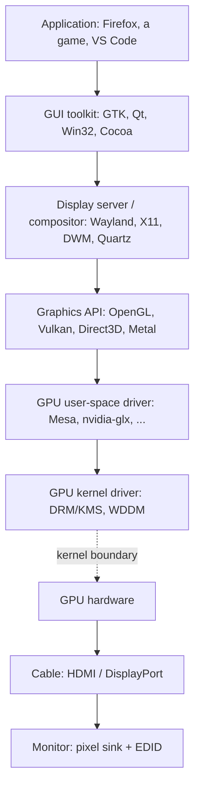

When you think about a GUI, it's tempting to imagine the monitor as an active participant — receiving "draw a window here" instructions from the OS. That mental model is wrong. The monitor is almost entirely passive: it advertises what it can do, then displays whatever pixels arrive on the cable. All the intelligence lives upstream on the GPU and OS side.

This note walks through the monitor side of the stack: what the monitor tells the OS, how a "display mode" gets picked, what flows over the cable, and what a monitor manufacturer is actually responsible for.

## Where the monitor fits in the full stack

Before zooming in on the monitor, here's the full pipeline from an application down to glowing pixels:

A few things to notice:

- 🔑 The **GPU vendor** (NVIDIA, AMD, Intel) — not the monitor vendor — supplies the low-level kernel driver. That's a common misconception worth correcting up front.
- The monitor sits at the very bottom, receiving a finished pixel stream.
- Apps don't submit pixels to the GPU — they submit *drawing commands* (triangles, shaders, textures). Pixels only materialize at the end, right before scanout to the monitor.

Now, the monitor side itself.

## Step 1 — The monitor advertises itself (EDID)

When you plug a monitor in, the GPU reads a small data blob called **EDID** (Extended Display Identification Data) from the monitor. EDID is ~128–256 bytes and contains:

| Field | Example |
|---|---|
| Supported resolutions | 2560×1440, 1920×1080, ... |
| Refresh rates per resolution | 60 Hz, 144 Hz, ... |
| Color characteristics | Gamut, bit depth, HDR capability |
| Manufacturer / model / serial | Dell U2723QE, serial #... |
| Physical size | Used by the OS to compute DPI |

EDID lives in a tiny **EEPROM** on the monitor's controller board. The GPU reads it over a side-channel called **DDC** (Display Data Channel), which is just **I²C** — a slow serial bus running on dedicated pins inside the HDMI/DP/VGA connector.

Modern monitors extend EDID with:

- **CEA-861 extension blocks** — audio formats, HDR metadata
- **DisplayID** — richer, newer replacement
- **VRR ranges** — for FreeSync / G-Sync (variable refresh rate)

There's also a single dedicated wire called **HPD** (Hot Plug Detect) that goes high when a monitor is connected, so the OS knows when to re-read EDID.

## Step 2 — The OS picks a "mode"

Given the EDID, the OS / GPU driver picks one supported combination — e.g., **2560×1440 @ 144 Hz, 8-bit RGB** — and configures the GPU's **display engine** to drive the cable at that mode.

On Linux this subsystem is literally called **KMS — Kernel Mode Setting**. The kernel is the thing that chooses and applies the mode, not user-space.

## Step 3 — Pixels flow over the cable, forever

Once a mode is set, the GPU's display engine continuously reads from a **framebuffer in VRAM** and streams pixels out to the monitor at the chosen refresh rate, **whether or not anything on screen changed**. If nothing changes, the same frame just keeps being sent 60 (or 144, etc.) times per second.

Some details worth knowing:

- **HDMI** is more of a continuous stream; **DisplayPort** is packetized — but both feel like a steady pixel firehose at the conceptual level.
- The **wire format** is negotiated: RGB vs YCbCr, 8/10/12-bit per channel, full vs limited range, chroma subsampling (4:4:4, 4:2:2, 4:2:0).
- **HDCP** (copy-protection) negotiation happens on top of this if protected content is being displayed.
- On DisplayPort there's a process called **link training** where the GPU and monitor agree on lane count and signal speed before pixels can flow.

## What the monitor actually is

The monitor itself is mostly **dumb hardware**. Inside, there's:

- A **scaler / controller chip** (often from MegaChips, Realtek, MStar) that decodes the HDMI/DP signal
- The **EEPROM** holding the EDID
- The **panel driving circuitry** and backlight (for LCD) or pixel drivers (for OLED)
- Firmware for the **OSD menu** (brightness, color profile, input switching)

What the monitor does **not** know about:

- ❌ Windows, applications, the cursor, or the desktop
- ❌ What's being drawn or why
- ❌ Anything above the pixel stream

It scales the incoming stream to the panel's native resolution if needed, paints whatever arrives, and exposes a menu for the user.

## What a monitor manufacturer is actually responsible for

Boiled down, making a monitor that "works" requires getting two things right — and both are governed by **industry standards**, not the manufacturer's whim:

### 1. Advertising itself correctly (EDID)

- Defined by **VESA** (Video Electronics Standards Association)
- Byte layout is fixed — magic header, manufacturer ID, timing descriptors, etc.
- Malformed EDID → the OS falls back to a safe default (often 1024×768 @ 60 Hz) or refuses to drive the display

### 2. Receiving pixels correctly (HDMI / DisplayPort)

- **HDMI** is defined by the HDMI Forum (paid license + HDCP licensing)
- **DisplayPort** is defined by VESA
- The specs dictate **everything**: signal voltages, timing, clock recovery, packet structure on DP, how audio is multiplexed in, how HDCP is negotiated.

### 3. (Bonus) Behaving correctly through transitions

A third, easy-to-overlook responsibility: handling **HPD signaling and re-negotiation** correctly. If you change resolution mid-session, or unplug/replug, the monitor and GPU re-do parts of the handshake (link training on DP, EDID re-read, mode change). The monitor needs to behave correctly during these transitions — not just in steady state.

## The supply-chain reality

Most "monitor brands" (Dell, LG, ASUS, HP, etc.) **don't actually make panels.** A typical monitor is assembled from:

1. A **panel** bought from LG Display, Samsung Display, BOE, or AUO
2. A **scaler chip** that does EDID + HDMI/DP decoding + panel driving
3. An **EEPROM** programmed with the EDID
4. **Firmware** for the OSD, color profiles, response-time tuning
5. A power supply, case, stand, etc.

The brand's value-add is in tuning (color accuracy, factory calibration, ergonomics), industrial design, and quality control — not in the core display chain.

## TL;DR mental model

> The monitor is a **standards-compliant pixel sink with a small ID card.**
>
> - The ID card (EDID) tells the OS what modes are supported.
> - The OS picks one and tells the GPU to drive the cable at that mode.
> - The GPU continuously streams pixels at that mode forever.
> - The monitor paints whatever arrives.
>
> All the "GUI" intelligence — windows, layout, what to draw — lives on the GPU/OS side, **never on the monitor**.

That's why you can plug the same monitor into a Linux box, a Mac, a Windows PC, an Xbox, or a Raspberry Pi and it just works: the monitor doesn't know or care what's upstream, as long as the cable signal conforms to HDMI or DisplayPort.
