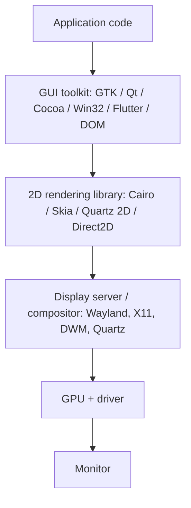
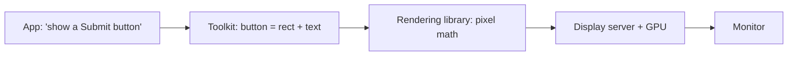

A monitor is a dumb pixel sink. Somewhere between an app saying "I want a button labeled *Click me*" and a 2560×1440 grid of glowing dots, a lot of translation happens. Most of that translation is the job of a **GUI toolkit**.

This note walks through what a toolkit is, what it abstracts away, what it delegates downstream, and how both drawing and input flow through it.

## Where the toolkit sits in the stack



Compared to the full pipeline, the toolkit is the layer the app actually talks to. Everything below — rendering library, display server, GPU, cable, monitor — is invisible to a well-written app.

## What a toolkit gives you

A toolkit is an **abstraction layer** that lets the app think in terms of UI concepts instead of pixels and coordinates.

Concretely, it provides:

- 🧱 **Widgets** — buttons, scrollbars, menus, text fields, etc.
- 📐 **Layout** — "put this button to the right of that label, resize when the window resizes"
- 🖱️ **Event handling** — "call this function when the user clicks here"
- 🔤 **Text rendering** — fonts, kerning, anti-aliasing, internationalization
- 🎨 **Theming** — matching the OS look (light/dark mode), or having its own

### A useful analogy

The relationship between an app and a monitor is like the relationship between SQL and a hard drive:

| Layer | Thinks in terms of… |
| --- | --- |
| Hard drive | Blocks of bytes at physical addresses |
| SQL / DB engine | Tables, rows, columns |
| Application | `SELECT name FROM users WHERE age > 30` |

| Layer | Thinks in terms of… |
| --- | --- |
| Monitor | Pixels |
| GUI toolkit | Buttons, windows, events |
| Application | `Button("Click me").on_click(...)` |

In both cases, a middle layer hides the hardware reality and exposes a clean, high-level vocabulary.

## Without a toolkit — what the app would have to do

To draw a single button by hand, an app would have to:

- [ ] Compute which pixels form a rounded rectangle for the button background
- [ ] Render the text "Click me" using a font file, with proper anti-aliasing and kerning
- [ ] Detect when mouse coordinates fall inside the button's bounds
- [ ] Redraw the button in a different color when hovered or pressed
- [ ] Handle high-DPI scaling, dark mode, accessibility, internationalization
- [ ] Repeat all of this for every widget on the screen

With a toolkit, all of that collapses to roughly:

```python
button = Button("Click me")
button.on_click(do_something)
```

## Common toolkits by platform

| Platform | Native toolkit | Cross-platform options |
| --- | --- | --- |
| Windows | Win32, WinUI, WPF | Qt, Electron, Flutter |
| macOS | Cocoa (AppKit), SwiftUI | Qt, Electron, Flutter |
| Linux | GTK, Qt | Qt, Electron, Flutter |
| Web (in browser) | DOM/HTML/CSS | The browser *is* the toolkit |

## Toolkits don't compute pixels themselves — they delegate

A common misconception is that the toolkit walks through every pixel of a button and decides which ones should be blue. It usually doesn't. The toolkit knows *what a button looks like in this style*, but the actual pixel math (anti-aliased rounded corners, font glyphs, gradients) is done by a **2D rendering library** underneath.

| Toolkit | Rendering backend |
| --- | --- |
| GTK | Cairo |
| Qt | QPainter (raster or OpenGL) |
| Chrome / Flutter | Skia |
| macOS Cocoa | Core Graphics (Quartz 2D) |
| Win32 / WPF | GDI / Direct2D |

So the layering for drawing is really:

```
App: "draw a big blue button at (100, 50)"
    ↓
Toolkit: "a button = rounded rect + border + centered text"
    ↓
Rendering library: actually computes which pixels become blue
    ↓
Display server / GPU: gets pixels onto the screen
```

## Output and input — a two-way translator

The abstraction the toolkit provides isn't only about *drawing*. It's equally about *input*. The toolkit translates raw input events into semantic events tied to specific widgets.

### Output direction



### Input direction

```mermaid
flowchart LR
    A[Mouse hardware]
    B[Kernel input subsystem]
    C[Display server: 'click at (347, 152) in window W']
    D[Toolkit: '(347, 152) is inside the Submit button → fire onClick']
    E[App: registered onClick handler runs]
    A --> B --> C --> D --> E
```

Both directions are the toolkit's job. Without that input translation, the app would have to do hit-testing for every click — figuring out which widget owned the pixel that was clicked.

## A typical end-to-end flow

```
App code:
    window = new Window("My App")
    button = new Button("Click me")
    button.onClick = () => print("hi")
    window.add(button)
    window.show()
        ↓
Toolkit (e.g. Qt):
    - figures out where the button goes (layout)
    - asks for a window from the OS
    - draws button shape, text, border into a buffer (via rendering library)
    - registers itself to receive mouse/keyboard events
        ↓
Display server (Wayland / X11 / Windows DWM / macOS WindowServer):
    - assigns screen space to the window
    - composites it with other windows
    - forwards mouse/keyboard events to the right window
        ↓
GPU + monitor:
    - pixels stream out, button appears on screen
```

## Not every app uses a "classic" toolkit

The "app → toolkit → display server" picture is accurate for most desktop applications, but several large categories of apps replace the toolkit layer with something else:

- 🎮 **Games** — usually skip toolkits entirely and talk directly to a graphics API (OpenGL/Vulkan/DirectX/Metal). They draw their own buttons, menus, HUDs from scratch.
- 🌐 **Electron apps** (VS Code, Slack, Discord) — embed an entire web browser (Chromium). Their "toolkit" is HTML/CSS/JS, and Chromium handles rendering, layout, input, and OS integration.
- 📱 **Flutter apps** — also skip native toolkits. Flutter draws every widget itself via Skia, the same 2D library Chrome uses.

In all three cases, the *role* of the toolkit is still being played — something is still translating high-level UI concepts into pixels and routing input back. It's just not the OS's native widget set.

## What to remember

- A GUI toolkit is the layer the app actually talks to.
- It abstracts both **output** (widgets → pixels) and **input** (raw events → semantic widget events).
- The toolkit usually does **not** compute pixels itself — it delegates to a 2D rendering library like Cairo, Skia, Quartz 2D, or Direct2D.
- Apps end up in one of three rough camps: **native toolkit** (GTK, Qt, Cocoa, Win32), **game-style direct rendering** (OpenGL/Vulkan/etc.), or **embedded engine** (Electron with Chromium, Flutter with Skia).
- Either way, the journey is the same shape: high-level intent at the top, dumb pixels at the bottom, with translation in between.
