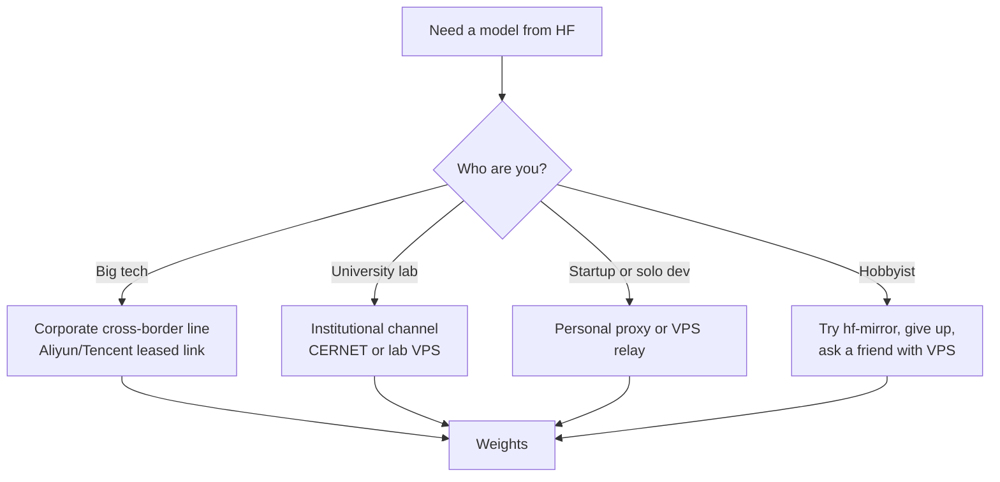

PyPI has Tsinghua. Docker Hub has dozens of mirrors. Even GitHub has community proxies. But Hugging Face — the registry every ML developer needs — is blocked from mainland China and has no official mirror. The community workarounds exist, but in practice they range from "slow" to "incomplete." Most serious work just routes around the problem.

This post unpacks why.

## The available mirrors

There are essentially three options, none of them satisfying.

### hf-mirror.com

A community-run reverse proxy that transparently fronts `huggingface.co`. Usage is a one-line environment variable:

```bash
export HF_ENDPOINT=https://hf-mirror.com
```

After that, the official `huggingface_hub` library and `huggingface-cli` work normally — downloads route through the mirror.

The catch: it is **slow**. Often unusably slow for large model files.

### ModelScope (魔搭)

Alibaba's domestic model hub at `modelscope.cn`. Not a mirror — it's a separate platform with its own SDK and its own copies of popular open-weights models (Llama, Qwen, DeepSeek, etc.).

For mainstream models it works well. For anything niche — research checkpoints, less-popular fine-tunes, most datasets — coverage is patchy or stale.

### WiseModel (始智AI)

`wisemodel.cn`. Smaller domestic hub serving roughly the same role as ModelScope, with less coverage.

## Why hf-mirror is slow

Even setting aside who pays for it (the funding model isn't publicly documented — likely an individual operator), the architecture has a hard ceiling.

| Factor | Hugging Face | hf-mirror |
|---|---|---|
| Edge network | Cloudflare global CDN | Single reverse proxy |
| Caching | Aggressive edge cache | All requests hit origin |
| Bandwidth | Funded by a real company | Borne by one operator |
| Scaling incentive | Commercial | Goodwill project |

Model files are routinely 10–100 GB. Whoever runs the mirror almost certainly throttles to keep the egress bill survivable. Add peak-hour congestion (every Chinese ML developer hitting the same pipe in the evening) and you get the experience users report.

The proxy-via-overseas-VPS route most teams use is faster because you're paying for your *own* dedicated pipe, not sharing one.

## Why there is no official mirror

The natural follow-up question: PyPI is mirrored everywhere, why not Hugging Face? The answers are structural.

### 1. Regulatory liability

Since August 2023, China's *Generative AI Services* rules (生成式人工智能服务管理暂行办法) require every model offered to the public to be registered with the Cyberspace Administration of China (CAC) and to pass a content and ideology review.

A blanket Hugging Face mirror would, by definition, host thousands of unregistered models. Datasets too — many of which contain web-scraped content that violates Chinese content law.

PyPI packages are just code. A model is a regulated *service*.

### 2. No Chinese entity to host it

Running anything official inside the GFW requires:

- An ICP license
- A domestic legal entity
- Server infrastructure inside China
- Ongoing content-moderation staff

Tsinghua and Aliyun mirror PyPI because *they* set it up unilaterally — PyPI's license permits it and the regulatory friction is near zero. Hugging Face's ToS also technically permits mirroring, but no Chinese institution wants to be the legal entity holding a giant unaudited model repository.

### 3. Domestic substitutes already exist

ModelScope (Alibaba), WiseModel, OpenCSG, and BAAI's FlagOpen all serve roughly the Hugging Face role with models that have been through the registration process. The government has no incentive to bless a foreign mirror that would undercut state-aligned alternatives.

### 4. The block is probably deliberate

PyPI was never blocked. Hugging Face became unreachable around mid-2023, right as the generative-AI rules came into force. That timing strongly suggests policy, not an accident of routing. An "official mirror" would directly contradict the block.

## What Chinese ML devs actually do

The workflow is stratified by who is paying.



- **Big tech (Alibaba, ByteDance, Tencent, Baidu, Huawei)** — legal cross-border leased lines or overseas offices. Aliyun and others sell this officially as "cross-border acceleration." No VPN needed; it's a corporate network product.
- **University labs and research institutes** — usually an institutional channel. CERNET sometimes routes better, or the lab maintains its own overseas box.
- **Startups and individual developers** — mostly proxy or VPN. Either a personal Shadowsocks/V2Ray setup or a small overseas VPS used as a download relay. Many check ModelScope first and only reach for the proxy when the model isn't there.
- **Hobbyists** — try hf-mirror, give up, ask a friend with a VPS.

Worth flagging the legal grey: personal VPN use is technically prohibited but tolerated within the tech industry. Corporate cross-border links are fully legal but expensive.

## The bottom line

There is no good mirror. The structural reasons — regulatory shape of model hosting, no Chinese legal entity for HF, state-aligned domestic competitors, deliberate block — make it unlikely that one will appear.

Serious work routes around the problem rather than waiting for it to be solved:

- Cache models on an overseas VPS or a HK/Singapore/Tokyo node
- `huggingface-cli download` there, `rsync` or object-storage transfer back
- Some teams keep a small box abroad permanently as a pull-through cache

"Use a VPN" understates how segmented the real workflow is by budget. But the user-facing experience converges: the mirror is the fallback of last resort, not the default.
