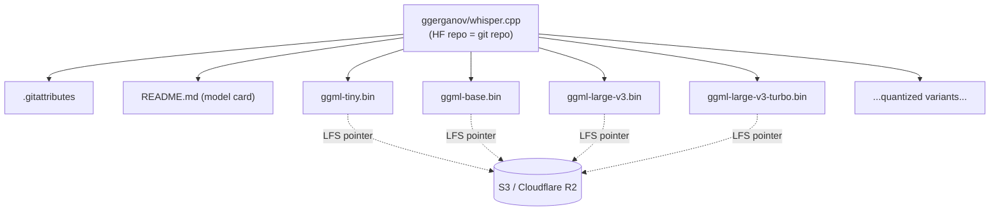

Hugging Face is the de-facto registry for open-source machine learning models. The most useful way to understand it is by analogy to GitHub — and that analogy turns out to be unusually literal.

## What Hugging Face is

A company and platform centered on open-source ML, especially NLP. The main pieces:

- **Hub** (`huggingface.co`): repository for models, datasets, and demo "Spaces".
- **Transformers library**: the de-facto Python library for loading transformer models (BERT, Llama, Whisper, …).
- **Other libraries**: `datasets`, `tokenizers`, `accelerate`, `diffusers`, `peft`, `trl`.
- **Inference Endpoints / Inference API**: hosted GPU model serving.
- **Spaces**: free hosting for Gradio/Streamlit ML demos.

## The repo mental model

Every model lives at a URL of the form:

```
huggingface.co/<username-or-org>/<repo-name>
```

Examples:

- `huggingface.co/meta-llama/Llama-3.1-8B`
- `huggingface.co/openai/whisper-large-v3`
- `huggingface.co/ggerganov/whisper.cpp`

The same namespace pattern serves three repo types:

| Type     | URL prefix                            |
| -------- | ------------------------------------- |
| Model    | `huggingface.co/<user>/<repo>`        |
| Dataset  | `huggingface.co/datasets/<user>/<repo>` |
| Space    | `huggingface.co/spaces/<user>/<repo>`   |

## It really is git

Not a lookalike — a real git server with Git LFS for large files.

✅ Standard git clients work:

```bash
git clone https://huggingface.co/ggerganov/whisper.cpp
cd whisper.cpp
git log
git checkout <some-sha>
```

✅ It speaks the smart-HTTP git protocol — `curl https://huggingface.co/<repo>/info/refs?service=git-upload-pack` returns a normal refs response.

✅ Commit hashes are real git SHA-1s.

✅ `.gitattributes` uses ordinary `filter=lfs diff=lfs merge=lfs` lines; a vanilla `git-lfs` client pulls the weights.

What's custom is built **on top of** git, not in place of it:

- The server backend is HF's own (not gitea/gitlab), so they can integrate auth, gating, model cards, and the Hub API.
- LFS blobs live on S3 / Cloudflare R2.
- `huggingface_hub` is a convenience layer (caching, partial download, auth) over the same HTTP API — underneath, the repo is still a git repo.
- **Xet** is HF's newer content-addressed storage replacing LFS for huge files (better dedup across versions). Still git-compatible at the surface.

### What carries over from GitHub

- **Branches** (HF calls them "revisions") — `main` is the default; tags pin versions.
- **Commit history** with author + message + SHA.
- **Pull requests** and **Discussions** under the "Community" tab.
- **`README.md`** — rendered as a "Model Card" with YAML frontmatter for license, tags, language, etc.

### What's different (because models ≠ source code)

- **Git LFS for big files**: `.bin` weights are LFS pointers; the bytes live on object storage.
- **Selective download is normal**: unlike GitHub, you usually grab one file, not the whole repo.
- **Raw-file URL pattern**:
  ```
  huggingface.co/<user>/<repo>/resolve/<branch-or-sha>/<path>
  ```
  Equivalent to GitHub's `raw.githubusercontent.com`.

## One repo, many models

A common pattern: a single repo holds an entire collection of related model files. `ggerganov/whisper.cpp` is the canonical example — its "Files" tab lists dozens of `.bin` weights:

- `ggml-tiny.bin`, `ggml-tiny.en.bin`
- `ggml-base.bin`, `ggml-base.en.bin`
- `ggml-small.bin`, `ggml-small.en.bin`
- `ggml-medium.bin`, `ggml-medium.en.bin`
- `ggml-large-v1.bin`, `ggml-large-v2.bin`, `ggml-large-v3.bin`, `ggml-large-v3-turbo.bin`
- plus quantized variants (`-q5_0`, `-q8_0`, …)

Each file is a different model — different size, language coverage, or quantization. The repo is just a **container**.



Two common repo styles you'll see on HF:

1. **One model per repo** (typical) — e.g., `openai/whisper-large-v3` holds one model's weights + config + tokenizer.
2. **Many models per repo** (collection) — format conversions (GGUF/GGML/ONNX), quantization sets, or checkpoint archives.

## Downloading a single model file

For a one-shot grab, **don't `git clone`** — the full `ggerganov/whisper.cpp` repo is 50+ GB if you pull everything. Use the `resolve/` URL:

```
https://huggingface.co/ggerganov/whisper.cpp/resolve/main/ggml-large-v3-turbo.bin
```

URL anatomy:

- `resolve/main/...` → latest on `main`
- `resolve/<sha>/...` → pinned to a specific commit (reproducible)
- `?download=true` → tells the browser to download rather than preview; `wget`/`curl` ignore it

### Equivalent commands

```bash
# wget — simple
wget https://huggingface.co/ggerganov/whisper.cpp/resolve/main/ggml-large-v3-turbo.bin

# curl — with resume support
curl -L -C - -o ggml-large-v3-turbo.bin \
  https://huggingface.co/ggerganov/whisper.cpp/resolve/main/ggml-large-v3-turbo.bin

# huggingface-cli — handles auth, caching, retries
huggingface-cli download ggerganov/whisper.cpp ggml-large-v3-turbo.bin
```

### When to actually use git

- Contributing/uploading to the repo
- Pinning to a specific commit across many files
- Mirroring the whole repo

For "just give me the weights file", the `resolve/` URL wins.

## Is curl too slow?

No. Hugging Face serves files via Cloudflare's CDN, so a single HTTP GET usually saturates your connection.

| Environment            | Typical throughput        | 1.6 GB file |
| ---------------------- | ------------------------- | ----------- |
| Home (100 Mbps ISP)    | ~12 MB/s                  | ~2 min      |
| Datacenter / cloud VM  | 200 MB/s – >1 GB/s        | seconds     |

Why curl isn't slower than fancier tools:

- The transfer is plain HTTPS — no protocol magic to "speed up".
- A single TCP connection usually saturates a CDN-fronted link.
- `huggingface-cli` / `hf_hub_download` don't transfer faster per-file; what they add is:
  - Parallel downloads when fetching **many** files (irrelevant for a single `.bin`)
  - Resumable transfers (curl does this with `-C -` anyway)
  - Local caching under `~/.cache/huggingface/`
  - Auth handling for gated/private repos
  - Integrity checks (SHA against the LFS pointer)
  - **Xet** chunked transfer (newer backend, dedupes across versions — meaningful for repos with many similar large files)

Curl is genuinely worse when:

- The repo is gated/private (needs `Authorization: Bearer $HF_TOKEN`).
- You're pulling many files serially and parallelism would help.
- Your network is flaky and you want automatic retries.

What people actually do:

- 🎯 One-off single file → `wget`/`curl` or the browser download button.
- 🛠 Scripted/repeated → `huggingface_hub` in Python, for caching + auth.
- 📦 Whole-repo mirror → `git clone` with LFS, or `huggingface-cli download <repo>`.

## How does Hugging Face make money?

The free Hub clearly costs a fortune in bandwidth and storage. The revenue model:

1. **Hosted compute (main business)**
   - Inference Endpoints: dedicated GPU instances, billed per hour.
   - Spaces upgrades: GPU-backed Spaces (A10G, A100, …) by the hour.
   - AutoTrain / managed training jobs.
2. **Enterprise Hub** — private orgs, SSO, audit logs, SOC2, priority support; sold per-seat to companies like Bloomberg, Intel, Pfizer.
3. **Pro subscription** (~$9/mo) — higher rate limits, ZeroGPU, private Spaces.
4. **Cloud partnerships** — deep integrations with AWS SageMaker, Azure, GCP, Nvidia DGX Cloud; revenue share / co-selling.

Why the bandwidth bill isn't fatal:

- Storage on S3 / **Cloudflare R2**, with **free egress** via Cloudflare's CDN — huge structural advantage.
- ~$400M+ raised at a $4.5B valuation (Aug 2023), with Nvidia, Salesforce, Google, Amazon as investors. The free hub is a loss-leader funnel for paid compute + enterprise.

The free model registry is the funnel; GPU rentals and enterprise contracts are the profit center.

## TL;DR

- HF repos are real git repos with Git LFS (transitioning to Xet) for the binary payloads — not a GitHub lookalike.
- A repo can hold one model or a whole collection; download just the file you need.
- For a single file, `wget`/`curl` on the `resolve/<branch>/<file>` URL is the right tool and not measurably slower than `huggingface-cli`.
- HF's free hub is subsidized by Cloudflare's free egress and bankrolled by enterprise compute revenue.
