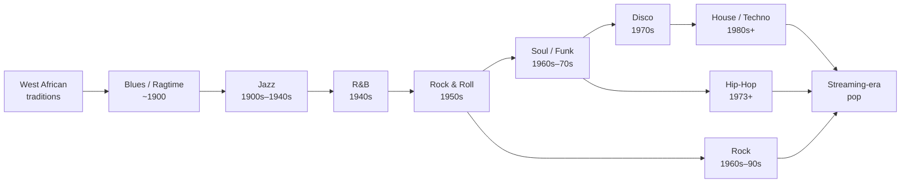

Music history is usually told as a parade of names. Beethoven, then the Romantics, then a smear of "modern stuff." That story misses the most interesting thing that happened in the last 200 years: at the start of the 20th century, popular music **broke** from the European tradition that had defined it for 500 years, and the thing that replaced it grew from an entirely different root system.

This post traces that break, then turns it into a practical listening plan — ten weeks of chronological listening that lets you hear the evolution happen with your own ears.

## 1. The European lineage was continuous for 500 years

From roughly 1400 (Renaissance) to 1900 (late Romanticism), European music was one long connected project. Three things stayed connected the whole way:

**People were connected.** Composers were trained in a system with traceable lineage. Bach's sons knew Haydn's generation. Haydn taught Beethoven. Beethoven influenced Schubert and Brahms. Wagner shaped Mahler and Richard Strauss. Across five centuries this is a continuous teacher-student-peer network.

**Knowledge was connected.** Same notation (five-line staff, stabilized in the Renaissance). Same theoretical edifice (counterpoint, then functional harmony). Same instruments evolving in continuity — viols to violins, harpsichord to piano, the orchestra slowly converging on its standard form. Each generation worked on tools the previous one had refined.

**Problems were connected.** Renaissance polyphony evolved into Baroque fugue. Late Baroque binary form became Classical sonata-allegro. Classical functional harmony was pushed to chromatic extremes by the Romantics and nearly collapsed under its own weight in the hands of Wagner and Mahler. Every generation solved the problem the previous one had left behind. It's accumulative — like math or science.

So Palestrina (1525–1594) and Mahler (1860–1911) sound nothing alike, but they were stages of **the same project**.

### Beethoven as a hinge, not a midpoint

Beethoven (1770–1827) is usually called "the transition from Classical to Romantic," which is a little too tidy. His career has three periods:

- **Early (~1792–1802)** — clearly continuing Haydn and Mozart. Symmetrical forms, courtly proportions.
- **Middle (~1803–1814)** — his style explodes. *Eroica*, the Fifth, the *Pastoral*, the *Appassionata*. Scale grows, emotional intensity surges, the assertion of personal will breaks the Classical container.
- **Late (~1815–1827)** — extreme interiority and experimentation. The late string quartets (especially Op. 131), the *Missa Solemnis*, the Ninth Symphony. Techniques here anticipate the 20th century.

He didn't *stand* at the boundary. He **personally moved music across it** — and was alive while Schubert (a true Romantic) was writing in Vienna and worshipping him.

### "The 19th century was Romantic" — with caveats

Mostly true, but worth refining:

- The Romantic era is usually dated ~1820s to ~1900, not a clean 1800–1900. 1800–1820 is the tail of Classicism; 1900-and-after is already Modernist territory.
- The late 19th century was already splitting. Wagner's chromaticism (*Tristan und Isolde*, 1859) was undermining tonality from inside. Debussy's Impressionism (1890s) isn't really Romantic. Mahler and Richard Strauss are "Late Romantic" only in the sense that they're already paving the road to Modernism.
- There's also a parallel **Nationalist** branch — Russian (the Mighty Five, Tchaikovsky), Czech (Dvořák, Smetana), Nordic (Grieg, Sibelius), Spanish (Albéniz). They worked inside the Romantic grammar but injected folk material from their own cultures. An important sub-current, not a side note.

The key thing about all of these — even the Nationalists — is that they **inherited the European grammar**. Tchaikovsky wrote symphonies. Dvořák wrote string quartets. The frame was passed down. The material inside it changed.

## 2. The structural break — and it didn't happen in Europe

Then, around 1900, in the American South, something appeared that wasn't part of this project at all. Not a new style. A new **species**.

Its sources were:

- **West African musical traditions**, forcibly brought to the Americas through the slave trade. Polyrhythm, call-and-response vocal structures, pentatonic leanings, the habit of bending notes (eventually heard as "blue notes").
- **The singing of enslaved Black Americans** on plantations and in churches — work songs, field hollers, spirituals. Music made under coercion, not for entertainment or commerce.
- **Some European elements** — brass instruments (Civil War military surplus that flowed into New Orleans), basic harmonic progressions, march and quadrille rhythms.

These ingredients fused into **blues** (personalized narratives of suffering) and **ragtime** (syncopated piano), then collided around 1900 in New Orleans — a port city where Caribbean, French, Spanish, African, and Anglo-American cultures already mixed — to produce **jazz**.

### Why it's invention, not inheritance

You can see the discontinuity along four axes:

| Axis | European classical tradition | Early jazz / blues |
|---|---|---|
| Core musical interest | Harmony and form | Rhythm and improvisation |
| Notion of the work | Composer writes, performer faithfully reproduces | The "tune" is a skeleton; the music is generated live, every time, in improvised solos |
| Social location | Court, salon, conservatory, opera house | Brothels, bars, street parades, juke joints |
| Native medium | Live performance + printed score | Phonograph record (1917: first commercial jazz disc) |

The first jazz musicians mostly couldn't read music and had no formal training. Louis Armstrong, Robert Johnson, later Charlie Parker — they learned by listening, imitating, playing in groups. The *mechanism of transmission* was different.

### Wait — they did use European resources

Yes, and this is the important nuance. The new music used:

- **European instruments** — trumpet, trombone, clarinet, saxophone, piano, guitar
- **Basic functional harmony** — I-IV-V progressions, the 12-bar blues structure
- **European notation** (when something needed to be written)
- **Bits of European form** — marches, polkas, waltzes seeded early jazz rhythm

So the right image is: **the skeleton was built from European parts, but the body, the soul, the way of moving, came from a different lineage.** A useful (imperfect) analogy: Meiji-era Japan adopted Western technology and institutional frames without becoming a branch of European civilization. Jazz borrowed European tools without entering the European pedigree.

The most dramatic consequence: across the 20th century, **dominance flipped**. Jazz crossed back into Europe in the 1920s. Stravinsky, Ravel, and Milhaud started folding jazz idioms into their "serious" music. After WWII, rock and R&B took over European pop markets. The music a Berlin teenager streams today traces back to the Mississippi Delta, not to Vienna.

## 3. From Delta blues to streaming — the modern timeline

What follows is the ~120-year line that runs from the cotton fields to your phone.

### 1900–1920: seeds

Delta blues (one person, one guitar, three chords, slide). Ragtime piano (Scott Joplin). And in New Orleans, the brass-band-meets-Caribbean-meets-African-rhythm fusion that becomes early jazz. In 1917 the Original Dixieland Jass Band cuts the first jazz record — pop music enters the recording age.

### 1920s: the Jazz Age

Prohibition, speakeasies, the gramophone in every middle-class home. Jazz becomes the sound of modernity. **Louis Armstrong** does two foundational things: he establishes the **solo** as the heart of jazz (over collective improvisation), and he locks in **swing** — the uneven, forward-leaning eighth-note feel that defines almost every American popular music for the next century. The Great Migration carries blues and jazz north to Chicago and New York.

### 1930s–1940s: Swing, then Bebop

The Big Band Swing era dominates: Duke Ellington, Count Basie, Benny Goodman. People go to ballrooms to *dance*. Singers detach from the band and become stars in their own right — Billie Holiday, Ella Fitzgerald, Frank Sinatra. Then, in postwar New York clubs, younger musicians revolt against commercialized swing and invent **bebop** — faster, harmonically denser, made for listening, not dancing. Charlie Parker and Dizzy Gillespie. This is the moment jazz starts turning from popular music into art music. In parallel, country music crystallizes in the white South — Hank Williams.

### 1950s: rock and roll

In Memphis around 1954, electrified urban R&B (Chuck Berry, Little Richard, Fats Domino) collides with rockabilly white country, and **Elvis Presley** — a white kid singing Black music — pushes the hybrid into the mass market. The cultural consequences go far beyond music: **teenagers** appear as an independent cultural and consumer category for the first time, racial lines in music get partially broken, and music becomes the medium of generational rebellion. Meanwhile Miles Davis releases *Kind of Blue* (1959), one of the most accessible jazz albums ever made.

### 1960s: the big bang

The most concentrated decade in popular music history. Almost every template still being copied today was set here:

- **The Beatles** invade America (1964), but more importantly establish the "creative artist" model — the same people write, perform, and record. Before this, singers mostly sang other people's songs (the Tin Pan Alley model).
- **Bob Dylan** drags poetry and political conscience into pop lyrics, and "goes electric" in 1965, proving rock can carry serious thought.
- **Motown** turns Soul into a precision Black-music export to the white mainstream — Marvin Gaye, Stevie Wonder, the Supremes, the Temptations.
- **Southern Soul** at Stax — Otis Redding, Aretha Franklin — runs grittier and more church-rooted.
- **Jimi Hendrix** redefines the electric guitar from instrument into sound generator.
- **James Brown** invents **funk** by re-emphasizing beat one of the bar ("the One") and treating the whole band as one giant rhythm machine. Every later groove-centric genre — disco, hip-hop, house — descends from this.

### 1970s: fragmentation

The unity of the 60s shatters into parallel streams:

- **Hard rock / art rock**: Led Zeppelin, Pink Floyd, Yes — long forms, concept albums, rock as "serious art."
- **Singer-songwriter**: Joni Mitchell, Carole King, James Taylor, Neil Young — introspective, acoustic-led, deeply personal. (The spiritual grandmother of artists like Taylor Swift later.)
- **Funk evolution**: Sly and the Family Stone, Parliament-Funkadelic, Earth Wind & Fire.
- **Disco** sweeps dancefloors mid-decade — funk groove + orchestral arrangements + electronic beats. The "Disco Sucks" backlash kills it commercially around 1979, but it morphs straight into house, techno, and all subsequent electronic dance music.
- **Punk** (1976–77): Sex Pistols, Ramones, the Clash — three chords, refusing arena rock's bloat. Its lasting contribution is the DIY ethos: anyone can form a band, anyone can release a record.
- **Hip-hop is born**: August 11, 1973, the Bronx. Jamaican-American DJ Kool Herc, at his sister's birthday party, loops the break (the drum break) of funk records on two turntables so the dancers can keep going. MCs talk over it. "Rapper's Delight" (1979) becomes the first commercially successful hip-hop record.

### 1980s: MTV, the synthesizer, the superstar

MTV launches in 1981 and rewrites everything. **Visual identity** becomes as important as sound. The decade manufactures global symbols: **Michael Jackson** (*Thriller* in 1982, still the best-selling album ever — a Black artist as the absolute center of global pop), **Madonna** (the perpetually re-inventing icon as cultural entrepreneur), **Prince** (funk + rock + pop + soul melted into one language), **Bruce Springsteen** (blue-collar America's poet). Synths and drum machines (Yamaha DX7, Roland drum machines) democratize the "big production" sound; bedroom studios become possible. Hip-hop crosses into the mainstream — Run-DMC's "Walk This Way" with Aerosmith (1986), Public Enemy politicizing the genre, N.W.A.'s *Straight Outta Compton* (1988) launching gangsta rap.

### 1990s: multiplicity

- **Grunge** (Nirvana's *Nevermind*, 1991) drags rock back to raw underground roots; Kurt Cobain becomes the anti-idol idol.
- The **Golden Age of hip-hop**: East Coast vs. West Coast (Notorious B.I.G., Nas, Wu-Tang, Jay-Z vs. Tupac, Dr. Dre, Snoop). Both Tupac and Biggie are murdered in 1996–97.
- **R&B summit**: Mariah Carey, Whitney Houston, Boyz II Men, TLC, Destiny's Child (with Beyoncé). R&B and hip-hop fuse permanently.
- **Late-90s teen-pop industrial complex**: Britney Spears, Christina Aguilera, Backstreet Boys, NSYNC — the manufactured-idol pipeline (audition → package → market → tour → merch) that becomes the industry standard.
- **Radiohead** mainstreams what used to be "alternative."
- In Europe, the disco→house→techno→trance chain has completed; electronic dance music is the spine of European club culture.

### 2000s: digital transition

- **Napster moment (1999–2001)**: peer-to-peer file sharing turns music into a free digital file. Recorded-music revenue collapses.
- **iTunes (2003)** reprices music to $0.99 per single. The single becomes the consumption unit again; the album starts its decline as an art form.
- **YouTube (2005)** breaks the music-promotion logic open.
- Defining artists: Eminem (the dominant rapper at century's open), Beyoncé going solo, Kanye West arriving with *The College Dropout* (2004), Coldplay, Amy Winehouse pulling soul back into the present.

### 2010s: the streaming era begins

Spotify (2008 in Europe, 2011 in the US) and successors reshape everything. Music becomes a tap you turn on — flat-rate subscription, infinite catalogue. **Sales no longer matter; streams do.** Per-stream royalties are tiny; discovery is revolutionary.

The big artists of the decade:

- **Adele** — *21* (2011) is the last giant of the pre-streaming-album era.
- **Beyoncé** — surprise visual album in 2013, then *Lemonade* (2016) as a full cultural event; sets the new "auteur superstar" template.
- **Kanye West** — *My Beautiful Dark Twisted Fantasy* (2010), *Yeezus* (2013), *The Life of Pablo* (2016, the first "perpetually updated" streaming album).
- **Kendrick Lamar** — *To Pimp a Butterfly* (2015), *DAMN.* (2017, Pulitzer Prize — final legitimization of hip-hop as serious art).
- **Drake** — the most commercially dominant artist of the back half of the decade; permanently blurs rap, R&B, and pop.
- **Billie Eilish** — bedroom production, Gen Z aesthetics.
- **BTS / K-pop** — first non-English-language acts at the top of the global mainstream.

### 2020s: streaming maturity

**TikTok** becomes the new discovery engine — 15 seconds decides whether a song breaks. Attention cycles shrink; old songs get revived constantly. **Live tours** (the Eras Tour, etc.) become the artist's main revenue source — recorded music is too cheap to monetize, but the *experience* and the *community* are not. AI-generated music starts triggering disputes. Latin music (Bad Bunny) and K-pop are permanently mainstream-mainstream, not "world music."

## 4. A 10-week chronological listening plan

The fastest way to *feel* this evolution isn't to read another article — it's to listen in order. Below is a ten-week plan. Each era gets dates, defining characteristics, and a short list of artists and pieces to actually play.

Listening tips first:

- Don't try to listen to everything. **3–5 pieces per week, deeply**, beats fifty pieces skimmed.
- Listen to **a few full albums**, not just singles. Some works were designed as albums and lose most of their power if you only hear the hit.
- **A/B test across weeks.** Right after week 4 (1960s), go back and play Louis Armstrong; right after week 6 (MTV era), go back to Chuck Berry. Hearing the gap from both ends is where the structure of the timeline becomes visible.
- Take notes on what you love and hate. A year later, you'll be able to see how your ear has changed.

### Week 1 — Early jazz & blues (~1920–1930)

The phonograph turns music into a commodity. African-American music moves from the South into national life. Improvised solo emerges as the core. This is the Genesis of popular music.

| Artist | Pieces |
|---|---|
| Louis Armstrong | *West End Blues* (1928), *What a Wonderful World* |
| Bessie Smith | *Nobody Knows You When You're Down and Out* |
| Robert Johnson | *Cross Road Blues*, *Hellhound on My Trail* |
| Duke Ellington (early) | *Mood Indigo* |

### Week 2 — Swing & Bebop (~1930–1949)

Big-band swing dominates ballrooms — escapism inside the Depression. The singer becomes a star independent of the band. After 1945, bebop pushes jazz from popular dance into elite art.

| Artist | Pieces |
|---|---|
| Duke Ellington | *Take the "A" Train* |
| Count Basie | *One O'Clock Jump* |
| Benny Goodman | *Sing, Sing, Sing* |
| Billie Holiday | *Strange Fruit*, *God Bless the Child* |
| Ella Fitzgerald | *Summertime* |
| Frank Sinatra | *Fly Me to the Moon* |
| Charlie Parker | *Ko-Ko*, *Now's the Time* |
| Hank Williams (country) | *I'm So Lonesome I Could Cry* |

### Week 3 — Birth of rock (~1950–1959)

R&B + country fuse into rock and roll. Teenagers become a culture. Electric guitar, the 45-rpm single, and television become the new tools. Racial lines in music are crossed at scale for the first time.

| Artist | Pieces |
|---|---|
| Chuck Berry | *Johnny B. Goode*, *Roll Over Beethoven* |
| Elvis Presley | *Hound Dog*, *Heartbreak Hotel* |
| Little Richard | *Tutti Frutti*, *Long Tall Sally* |
| Buddy Holly | *That'll Be the Day* |
| Ray Charles | *What'd I Say* |
| Miles Davis | *Kind of Blue* (1959, full album) |
| Johnny Cash | *I Walk the Line* |

### Week 4 — The golden age of rock (~1960–1969)

The most concentrated decade in pop history. The Beatles establish the "creative band" model. Dylan injects literary weight into lyrics. Motown takes Soul to the mainstream. Hendrix reinvents the electric guitar. James Brown invents funk. Almost every later popular-music idiom traces back to here.

| Artist | Pieces |
|---|---|
| The Beatles | *A Hard Day's Night*, *Yesterday*, *Hey Jude*, *A Day in the Life* |
| The Rolling Stones | *(I Can't Get No) Satisfaction*, *Gimme Shelter* |
| Bob Dylan | *Blowin' in the Wind*, *Like a Rolling Stone* |
| The Beach Boys | *God Only Knows*, *Good Vibrations* |
| Marvin Gaye | *I Heard It Through the Grapevine* |
| The Supremes | *You Can't Hurry Love* |
| Aretha Franklin | *Respect* |
| Otis Redding | *(Sittin' On) The Dock of the Bay* |
| Jimi Hendrix | *Purple Haze*, *Voodoo Child (Slight Return)* |
| James Brown | *Papa's Got a Brand New Bag*, *Cold Sweat* |
| The Velvet Underground | *Sunday Morning* |

### Week 5 — Fragmentation (~1970–1979)

After the 60s utopia collapses, music splits into many streams: heavy rock, art rock, the singer-songwriter, funk, disco, punk, reggae. At decade's end, hip-hop is born in the Bronx.

| Artist | Pieces |
|---|---|
| Led Zeppelin | *Stairway to Heaven*, *Whole Lotta Love* |
| Pink Floyd | *The Dark Side of the Moon* (full album), *Wish You Were Here* |
| Joni Mitchell | *A Case of You*, *River* |
| Stevie Wonder | *Superstition*, *Sir Duke* |
| David Bowie | *Space Oddity*, *Heroes*, *Life on Mars?* |
| Bob Marley | *No Woman, No Cry*, *Redemption Song* |
| Donna Summer | *I Feel Love* |
| Bee Gees | *Stayin' Alive* |
| Sex Pistols | *Anarchy in the U.K.* |
| The Clash | *London Calling* |
| Sugarhill Gang | *Rapper's Delight* |

### Week 6 — MTV and the superstar (~1980–1989)

MTV (1981) makes visuals as important as sound. Synthesizers and drum machines democratize big production. Michael Jackson, Madonna, and Prince become true global symbols. Hip-hop crosses into the mainstream.

| Artist | Pieces |
|---|---|
| Michael Jackson | *Billie Jean*, *Beat It*, *Thriller* |
| Prince | *Purple Rain*, *When Doves Cry*, *Kiss* |
| Madonna | *Like a Prayer*, *Material Girl* |
| Bruce Springsteen | *Born in the U.S.A.* |
| U2 | *With or Without You*, *One* |
| Run-DMC (with Aerosmith) | *Walk This Way* |
| Public Enemy | *Fight the Power* |
| The Smiths | *There Is a Light That Never Goes Out* |
| Depeche Mode | *Enjoy the Silence* |
| Whitney Houston | *I Wanna Dance with Somebody* |

### Week 7 — The multiplicity explosion (~1990–1999)

Grunge replaces 80s gloss. Hip-hop enters its Golden Age, with East-Coast / West-Coast rivalry as a cultural event. R&B and hip-hop fuse. The teen-idol machine assembles itself. CD sales peak.

| Artist | Pieces |
|---|---|
| Nirvana | *Smells Like Teen Spirit*, *Come as You Are* |
| Pearl Jam | *Alive*, *Black* |
| Radiohead | *Creep*, *OK Computer* (1997 full album) |
| The Notorious B.I.G. | *Juicy* |
| Tupac Shakur | *California Love*, *Changes* |
| Wu-Tang Clan | *C.R.E.A.M.* |
| Dr. Dre & Snoop Dogg | *Nuthin' but a "G" Thang* |
| Mariah Carey | *Vision of Love*, *Fantasy* |
| Whitney Houston | *I Will Always Love You* |
| Lauryn Hill | *Doo Wop (That Thing)* |
| Daft Punk | *Around the World* |
| Britney Spears | *...Baby One More Time* |

### Week 8 — Digital transition (~2000–2009)

Napster, iTunes, and YouTube arrive one after another. The old industry model collapses. The single is the consumption unit again. Hip-hop becomes the most influential American genre. Indie rock has its moment.

| Artist | Pieces |
|---|---|
| Eminem | *Stan*, *Lose Yourself* |
| Beyoncé | *Crazy in Love*, *Halo* |
| OutKast | *Hey Ya!*, *Ms. Jackson* |
| Amy Winehouse | *Rehab*, *Back to Black* |
| Kanye West | *Through the Wire*, *Stronger*, *Heartless* |
| Jay-Z | *99 Problems* |
| Coldplay | *Yellow*, *Fix You*, *Viva la Vida* |
| The White Stripes | *Seven Nation Army* |
| Arcade Fire | *Wake Up* |
| Rihanna | *Umbrella* |

### Week 9 — Early streaming (~2010–2019)

Spotify makes music a subscription tap. Album sales give way to stream counts. Around 2017, hip-hop and R&B officially overtake rock as the most-consumed US genre. Visual albums and surprise drops become strategy. K-pop and Latin music push into the English-language mainstream.

| Artist | Pieces |
|---|---|
| Adele | *Rolling in the Deep*, *Someone Like You*, *Hello* |
| Kanye West | *Runaway*, *All of the Lights* |
| Beyoncé | *Formation*, *Hold Up* (*Lemonade*, 2016, full album) |
| Kendrick Lamar | *Alright*, *HUMBLE.*, *DNA.* |
| Drake | *Hotline Bling*, *God's Plan*, *One Dance* |
| Frank Ocean | *Thinkin Bout You*, *Pyramids* |
| Daft Punk & Pharrell | *Get Lucky* |
| Lana Del Rey | *Video Games*, *Born to Die* |
| The Weeknd | *Can't Feel My Face*, *Blinding Lights* |
| Taylor Swift | *Blank Space*, *All Too Well* (10-minute version) |
| Billie Eilish | *Bad Guy* |

### Week 10 — Mature streaming (~2020–present)

TikTok becomes the new discovery engine; 15 seconds decides a song's fate. Attention cycles compress; old songs get revived constantly. AI-generated music starts triggering debate. Live tours — especially mega-tours — become the artist's main income. Fan community matters more than the album. Latin and K-pop are fully international.

| Artist | Pieces |
|---|---|
| Taylor Swift | *cardigan*, *exile*, *Anti-Hero*, *Fortnight* |
| Bad Bunny | *Dákiti*, *Tití Me Preguntó* |
| Olivia Rodrigo | *drivers license*, *good 4 u* |
| Beyoncé | *BREAK MY SOUL*, *TEXAS HOLD 'EM* |
| Kendrick Lamar | *Not Like Us* |
| Billie Eilish | *Birds of a Feather* |
| The Weeknd | *Save Your Tears* |
| SZA | *Kill Bill*, *Snooze* |
| Harry Styles | *As It Was* |
| BTS | *Dynamite*, *Butter* |
| Sabrina Carpenter | *Espresso* |
| Chappell Roan | *Pink Pony Club*, *Good Luck, Babe!* |

### A handful of must-hear full albums

Streaming has trained us to listen one track at a time, but some works lose most of their power without the full sequence. If you only listen to ten albums end-to-end, make it these:

- ✅ *Kind of Blue* — Miles Davis (1959)
- ✅ *Sgt. Pepper's Lonely Hearts Club Band* — The Beatles (1967)
- ✅ *The Dark Side of the Moon* — Pink Floyd (1973)
- ✅ *Thriller* — Michael Jackson (1982)
- ✅ *OK Computer* — Radiohead (1997)
- ✅ *The Miseducation of Lauryn Hill* — Lauryn Hill (1998)
- ✅ *My Beautiful Dark Twisted Fantasy* — Kanye West (2010)
- ✅ *To Pimp a Butterfly* — Kendrick Lamar (2015)
- ✅ *Lemonade* — Beyoncé (2016)
- ✅ *folklore* — Taylor Swift (2020)

## 5. The through-line

If you step back from the 120-year timeline, a few patterns hold across the whole thing:

**African-American music is the center.** Blues, jazz, R&B, rock, funk, soul, hip-hop — every major innovation comes from this tradition. The history of popular music is largely the history of Black American music being invented, absorbed, whitened, and reinvented by a new generation of Black musicians.

**Each technology shift rebuilds the form.** 78-rpm → 33-rpm LP → radio → TV/MTV → CD → MP3/Napster → iTunes → YouTube → Spotify → TikTok. Every time the medium changes, the format, length, distribution, and business model get rewritten.

**Young people are the engine.** From the moment rock invented "teenagers" as a cultural category in the 1950s, popular music has always been how successive generations announce themselves, separate from their parents, and form community.

**The streaming-era artist is not just a musician.** They are a creator + idol + entrepreneur + community organizer. Recorded music is so cheap that the album is no longer the product. The product is the *sustained personal narrative over time* — a multi-year story fans can identify with — which is the only thing scarce enough to anchor a business on.

And a satisfying closing image: from a Delta blues singer in a wooden cabin in Mississippi singing about his own suffering, to a stadium of 70,000 people singing along to a song someone wrote about her ex-boyfriend — the surface is unrecognizable, but the core is the same. **Music as the first-person telling of a claimable individual experience.** That is what African-American music invented, and what eventually seeped into every corner of popular music on earth.

Beethoven, if he could hear Taylor Swift, would probably recognize the impulse — he was the one who first made personal feeling the legitimate subject of a symphony. Two centuries later, the tradition reached different soil, but the seed is the same.
