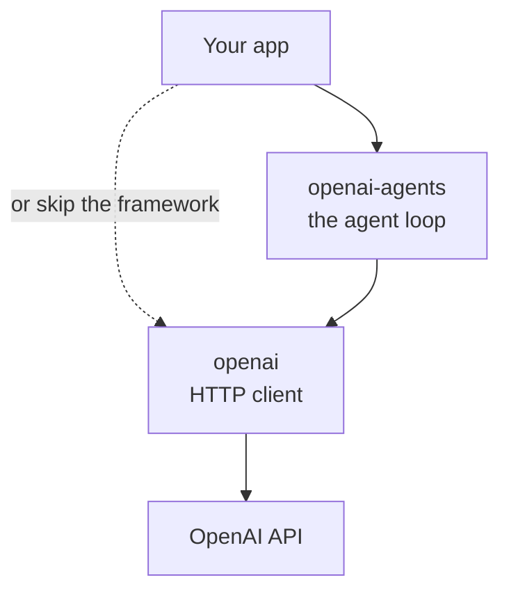

OpenAI ships two Python (and JS/TS) libraries that newcomers tend to confuse: **`openai`** and **`openai-agents`**. They sound similar but live at different layers of the stack. This post pins down what each one actually does, then contrasts the OpenAI Agents SDK architecture with Anthropic's Claude Agent SDK — because the two frameworks make very different design choices despite solving the same problem.

## The two layers

### `openai` — the raw API client

This is the **HTTP client** for OpenAI's REST API. One call in, one HTTP request out.

```python
from openai import OpenAI
client = OpenAI()

response = client.chat.completions.create(
    model="gpt-4o",
    messages=[{"role": "user", "content": "Hello"}],
)
print(response.choices[0].message.content)
```

That's the whole abstraction: send messages, get a response. It also wraps every other OpenAI endpoint — embeddings, images, audio, files, batch, fine-tuning, assistants, and so on.

If you want anything resembling an "agent" — tool calls dispatched in a loop, multi-step reasoning, memory, retries — **you build it yourself** on top of this.

### `openai-agents` — the agent framework

Built **on top of** `openai`. It implements the agent loop *for* you.

```python
from agents import Agent, Runner, function_tool

@function_tool
def get_weather(city: str) -> str:
    return f"Sunny in {city}"

agent = Agent(
    name="Assistant",
    instructions="Help the user",
    tools=[get_weather],
)

result = Runner.run_sync(agent, "What's the weather in Paris?")
print(result.final_output)
```

Under the hood, `openai-agents` is calling `openai.chat.completions.create()` in a loop. On top of that it handles:

- Tool-call parsing → dispatch → feed result back to the model
- Multi-turn reasoning until the agent decides it's done
- Handoffs between agents (one agent passes control to another)
- Guardrails (input/output validators)
- Tracing
- Retries, streaming, parallelism

## The relationship



`openai-agents` **depends on** `openai`. You can use `openai` alone. You cannot use `openai-agents` without `openai` underneath.

## When to use which

| Situation | Use |
|---|---|
| One-shot prompt → response | `openai` |
| Embeddings, images, audio, batch jobs | `openai` |
| You already have your own agent framework (LangChain, your own loop) | `openai` |
| You want an agent that calls tools in a loop until done | `openai-agents` |
| Multi-agent system with handoffs | `openai-agents` |
| You want built-in tracing without wiring it up | `openai-agents` |

## The parallel to Anthropic's stack

The shape mirrors Anthropic's offering exactly:

| Layer | OpenAI | Anthropic |
|---|---|---|
| Raw API client | `openai` | `anthropic` |
| Agent framework | `openai-agents` | `claude-agent-sdk` |

Both vendors converged on the same two-tier layout: a low-level HTTP client, plus an optional higher-level agent library built on top of it.

## Where the architectures diverge

There is **one major asymmetry** between the two agent frameworks worth understanding, because it shapes what you can do with them out of the box.

### OpenAI Agents SDK: self-contained library

```
┌────────────────────────────┐
│  Your app                  │
├────────────────────────────┤
│  openai-agents SDK         │  ← agent loop lives HERE, in the library
│  (Runner, Agent, tools,    │
│   handoffs, guardrails)    │
└─────────────┬──────────────┘
              │ HTTPS
              ▼
┌────────────────────────────┐
│  OpenAI API                │
└────────────────────────────┘
```

The SDK *is* the agent harness. It implements the loop, tool dispatch, handoffs, etc. directly in Python/TS and talks to the OpenAI API straight. No external binary, no subprocess.

Crucially, **there are no built-in tools**. You define every tool yourself with `@function_tool`. The framework gives you the loop; you bring the capabilities.

### Claude Agent SDK: thin wrapper around the Claude Code CLI

```
┌─────────────────────────────────────────────┐
│  Your Python app   │   Your TypeScript app  │
├────────────────────┼────────────────────────┤
│ claude-agent-sdk-  │ claude-agent-sdk-      │
│ python  (wrapper)  │ typescript (wrapper)   │
└────────────┬───────┴──────────┬─────────────┘
             │  spawn subprocess + stream JSON
             ▼                  ▼
        ┌──────────────────────────────┐
        │  claude  (the CLI binary)    │  ← the actual agent loop
        │  • tool execution            │
        │  • permission system         │
        │  • context management        │
        │  • subagent spawning         │
        └──────────────┬───────────────┘
                       │  HTTPS
                       ▼
        ┌──────────────────────────────┐
        │  Anthropic API               │
        └──────────────────────────────┘
```

The Claude Code CLI binary is the engine. Both the Python and TypeScript SDKs are sibling client wrappers that spawn the `claude` CLI as a subprocess and drive it via JSON messages. The CLI is where the actual harness logic lives — and it ships with a fully-loaded coding-agent toolkit: Read, Edit, Write, Bash, Grep, WebFetch, and more.

### Feature-by-feature

| | OpenAI Agents SDK | Claude Agent SDK |
|---|---|---|
| Architecture | Self-contained library, calls API directly | Thin wrapper around `claude` CLI subprocess |
| Engine lives in | The SDK itself | The Claude Code CLI binary |
| Built-in tools | None — you define your own | Read/Edit/Write/Bash/Grep/WebFetch (full toolkit) |
| Filesystem access | You wire it up yourself | Out of the box |
| Multi-agent | Handoffs (one agent passes control to another) | Subagents (spawn another Claude Code instance) |
| Tracing/observability | First-class built-in tracing UI | Via CLI hooks + telemetry |
| Guardrails | Input/output guardrails (validators) | Permission system |
| License | Both Python and JS: MIT | Python: MIT; TypeScript: proprietary (Anthropic Commercial Terms) |

## Two philosophies

The architectural difference reflects what each company optimized for first.

- **OpenAI Agents SDK** — "Here's a tidy framework. *You* bring the tools, prompts, and orchestration logic." Good for business agents, customer-support bots, RAG agents, anything where the tools are domain-specific to your application.
- **Claude Agent SDK** — "Here's a fully-loaded coding agent. Point it at a repo and it can already read/edit/run things." Good for coding agents, automation that touches real codebases, CI/CD bots, PR reviewers.

Neither is strictly better. They reflect different starting assumptions:

- OpenAI started from "build me a generic agent framework" → **batteries-not-included**, maximum flexibility.
- Anthropic started from Claude Code (a coding agent) and exposed its engine as a library → **batteries-included**, opinionated toward codebase work.

## Practical takeaways ✅

- If you only need to call a model and parse a response, use **`openai`** directly. Don't pull in a framework you don't need.
- If you're building an agent that calls tools you define yourself in a loop, **`openai-agents`** saves you from writing the loop machinery and gives you tracing for free.
- If you're building an agent that does work *in a codebase*, the Claude Agent SDK gives you the entire coding toolkit on day one — whereas with `openai-agents` you'd need to implement Read/Write/Bash equivalents yourself (or pull them in via MCP).
- The two-tier layering (raw client + optional agent framework) is now the de facto pattern for LLM vendors. Expect to see it everywhere.
