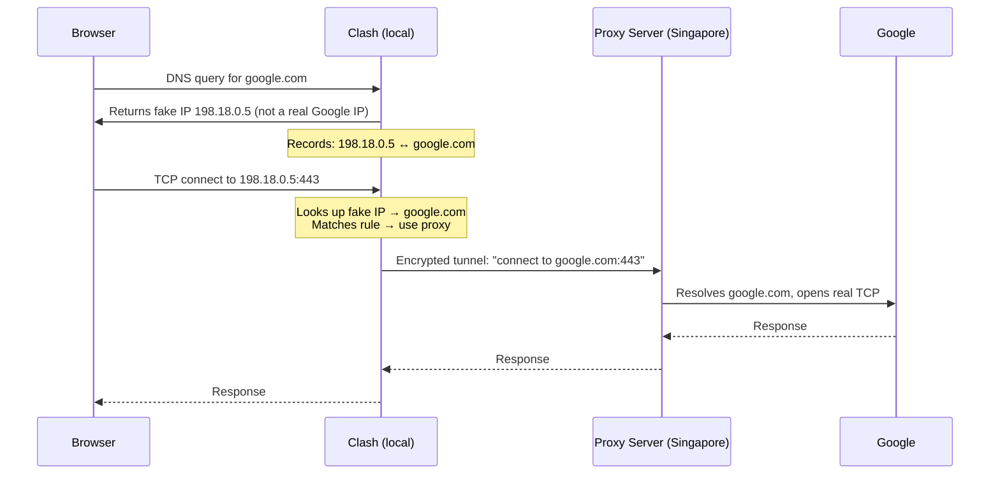

Clash is a rule-based proxy tool written in Go. Its YAML config lets you write rules like `DOMAIN,google.com,MyProxy` — but there's an immediate puzzle: by the time a TCP connection reaches Clash, the browser has already done a DNS lookup and turned `google.com` into an IP address. How does Clash know the IP belongs to `google.com`?

The answer is fake-IP mode, and it's one of the cleverest design choices in the proxy ecosystem.

## The Core Problem

When a browser wants to open `google.com`:

1. It queries DNS to resolve the domain to an IP
2. It opens a TCP connection to that IP

The DNS step happens first, and then the domain name is discarded. The operating system hands Clash a connection destined for (say) `142.250.80.46` — but not the domain name that produced it. Without some trick, domain-based rules are impossible.

Clash solves this in three ways, the most important being fake-IP mode.

## Fake-IP Mode

When `enhanced-mode: fake-ip` is set in the DNS section, Clash positions itself as the local DNS server. The flow changes entirely:



The key steps:

1. **Browser asks for `google.com`** → Clash intercepts the query and returns a fake IP from a reserved range (`198.18.0.0/16`, defined in RFC 2544 as a benchmarking range — not routable on the real internet)
2. **Clash records the mapping**: `198.18.0.5` ↔ `google.com`
3. **Browser connects to `198.18.0.5`** — which is actually a local listener inside Clash
4. **Clash looks up the fake IP**, recovers `google.com`, runs it through the rule engine
5. **If the rule says "use proxy"**: Clash sends the **domain name** (not an IP) to the proxy server. The proxy server resolves `google.com` from its own clean DNS (in Singapore) and makes the real connection
6. **If the rule says "DIRECT"**: Clash resolves the real IP itself using its configured nameservers, and connects directly

The fake IP never leaves your machine. It's just a local key for the domain name.

### Why Clash Sends the Domain Name to the Proxy, Not the IP

This is subtle but important. When a rule matches "use proxy", Clash does **not** resolve `google.com` to a real IP first. It hands the domain string directly to the proxy protocol (e.g. SOCKS5's DOMAINNAME address type, or Shadowsocks's ATYP 0x03).

This has two benefits:

- **No DNS pollution**: If Clash queried China's DNS for `google.com`, it would get a poisoned/wrong answer. By never asking at all, the problem is avoided entirely
- **Better CDN routing**: The proxy server resolves the domain from Singapore, so it gets the IP optimised for a Singapore client — correct geolocation for content delivery

## Why Browsers Trust the Fake IP

Chrome (or any app) trusts whatever DNS resolver the OS is configured to use. Clash either acts as that resolver or intercepts UDP port 53. From Chrome's perspective, it's receiving a valid A record from a legitimate source — there's no way to tell it's fake.

A few reasons Chrome can't detect this:

- **DNS has no built-in authenticity.** Without DNSSEC deployed end-to-end, there's no cryptographic way to verify "is `198.18.0.5` really Google's IP?" The browser just gets an A record and uses it
- **TLS still validates correctly.** Chrome's TLS handshake for `google.com` expects a certificate signed for `google.com`. That handshake flows through Clash → proxy → Google's real server. The cert is Google's real cert, so Chrome accepts it. Chrome is happy because the thing that actually matters — certificate authenticity — is intact
- **Reserved ranges carry no special browser rules.** `198.18.0.0/15` is reserved, but there's no browser logic saying "reject DNS answers in this range"

One edge case that **does** break this: Chrome's built-in DNS-over-HTTPS (Secure DNS). When DoH is enabled, Chrome bypasses the OS resolver entirely and queries Cloudflare or Google directly over HTTPS. Clash's fake-IP never gets a chance to intercept. Most Clash users either disable Chrome's DoH or use TUN mode to capture all traffic at the network layer.

## Other Mechanisms for Domain Recovery

Fake-IP is the most popular approach, but Clash also supports two alternatives:

**Redir-host mode**: Clash returns the real resolved IP (not a fake one), but remembers the DNS query that produced it. When a connection arrives for that IP, it looks up the cached domain. Less reliable if the mapping ages out or the IP is shared across domains.

**SNI / protocol sniffing**: For HTTPS (TLS), Clash can read the ClientHello packet and extract the SNI field, which contains the hostname the browser is trying to reach. For plain HTTP, it reads the `Host` header. Enabled via the `sniffer` config block in Clash Meta / mihomo. This works independently of DNS tricks and serves as a fallback.

## DNS Pollution and How Clash Handles It

In mainland China, querying a plain UDP DNS server for `google.com` returns a poisoned answer — a fake IP designed to block access. Since Clash's own DNS queries don't automatically go through the proxy, this matters for DIRECT traffic and IP-based rule matching.

Clash offers several strategies:

**1. DoH / DoT (encrypted DNS)**

```yaml
dns:
  nameserver:
    - https://1.1.1.1/dns-query    # DNS-over-HTTPS
    - tls://8.8.8.8:853            # DNS-over-TLS
```

The GFW can't trivially inspect or poison encrypted DNS. Queries still leave your machine directly, but arrive clean.

**2. fallback + fallback-filter (the anti-pollution pattern)**

```yaml
dns:
  nameserver:
    - 223.5.5.5                    # domestic, fast, but pollutable
  fallback:
    - https://1.1.1.1/dns-query    # overseas, clean
  fallback-filter:
    geoip: true
    geoip-code: CN
```

Clash queries both lists in parallel. If the domestic answer is a China IP, it's trusted (probably a `.cn` CDN). If it returns a non-China IP (suspicious — GFW poisoning usually returns random non-China IPs), Clash discards it and uses the fallback answer instead.

**3. nameserver-policy (per-domain)**

```yaml
dns:
  nameserver-policy:
    'geosite:google': https://1.1.1.1/dns-query
    '+.cn': 223.5.5.5
```

Route each domain to the appropriate upstream: overseas encrypted DNS for foreign domains, fast domestic DNS for `.cn` domains.

**4. Route DNS through the proxy (Clash Meta / mihomo)**

```yaml
dns:
  nameserver-policy:
    'geosite:google':
      server: https://1.1.1.1/dns-query
      proxy: MyProxy
```

The DNS query itself is tunneled through the proxy. Resolves in Singapore, arrives clean.

**In practice with fake-IP mode**: for proxied domains, none of this matters because Clash never resolves them locally at all. DNS pollution only affects DIRECT-routed domains and the proxy server's own hostname resolution (handled separately by `proxy-server-nameserver` in Clash Meta).

## The Full Architecture: China → Singapore VPS

Clash running in China is the **proxy client**, not the server. The "proxy server" is a separate piece of software you deploy on a VPS outside the firewall.

```
[Your machine — mainland China]         [Singapore VPS]
┌──────────────────────────┐            ┌────────────────────┐
│  Browser                 │            │  Proxy server SW   │
│    ↓ DNS                 │            │  (shadowsocks-rust, │
│  Clash (client)          │  ═══════>  │   xray, trojan-go, │
│  - YAML rule engine      │  encrypted │   v2ray, etc.)      │
│  - fake-IP DNS hijack    │  tunnel    │                    │
│  - TUN / SOCKS listener  │            └────────────────────┘
└──────────────────────────┘                      ↓
                                         Real internet (Google,
                                         YouTube, GitHub, etc.)
```

Your Clash YAML describes how to reach the VPS:

```yaml
proxies:
  - name: "SG-VPS"
    type: ss
    server: 1.2.3.4          # VPS public IP
    port: 443
    cipher: chacha20-ietf-poly1305
    password: "your-secret"
```

The encrypted tunnel between your machine and `1.2.3.4` looks like ordinary TLS traffic to the GFW. Protocols like VMess+WS+TLS, Trojan, and VLESS+Reality are specifically designed to be indistinguishable from legitimate HTTPS in traffic analysis.

End-to-end TLS to Google is preserved: the TLS handshake flows through the tunnel untouched and terminates at Google's real server with Google's real certificate. Clash and the proxy server never decrypt your HTTPS payload.

## Origins of Fake-IP

The fake-IP technique wasn't invented by Dreamacro (Clash's author) — it predates Clash by several years:

- **NAT64 / DNS64** (RFC 6146 / RFC 6147, 2011) — synthesises IPv6 addresses for IPv4-only hosts so that the DNS response becomes a rendezvous key for the translator. The same conceptual move: DNS manufactures an address that maps to the original query
- **Surge** (a commercial macOS proxy app by Yachen Liu, ~2014) — popularised "enhanced-mode: fake-ip" specifically in the rule-based proxy context. Clash's config format and feature set were openly inspired by Surge
- Earlier transparent-proxy setups on OpenWrt used similar dnsmasq tricks to recover domain names for routing

Dreamacro built a clean, open-source Go implementation that made the approach accessible to everyone. The rule engine integration, cross-platform reach, and the ecosystem of forks (Clash Meta / mihomo, Clash Verge, etc.) are real contributions — but the fake-IP concept itself was already established before Clash existed.
