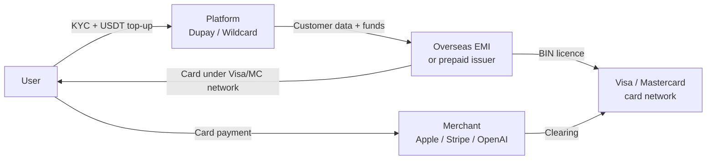
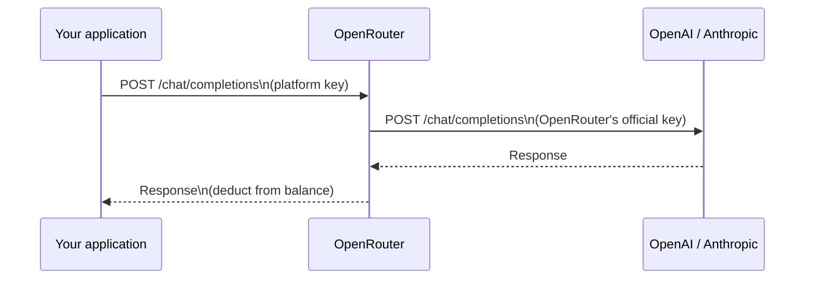

Two products keep coming up whenever Chinese users need to pay for ChatGPT Plus, Claude Pro, or Apple subscriptions: **Dupay** (also spelled Depay) and **Wildcard** (野卡). They look like simple prepaid Visa/Mastercard services, but the actual machinery underneath is more interesting — and more precarious — than their landing pages suggest.

This post maps out how these services work, why they fail, what OpenRouter's API relay model offers as an alternative, and why all three live in the same regulatory grey zone that may or may not matter.

---

## The virtual card layer

### What Dupay and Wildcard actually are

Neither Dupay nor Wildcard is a bank. Neither holds a card-issuing licence. They are **front-end platforms**: they run the app, handle user onboarding, accept USDT top-ups, and present a branded experience. The actual Visa or Mastercard is issued by a separate overseas entity the user rarely hears about.

The industry name for this arrangement is **BIN sponsorship** or **Card-as-a-Service (CaaS)**. The structure looks like this:

Plenty of legitimate fintechs use the same model — it is not inherently illegal. The compliance weight sits on the issuer, not the platform brand.

### Who the issuer actually is

The issuers Dupay and Wildcard partner with tend to be **small Electronic Money Institutions (EMIs)** licensed in low-friction jurisdictions: Lithuania, Gibraltar, Mauritius, Seychelles, the Philippines, and similar. These entities hold real card-programme licences but face much less scrutiny than a Hong Kong or US bank.

Key implication: **the issuer can terminate the partnership unilaterally**. Dupay has already switched issuers at least once; each migration froze accounts, migrated balances imperfectly, and required users to re-register with the new card programme. The platform you signed up with is not the entity that actually controls your money.

### The KYC flow and where your data goes

When you submit your passport and do a face scan inside the Dupay or Wildcard app, you are sending that data to at least two places:

1. The **platform's own servers** (for its internal records and account management)
2. The **issuing EMI's KYC system** (required by the issuer's AML obligations)
3. Potentially a **third-party KYC vendor** (Sumsub, Onfido, and similar) embedded in the issuer's flow

Each hop is a separate data controller with its own retention policy. The platform's marketing page does not tell you which jurisdiction's data laws apply to your passport scan after it reaches the issuer.

### Why Chinese nationals can successfully apply

Many people expect "Chinese passport = immediate rejection," having heard that US or Hong Kong banks won't open accounts for mainland Chinese residents. The virtual card product does not trigger those restrictions for a few structural reasons:

| Factor | Why it helps |
|---|---|
| **Prepaid ≠ bank account** | Prepaid cards sit in a lighter regulatory category in most jurisdictions. No credit, no deposits, lower KYC threshold. |
| **Small offshore issuers** | Entities in Mauritius or the Philippines have wider nationality acceptance than HSBC or Citibank. |
| **KYC pass ≠ regulatory green light** | The issuer's internal policy permits Chinese nationals. China's regulators cannot instruct a Lithuanian EMI. |
| **Visa/MC are neutral rails** | The card networks supply clearing infrastructure; they do not screen end-user citizenship themselves. |
| **Enforcement is user-side** | China's regulators target USDT trading and domestic promotion, not the act of an individual obtaining a foreign prepaid card. |

So "you can apply successfully" means "a small offshore EMI is willing to do this business." It is a regulatory gap, not a compliance clearance.

---

## Why the card gets rejected at Stripe and Apple

Having a valid card does not mean all merchants will accept it. The rejection pipeline is multi-layered.

### 🔴 BIN blacklisting

Every card number starts with a 6–8 digit **Bank Identification Number** that publicly identifies the issuer. Stripe, Apple, and OpenAI maintain lists of BIN ranges associated with "crypto prepaid" issuers. When a BIN range accumulates enough fraud flags, high chargeback rates, or mismatched user patterns (Chinese IPs on cards supposedly issued in the UK), the entire range gets blocked — regardless of the individual card's history.

This is why Dupay and Wildcard periodically announce "new card series" or "issuer migration." The old BIN got blacklisted; the platform found a new issuer with a fresh BIN range and the cat-and-mouse cycle resets.

### 🟡 AVS mismatch

Stripe and many Apple transactions run **Address Verification System (AVS)** checks: the billing address you enter must match what the issuing bank has on file. If your real address is in Chengdu but the issuer's record says "New York," AVS fails and the card is declined.

This leads directly to how the business model actually works.

### The billing address workaround

You might wonder: if users sign up with Chinese ID, how do they pass AVS with a US merchant?

The answer is that **platforms provide a fictitious overseas billing address** and register it with the issuing EMI as the cardholder's official address.

Wildcard, for example, tells users explicitly: *"Your billing address is [US address]. Use this when asked by Apple or ChatGPT."*

The platform maintains a pool of US or UK postal addresses — sometimes a real virtual-office service, sometimes a few dozen reused strings. AVS only compares character strings; it does not verify that a human lives there. So thousands of users share a handful of "official" addresses and AVS passes.

Stripe and Apple's fraud systems eventually notice: one BIN range → many cards → billing addresses clustered at a few identical strings → IPs geolocating to China → all spending on AI subscriptions. The BIN gets blacklisted. The platform switches issuers, gets a new address pool, and repeats.

This is the real business model: **selling access to a rotating arbitrage layer between permissive offshore issuers and merchant fraud detection lag.**

### Other rejection causes

- **3DS verification failures**: European PSD2 requires two-factor card authentication. Prepaid cards on small issuers sometimes have unreliable 3DS infrastructure.
- **Merchant-side prepaid bans**: Merchants can configure Stripe to reject all prepaid cards outright, reasoning that prepaid cards have higher dispute rates and unreliable recurring billing.
- **Fraud scoring models**: Stripe Radar and Apple's systems score device fingerprint, IP geolocation, purchase history, and card age together. New card + Chinese IP + first-ever transaction = elevated risk score → decline.

---

## Dupay vs. Wildcard

Both services use the same structural model. The differences are more about positioning and fee structure.

| | Dupay | Wildcard (野卡) |
|---|---|---|
| **Target use case** | General cross-border spending | AI subscription activation (ChatGPT, Claude, Apple) |
| **Fee model** | Card issuance fee + top-up/spending fee | Annual membership (~$10–15/yr) + top-up fee |
| **User base** | Broader (includes general e-commerce) | Narrower, skews heavily toward AI-tool buyers |
| **Compliance history** | Older; has survived multiple issuer switches | Newer; fewer incidents so far, but same structural fragility |
| **Transparency** | Neither discloses current issuer prominently | Neither discloses current issuer prominently |

Wildcard has better brand recognition in the Chinese AI community because of aggressive promotion through tech bloggers. For purely AI subscription needs, it offers a more polished UX — but the underlying risks (frozen balances, sudden BIN blocks, third-party data exposure) are identical.

**Neither service is suitable for storing meaningful amounts of money.** They are best treated as spend-immediately, keep-minimal-balance tools.

---

## The API relay alternative

For users whose actual need is calling AI model APIs — rather than subscribing to consumer products — there is a structurally cleaner option.

### How API relay / aggregation gateways work

A platform like OpenRouter holds legitimate API agreements with upstream model providers (OpenAI, Anthropic, Google, Meta, Mistral, and others). Users fund a balance on the platform, receive the platform's own API key, and their requests are proxied:

The user never needs a payment card that can pass AVS, because the platform handles the upstream payment relationship entirely.

### OpenRouter's compliance approach

OpenRouter stands apart from informal Chinese API relay sites in one specific way: **it does not directly hold or exchange cryptocurrency.**

When a user pays with crypto, OpenRouter routes the transaction through **Coinbase Commerce** — a licensed payment processor. Coinbase Commerce:

- Holds a money-transmitter licence and complies with FinCEN AML requirements
- Runs on-chain source screening (via Chainalysis or similar) to filter sanctioned addresses, mixer outputs, and known fraud wallets
- Converts the incoming crypto to USD before remitting to OpenRouter
- Absorbs the KYC and AML compliance obligation for the payment leg

OpenRouter receives **USD**, not cryptocurrency. This keeps it out of the money-transmitter regulatory category. Its product is a SaaS API credit — legally closer to a phone card than a financial account — which avoids most payment-services licensing requirements.

For small top-ups from a clean address (e.g., withdrawn from a KYC'd Binance account), Coinbase Commerce typically imposes no additional KYC on the sender. The payment completes frictionlessly.

However: **frictionless ≠ anonymous.** Every on-chain transaction is permanently visible. The sending address (your Binance withdrawal address) is tied to your Binance identity. The receiving address is tied to OpenRouter. The full payment chain is reconstructible by any party with subpoena access to both endpoints. USDC is not a privacy coin.

### Virtual card vs. API relay: when to use which

| Need | Better fit |
|---|---|
| ChatGPT Plus, Claude Pro, Apple subscription | Virtual card (Dupay / Wildcard) |
| Calling model APIs from code | API relay (OpenRouter) |
| Privacy from payment chain | Neither — both are traceable |
| Long-term balance safety | Neither — uninsured prepaid credit |
| Regulatory exposure (China) | Both are grey-zone; relay is lower friction |

---

## The structural explanation: compliance as liability transfer

A recurring pattern runs through everything above: services that look non-compliant keep operating for years, and services that claim to be compliant often provide less protection than advertised.

David Graeber's *Bullshit Jobs* describes a type of worker he calls the **box-ticker** — someone whose job exists not to accomplish outcomes but to generate documentation proving that the employer followed procedure. His canonical example: a US company hiring a firm to audit its overseas suppliers, staffed by a Manhattan employee who Googles the foreign company and writes up a compliance report without speaking the local language.

The report exists not because anyone believes it accurately characterises the supplier's practices, but because it shifts liability. If something later goes wrong, the company can produce the report as evidence of due diligence. The auditor can say they followed their methodology. The regulator can say the system worked as designed. No one is responsible for outcomes; everyone is responsible only for their own procedural step.

### Compliance as liability management, not prevention

This structure is not unique to supply-chain auditing. It is the operating logic of most compliance regimes:

**AML / SAR filings** — US banks file millions of Suspicious Activity Reports annually. FinCEN investigates a fraction of a percent. Banks file not because they expect action, but because not-filing creates liability. The filings function as insurance against blame, not as financial crime detection.

**KYC at small EMIs** — The issuing entities behind Dupay and Wildcard conduct KYC to satisfy their licence conditions, not to meaningfully verify anything. Fake address documentation passes because the auditor's job is to confirm a document exists, not to verify the address. If fraud later surfaces, the issuer can produce the filed documentation and demonstrate process compliance.

**GDPR cookie banners** — The regulation was designed to give users genuine control over their data. In practice it produced billions of daily "I Agree" clicks from users who never read the consent and never would. Surveillance advertising continues at roughly the same scale. The regulation's main measurable effect was: (1) creating a multi-billion-dollar consent management platform industry (OneTrust and competitors), and (2) increasing market concentration — large platforms can absorb compliance overhead; small competitors cannot.

**China labour law** — Chinese law prohibits 996 schedules, mandates overtime pay at a multiplier of base salary, and requires social insurance at actual wages. Major tech employers and foreign-invested enterprises violate these provisions routinely, with full documentation of compliant-looking HR processes: signed employee handbooks, training records, performance review systems. The process is compliant; the outcomes are not. Enforcement happens selectively — when a company attracts political scrutiny, not when workers are harmed.

### Strict law + selective enforcement as a political design choice

The coincidence of strict written rules and loose enforcement is not a governance failure. It is a **governance tool**.

If a law were strictly enforced, economic activity would contract: European tech companies under rigorous GDPR enforcement, Chinese manufacturing under rigorous labour law enforcement. If the law were simply absent, political pressure from rights advocates, workers, and civil society would mount.

The stable equilibrium is: **write a demanding law, enforce it selectively**. This gives regulators:

- Political credit for the law's existence
- Discretion over whom to enforce it against
- A pre-built instrument for targeted action when politically convenient

GDPR's most notable enforcement actions have targeted American tech companies during transatlantic data-flow disputes — not to protect individual users, but as geopolitical leverage. China's labour law most visibly surfaces when a company has become politically inconvenient, or when a scandal reaches a scale that demands a visible response.

The regulatory gap that Dupay, Wildcard, and OpenRouter all inhabit is not an oversight. It exists because all the relevant parties — Chinese regulators, Visa/Mastercard, the small offshore issuers, and the merchants — have calibrated their enforcement to a point where the grey zone stays open. The moment any party decided to close it seriously, the business model evaporates overnight. The fact that it hasn't evaporated is its own data point.

---

## Risk summary

| Risk | Dupay / Wildcard | OpenRouter / API relay |
|---|---|---|
| Balance loss (platform failure) | High — no deposit insurance | Medium — SaaS credit, operator risk |
| Sudden service interruption | High — BIN blocks, issuer changes | Medium — upstream API policy changes |
| Identity data exposure | High — passport + biometrics at offshore EMI | Low — email registration only |
| Payment traceability | Medium — card transaction records | Medium — on-chain USDC is permanent |
| Regulatory exposure (China) | Grey — individual use not actively pursued | Grey — API use not actively pursued |
| Data privacy (conversation content) | N/A | Medium — all prompts transit relay servers |

For small, occasional payments to consumer AI services: virtual cards are functional but fragile. Treat them as temporary infrastructure, keep balances minimal, and assume any balance could become inaccessible.

For API access in software projects: an API relay like OpenRouter is cleaner on almost every dimension — except that all your prompts and outputs flow through a third party. For personal projects this is usually acceptable; for commercial or sensitive workloads, direct provider API access (with a compliant payment method) is worth the friction.

[graeber-bullshit-jobs]: https://www.simonandschuster.com/books/Bullshit-Jobs/David-Graeber/9781501143335
[openrouter]: https://openrouter.ai
[coinbase-commerce]: https://commerce.coinbase.com
[chainalysis]: https://www.chainalysis.com
