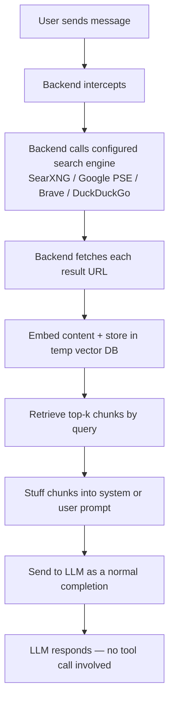

This started as a bug report and turned into an architecture discussion. The short version: **Open WebUI's web search is not what most people think it is**, and the moment you understand why, you also understand why LibreChat and LobeChat exist as alternatives — and which one to pick.

## The symptom: a "successful" search that didn't actually search

The setup: Open WebUI 🌐 toggle on, model is `google/gemini-3-flash-preview` via OpenRouter, query is `weather in london`.

The UI shows everything you'd expect — "Searching the web", "Searched 5 sites", five result URLs (AccuWeather, Weather25, etc.). The model then confidently answers with `"As of Tuesday, May 21, 2024..."` — training-data garbage from two years ago.

[Langfuse](https://langfuse.com/) was capturing the actual LLM API call. What it shows:

- The user message in the request body is literally just `"weather in london"`. No retrieved web content attached.
- `tool_calls: null`, `function_call: null` on the assistant response.
- A single, plain completion. No tool calling anywhere in the trace.

So the question: the UI shows a search happening with concrete site results, the real API call has none of it, and the model answered from training data. What's going on?

## How Open WebUI actually does "web search"

A lot of people assume Open WebUI's web search works via **function calling** — the model sees a `web_search` tool, decides to call it, gets results, responds. **It does not.** Open WebUI uses **RAG-style pre-injection**:



The model never sees a tool. From its point of view, the request is a normal completion that happens to have a bunch of reference text in the prompt. So `tool_calls: null` in Langfuse is **not a bug** — it's the design.

### Where it broke

The clue was hiding in the UI screenshot: `No sources found` appeared **after** "Searched 5 sites". So the pipeline didn't fail at the search step — it failed *between* search and prompt-injection:

- Step 3 (search engine call) → succeeded, returned 5 URLs.
- Step 4 (fetch URL bodies) or step 5 (embed + retrieve) → produced zero usable sources.
- Step 6 → injected nothing into the prompt.
- Step 7 → model received a bare `"weather in london"` and hallucinated from May 2024.

That's why Langfuse shows a clean completion with no search context: there was no context to inject. The most likely culprits, in order:

1. **Webpage fetch failed.** Default `requests` or Playwright loader can't handle JS-heavy sites like AccuWeather / Weather25 — common failure modes are 403, Cloudflare block, or timeout (default 10s).
2. **Embedding model misconfigured.** Default `sentence-transformers` couldn't download in an offline container, or an OpenAI embedding key is missing.
3. **Wrong content extraction engine.** `RAG_WEB_LOADER_ENGINE` (also called "Web Loader Engine" in newer admin UIs) set to something that can't handle the target pages.
4. **Top-K / relevance threshold too strict.** Everything gets filtered out.

## A second surprise: query generation is *also* a hidden LLM call

The observed search query in the UI was `"weather in London May 26 2026"` — not the original `"weather in london"`. Where did the date come from?

Open WebUI runs an extra LLM call *before* the search to rewrite the query. The prompt template (roughly `RAG_WEB_SEARCH_QUERY_GENERATION_PROMPT_TEMPLATE`) looks like:

```
### Task:
Based on the chat history, generate search queries...
Today's date: {{CURRENT_DATE}}
### Output:
JSON format: { "queries": ["query1", "query2"] }
```

`{{CURRENT_DATE}}` gets substituted with the real date, so the rewriter adds "May 26 2026" before searching. So the true flow is:

```
User: "weather in london"
   ↓
[LLM call #1] generate search queries
   → ["weather in London May 26 2026", "London weather forecast today"]
   ↓
[Search engine call] → 5 URLs
   ↓
[Webpage fetch] ← FAILED HERE in this case
   ↓
[Embed + retrieve top-k]
   ↓
[LLM call #2] answer with retrieved context (or without, if fetch failed)
   → THIS is the call Langfuse captured
```

The first LLM call was either filtered by the Langfuse callback, or hidden in a different trace. The second one is the only one most users notice.

## Two paradigms for "let the chatbot use the web"

| | **Paradigm A: Pre-RAG injection** | **Paradigm B: Tool use / function calling** |
|---|---|---|
| Who decides to search? | App layer (or a user toggle) | The LLM itself |
| Model sees a tool? | No | Yes, in the request's `tools` array |
| Calls per turn | 2 (rewrite + answer) | 1+N (decide + tool result + answer) |
| Observability | One opaque completion with stuffed prompt | Clean `tool_use → tool_result → final_answer` chain |
| Works with non–tool-use models | Yes | No (model must support function calling) |
| User control | Hard on/off toggle | Model self-decides, less predictable |
| Failure mode shown to user | "UI says searched, answer is hallucinated" | "Tool call failed" — model can retry or apologize |

Which one is the *current* default in 2026? It depends on when the project was designed:

| Period | Norm |
|---|---|
| 2022–early 2023 | Paradigm A (GPT-3.5 era, no function calling) |
| Late 2023–2024 | Transition; both common |
| 2025–2026 | **Paradigm B is the default** for new projects; A survives in local/lightweight setups |

ChatGPT, Claude, Gemini, Perplexity — all paradigm B. The bug above is exactly the kind of UI/backend desync that paradigm B prevents: if the model is making the call, it knows when the call failed and can say so.

## Why Open WebUI is still on Paradigm A

Not because the maintainers don't know better. There are real reasons:

- **Model-agnostic by design.** Open WebUI's pitch is "works with any backend, including local Llamas and Qwens that don't support tool use." Paradigm A is the least common denominator.
- **User control.** Many users *want* a manual toggle, not a model deciding "I think I'll search now."
- **Historical baggage.** The project started as Ollama WebUI for local models, when essentially nothing supported function calling.
- **Token cost.** Tool schemas in every request add input tokens.

It's a reasonable design for its target audience — local models, single-user homelabs. It's just not the design you want if you care about observability or tool-use ergonomics.

## So if Paradigm B is the goal: LibreChat or LobeChat?

Both are self-hosted, Docker-deploy, BYOK, open-source, ChatGPT-like frontends — same category as Open WebUI. Both have **native MCP support**, so web search just becomes "plug in a Tavily/Brave/Exa/SearXNG MCP server" and the model calls it as a tool. Either one fixes the Open WebUI bug architecturally, not as a workaround.

GitHub:

- LibreChat — <https://github.com/danny-avila/LibreChat>
- LobeChat — <https://github.com/lobehub/lobe-chat>
- Open WebUI (the one with the bug) — <https://github.com/open-webui/open-webui>
- AnythingLLM (worth knowing about) — <https://github.com/Mintplex-Labs/anything-llm>
- Jan (desktop-leaning) — <https://github.com/janhq/jan>

The interesting question is which of LibreChat vs LobeChat is the better pick. Three useful axes: code modernity, feature breadth, usage intuition.

### Code design modernity → LobeChat wins clearly

**LobeChat**: Next.js 16 + React 19, TypeScript first, tRPC for end-to-end type safety, Drizzle ORM over Postgres, Zustand for state, antd-style for CSS-in-JS. Monorepo with `@lobechat/*` packages, three deploy targets (web / Electron desktop / mobile bridge), Redis + S3 in the stack. Textbook 2026 full-stack.

**LibreChat**: Node.js + Express + React, MongoDB, Recoil + React Query on the frontend, MeiliSearch for chat search, *separate* Postgres + pgvector container running an independent Python RAG service. Repo guidelines now mandate TypeScript in `/packages/api` while the legacy `/api` directory stays JS with thin TS wrappers — clearly mid-migration. `turbo` for build pipeline, config split across `librechat.yaml` + `.env` with Zod validation.

LobeChat reads like a project written from scratch with 2025–2026 conventions. LibreChat reads like a 2023 project that's working hard to modernize. Both are solid engineering; LobeChat is just less encumbered.

### Feature breadth → mostly LobeChat, but LibreChat is deeper in a few spots

| Feature | LibreChat | LobeChat | Winner |
|---|---|---|---|
| MCP support | First-class, YAML config | First-class, **UI-configurable**, stdio/HTTP/cloud | LobeChat (UX) |
| Tool / function calling | Unified through MCP | MCP + built-in plugins + legacy plugin gateway (three layers) | LibreChat (cleaner) |
| RAG / knowledge base | Dedicated Python service + pgvector | Built-in, lighter implementation | LibreChat (industrial) |
| Image input (vision) | ✅ | ✅ | tie |
| Image generation | DALL·E, SD via MCP | DALL·E, MidJourney, Pollinations, Tongyi Wanxiang — native | **LobeChat** |
| Voice (TTS/STT) | Configurable but fiddly | OpenAI / Edge / Microsoft out of box | LobeChat |
| Code interpreter | Yes, needs sandbox container | No real one | LibreChat |
| Artifacts | ✅ | ✅ | tie |
| Agent builder | Built-in builder, tools/model/prompt | Built-in builder | tie |
| Agent marketplace | ❌ | ✅ thousands of community agents | **LobeChat** |
| Multi-model in one chat | Best-in-class, swap mid-conversation | Supported | LibreChat slight edge |
| Multi-user / RBAC | Full RBAC, enterprise-grade | Server edition has it, coarser | **LibreChat** |
| Enterprise SSO (SAML/OIDC) | ✅ | partial | LibreChat |
| PWA / mobile | ❌ | ✅ | LobeChat |
| Desktop app | ❌ | Electron | LobeChat |
| Local models (Ollama) | ✅ | ✅ | tie |

Short version: LobeChat is the Swiss-army knife (broader, especially multimodal and ecosystem). LibreChat is the professional tool (deeper in enterprise things — RBAC, SSO, RAG, multi-provider).

### Usage intuition → it depends on "first 10 minutes" vs "long term"

The counterintuitive part: prettier is not the same as more intuitive.

**LibreChat** is almost a pixel-clone of ChatGPT — left sidebar of conversations, model picker on top, message area, input at the bottom. Anyone who's used ChatGPT can use it in 30 seconds. The catch: power features hide in config files (`librechat.yaml` for MCP, deeper menus for agents). The philosophy is "ChatGPT-simple in the chat view, YAML for everything else."

**LobeChat** has the highest visual information density of the three — agent market, plugin market, files, settings all reachable from the left rail. First impression is "a lot is going on." But *inside* each module, the interactions are smooth — MCP servers are added by clicking, not by editing a file. The philosophy is "everything should be possible in the UI."

| When | Better experience |
|---|---|
| First install, first time | **LibreChat** (looks like ChatGPT) |
| Adding a web search MCP server | **LobeChat** (UI vs YAML) |
| Daily chatting, switching models | LibreChat (top-bar swap) |
| Exploring new capabilities | LobeChat (discoverable market) |
| Deploying to non-technical users | LibreChat (less to misuse) |
| Solo power user | LobeChat (more surfaced features) |

### A rough scorecard

| | LibreChat | LobeChat |
|---|---|---|
| Code modernity | 6.5 | 9 |
| Feature breadth | 8 | 9 |
| Short-term intuition | 8.5 | 7 |
| Long-term intuition | 7 | 8.5 |

## How to pick

- **Solo user, taste for modern code, willing to spend 10 minutes learning the UI** → **LobeChat**. Best bet on where the ecosystem is heading. MCP-via-UI, PWA, multimodal depth — all things you'll appreciate.
- **Team or company deployment, want stability, ChatGPT-like zero-friction onboarding, care about RAG / SSO / multi-provider switching** → **LibreChat**. The engineering choice.
- **Already happy with Open WebUI for local Ollama models** → keep it for that use case and run LibreChat or LobeChat alongside for the modern tool-use experience. They're just frontends; nothing stops you from running two.

The fastest way to decide is to spin up both with one-liner Docker commands, point them at the same OpenRouter / Anthropic / OpenAI key, and use each for a real task for 15 minutes. The "which one feels right" answer arrives almost immediately. Whatever you pick, both are paradigm B — meaning when you turn on web search and check Langfuse, you'll see actual tool calls, not a polite lie.
