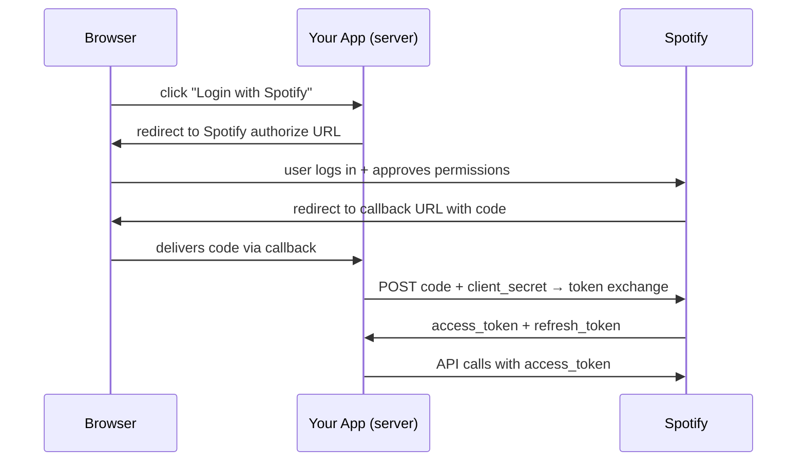

OAuth 2.0 feels over-engineered at first glance. This post works through the full flow using Spotify as the example, and explains *why* each step has to be the way it is — not just what it does.

## The Problem OAuth Solves

Before OAuth, a third-party app that needed access to your Spotify had one option: ask for your username and password.

```
App: "Give me your Spotify password"
You: "...ok" 😬
```

Problems with this:
- The app can do **anything** — delete playlists, change settings, everything
- If the app gets hacked, your **password** leaks
- To revoke access you must **change your password**, breaking all other apps too

OAuth's answer: your app never touches the password. Instead, you approve a limited set of permissions through Spotify's own login page, and the app gets a scoped, revocable token.

### Why Not Just Create a Static API Key?

A reasonable alternative: go to Spotify's developer dashboard, create a key scoped to "read email only", and hand it to the app.

This works fine for **you as a single user**. But if you're building an app for a million users, you can't tell each of them:

> "Go to Spotify's dashboard, create an API key with these permissions, paste it here."

OAuth automates exactly that process — the redirect flow *is* the user creating a scoped key, on your behalf, without ever leaving their browser.

---

## The Full Flow, Step by Step



### Step 1 — Redirect to Spotify's Login Page

Your app builds a URL and redirects the user:

```
https://accounts.spotify.com/authorize
  ?client_id=abc123
  &response_type=code
  &redirect_uri=https://yourapp.com/callback
  &scope=user-read-email playlist-read-private
  &state=k3j9mxq2
```

**Why redirect to Spotify's own page?**
If you asked for the password inside your app, your app would hold the user's Spotify master credential — it could do anything, and a breach would expose everything. Redirecting to Spotify means your app never touches the password.

### Step 2 — `client_id` in the URL

`client_id` tells Spotify which app is requesting access. Spotify uses it to:
- Show "YourApp wants access to your playlists" on the consent screen
- Reject unregistered apps from using OAuth
- Let users see and revoke app access in their Spotify settings

### Step 3 — `redirect_uri` Must Be Pre-registered

After login, Spotify sends the user back to `redirect_uri`. But this value must **exactly match** what you registered in Spotify's developer dashboard.

Without this rule, an attacker could craft:

```
https://accounts.spotify.com/authorize
  ?client_id=abc123
  &redirect_uri=https://evil.com/steal   ← attacker's site
```

The user logs in → Spotify sends the code to the attacker's site. Pre-registering the URI makes this impossible.

### Step 4 — Spotify Returns a `code`, Not a Token

After the user approves, Spotify redirects back:

```
https://yourapp.com/callback?code=AQD3x...&state=k3j9mxq2
```

**Why a short-lived code and not the access token directly?**

The redirect URL passes through the browser — it appears in browser history, server logs, and network proxies. A `code` alone is useless: it can only be exchanged with your `client_secret`, which only your server knows. Even if someone intercepts the code in transit, they can't do anything with it.

### Step 5 — `state` Parameter (CSRF Protection)

Your app generates a random `state` before the redirect, stores it in the user's session, and verifies it matches when the callback arrives.

**Without `state`, here's the attack:**

1. Attacker starts OAuth on their browser, logs in with *their* Google account, but doesn't follow the final redirect
2. They copy the callback URL: `https://yourapp.com/callback?code=ATTACKER_CODE`
3. They trick *you* into clicking that link (email, "claim your prize", etc.)
4. Your browser opens it while you're logged into yourapp.com
5. Your session gets linked to the attacker's Google account
6. Attacker logs in with their Google → they're inside **your** account

**With `state`:**

Your session has `state = "k3j9mxq2"`. The attacker's URL has no matching state (or the wrong one). Your app rejects it. The attacker would need to read your session to forge it, which they can't.

### Step 6 — Server-Side Code Exchange

Your **server** (never the browser) sends:

```
POST https://accounts.spotify.com/api/token
  grant_type=authorization_code
  code=AQD3x...
  redirect_uri=https://yourapp.com/callback
  client_id=abc123
  client_secret=your_secret    ← stays on server, never in browser
```

**Why both `code` and `client_secret`?**

```
code alone          → Spotify rejects it
client_secret alone → Spotify rejects it
code + client_secret → ✅ Spotify issues tokens
```

This two-factor exchange means intercepting the code in Step 4 is worthless without the secret.

### Step 7 — Access Token Expires (Short-Lived by Design)

Spotify returns:

```json
{
  "access_token": "BQA...",
  "expires_in": 3600,
  "refresh_token": "AQA..."
}
```

Static API keys don't expire — if leaked, the attacker has permanent access until you notice and manually revoke. A 1-hour access token limits the damage window dramatically.

### Step 8 — Refresh Token (Long-Lived, Revocable)

Re-logging in every hour would be terrible UX. The `refresh_token` lets your server silently get a new `access_token` without user involvement:

```
POST https://accounts.spotify.com/api/token
  grant_type=refresh_token
  refresh_token=AQA...
  client_id=abc123
  client_secret=your_secret
```

The refresh token is long-lived but Spotify can revoke it anytime — for example, when the user clicks "Remove app access" in their Spotify settings.

---

## Why Each Step Exists — Summary

| Step | Prevents |
|---|---|
| Redirect to Spotify's page | App never sees the password |
| Pre-register `redirect_uri` | Attacker can't redirect code to evil site |
| Return `code`, not token | Intercepted redirect URLs are useless |
| Server-side exchange with `client_secret` | `client_secret` never exposed to browser |
| Short-lived `access_token` | Stolen tokens expire quickly |
| `refresh_token` | User doesn't re-login every hour |
| `state` parameter | CSRF / session injection attack impossible |

---

## Building a Personal Spotify CLI

For a personal tool with no GUI, you don't need to implement any of this yourself.

### Spotipy (Python)

[Spotipy] handles the entire OAuth flow plus wraps every Spotify API endpoint:

```python
import spotipy
from spotipy.oauth2 import SpotifyOAuth

sp = spotipy.Spotify(auth_manager=SpotifyOAuth(
    client_id="...",
    client_secret="...",
    redirect_uri="http://localhost:8888/callback",
    scope="user-read-currently-playing"
))

print(sp.current_user_playing_track())
```

First run opens a browser once and saves a `.cache` file containing the refresh token. Every subsequent run uses the cached token silently.

**Standard OAuth lib vs Spotipy:**

| | Standard OAuth lib | Spotipy |
|---|---|---|
| OAuth flow | ✅ | ✅ |
| Spotify API wrappers | ✗ write yourself | ✅ built-in |
| Token refresh | handle manually | automatic |
| Good for | learning / flexibility | getting things done |

### Running on a Headless Server (No Browser)

Three approaches, simplest first:

**Option A — Authenticate on laptop, copy cache to server**

```bash
# On your laptop
python auth.py        # opens browser, saves .cache

# Copy token cache to server
scp .cache user@yourserver:~/spotify-app/
```

The server reads the cached refresh token forever, silently refreshing as needed.

**Option B — Set `redirect_uri` to your server's address**

```python
redirect_uri = "http://yourserver.com:8888/callback"
```

Spotipy starts a temporary HTTP listener on that port. You open the printed URL in any browser — after login, Spotify redirects to your server, the listener catches the code, exchanges it, and shuts down.

**Option C — Paste the callback URL manually**

```python
SpotifyOAuth(..., open_browser=False)
```

Spotipy prints the authorize URL. You open it in any browser, complete login, then copy the full redirect URL from the address bar (even if it's a 404 page) and paste it into the terminal. One-time setup, then fully silent.

---

## When OAuth Is Overkill

OAuth 2.0 was designed for **delegated access at scale** — millions of users each granting a third-party app limited access to their account. For simpler scenarios:

| Scenario | Better approach |
|---|---|
| Personal script, public Spotify data only | Client Credentials Flow (just `client_id` + `client_secret`, no user login) |
| Personal script, your own Spotify data | Authenticate once, cache the refresh token |
| App with many users | Full Authorization Code Flow as described above |

The complexity is real, but it's proportional to the problem. For personal tooling, a library like Spotipy reduces the entire flow to a one-time browser prompt.

[Spotipy]: https://spotipy.readthedocs.io/
