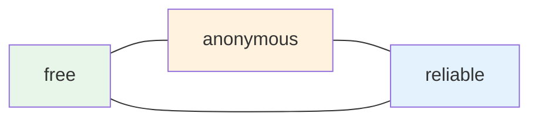
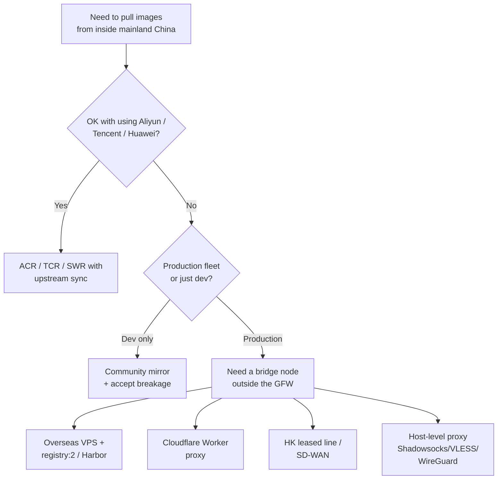
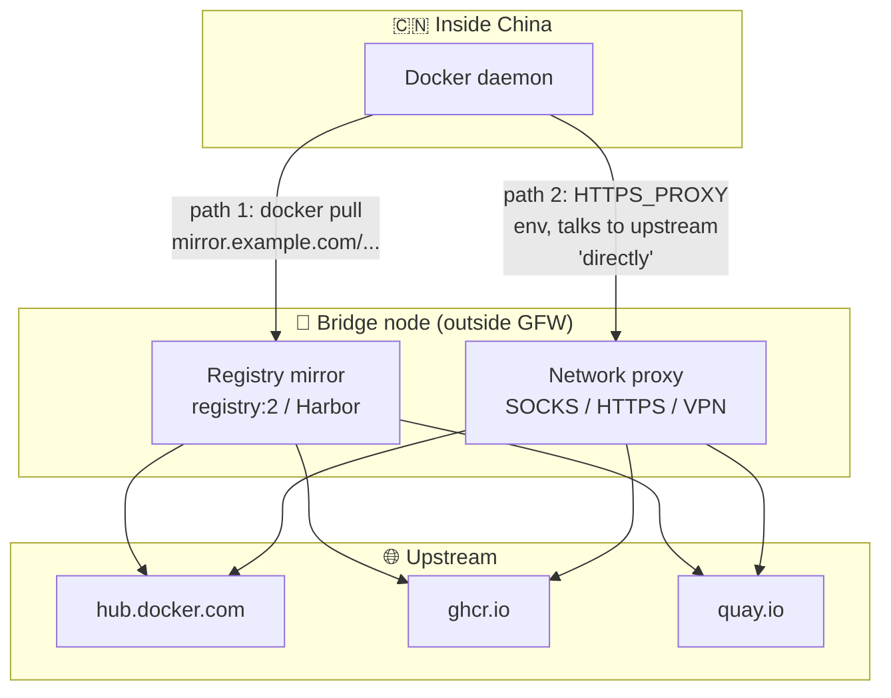

A practical guide to mirror configuration already exists in [Pulling Docker Images from China Mainland][prev]. This note is the
complement: **why** the mirror landscape looks the way it does in 2026,
and the decision tree a company faces when it rules out domestic
cloud providers.

## What changed in June 2024

For years, pulling Docker images from inside mainland China was a
solved problem. You pasted one of a dozen mirror URLs into
`/etc/docker/daemon.json` and moved on. The big names were household
infra:

- Alibaba Cloud — `*.mirror.aliyuncs.com` (anonymous public form)
- Tencent Cloud — `mirror.ccs.tencentyun.com`
- NetEase, Baidu Cloud, DaoCloud (old endpoint)
- USTC (中科大), SJTU (上海交大) — university mirrors

On **June 6, 2024**, almost all of them shut down their anonymous
public endpoints within the same week. Some retained service for
logged-in accounts pulling from inside their own cloud; others went
fully dark; the university mirrors became education-network-only.

The synchronized timing strongly suggests a coordinated regulatory
push rather than independent business decisions, but **no provider
ever published an official reason**. The widely understood drivers:

| Driver | Detail |
|---|---|
| 🛡️ Content liability | A Docker Hub mirror re-serves arbitrary third-party layers. Auditing every image (for VPN tools, circumvention software, miners) is effectively impossible — but Chinese content rules don't grant exceptions for "too hard to audit." |
| 🚧 Upstream already blocked | `registry-1.docker.io` and `hub.docker.com` became mostly unreachable from mainland China around May–June 2023. Once upstream is blocked, mirrors stop being mere "accelerators" and become the **only** path — far more politically visible. |
| 💸 Cost & abuse | Free public mirrors were hammered by overseas traffic, CI farms, and crypto-adjacent workloads. Bandwidth is real money, especially for education networks. |
| ⚖️ Liability without revenue | Anonymous public mirrors generated zero revenue but unbounded compliance exposure. Exiting was the rational move even absent a directive. |

**Tsinghua (TUNA)** is often mentioned in the same breath, but they
never operated a public Docker Hub mirror. Their service covers PyPI,
apt, Anaconda, etc. — Docker was always outside their scope.

## The current landscape (2026)

Stripping away the variations, what's free, anonymous, and reliable
no longer coexist. You can have **two of the three**:

| You want… | You give up… | Example |
|---|---|---|
| Free + anonymous | Reliability | Community mirrors (`docker.m.daocloud.io`, `docker.1ms.run`, `docker.m.ixdev.cn`) — come and go on a scale of weeks |
| Free + reliable | Anonymity | Aliyun / Tencent personal accelerator (account-bound, free, stable) |
| Anonymous + reliable | Free | Self-hosted registry on overseas infra |

Community-maintained lists like [`dautovri/mirrors-china`][mirrors-china]
and [`y0ngb1n/dockerized`][dockerized] track what's currently alive.

## The decision tree for a company

The first fork is whether you can use a **domestic cloud provider's
container service**:

### Path A — domestic cloud registry (most production teams)

If you're already running on Aliyun, Tencent Cloud, or Huawei Cloud,
the path of least resistance is their managed container registry:

- **ACR** (Aliyun Container Registry)
- **TCR** (Tencent Container Registry)
- **SWR** (Huawei Software Repository)

These services have a built-in **image sync / replication** feature
that pulls from Docker Hub, `gcr.io`, `quay.io`, `ghcr.io` through
the provider's own overseas egress. Your fleet pulls from the
private registry inside China at LAN speed.

Bonus features come for free: image scanning, signing, RBAC, version
pinning. This is what most production teams actually do — it
sidesteps the public-mirror question entirely.

### Path B — refuse domestic cloud

If the company won't use Aliyun/Tencent (data sovereignty concerns,
multi-cloud strategy, existing AWS/GCP investment, foreign HQ
policies), the constraint reduces to a single sentence:

> **Pull traffic must exit through a network endpoint outside the
> GFW that you control or trust.**

The form of that endpoint is just a cost/operations decision.

## The bridge node mental model

The crucial realization is that **registry-layer** and
**network-layer** bridges achieve the same goal — they differ only
in where in the stack the "go outside" happens:

### Registry-layer bridges

The Docker daemon believes it's talking to a private registry.
Examples:

- VPS running `registry:2` in pull-through cache mode (Vultr, Linode,
  DigitalOcean, AWS Lightsail HK/SG/JP)
- Harbor on overseas infra
- Cloudflare Workers / Deno Deploy / Vercel — script proxies the
  Docker Registry HTTP API (cheapest; layer-size limits make large
  images flaky)
- Managed registries with overseas backing (JFrog Cloud, GHCR when
  reachable)

### Network-layer bridges

The Docker daemon believes it's talking to Docker Hub directly,
but traffic is tunneled:

- Shadowsocks / VLESS / Trojan / WireGuard / OpenVPN, configured as
  the daemon's proxy via
  `/etc/systemd/system/docker.service.d/http-proxy.conf`
- Commercial SD-WAN or 中港专线 (HK leased line)
- Sidecar like `clash` / `sing-box` doing transparent proxying on
  the host

### The trade-off

| Layer | Pros | Cons |
|---|---|---|
| Registry | Caches layers — 100 nodes pulling the same image cross the GFW once. Works for the whole fleet centrally. | You operate a registry. Doesn't help apt/pip/git. |
| Network | Zero registry to maintain. Works for everything (apt, pip, git, docker, `curl`). | No caching — every pull re-downloads from overseas. Every machine needs proxy config. |

Most teams that go down Path B end up combining both:
**network-layer proxy for ad-hoc dev work + registry-layer cache for
production fleet** — so repeated pulls don't burn the same bytes
across the GFW a hundred times.

## Summary

- ✅ The "free + anonymous + reliable" Docker mirror that existed
  pre-June-2024 no longer exists in mainland China.
- ✅ Domestic cloud users have an easy out: ACR / TCR / SWR with
  upstream sync. This is the dominant production pattern.
- ✅ Companies that refuse domestic cloud need **a bridge node
  outside the GFW**. The form (VPS, Worker, leased line, Shadowsocks
  endpoint) is a cost knob, not an architectural choice.
- ✅ Registry-layer and network-layer bridges solve the same problem
  at different layers — combine them for fleet-scale efficiency.

[prev]: /posts/pulling-docker-images-from-china-mainland
[mirrors-china]: https://github.com/dautovri/mirrors-china
[dockerized]: https://gist.github.com/y0ngb1n/7e8f16af3242c7815e7ca2f0833d3ea6
