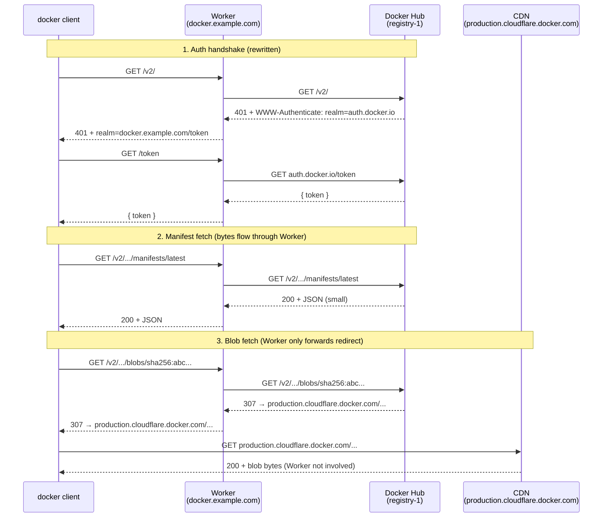

A pattern that surged in popularity after the [June 2024 collapse of China's public Docker mirrors](/posts/china-docker-mirror-collapse-and-bridge-nodes/): point a Cloudflare Worker at `registry-1.docker.io`, bind it to your own domain, and `docker pull` images through it. The canonical implementation is [`cloudflare-docker-proxy`](https://github.com/ciiiii/cloudflare-docker-proxy) and there are a dozen forks doing the same thing.

It works. Mostly. But the *how* and the *why it sometimes doesn't* are worth understanding before you bet a team's CI on it.

## What Cloudflare Workers is, in one paragraph

Cloudflare Workers is a serverless platform that runs JS/TS (and WASM-compiled languages) inside V8 isolates — the same sandbox Chrome uses for tabs — at 300+ edge data centers worldwide. Cold starts ~5ms, no filesystem, 128MB memory cap, 30s CPU time per request, free tier 100k requests/day. Tightly integrated with KV, Durable Objects, R2, D1, Queues. If your code is HTTP-in/HTTP-out and doesn't need a full Node runtime, Workers usually beats Lambda on latency by an order of magnitude.

That last sentence is what makes the Docker mirror trick possible.

## The basic setup

Map subdomains of a domain you control to upstream registries:

```
docker.example.com  → registry-1.docker.io
ghcr.example.com    → ghcr.io
quay.example.com    → quay.io
gcr.example.com     → gcr.io
```

Then `docker pull docker.example.com/library/nginx` routes through the Worker. The Worker speaks Docker Registry v2 to the client and to the upstream — translating auth challenges, rewriting `WWW-Authenticate` headers so the docker client comes back to *your* domain for tokens instead of going directly to `auth.docker.io`.

That last bit matters: without rewriting the auth challenge, the docker client would acquire its token directly from Docker Hub and then... still pull from your Worker, but the token-bearing requests would silently mismatch in subtle ways. So the Worker has to proxy the token endpoint too, or at minimum rewrite the realm URL.

## Why it fits in a 128MB Worker

The naive worry is "Workers has a 30s CPU limit and a response-size cap — how do you stream a 500MB image layer through it?" The answer: **you don't.** Docker Registry v2 splits traffic into two very different kinds of resources.

| Resource | Size | Behavior |
|---|---|---|
| **Manifests** | KB | JSON describing what layers an image contains. Worker proxies the bytes. |
| **Blobs** | MB to GB | The actual layer tarballs. Worker proxies a **redirect**, not the bytes. |

Docker Hub itself doesn't want to serve hundreds of MB through its registry frontend, so when you `GET /v2/library/nginx/blobs/sha256:abc...`, Docker Hub responds with a **307 Temporary Redirect** pointing to its CDN URL (`production.cloudflare.docker.com/...`). The Worker just forwards that 307 to the docker client, and the docker client follows it directly to the CDN.



The Worker is essentially a *translator* — it never sees the heavy bytes. That's why a 200MB layer doesn't blow the Worker's response-size limit or burn the subrequest budget, and it's why the free tier's 100k requests/day stretches further than you'd think (most of those requests are tiny manifest/auth calls, not bulk transfers).

## Does it cache?

By default: no, the Worker itself stores nothing.

But:

- **Cloudflare's edge cache** (a separate layer below Workers) may cache manifest responses based on `Cache-Control` headers. Manifests are tiny, so this is a latency win, not a bandwidth one.
- **Blobs are already cached** by virtue of going through Cloudflare's CDN directly. They're content-addressed by SHA, so once a blob is warm at a POP, every subsequent pull at that POP hits cache. You get this for free.
- **For a true private cache** (e.g., to keep working when Docker Hub is down, or to cache across upstream registries), bolt on **R2**: Worker checks R2 first, fetches from upstream on miss, writes back. That converts the routing proxy into a real pull-through cache. Not the default — you have to write it.

## The China problem: three connectivity hurdles

Here is where the honest part starts. People reach for this pattern *because* their region's Docker mirrors got blocked, but Cloudflare's reachability inside the GFW is not a solved problem either. The pattern is a **probabilistic** fix.

### Hurdle 1: `*.workers.dev` is effectively unusable from mainland China

The `workers.dev` apex has been DNS-poisoned and RST-injected for years. If you deploy a Worker and try to pull from `myproxy.username.workers.dev`, you'll hit timeouts or TCP resets from most Chinese ISPs.

**Always bind a custom domain.** The `workers.dev` URL is for testing only.

### Hurdle 2: Custom domain → overseas Cloudflare POPs, which are flaky

Cloudflare does have China POPs (via the JD Cloud partnership), but those are gated behind **Cloudflare's Enterprise plan + an ICP license** on your domain. Free / Pro / Business plans — which is what the Workers free tier runs on — route Chinese traffic to **overseas POPs**: usually Hong Kong, Tokyo, Singapore, or Los Angeles.

That means:

- DNS for your custom domain must not be poisoned. Avoid Chinese registrars that may pre-block; some operators report better luck with non-`.com` TLDs that aren't on routine blocklists.
- Cloudflare's foreign anycast IPs must be reachable. Most of the time they are. Latency to HK/Tokyo from China is 50–150ms when it works, hundreds of ms or full timeouts when the GFW throttles a /24 — which it does periodically, especially around sensitive dates.
- No ICP license is required (since you're not hitting mainland POPs). That's the whole point of this workaround — it sidesteps ICP at the cost of routing every request out and back over an international link.

### Hurdle 3: The blob redirect *also* points to Cloudflare

This is the catch most write-ups miss. Even if the Worker hop succeeds, the docker client then follows a 307 to `production.cloudflare.docker.com` — **which is also hosted on Cloudflare**. So one image pull involves *two* Cloudflare round-trips, both subject to the same GFW conditions. If Cloudflare is degraded today, both legs fail together.

### Workaround: rewrite the blob redirect

Robust variants of `cloudflare-docker-proxy` rewrite the 307 instead of passing it through, so the bytes come back through the Worker's own domain:

```text
Without rewrite (default):
  Docker Hub → "307 production.cloudflare.docker.com/..."
  Worker     → forwards as-is
  docker     → CDN (also Cloudflare, also GFW-subject)

With rewrite:
  Docker Hub → "307 production.cloudflare.docker.com/..."
  Worker     → rewrites to "307 docker.example.com/cf-blob/..."
  docker     → comes back to Worker
  Worker     → fetches blob upstream, streams it through (or caches in R2)
```

Costs of rewriting:

- ❌ You now pay Worker CPU + bandwidth for blob bytes.
- ❌ The 30s CPU limit and response-size limits become real risks on big layers.
- ❌ The 100k requests/day free tier burns fast.
- ✅ R2 in front amortizes the repeat-pull cost.
- ✅ Single POP path — if the Worker is reachable, the blob is reachable.

## What people actually do

| Use case | Pattern |
|---|---|
| **Personal / hobby pulls from home** | Plain Worker proxy on a custom domain. Works most of the time, fails occasionally, shrug. |
| **Team CI in China** | Don't make this the primary path. Run **Harbor** or **Nexus** on Aliyun/Tencent ECS as a pull-through cache, with the Worker configured as *one of several* upstreams — alongside Aliyun's container registry mirror, USTC's mirror, etc. The Worker is a fallback, not the hot path. |
| **Production** | Pay for Aliyun Container Registry's mirror, or self-host with images replicated in from outside via a build server you control. Don't put the GFW on your critical path. |

## The honest framing

The Cloudflare Worker mirror exists because it is the cheapest, easiest band-aid for "I just want `docker pull nginx` to work from my apartment in Shanghai." It is a [bridge node](/posts/china-docker-mirror-collapse-and-bridge-nodes/) — same mental model as the June 2024 collapse — and like all bridges across the GFW, it is load-bearing until it isn't. The moment Cloudflare's foreign POPs get throttled, every Worker-based Docker mirror in China degrades at once.

People who got burned by the June 2024 collapse tend to build **multiple** bridges — Worker + Aliyun mirror + self-hosted Harbor — rather than swapping one single point of failure for another. That's the lesson the original outage taught, and it applies just as much to its workarounds.

## TL;DR

- ✅ Cloudflare Worker as Docker mirror is **real** and **commonly used**.
- ✅ It works because Docker Hub returns redirects for blobs, so the Worker only handles auth + manifests — the heavy bytes flow CDN-to-client.
- ✅ It does **not** cache by default. The CDN does some of that job for you; R2 closes the rest of the gap if you write the code.
- ⚠️ From inside the GFW it is a **probabilistic** fix — `*.workers.dev` is blocked, custom domains hit foreign POPs which are intermittent, and the blob CDN is also Cloudflare.
- ⚠️ Use it as one bridge among many, not as the only bridge.
