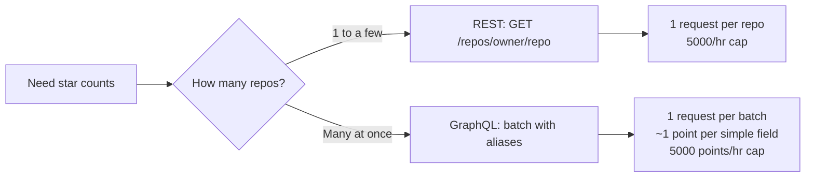

A common automation task is "how many stars does this repo (or these 50 repos) have right now?" GitHub exposes this through two APIs — REST and GraphQL — and the right choice depends on how many repos you're checking and how often.

## The simplest case: REST

REST gives you one endpoint per resource. For a repo:

```
GET https://api.github.com/repos/{owner}/{repo}
```

The response is the full repo object — name, description, license, fork count, and the field you want: `stargazers_count`.

```bash
curl -s https://api.github.com/repos/anthropics/claude-code \
  | jq .stargazers_count
```

That works without authentication, but unauthenticated calls are capped at **60 requests/hour per IP**. With a token in the `Authorization` header, the cap jumps to **5,000 requests/hour**.

## Getting a token

You have a few options. All produce a string you put in the `Authorization` header.

### Option 1: Fine-grained Personal Access Token (recommended)

1. Visit `https://github.com/settings/tokens?type=beta`
2. Click **Generate new token**
3. Set an expiration and choose repo access (all / selected / public-only)
4. For reading public repo metadata like star counts, you don't need to grant any extra permissions — public read is allowed by default
5. Click **Generate token** and copy it immediately (it's shown only once)

### Option 2: Classic Personal Access Token

1. Visit `https://github.com/settings/tokens`
2. Click **Generate new token (classic)**
3. Pick scopes — `public_repo` is enough for public reads; `repo` for private
4. Generate and copy

### Option 3: The `gh` CLI

If you have GitHub's CLI installed, the easiest path is:

```bash
gh auth login        # browser-based flow
gh auth token        # prints the token
export GH_TOKEN=$(gh auth token)
```

Or skip the raw token entirely — `gh api` handles auth for you:

```bash
gh api repos/anthropics/claude-code --jq .stargazers_count
```

### Using the token

```bash
export GH_TOKEN=<your-token>
curl -s -H "Authorization: Bearer $GH_TOKEN" \
  https://api.github.com/repos/anthropics/claude-code \
  | jq .stargazers_count
```

Store the token in a password manager or your shell environment — never commit it to a repo.

## The scale problem

Each REST call counts as one request. If you're tracking 5,000 repos, that's your entire hourly quota in a single sweep. For dashboards, leaderboards, or batch jobs, REST runs out of room fast.

This is where GraphQL becomes useful.

## What is GraphQL?

GraphQL is a query language for APIs, originally built by Facebook. It's an alternative to REST with a few core differences:

| | REST | GraphQL |
|---|---|---|
| Endpoints | Many (`/repos`, `/users`, `/issues`…) | Usually one (`/graphql`) |
| HTTP method | GET/POST/PUT/DELETE | Almost always POST |
| What you get | Whatever the endpoint returns | Exactly the fields you ask for |
| Combining data | Multiple round-trips | One query can fetch nested/related data |
| Versioning | `/v1/`, `/v2/` | Schema evolves; fields deprecated, not versioned |

The key shift: with REST the **server** decides what each endpoint returns. With GraphQL the **client** describes what it wants and the server returns only that. No wasted bytes, no extra round-trips for related data.

A minimal GraphQL query for a single repo's star count:

```graphql
{
  repository(owner: "anthropics", name: "claude-code") {
    stargazerCount
  }
}
```

Response:

```json
{ "data": { "repository": { "stargazerCount": 12345 } } }
```

## Batching many repos in one request

GraphQL supports **aliases** — letting you call the same field multiple times under different names in one query:

```graphql
{
  react:  repository(owner: "facebook",   name: "react")       { stargazerCount }
  vue:    repository(owner: "vuejs",      name: "vue")         { stargazerCount }
  linux:  repository(owner: "torvalds",   name: "linux")       { stargazerCount }
  claude: repository(owner: "anthropics", name: "claude-code") { stargazerCount }
}
```

Each alias becomes a key in the response. One HTTP call returns all four.

### curl, one-liner

```bash
curl -s -H "Authorization: bearer $GH_TOKEN" \
  -X POST https://api.github.com/graphql \
  -d '{"query":"{ react: repository(owner:\"facebook\", name:\"react\") { stargazerCount } linux: repository(owner:\"torvalds\", name:\"linux\") { stargazerCount } claude: repository(owner:\"anthropics\", name:\"claude-code\") { stargazerCount } }"}'
```

### curl, heredoc form (easier to edit as the query grows)

```bash
curl -s -H "Authorization: bearer $GH_TOKEN" \
  -X POST https://api.github.com/graphql \
  -d @- <<'EOF'
{
  "query": "{
    react:  repository(owner:\"facebook\",   name:\"react\")       { stargazerCount }
    vue:    repository(owner:\"vuejs\",      name:\"vue\")         { stargazerCount }
    svelte: repository(owner:\"sveltejs\",   name:\"svelte\")      { stargazerCount }
    linux:  repository(owner:\"torvalds\",   name:\"linux\")       { stargazerCount }
    claude: repository(owner:\"anthropics\", name:\"claude-code\") { stargazerCount }
  }"
}
EOF
```

### Pretty-print with jq

```bash
curl -s -H "Authorization: bearer $GH_TOKEN" \
  -X POST https://api.github.com/graphql \
  -d '{"query":"{ react: repository(owner:\"facebook\", name:\"react\") { stargazerCount } linux: repository(owner:\"torvalds\", name:\"linux\") { stargazerCount } }"}' \
  | jq .data
```

## Rate limits compared



- **REST**: 5,000 requests/hour with a token, 1 request per repo → ~5,000 repos/hour ceiling.
- **GraphQL**: 5,000 *points*/hour, but a simple `stargazerCount` query costs roughly 1 point regardless of how many aliases you pack in (up to GitHub's per-query node limit). Realistically tens of thousands of repos/hour.
- **Search API**: separate bucket, 30 requests/minute when authenticated.

You can always check your current budget:

```bash
curl -s -H "Authorization: Bearer $GH_TOKEN" https://api.github.com/rate_limit
```

The response breaks out REST, GraphQL, and search quotas separately.

## When to reach for which

- ✅ **One repo, occasionally** → REST. Simple, cacheable, no token strictly required.
- ✅ **A handful of repos, scripted** → REST with a token is fine.
- ✅ **Dozens to thousands of repos** → GraphQL with aliases. Single round-trip, light on quota.
- ✅ **Need more than 5,000/hr** → GitHub App installation tokens scale higher (5,000/hr per installation, up to ~15,000/hr depending on repo count).

## Tradeoffs of GraphQL itself

GraphQL isn't strictly better than REST — it's a different shape with different costs:

- ➕ Precise data shape, fewer round-trips, strongly typed schema (self-documenting via introspection)
- ➖ More complex server side, harder to cache (POST + dynamic shape), easier for clients to write accidentally expensive queries

For a "check N repos' stars" workload, the batching property alone makes GraphQL the right tool once N gets past a handful.
