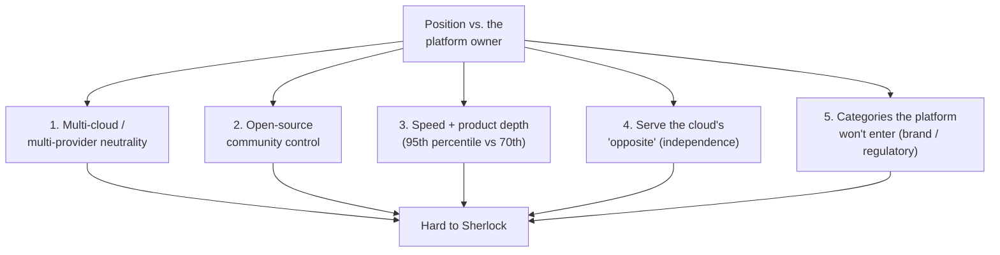

Every founder building an app on top of a foundation model wakes up to the same fear: **what if OpenAI / Anthropic / Google ships a free, better version of my product on Tuesday?**

Apple watchers call this **Sherlocking** — the platform owner cloning a third-party app into the OS. In the AI era it's a stronger threat than ever, because the foundation-model companies *already have the strongest possible model* and a giant distribution surface.

But this game has been played before. **SaaS-on-cloud has been a 15-year war against AWS, Azure, and GCP**, with clearly visible survivors and casualties. The patterns transfer almost mechanically to LLM-app startups. This post walks through the precedent, extracts the five structural moats that worked, then maps them onto the AI layer.

## The fear, stated precisely

You can phrase the worry in one sentence:

> If the layer underneath you is owned by a company that has more capital, more data, and a free distribution channel, what stops them from absorbing your slice?

For SaaS, "the layer underneath" is the hyperscaler. For LLM apps, it's the foundation-model lab. The shape is identical. So is the answer: **survival isn't about being smart or fast — it's about occupying a position the layer-owner is structurally unable or unwilling to occupy.**

## The SaaS-on-cloud scoreboard

A decade and a half of evidence:

### Survived (and thrived) ✅

| Company | What the cloud copied | Why it didn't die |
|---|---|---|
| **Snowflake** | AWS Redshift | Multi-cloud, extreme performance, data-sharing network effects |
| **MongoDB** | AWS DocumentDB (API-cloned) | Developer community, Atlas multi-cloud managed offering, faster product iteration |
| **Databricks** | AWS EMR, Azure Synapse | Owns the Spark/Delta Lake open-source community, cloud-neutral |
| **Datadog** | AWS CloudWatch | Cross-cloud observability, UX one generation ahead |
| **Confluent** | AWS MSK | Controls Kafka's open-source core and deep features |
| **HashiCorp** | every cloud's native IaC | Multi-cloud abstraction layer — clouds *need* it |

### Died or got mauled ❌

| Company | What happened |
|---|---|
| **Heroku** | Squeezed by AWS + Vercel + Render; stalled after Salesforce acquisition |
| **Parse** (Facebook) | Displaced by Firebase / AWS Amplify |
| **MapR** | Bankruptcy |
| **Cloudera** | Limp survival, taken private |
| **Elastic** | AWS forked it into OpenSearch; license change came too late |
| **Slack** | Nearly killed by Microsoft Teams; rescued by Salesforce acquisition |

Stare at the two lists long enough and a small set of moats emerges.

## The five structural patterns

### 1. Multi-cloud neutrality is a nuclear weapon 🚀

Snowflake, Databricks, Datadog, MongoDB Atlas, HashiCorp — every survivor in the top tier runs on **all three clouds**. They feed the single biggest fear of every enterprise CIO: *don't get locked into any one hyperscaler*.

This is the **structural weakness of the cloud's own offerings**: AWS will never help you move data to Azure. It can't, by definition. Anyone who can credibly bridge clouds occupies real estate the hyperscaler is physically incapable of building on.

> **AI parallel:** Tools that work across OpenAI / Anthropic / Google / open-source models — LangChain, LiteLLM, OpenRouter — sit in the equivalent slot. A product whose users can swap base models is, by construction, hard for any single foundation-model lab to kill.

### 2. Own the open-source center of gravity 🧲

Databricks owns Spark. Confluent owns Kafka. MongoDB owns Mongo. HashiCorp owns Terraform. The cloud can copy the API, but it cannot copy the committers, the conference, or the trust of the developer community.

The cautionary tale is **Elastic** — it didn't tighten its license in time, AWS forked it into OpenSearch, and the company's growth was permanently dented.

> **AI parallel:** Hugging Face occupies this slot — controlling the de facto registry for models, datasets, and evaluations. Anyone building a serious open project (eval framework, fine-tuning tooling, agent runtime) in a credible community is buying the same kind of insurance.

### 3. The "good enough" gap is a real moat 🏎️

Internally, hyperscalers have a phrase for what their managed services aim at: **"good enough."** They have to serve everyone — Fortune 500, hobbyist, regulated bank — so the product is 70th-percentile by design. A specialist can credibly hit 95th.

- **CloudWatch vs Datadog:** CloudWatch keeps shipping. Datadog stays two product generations ahead.
- **DocumentDB vs MongoDB Atlas:** API-compatible but ergonomically a tier below.

The precondition is brutal, though: **your domain must be deep enough that a single internal PM team at the hyperscaler can't catch up in a quarter.** If your roadmap fits on one slide, you are dead.

### 4. Serve the *opposite* of the platform 🔓

Some categories define themselves by *not* being the platform.

- **GitLab vs GitHub** — once Microsoft owned GitHub, "we are not Microsoft" became a real sales angle for self-hosted teams.
- **1Password / Bitwarden vs hyperscaler key management** — independence itself is the product.

Independence is a position the platform owner can never occupy without contradicting itself.

### 5. Categories where the platform won't enter 🚧

Some doors the hyperscalers structurally won't walk through:

- **Stripe vs AWS** — AWS does not want payments licensing, fraud liability, or the financial-regulator scrutiny that comes with being a money transmitter.
- **Twilio vs AWS** — global telco relationships and carrier compliance are out-of-scope for an infra company's brand and ops model.

The pattern is **business-model misalignment**, not capability. AWS *could* build these. It just won't.

## Mapping the framework onto LLM apps

The same five slots exist one layer up. Some are already being filled:

### Model-neutral middleware (pattern 1)

Anything that lets a customer **swap base models without changing tools** wins structural points. Cursor's early bet on multi-model support — rather than locking itself to one lab — is part of why it became defensible at all.

### Apps that own data and workflow gravity (pattern 3 + 4)

Notion AI doesn't need to beat ChatGPT at raw reasoning. It needs to beat *"open ChatGPT and paste this Notion page in"*. The user's notes already live in Notion; migration cost is enormous. Linear-with-AI beats a standalone "AI project manager" for the same reason.

**Rule of thumb:** if the AI is a feature *of* a product the user already lives in, it's safer than the same AI as a standalone product.

### The dirty work foundation labs won't touch (pattern 5)

Foundation-model companies have brand, regulatory, and PR constraints. They will *not* easily move into:

- 🔞 NSFW / borderline content (character.ai, AI companion apps)
- 🎵 Rights-sensitive UGC creator communities (Suno)
- ⚖️ Regulated verticals — legal contract review, medical imaging assist, tax/insurance — that need licensed humans in the loop
- 🧸 Physical hardware — AI toys, AI glasses, AI hearing aids, AI tutors
- 🌏 Deep regional localization — LatAm WhatsApp commerce bots, SEA local-language tooling

OpenAI doesn't want to fight content moderation lawsuits about teen chatbots. They don't want to hire lawyers. They don't ship hardware supply chains. These are real, durable gaps.

### The categories to avoid ⚠️

By the same framework, the dangerous categories are obvious:

- ❌ **General-purpose chatbots** — head-on with ChatGPT / Claude / Gemini. Unwinnable.
- ❌ **Generic writing or coding assistants** — Cursor squeaked through because of early timing and obsessive polish; do not assume you can repeat it.
- ❌ **"Wrapper + prompt template" apps** — one model upgrade and your moat evaporates. This is the **Beauty-Layer Trap**: prettier UI plus a few prompts isn't a business; it's a feature waiting to be absorbed.

## The Sherlock test

Single sharpest question to run any AI-app idea through:

> Tomorrow OpenAI ships a model that is 10× better and bundles a free official app that does exactly what you do.
> **Why does your user stay with you instead?**

The answers separate safe positions from unsafe ones:

| Answer | Verdict |
|---|---|
| "My prompts are better" | ☠️ |
| "My UI is nicer" | ☠️ |
| "Three years of their character cards / saved chats / community live here" | ✅ |
| "We're integrated into the customer's SAP and AD" | ✅ |
| "We hold the medical license / insurance billing relationship" | ✅ |
| "We're the physical toy their kid is bonded to" | ✅ |

If your answer is in the top half of the table, you are renting time before being absorbed.

## The Slack / Heroku trap when borrowing analogies

People reach for **"we'll be like Notion / Databricks / Slack on the foundation-model layer"**. Be precise about which analogy:

- **Slack** was *not* a winner. Microsoft Teams nearly killed it; Salesforce had to buy it. It's a cautionary tale, not a template.
- **Notion** survived because the *real* competitor was Microsoft Office / Google Workspace, not the cloud underneath it — AWS had no brand reason to build a docs app. The cloud was incidental.
- **Databricks** is the cleanest case: open-source community + multi-cloud neutrality + deep verticalization in data engineering.

When you say "we'll parasitize OpenAI's API like Notion parasitized AWS," ask:

1. Am I **provider-neutral** the way Databricks is?
2. Is what I'm doing **brand- or business-model-misaligned** with the labs the way docs were for AWS?
3. Do I own **assets outside the model** — data, community, UGC, brand, distribution, regulated relationships?

If three nos, the analogy is wishful.

## The time-window option ⏳

One final, underappreciated path: **even if the platform eventually eats you, you can still win.**

Jasper rode GPT-3 to tens of millions of dollars in marketing-copy revenue. ChatGPT then cratered its valuation. The founders, however, had already made their money. A startup that captures a real wedge for 18–24 months and then either pivots, exits, or harvests cash is a perfectly rational play — it just shouldn't be sold internally (or to investors) as a "forever" business.

Not every venture has to be Snowflake. A three-year, $10M-exit business is also a real outcome — provided you priced the foundation-model risk in from day one rather than discovering it on the way down.

## A practical exercise

The single most useful thing a founder thinking about an LLM app can do, in order:

- [ ] Pick 10–15 SaaS-on-cloud survivors and 10–15 casualties.
- [ ] For each: founding year, the hyperscaler product that tried to copy them, the year of attack, and which of the five patterns above the survivor occupied (or which the casualty failed to occupy).
- [ ] Read your own startup idea against the same five-column table.

That exercise will tell you more about your survival odds than any market-size deck. The AI layer is new; the *game* isn't.
