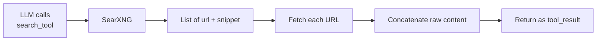
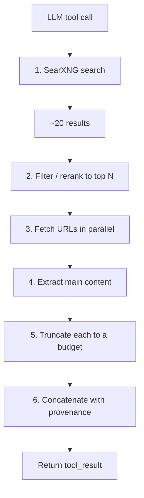

"LLM with web search" looks like a one-line feature in a demo. Underneath it is a small industry of unsolved sub-problems. This post walks from the bottom of that stack — SearXNG, a self-hostable metasearch engine — up to the strategic question every LLM-app startup eventually faces: build the pipeline or buy it.

## What SearXNG is

SearXNG is a free, open-source **metasearch engine**. It doesn't have its own index. Instead, when you give it a query, it queries other search engines (Google, Bing, DuckDuckGo, Brave, Wikipedia, Qwant, Mojeek, …) on your behalf, aggregates and deduplicates the results, and hands them back without tracking you.

Key properties:

- **Fork of searx**, actively maintained since ~2021.
- **Self-hostable** via Python or Docker; public instances live at [searx.space](https://searx.space).
- **Privacy-focused** — strips identifying headers, no cookies, no query logs by default.
- **~200+ engines** across web, images, videos, maps, science, files, and code.
- **Configurable** — pick which engines to query, weight them, blocklist domains.
- **JSON API** — append `&format=json` to get structured results without an API key.

That last point is why SearXNG quietly became a popular building block for local LLM stacks: it's a free, key-less search backend that returns parseable JSON.

## Why search engines don't ban it

If SearXNG sends queries to Google all day, why doesn't Google just block it? They try. It's a permanent cat-and-mouse game, and SearXNG mostly survives for five reasons:

1. **It looks like a browser, not a bot.** SearXNG scrapes public HTML with normal-looking User-Agent strings. A single request is indistinguishable from a human at google.com.
2. **Traffic is spread across many small instances.** Hundreds of public instances plus thousands of self-hosted ones, each sending a trickle from a different IP. No instance is big enough to be worth targeting.
3. **Engines rate-limit, they don't ban.** A busy public SearXNG will start getting CAPTCHAs from Google within hours. The operator rotates IPs, switches engines, or accepts degraded results.
4. **Most engines are permissive.** Bing, Brave, Mojeek, and Qwant tolerate scraping. DuckDuckGo is itself a metasearch layer. Wikipedia *encourages* programmatic access. Google is the strictest — many SearXNG instances disable Google by default.
5. **The legal route is closed.** Scraping public search results sits in a gray area (see *hiQ v. LinkedIn* in the US). Engines rely on technical countermeasures, not lawsuits against decentralized open-source projects.

The honest answer: engines *do* fight back, but blocking a decentralized swarm of self-hosters with rotating IPs is whack-a-mole. The cost of perfect enforcement exceeds the benefit.

## What SearXNG returns

Two output formats, depending on how you ask.

**HTML** — the web UI, rendered like a normal search results page.

**JSON** — what programs use. `GET /search?q=rust+borrow+checker&format=json` returns:

```json
{
  "query": "rust borrow checker",
  "results": [
    {
      "url": "https://doc.rust-lang.org/book/ch04-02-references-and-borrowing.html",
      "title": "References and Borrowing - The Rust Programming Language",
      "content": "The borrow checker compares scopes to determine that all borrows are valid...",
      "engine": "google",
      "engines": ["google", "duckduckgo"],
      "score": 4.5,
      "category": "general",
      "publishedDate": null
    }
  ],
  "answers": [],
  "corrections": [],
  "infoboxes": [{ "infobox": "Rust", "content": "...", "urls": [] }],
  "suggestions": ["rust ownership", "rust lifetimes"],
  "unresponsive_engines": []
}
```

Key fields:

| Field | Meaning |
|---|---|
| `results` | Merged, deduplicated list. Each entry has `url`, `title`, `content` (snippet), engine(s), score. |
| `infoboxes` | Wikipedia-style summary cards. |
| `answers` | Direct answers — calculator results, unit conversions. |
| `suggestions` | Related queries. |
| `unresponsive_engines` | Useful for debugging — which engines timed out or got blocked. |

**What SearXNG does not give you:**

- Full page content. Snippets are ~150–300 characters, often cut mid-sentence.
- A meaningful ranking signal — `score` is just SearXNG's internal merge weight.
- Anything past the first match on a page.

That last gap is the whole problem.

## The naive LLM pipeline

A natural first design for "give my LLM web search":



The shape is right. Every step in the middle hides difficulty.

### The refined pipeline



What each added step is for:

- **Filter before fetching** — SearXNG returns 20+ results. Fetching them all wastes time and bloats context. Take top 5–8 by score, or run a cheap BM25 / cross-encoder rerank.
- **Per-page truncation** — if one page is a 50k-token Wikipedia article and another is a 500-token blog post, the long one drowns out everything else. Cap each page at 1–3k tokens *before* concatenating.
- **Provenance formatting** — don't glue text together. Number each source so the LLM can cite it:

  ```
  [1] https://example.com/foo
      Title: Foo Explained
      <extracted text, truncated>

  [2] https://other.com/bar
      ...
  ```

  Then in the system prompt: *"Cite sources with [N] when answering."*

## Why each step is harder than it looks

| Step | What can go wrong | Mitigation |
|---|---|---|
| Search | Engines rate-limit or CAPTCHA your IP | IP rotation, disable Google, fall back to permissive engines |
| Fetch | Slow site hangs the whole tool call | Per-URL timeout (5–10s), parallel fetches, drop slow ones |
| Fetch | JS-rendered SPA returns empty shell | Headless browser fallback (Playwright) — expensive, slow |
| Fetch | Paywalled news / login walls | Try archive.org or archive.ph; for social media (TikTok, Instagram, X, LinkedIn) — mostly unsolved without official APIs |
| Fetch | Cloudflare / bot detection | curl-impersonate, residential proxies |
| Extract | Nav, ads, footers leak into "content" | `trafilatura`, `readability-lxml`, Mozilla's `readability.js` |
| Extract | PDFs and other binaries | Separate extractor (pdfplumber, unstructured) |
| Truncate | Naive head-cut loses the answer if it's in section 5 of 12 | Chunk + embed + rerank → keep most relevant chunks |
| Truncate | One huge page eats the context | Per-page token cap |
| Truncate | Important context lost no matter where you cut | LLM-as-extractor: cheap model summarizes each page first |
| Merge | Same domain dominates results | Per-domain cap (max 2 per site) |
| Merge | LLM doesn't cite anywhere | Number sources, prompt for `[N]` citations |

The truncation problem is the most interesting one. Real solutions:

1. **Chunk + embed + rerank.** Split each page into 500-token chunks, embed them, rerank against the query, keep top K. RAG-over-fetched-pages. Most quality pipelines do this.
2. **LLM-as-extractor (two-pass).** For each fetched page, run a cheap model with the prompt: *"Given this query and this page, extract the relevant facts in <500 tokens."* Then feed those distillations to the main model. Slower, much higher signal.
3. **Structural truncation.** If the page has headings, keep the section whose heading best matches the query. Works surprisingly well for docs, Wikipedia, Stack Overflow.
4. **Stop being clever — fetch more, truncate less.** Modern long-context models can swallow 50k+ tokens per page. Sometimes the right answer is to feed the whole page. Costs more, but quality jumps.

## Tavily: what changes when you buy the pipeline

Tavily is a search API designed specifically for LLM use. Same query, same shape — but the pipeline collapses.

`POST /search` with `include_raw_content=true, include_answer=true`:

```json
{
  "query": "what is the rust borrow checker",
  "answer": "The Rust borrow checker is a compile-time mechanism that enforces ownership and borrowing rules. It ensures references are always valid by tracking lifetimes and preventing data races, dangling pointers, and use-after-free bugs without runtime overhead.",
  "results": [
    {
      "url": "https://doc.rust-lang.org/book/ch04-02-references-and-borrowing.html",
      "title": "References and Borrowing - The Rust Programming Language",
      "content": "At any given time, you can have either one mutable reference or any number of immutable references...",
      "raw_content": "## References and Borrowing\n\nThe issue with the tuple code...\n\n[full extracted markdown, ~5–20k chars]",
      "score": 0.94
    }
  ],
  "response_time": 1.8
}
```

### Side-by-side

| | SearXNG | Tavily |
|---|---|---|
| URL list | ✅ | ✅ |
| Title | ✅ | ✅ |
| Snippet | ~150–300 chars, raw | ~500–1000 chars, query-relevant |
| Full page content | ❌ (you fetch yourself) | ✅ via `include_raw_content` |
| Pre-cleaned (no nav/ads) | ❌ | ✅ |
| Handles JS-rendered pages | ❌ | ✅ |
| Synthesized answer | ❌ | ✅ via `include_answer` |
| Score meaning | merge weight | LLM-relevance |
| Domain filter | per-engine config | `include_domains` / `exclude_domains` |
| Topic mode | ❌ | `topic: "news"` boosts fresh results |
| Rate limits | depends on engines / your IPs | 1k/mo free, paid above |
| Bans / CAPTCHAs | your problem | their problem |

### In code

**SearXNG path** — you write the rest yourself:

```python
results = searxng_search(q)              # snippets only
pages = await fetch_all([r.url for r in results[:5]])
texts = [trafilatura.extract(p) for p in pages]
truncated = [t[:8000] for t in texts]
context = format_with_citations(results, truncated)
```

**Tavily path** — three lines:

```python
r = tavily.search(q, include_raw_content=True, max_results=5)
context = "\n\n".join(
    f"[{i}] {x['url']}\n{x['raw_content'][:8000]}"
    for i, x in enumerate(r["results"], 1)
)
```

Tavily collapses three pipeline stages (fetch, extract, format) into a single HTTP call. It isn't magic — it'll still miss content on heavy SPAs or return empty for paywalls — but the failure rate is much lower than rolling your own.

## Build vs buy: the startup calculus

For most LLM projects there are three tiers:

| Tier | Stack | When |
|---|---|---|
| **Hobbyist** | SearXNG + trafilatura + head-truncate | Personal tools, learning, low traffic |
| **Serious** | Paid search API + Firecrawl/Jina + rerank | Real product, want it to just work |
| **Frontier** | Custom crawl + headless fleet + LLM extraction + caching | Perplexity-tier, the pipeline *is* the moat |

For a startup shipping an LLM app where search is a feature (not the whole product), the answer is almost always tier 2. The math:

- **Cost is trivial vs. engineering time.** Tavily ~$0.008/search, Jina Reader cheap/free at small scale, Firecrawl ~$20–100/mo. A founder-month costs $15k+; you'd burn that just keeping SearXNG un-banned.
- **It's undifferentiated heavy lifting.** Users don't care whether you scraped the page or Tavily did. They care whether your product helps them.
- **You may not even need two APIs.** Tavily's `/search` returns extracted content inline; Exa's `searchAndContents` does the same. The pipeline becomes three lines.

### What you give up vs. Perplexity

- **Freshness.** Perplexity crawls their own index; Tavily/Exa lag by minutes-to-hours on breaking news.
- **Ranking on hard queries.** Perplexity has rerankers tuned on real user signal. You'll do well on common queries, worse on weird ones.
- **Cost at scale.** Per-search pricing adds up at 10M queries/month. That's a good problem to have.
- **Niche domains.** Academic papers, code, legal — specialist APIs (Semantic Scholar, GitHub code search) beat general search.

### When the "buy" answer flips

Revisit build-vs-buy when:

- **Web search IS the product** (you're building Perplexity, not building *with* search) — the pipeline is your moat. Build it.
- **>100k searches/day** — economics start favoring own infrastructure.
- **You need data the APIs don't have** — customer internal wikis, niche industry data.
- **Offline / on-prem** — regulated customers can't depend on a SaaS search API.

### The pragmatic 2026 startup stack

```text
Tavily (search + content)
   ├─ fallback: Jina Reader for stubborn URLs
   ├─ fallback: archive.ph for paywalls
   └─ cache: Redis, 24h TTL on (query → results) and (url → content)

LLM: Claude / GPT, structured tool-calling
```

That gets a working product in days instead of months, and it'll be ~80% as good as one built over a year. Spend the saved time finding product-market fit; come back to the pipeline only when scale or differentiation demand it.

## The phrase to hold onto

**Undifferentiated heavy lifting.** AWS coined it for infrastructure; it applies cleanly here. Search-and-fetch is plumbing. Don't build plumbing unless plumbing is the product.

SearXNG is a great learning tool, a great personal stack, and a great fallback. For a startup whose value is *what the LLM does with the search results*, buying the pipeline isn't a shortcut — it's the correct allocation of attention.
