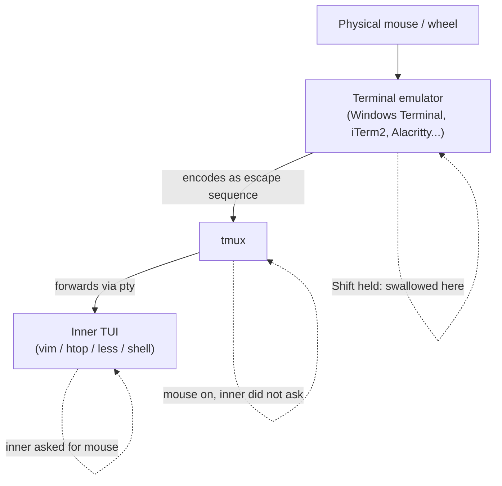

Out of the box, scrolling back through history in tmux is famously awkward: press `Ctrl+b`, then `[`, then arrow keys or `PageUp`, then `q` to leave. Almost everyone eventually adds `set -g mouse on` to `~/.tmux.conf` and forgets it ever hurt.

But that one line opens a real question: if tmux is now grabbing mouse events, what happens when the TUI inside the pane — vim, htop, less — *also* wants the mouse? Who wins? And what does holding `Shift` while you click actually do?

The mental model below is the part that's worth remembering. Everything else (key bindings, scroll-back size, vi-mode) is just config trivia you can copy from any tmux cheat sheet.

## The painful default, and the one-line escape

By default tmux ships with `mouse off`. Scrolling back means entering copy mode:

| Step                  | Keys                                  |
| --------------------- | ------------------------------------- |
| Enter copy mode       | `Ctrl+b` then `[`                     |
| Scroll line / page    | `↑` `↓` / `PageUp` `PageDown`         |
| Search (vi-mode)      | `/` forward, `?` backward             |
| Leave                 | `q` or `Esc`                          |

Useful to know it exists. Most people then add one line and never touch it again:

```conf
# ~/.tmux.conf
set -g mouse on
```

After that, the wheel just scrolls. The interesting question is what `mouse on` actually *does* to event flow.

## The three-layer stack

Your physical mouse event has to travel through three programs before anything visible happens:



Each layer can either **swallow** the event (act on it itself), **forward** it (encode and pass down), or simply not care. The rules for who swallows are not a free-for-all — they're driven by explicit opt-in.

## How the inner TUI "asks" for the mouse

The handshake is just escape sequences. When vim, htop, less, or mc starts and wants mouse input, it writes something like `\e[?1000h` (basic mouse tracking), `\e[?1002h` (drag tracking), or `\e[?1006h` (SGR extended coordinates) to its stdout. tmux sees these on the pane's pty and remembers: "this pane wants mouse events." From then on, tmux **passes mouse events through** to that pane instead of acting on them.

When the program exits (or sends the corresponding `l` sequence to disable), tmux goes back to handling the mouse itself.

This is why the answer is never "tmux always wins" or "the inner program always wins" — it's a per-pane, per-moment negotiation.

## The four cases

That gives a clean table for what actually happens on a click or scroll:

| tmux mouse | Inner TUI asked for mouse? | Who handles the event |
| ---------- | -------------------------- | --------------------- |
| `off` (default) | n/a                  | Event passes through tmux untouched; inner TUI gets it if it wants it, otherwise nothing happens |
| `on`       | No                         | **tmux** — pane selection, resize, scroll into copy mode |
| `on`       | Yes                        | **Inner TUI** — tmux forwards the event |
| any        | any, but `Shift` is held   | **Terminal emulator** — swallowed at the top, never encoded |

The Shift row is the one that surprises people, so it's worth zooming in.

## What `Shift` actually does

A terminal emulator usually behaves as a *courier*: it sees your mouse event, encodes it as an escape sequence, and pipes it down to whatever's running. tmux and the inner TUI fight over what to do with it.

Hold `Shift`, and the courier decides this event is "the user talking to *me*, the terminal window." It uses the click to select text, the wheel to scroll its own scrollback buffer, etc. — and **does not encode or forward anything**. tmux never sees it. The inner TUI never sees it.

That's why `Shift+drag` is the universal "let me just copy text like a normal terminal" gesture inside tmux: you're cutting off the event at layer one.

Windows Terminal, iTerm2, GNOME Terminal, Alacritty, Kitty — all of them implement this. It's a terminal-emulator feature, not a tmux feature.

## Common traps

A few sharp edges that have nothing to do with the model itself but trip people up:

- ✅ **Vim's default is `set mouse=`** — empty, i.e. no mouse. So even with `set -g mouse on` in tmux, scrolling inside vim still gets caught by tmux and dumps you into copy mode. Add `set mouse=a` to `~/.vimrc` and vim will claim the mouse properly.
- ✅ **Programs that don't use the alternate screen** (`tail -f`, plain command output, the shell prompt itself) never declare mouse interest. The wheel always belongs to tmux there. That's expected, not a bug.
- ✅ **tmux < 2.1 had a different config surface** (`mode-mouse`, `mouse-select-pane`, `mouse-resize-pane`, `mouse-select-window`). Old blog posts still recommend those. Run `tmux -V` first; on anything modern, only `set -g mouse on` is needed.
- ✅ **Scrollback length** defaults to 2000 lines. Bump it with `set -g history-limit 50000` if you regularly lose output past the top.

## A minimal "actually nice" config

Putting it together, this is roughly what most people land on:

```conf
# ~/.tmux.conf
set -g mouse on
set -g history-limit 50000
setw -g mode-keys vi

# optional: PageUp drops straight into copy mode and scrolls one page
bind -n PageUp copy-mode -u
```

And inside vim:

```vim
" ~/.vimrc
set mouse=a
```

That's it. The model — terminal emulator on top, tmux in the middle, inner TUI at the bottom, with `Shift` as the emergency eject — is the only thing worth memorizing. Once it's internalized, surprising behavior usually answers itself: *some layer is silently swallowing the event; which one, and why?*

## TL;DR

- 🖱️ **`mouse off`** (default): tmux is invisible to mouse events. Inner TUI gets them if it wants them.
- 🖱️ **`mouse on` + inner TUI silent**: tmux handles it.
- 🖱️ **`mouse on` + inner TUI declared mouse via `\e[?100xh`**: tmux forwards to the TUI.
- 🖱️ **`Shift` held**: terminal emulator eats it; nothing downstream sees it.
