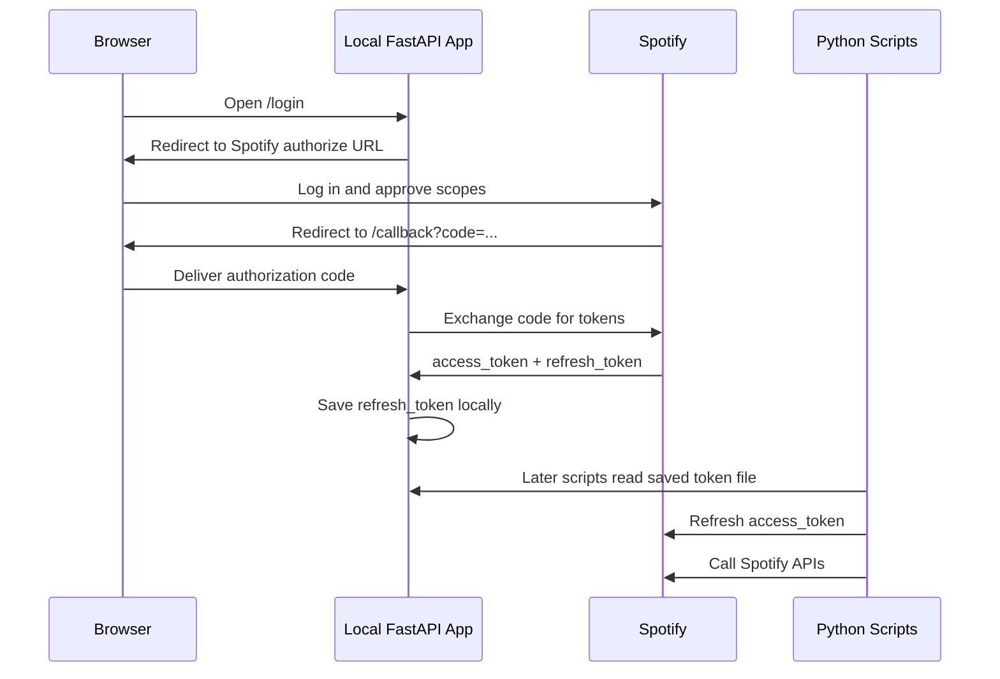

OAuth is easiest to understand when it stops being only a diagram and becomes a small thing you can run. Spotify is a good playground for that: the API is real, the scopes matter, the browser login is visible, and the reward is tangible - a playlist appears in your account.

This post describes a practical learning path: use a FastAPI app to handle the browser part of Spotify OAuth once, save the refresh token locally, then use normal Python scripts to inspect the Spotify Web API and create playlists from song lists.

## The Core Idea

In modern app development, when people say "OAuth", they usually mean the OAuth 2.0 family of flows. For this project, the relevant flow is the **Authorization Code Flow**:



The important part is what your app does **not** do: it never asks for the Spotify password. Spotify handles login. Your app receives a temporary authorization code and exchanges that code for tokens.

## Why Spotify Is a Good OAuth Example

Spotify is useful for learning because it gives you multiple OAuth concepts in one place:

| Concept | What Spotify Shows |
|---|---|
| Redirect URI | Spotify sends the browser back to your local callback URL |
| Authorization code | The callback URL includes a temporary `code` |
| Scopes | Playlist creation requires playlist-related permissions |
| Access token | API calls use `Authorization: Bearer ...` |
| Refresh token | Scripts can get fresh access tokens later |
| Resource API | Search, create playlist, and add tracks are normal HTTP calls |

The feedback loop is also nice. When the flow works, you can see a real playlist created in Spotify.

## The First Milestone: Browser Login

The hard part of OAuth is the browser redirect. A local FastAPI app is a clean way to learn it.

The app needs routes like:

```text
GET /
GET /login
GET /callback
GET /me
```

`GET /login` redirects the browser to Spotify:

```text
https://accounts.spotify.com/authorize
```

with parameters such as:

```text
response_type=code
client_id=...
redirect_uri=http://127.0.0.1:8888/callback
scope=playlist-modify-private playlist-modify-public user-read-private user-read-email
state=random_value
```

After the user approves access, Spotify redirects back:

```text
http://127.0.0.1:8888/callback?code=...&state=...
```

The `code` in that URL is not the access token. It is a temporary value. The backend exchanges it for tokens:

```http
POST https://accounts.spotify.com/api/token
```

The response includes an access token and, usually on the first consent, a refresh token:

```json
{
  "access_token": "...",
  "token_type": "Bearer",
  "expires_in": 3600,
  "refresh_token": "..."
}
```

The access token is short-lived. For Spotify, it lasts about one hour. The refresh token is the piece that makes this useful for future scripts.

## Why Save the Refresh Token?

For learning, it is tempting to do everything inside the web server: log in, search tracks, create playlist, done.

That works, but it hides the best learning surface. If the goal is to understand Spotify's API data structures, it is better to separate the flow:

```text
FastAPI server: handle browser OAuth once
Python scripts: use refresh token, call APIs, print data, create playlists
```

That means the callback should save a local ignored file:

```text
.spotify-token.json
```

with only the sensitive long-lived credential:

```json
{
  "refresh_token": "..."
}
```

This file should never be committed. It belongs next to `.env` and local song lists in `.gitignore`.

## The Script-Based Workflow

Once the refresh token exists, later scripts can follow this shape:

```text
read .spotify-token.json
read .env for client_id/client_secret
POST refresh_token to Spotify token endpoint
receive fresh access_token
call Spotify APIs
print or inspect JSON
create playlists
```

That gives a much better learning loop:

1. Run a small script.
2. Inspect the raw Spotify JSON.
3. Adjust the query.
4. Print the fields that matter.
5. Build playlist logic after the data structure is clear.

The web server remains useful, but only as the OAuth bootstrapper.

## Searching Songs

A practical song list can start simple:

```text
Queen - Bohemian Rhapsody
Michael Jackson - Billie Jean
Nirvana - Smells Like Teen Spirit
The Beatles - Hey Jude
```

A script can translate each line into a Spotify search query:

```text
track:"Bohemian Rhapsody" artist:"Queen"
```

Then call:

```http
GET https://api.spotify.com/v1/search?q=...&type=track&limit=1
```

The useful value from a matched track is the Spotify URI:

```text
spotify:track:...
```

That URI is what the playlist API accepts when adding tracks.

## Creating Playlists

Spotify's current Development Mode API uses:

```http
POST https://api.spotify.com/v1/me/playlists
```

to create a playlist for the current user, and:

```http
POST https://api.spotify.com/v1/playlists/{playlist_id}/items
```

to add tracks.

The older `POST /users/{user_id}/playlists` endpoint is not the one to use for this learning flow now. This is a good reminder that OAuth and API learning are slightly different things: OAuth gets the token, but each API still has its own current rules.

## What To Store and What Not To Store

For a local learning project:

| File | Store? | Commit? |
|---|---:|---:|
| `.env` | Client ID, client secret, redirect URI | No |
| `.spotify-token.json` | Refresh token | No |
| `songs.txt` | Personal song list | No |
| `.env.example` | Placeholder names only | Yes |
| `songs.example.txt` | Example songs only | Yes |

The refresh token is sensitive. Treat it like a password for delegated Spotify access. If it leaks, revoke the app's access in Spotify and generate a new one by logging in again.

## The Learning Path I Like

The cleanest path is incremental:

1. Build the FastAPI login route.
2. Build the callback route.
3. Exchange the authorization code for tokens.
4. Call `/me` to verify the access token.
5. Save the refresh token locally.
6. Write a script that turns the refresh token into a fresh access token.
7. Write tiny inspection scripts for `/me`, search, albums, tracks, playlists.
8. Create a playlist from `songs.txt`.
9. Print unmatched songs instead of silently ignoring them.

This order keeps OAuth understandable. First, learn the browser handoff. Then learn token refresh. Then explore the API like normal Python.

## Takeaway

OAuth feels complicated because it mixes browser navigation, backend token exchange, security rules, and API calls. Splitting the project into two pieces makes it much easier:

- FastAPI handles the one-time OAuth redirect flow.
- Python scripts use the saved refresh token to explore Spotify and create playlists.

That separation turns OAuth from a mysterious login ritual into a reusable doorway: once the refresh token is saved safely, the rest is just HTTP, JSON, and Python.

## References

- Spotify Authorization Code Flow: https://developer.spotify.com/documentation/web-api/tutorials/code-flow
- Spotify Refreshing Tokens: https://developer.spotify.com/documentation/web-api/tutorials/refreshing-tokens
- Spotify Search API: https://developer.spotify.com/documentation/web-api/reference/search
- Spotify Create Playlist API: https://developer.spotify.com/documentation/web-api/reference/create-playlist
- Spotify Add Items to Playlist API: https://developer.spotify.com/documentation/web-api/reference/add-items-to-playlist
- Spotify February 2026 Web API changes: https://developer.spotify.com/documentation/web-api/references/changes/february-2026
