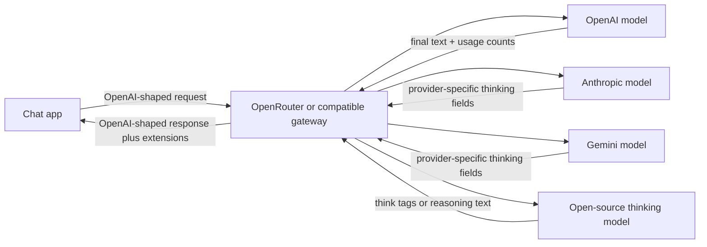

## The short answer

"Reasoning" in an LLM API can mean three different things:

1. A **request control**, such as `reasoning_effort`, that tells the model how much internal problem-solving budget to spend.
2. **Hidden reasoning tokens**, which count toward token usage and latency but are not returned as readable text.
3. **Visible reasoning content**, which some providers and gateways return in fields such as `reasoning`, `reasoning_content`, or `reasoning_details`.

Those meanings often get mixed together because many services use an OpenAI-compatible API shape. The wire format looks familiar, but the semantics are not identical across providers.

## The common OpenAI-shaped chat call

Most LLM clients understand this shape:

```json
{
  "model": "some-model",
  "messages": [
    { "role": "user", "content": "Explain why this test fails." }
  ]
}
```

The non-streaming response usually looks like this:

```json
{
  "id": "chatcmpl_...",
  "object": "chat.completion",
  "model": "some-model",
  "choices": [
    {
      "index": 0,
      "message": {
        "role": "assistant",
        "content": "The final answer."
      },
      "finish_reason": "stop"
    }
  ],
  "usage": {
    "prompt_tokens": 100,
    "completion_tokens": 200,
    "total_tokens": 300
  }
}
```

The important path is:

```js
response.choices[0].message.content
```

That is the assistant's visible answer. But reasoning-capable models add a wrinkle: the model may spend tokens internally before producing that answer.

## Reasoning as a control knob

OpenAI's Chat Completions API exposes a `reasoning_effort` parameter for supported reasoning models:

```json
{
  "model": "gpt-5.5",
  "messages": [
    { "role": "user", "content": "Find the bug in this concurrent queue." }
  ],
  "reasoning_effort": "high"
}
```

Conceptually, this is a tradeoff knob:

| Effort | Practical use |
|---|---|
| `none` | Simple classification, routing, or short factual replies where latency matters most. |
| `minimal` / `low` | Light reasoning with better speed and lower cost. |
| `medium` | Balanced default for many tasks. |
| `high` | Hard debugging, planning, math, code review, or multi-step analysis. |
| `xhigh` | Deep agentic work where quality matters more than latency or cost. |

This is not the same as `temperature`. Temperature affects randomness. Reasoning effort affects how much internal problem-solving work the model is allowed to do.

One easy mistake is setting the output limit too low. In Chat Completions, `max_completion_tokens` is an upper bound over both visible answer tokens and reasoning tokens. A model can spend part of that budget thinking, then have too little room left for the visible answer.

## Hidden reasoning tokens

When a reasoning-capable model thinks internally, those internal tokens can show up in usage accounting:

```json
{
  "usage": {
    "completion_tokens_details": {
      "reasoning_tokens": 123
    }
  }
}
```

That number means "the model used some internal reasoning budget." It does not mean the API returned the raw chain of thought.

With OpenAI's official API, the ordinary Chat Completions response gives you the final answer in `choices[].message.content`, plus token accounting. The raw reasoning text is not returned. OpenAI's newer Responses API can expose reasoning summaries for supported models when configured, but that is still different from returning the model's private raw chain of thought.

## Visible reasoning content

OpenRouter shows why this topic gets confusing.

OpenRouter provides an OpenAI-compatible API, so many apps can connect by changing the `base_url` and API key. But OpenRouter is also a gateway across many model providers, and it normalizes provider-specific features. For models that expose thinking tokens, OpenRouter can return reasoning text in additional fields such as:

```json
{
  "choices": [
    {
      "message": {
        "role": "assistant",
        "reasoning": "The model's visible thinking text.",
        "content": "The final answer."
      }
    }
  ]
}
```

or, for richer structured output:

```json
{
  "choices": [
    {
      "message": {
        "role": "assistant",
        "reasoning_details": [
          {
            "type": "reasoning.text",
            "text": "A reasoning segment."
          }
        ],
        "content": "The final answer."
      }
    }
  ]
}
```

An app can display that extra field in a collapsible "thinking" section. That does not contradict OpenAI's official behavior. It means the gateway or underlying provider returned more than the base OpenAI Chat Completions object.

## Compatibility does not mean identity

The phrase "OpenAI-compatible" usually means:

- same endpoint style, such as `/v1/chat/completions`
- same core request fields, such as `model`, `messages`, `temperature`, `stream`, and `tools`
- same core response path, such as `choices[0].message.content`

It does not mean every provider has the same feature semantics.



JSON clients usually tolerate extra fields. A strict OpenAI client may ignore them. A richer chat frontend may render them.

## Why some apps show the thought process

If an app connected through a gateway shows a "reasoning" panel, one of four things is usually happening:

1. The underlying model explicitly returned visible thinking tokens.
2. The gateway normalized native provider fields into `message.reasoning` or `message.reasoning_details`.
3. The model emitted text such as `<think>...</think>`, and the app split it out of the final answer.
4. The API returned a summary-like reasoning object rather than raw hidden reasoning.

The key question is not "is the API OpenAI-compatible?" The useful question is "which extra fields does this provider return, and does the app display them?"

## Streaming makes this more visible

In streaming mode, final answer text usually arrives as deltas:

```json
{
  "choices": [
    {
      "delta": {
        "content": "partial answer"
      }
    }
  ]
}
```

Gateways that expose reasoning may stream reasoning deltas separately:

```json
{
  "choices": [
    {
      "delta": {
        "reasoning": "partial thinking"
      }
    }
  ]
}
```

or:

```json
{
  "choices": [
    {
      "delta": {
        "reasoning_details": [
          { "type": "reasoning.text", "text": "partial thinking" }
        ]
      }
    }
  ]
}
```

This is why two apps can call "the same kind" of chat endpoint and appear to behave differently. One app ignores the reasoning deltas. Another app turns them into a visible panel.

## API design advice

If you are building a multi-provider LLM app, treat reasoning as an optional capability, not a guaranteed part of the base chat schema.

Use a normalized internal shape:

```ts
type LlmMessage = {
  role: "assistant" | "user" | "system" | "developer" | "tool";
  content: string;
  reasoning?: string;
  reasoningDetails?: unknown[];
  usage?: {
    inputTokens?: number;
    outputTokens?: number;
    reasoningTokens?: number;
  };
};
```

Then map each provider into that shape:

| Provider style | What to store |
|---|---|
| OpenAI Chat Completions | `content`, usage counts, possibly `reasoningTokens` |
| OpenAI Responses API with summaries | final output plus reasoning summary items, when requested |
| OpenRouter | `content`, `reasoning`, and/or `reasoning_details` if present |
| Models that emit `<think>` | parse cautiously, then store visible thinking separately from final content |
| Providers with no reasoning field | leave `reasoning` empty |

Do not assume visible reasoning is always available. Do not assume visible reasoning is always raw chain of thought. Do not assume hidden reasoning token counts explain the quality of a single response.

## User-facing product choices

A good UI should make reasoning display explicit:

- Show the final answer by default.
- Put visible reasoning in a collapsed section.
- Label it as "reasoning", "thinking", or "model trace" rather than "truth".
- Provide a setting to hide reasoning text when it is noisy or sensitive.
- Keep token usage visible for debugging cost and latency.

For API controls, expose simple presets:

| UI preset | API mapping |
|---|---|
| Fast | low effort, low max reasoning budget, or reasoning excluded |
| Balanced | medium effort |
| Deep | high effort, larger token budget |
| Hide thinking | request reasoning exclusion when the gateway supports it |

OpenRouter, for example, supports a `reasoning` configuration object that can control effort, token budget, whether reasoning is enabled, and whether reasoning is excluded from the response.

```json
{
  "model": "some-reasoning-model",
  "messages": [
    { "role": "user", "content": "Solve this carefully." }
  ],
  "reasoning": {
    "effort": "high",
    "exclude": true
  }
}
```

## The mental model

Reasoning in LLM APIs is not one feature. It is a layer stack:

| Layer | Example | Returned as text? |
|---|---|---|
| Control | `reasoning_effort: "high"` | No |
| Accounting | `reasoning_tokens: 123` | No, just a count |
| Summary | reasoning summary items | Sometimes |
| Visible thinking | `message.reasoning` | Yes, provider/gateway dependent |
| Final answer | `message.content` | Yes |

Once you separate those layers, the apparent contradiction disappears. OpenAI can hide raw reasoning while still reporting reasoning token counts. OpenRouter can speak the OpenAI-style chat format while adding visible reasoning fields for models that expose them. A frontend can choose whether to display those fields.

The API shape is the envelope. The reasoning behavior is the letter inside, and different providers put different things in it.

## Sources

- [OpenAI Chat Completions API reference](https://platform.openai.com/docs/api-reference/chat/create)
- [OpenAI reasoning guide](https://developers.openai.com/api/docs/guides/reasoning)
- [OpenRouter reasoning tokens documentation](https://openrouter.ai/docs/guides/best-practices/reasoning-tokens)
- [OpenRouter API reference overview](https://openrouter.ai/docs/api/reference/overview)
