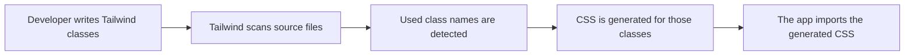

Tailwind CSS can feel strange at first because it changes where styling happens. Instead of writing a custom CSS class like `.primary-button` and then attaching that class to an element, you compose the design directly in the markup with small utility classes.

```html
<button class="bg-blue-600 text-white px-4 py-2 rounded hover:bg-blue-700">
  Save
</button>
```

Each class does one focused job:

| Class | Meaning |
| --- | --- |
| `bg-blue-600` | Sets the background color |
| `text-white` | Sets the text color |
| `px-4` | Adds horizontal padding |
| `py-2` | Adds vertical padding |
| `rounded` | Adds border radius |
| `hover:bg-blue-700` | Changes the background color on hover |

So yes, the basic idea is simple: developers use Tailwind's predefined class names on HTML or JSX elements.

## Tailwind Is Not Just One Giant CSS File

A useful mental model is: Tailwind knows how to produce thousands of CSS utilities, but your final site usually does not ship all of them.

Tailwind's maintainers define the utility system: colors, spacing scales, font sizes, layout helpers, responsive variants, hover states, dark mode variants, and more. But they do not necessarily hand-write every possible class one by one. Many utilities are generated from configuration and rules.

For example, Tailwind can understand that this class:

```html
<div class="p-4">
  Content
</div>
```

should produce CSS like this:

```css
.p-4 {
  padding: 1rem;
}
```

And this class:

```html
<div class="flex">
  Content
</div>
```

corresponds to:

```css
.flex {
  display: flex;
}
```

The framework defines the mapping between class names and CSS output.

## The Build Step

In a modern Tailwind project, the build tool scans your source files and looks for class names. It checks files like HTML, JSX, TSX, Vue components, templates, or whichever paths are configured for the project.

The flow looks like this:



If your code contains this:

```html
<button class="bg-blue-600 text-white px-4 py-2 rounded">
  Save
</button>
```

Tailwind generates only the CSS needed for those utilities, roughly like:

```css
.bg-blue-600 {
  background-color: #2563eb;
}

.text-white {
  color: #fff;
}

.px-4 {
  padding-left: 1rem;
  padding-right: 1rem;
}

.py-2 {
  padding-top: 0.5rem;
  padding-bottom: 0.5rem;
}

.rounded {
  border-radius: 0.25rem;
}
```

Unused utilities are left out of the final CSS output.

## Why This Matters

Without this generation step, Tailwind would need to ship an enormous stylesheet containing every possible utility and variant. That would be wasteful for most websites because any individual page only uses a small fraction of the available design system.

The scanning and generation step lets Tailwind offer a very large vocabulary while keeping the final CSS focused on what the project actually uses.

## A Simple Way To Think About It

Tailwind works like a CSS utility factory:

1. Tailwind defines the rules for many possible CSS classes.
2. Developers write those class names in their source code.
3. The build tool scans the source code.
4. Tailwind generates CSS for the classes it finds.
5. The browser receives the generated stylesheet and applies those styles normally.

The browser itself is not doing anything special. By the time the page loads, Tailwind classes are just regular CSS classes with regular CSS rules behind them.

That is the core idea: Tailwind gives developers a large set of reusable styling words, and the build process turns only the words actually used into CSS.
