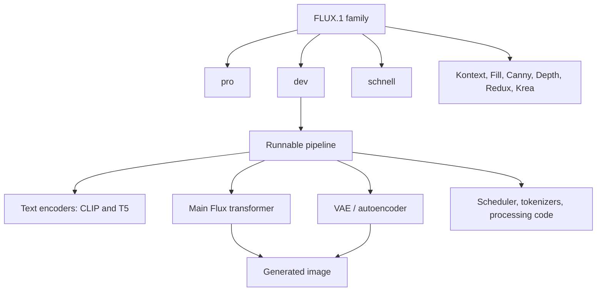

[FLUX.1](https://bfl.ai/blog/24-08-01-bfl) is easy to describe badly. People say "the Flux model" as if it were one neural network that turns a sentence directly into a PNG. In practice, FLUX.1 is better understood at three levels:

1. **FLUX.1 is a model family.**
2. **Each named variant is commonly used as a generation pipeline.**
3. **Each pipeline is made from several neural-network modules plus ordinary software components.**

That distinction matters because it explains why people can all be "using Flux" while running different weights, licenses, UIs, memory optimizations, editing modes, and deployment paths.

## The Short Version

Black Forest Labs introduced FLUX.1 on August 1, 2024 as a suite of text-to-image models. The original public family had three main variants:

| Variant | What it is for | Availability |
| --- | --- | --- |
| [FLUX.1 [pro]](https://bfl.ai/blog/24-08-01-bfl) | Highest-quality hosted model | API and partner platforms |
| [FLUX.1 [dev]](https://huggingface.co/black-forest-labs/FLUX.1-dev) | Open-weight, guidance-distilled model for research and non-commercial use | Hugging Face, Diffusers, ComfyUI-style workflows |
| [FLUX.1 [schnell]](https://huggingface.co/black-forest-labs/FLUX.1-schnell) | Fast local and personal-use model | Open weights under Apache 2.0 |

Later, the FLUX.1 ecosystem expanded with task-specific and newer variants such as [FLUX.1 Fill](https://huggingface.co/black-forest-labs/FLUX.1-Fill-dev), [FLUX.1 Canny](https://huggingface.co/black-forest-labs/FLUX.1-Canny-dev), [FLUX.1 Depth](https://huggingface.co/black-forest-labs/FLUX.1-Depth-dev), [FLUX.1 Redux](https://huggingface.co/black-forest-labs/FLUX.1-Redux-dev), [FLUX.1 Kontext](https://huggingface.co/black-forest-labs/FLUX.1-Kontext-dev), and [FLUX.1 Krea](https://huggingface.co/black-forest-labs/FLUX.1-Krea-dev). The [Hugging Face FLUX.1 collection](https://huggingface.co/collections/black-forest-labs/flux1) is the most useful map of those open-weight releases.

As of June 2026, Black Forest Labs' own docs position [FLUX.2](https://docs.bfl.ai/) as the recommended family for new projects, with FLUX.1-era models still important because they are widely used, well supported, and deeply woven into local image-generation workflows.

## Why FLUX.1 Is Not "One Neural Network"

There is a core neural network inside a FLUX.1 pipeline: the transformer that denoises image latents. The [FLUX.1 launch post](https://bfl.ai/blog/24-08-01-bfl) describes the public models as 12B-parameter, transformer-powered flow models based on hybrid multimodal and parallel diffusion transformer blocks.

But when you load FLUX.1 in a library such as [Hugging Face Diffusers](https://huggingface.co/docs/diffusers/api/pipelines/flux), you are not loading only that transformer. A typical `FluxPipeline` has:

| Component | Neural network? | Role |
| --- | --- | --- |
| `FluxTransformer2DModel` | Yes | Denoises encoded image latents; this is the main FLUX model component |
| `CLIPTextModel` | Yes | Encodes text prompt information |
| `T5EncoderModel` | Yes | Provides a second, richer text encoding path |
| `AutoencoderKL` | Yes | Encodes images into latents and decodes latents back into pixels |
| Tokenizers | No | Convert prompt text into token IDs |
| Scheduler | No | Controls the denoising or flow-matching sampling steps |
| Pre/post-processing code | No | Handles image sizes, tensors, safety checks, and output formatting |

So the precise wording is:

> FLUX.1 is a model family. A runnable FLUX.1 variant is usually packaged as a pipeline. That pipeline contains several neural networks, plus non-neural utility components.

This is not unique to FLUX.1. Most modern image-generation systems are assembled this way. The user sees a prompt box; under the surface, there is a coordinated stack of text encoders, latent models, decoders, schedulers, tokenizers, and memory-management code.

## What Makes FLUX.1 Technically Interesting

FLUX.1 arrived after the Stable Diffusion era had already taught the community how useful open weights could be. Its importance came from combining a few things at once:

- strong prompt following
- high image detail and visual quality
- better typography than many older open models
- useful aspect-ratio flexibility
- open-weight variants that could be integrated into local tools
- a large enough quality jump to become a new base for LoRAs, quantizations, ComfyUI graphs, and hosted APIs

Black Forest Labs describes FLUX.1 as a flow-matching model family. Flow matching is closely related to diffusion-style generation in practice: the model learns how to transform noise-like latent representations into structured image latents over a sequence of steps. For users, the result is familiar: write a prompt, choose parameters, run sampling, decode the result into an image.

The practical difference is less about the buzzword and more about the quality and ecosystem: FLUX.1 became one of the default answers when people wanted an open-weight model for realistic images, natural-language prompting, and modern ComfyUI pipelines.

## The Main FLUX.1 Variants

### FLUX.1 [pro]

[FLUX.1 [pro]](https://bfl.ai/blog/24-08-01-bfl) is the hosted top-tier version from Black Forest Labs. It is not the variant most people mean when they talk about downloading Flux weights locally. It matters because the open-weight dev model was positioned as a distilled sibling of the pro model.

Use this when you want hosted access, production APIs, and the strongest FLUX.1-era generation quality without managing GPUs.

### FLUX.1 [dev]

[FLUX.1 [dev]](https://huggingface.co/black-forest-labs/FLUX.1-dev) is the variant that made FLUX.1 a local-workflow staple. Its model card describes it as a 12B-parameter rectified flow transformer for generating images from text descriptions. It is open-weight, but its license is the FLUX.1 dev non-commercial license, so commercial use needs separate attention.

Use this when you care about image quality, research, experimentation, LoRAs, local pipelines, and open-weight workflows.

### FLUX.1 [schnell]

[FLUX.1 [schnell]](https://huggingface.co/black-forest-labs/FLUX.1-schnell) is the faster variant. Its model card describes a 12B-parameter rectified flow transformer that can generate high-quality images in only a few steps. It is released under Apache 2.0, which makes it easier to use in commercial-friendly experiments than the dev variant.

Use this when speed, permissive licensing, and local prototyping matter more than maximum quality.

### FLUX.1 Kontext

[FLUX.1 Kontext](https://bfl.ai/announcements/flux-1-kontext) expanded the FLUX.1 line from classic text-to-image generation into context-aware generation and editing. The [FLUX.1 Kontext [dev] model card](https://huggingface.co/black-forest-labs/FLUX.1-Kontext-dev) describes it as a 12B-parameter rectified flow transformer that edits images from text instructions. Its [technical report](https://arxiv.org/abs/2506.15742) frames Kontext around in-context image generation and editing in latent space.

Use this when the input is not just a blank prompt but an existing image, character, object, or visual context you want the model to preserve and modify.

## How People Actually Run FLUX.1

The three common routes are:

| Route | Good for | Links |
| --- | --- | --- |
| Hosted API | Apps, prototypes, production services, no local GPU | [BFL docs](https://docs.bfl.ai/), [Replicate](https://replicate.com/black-forest-labs), [fal](https://fal.ai/models/fal-ai/flux/dev) |
| Python library | Custom scripts, notebooks, backend services | [Diffusers FLUX docs](https://huggingface.co/docs/diffusers/api/pipelines/flux) |
| Node workflow UI | Artists, tinkerers, repeatable visual pipelines | [ComfyUI](https://github.com/comfyanonymous/ComfyUI), [BFL Flux repo](https://github.com/black-forest-labs/flux) |

Diffusers makes the pipeline structure especially visible. The constructor for `FluxPipeline` lists the scheduler, VAE, CLIP text encoder, T5 text encoder, tokenizers, and transformer. That is a useful antidote to the idea that "the model" is one monolithic file.

ComfyUI makes a different truth visible: the model is only one part of a creative workflow. A serious FLUX graph may include LoRAs, image references, prompt conditioning, quantized weights, tiled upscaling, inpainting, face/detail passes, and custom nodes. The final image may be "made with Flux," but Flux may not be the whole story.

## Licensing And Deployment Notes

The licensing split is one of the most important practical details:

| Model | License shape |
| --- | --- |
| FLUX.1 [dev] | Open weights under a non-commercial license |
| FLUX.1 [schnell] | Apache 2.0 |
| FLUX.1 Kontext [dev] | Open weights under the FLUX.1 dev non-commercial license |
| FLUX.1 [pro] and Kontext hosted variants | API/platform terms |

The short lesson: do not assume "open weights" means "open-source" or "free for any commercial use." If money, clients, ads, paid products, or production deployment are involved, read the model license and provider terms directly.

## A Mental Model For FLUX.1

The cleanest way to think about FLUX.1 is a stack:

At the top, FLUX.1 is a family name. In the middle, each variant is a model release with its own purpose and license. At runtime, that model release becomes a pipeline. Inside the pipeline, several neural networks cooperate to turn text, images, or both into pixels.

## Why FLUX.1 Still Matters

Even with newer Black Forest Labs models available, FLUX.1 remains important because it became infrastructure for a generation of image workflows. It is in Hugging Face model cards, Diffusers examples, ComfyUI graphs, LoRA collections, quantized builds, cloud inference endpoints, and tutorials. It also helped normalize the idea that high-quality image generation could be both frontier-grade and available outside a single closed web app.

The name is compact, but the thing behind it is layered:

- a company release
- a model family
- several model variants
- multiple licenses
- pipeline implementations
- neural-network components
- creative ecosystems around those components

That layered view prevents a lot of confusion. When someone asks "is Flux one model?", the best answer is: only in casual speech. More precisely, FLUX.1 is a family of related image models, and each usable model is commonly run as a multi-component generation pipeline.

## Related Links

- [Black Forest Labs: Announcing FLUX.1](https://bfl.ai/blog/24-08-01-bfl)
- [Black Forest Labs model catalog](https://bfl.ai/models)
- [BFL API documentation](https://docs.bfl.ai/)
- [BFL Flux GitHub repository](https://github.com/black-forest-labs/flux)
- [Hugging Face FLUX.1 collection](https://huggingface.co/collections/black-forest-labs/flux1)
- [FLUX.1 dev on Hugging Face](https://huggingface.co/black-forest-labs/FLUX.1-dev)
- [FLUX.1 schnell on Hugging Face](https://huggingface.co/black-forest-labs/FLUX.1-schnell)
- [FLUX.1 Kontext dev on Hugging Face](https://huggingface.co/black-forest-labs/FLUX.1-Kontext-dev)
- [FLUX.1 Krea dev on Hugging Face](https://huggingface.co/black-forest-labs/FLUX.1-Krea-dev)
- [Hugging Face Diffusers FLUX pipeline docs](https://huggingface.co/docs/diffusers/api/pipelines/flux)
- [FLUX.1 Kontext technical report](https://arxiv.org/abs/2506.15742)
- [ComfyUI GitHub](https://github.com/comfyanonymous/ComfyUI)
