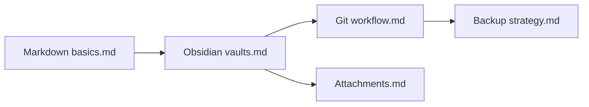

Markdown is usually introduced as a single-file format. You write one `.md` file, put headings and lists inside it, maybe add a few links, and render it somewhere like GitHub, VS Code, or a static site generator.

Obsidian keeps that simple foundation, but changes the scale of the idea. Instead of treating Markdown mainly as one document, Obsidian treats a folder of Markdown files as a connected workspace. That workspace is called a vault.

## The vault is the core idea

An Obsidian vault is just a normal folder on disk. It can contain many files and folders, but the main knowledge layer is made of Markdown notes.

```text
My Vault/
├── Daily Notes/
│   └── 2026-06-08.md
├── Projects/
│   └── Personal Knowledge System.md
├── Notes/
│   └── Markdown basics.md
├── Attachments/
│   ├── diagram.png
│   └── paper.pdf
└── .obsidian/
    ├── app.json
    ├── appearance.json
    ├── core-plugins.json
    └── plugins/
```

The comparison to a git repository is useful. A git repo is not one source file; it is a project made of many related files. In the same way, an Obsidian vault is not one Markdown document; it is a local knowledge project made of many notes.

This is why Obsidian feels different from a plain Markdown editor. The important unit is not only the current file. The important unit is the whole vault.

## Links turn files into a knowledge graph

The feature that makes the vault model powerful is internal linking. Obsidian supports wiki-style links between notes:

```md
[[Markdown basics]]
[[Markdown basics#Headings]]
[[Markdown basics#^block-id]]
```

These links can point to another note, a heading inside another note, or even a specific block. They are similar in spirit to HTTP links, but they work inside one local vault instead of across the public web.

That small syntax changes the feel of Markdown. A note no longer has to contain everything. It can become one node in a network:



Obsidian then builds extra features around those links:

| Feature | What it adds |
| --- | --- |
| Internal links | Move between notes without hardcoding long file paths |
| Backlinks | See which notes point to the current note |
| Graph view | Visualize connections across the vault |
| Tags | Add loose categories across folders |
| Search | Query the vault as one workspace |

The deeper pattern is simple: Markdown files stay plain, but relationships between files become first-class.

## A vault is mostly text, but not only text

The most important files in a vault are usually plain text `.md` files. That is one of Obsidian's biggest strengths. You can open the notes in another editor, version them with git, search them with command-line tools, or publish them with a static site generator.

But the whole vault does not have to be pure text. A vault may also contain:

| File type | Common use |
| --- | --- |
| `.md` | Notes, outlines, daily logs, project pages |
| `.json` | Obsidian settings and plugin data |
| `.css` | Themes and snippets |
| `.png`, `.jpg`, `.svg` | Images and diagrams |
| `.pdf` | Papers, manuals, exported documents |
| `.mp3`, `.mp4` | Audio or video attachments |
| `.canvas` | Obsidian Canvas files |

So the precise statement is: an Obsidian vault is a normal folder whose knowledge layer is mostly plain Markdown, while the folder can also hold settings, plugins, images, PDFs, and other attachments.

## The `.obsidian` folder

The `.obsidian/` directory is where Obsidian stores vault-specific application data. It is similar to how development tools might put project settings in `.vscode/`, `.idea/`, or another hidden config folder.

Some files in `.obsidian/` are stable and useful to keep:

```text
.obsidian/app.json
.obsidian/appearance.json
.obsidian/core-plugins.json
.obsidian/community-plugins.json
.obsidian/hotkeys.json
.obsidian/snippets/
.obsidian/themes/
```

Other files are more like local UI state. They change often and can create noise if the vault is managed with git:

```text
.obsidian/workspace.json
.obsidian/workspace-mobile.json
```

Plugin data deserves special care. Some plugin settings are harmless and useful to sync. Others may contain local paths, account identifiers, API keys, or machine-specific state. It is worth checking before committing them.

## Managing a vault with git

Because a vault is just a folder of files, git works well as a backup and history tool. The usual pattern is to initialize git at the vault root:

```text
My Vault/
├── .git/
├── .gitignore
├── .obsidian/
├── Notes/
├── Projects/
└── Attachments/
```

A practical `.gitignore` might look like this:

```gitignore
# Obsidian local UI/session state
.obsidian/workspace.json
.obsidian/workspace-mobile.json

# Obsidian trash
.trash/

# OS/editor noise
.DS_Store
Thumbs.db
*.swp
```

In most personal vaults, it makes sense to commit:

| Commit | Usually commit? | Reason |
| --- | --- | --- |
| Markdown notes | Yes | This is the core knowledge base |
| Small useful attachments | Yes | Keeps notes complete across devices |
| Large media files | Maybe | Use Git LFS or external storage if the repo grows too much |
| Stable Obsidian settings | Yes | Preserves the vault setup |
| Workspace/session files | No | They change constantly and cause conflicts |
| Plugin data | Case by case | It may contain secrets or local machine state |

The habits matter more than the exact ignore file:

1. Pull before editing the vault on another device.
2. Commit small changes with meaningful messages.
3. Push after a writing session.
4. Avoid editing the same note independently on two devices.
5. Keep secrets out of the vault unless the repository and backups match your security needs.

Git gives Obsidian a very programmer-friendly superpower: notes become versioned, diffable, branchable text.

## Is Obsidian open source?

Obsidian itself is not open source. The main desktop and mobile apps are proprietary, even though they are free to use. Obsidian's license overview says the app is free for personal, commercial, educational, nonprofit, and government use, but the company reserves rights to the app's code and other protected content.

This creates an important distinction:

| Layer | Ownership and portability |
| --- | --- |
| Your notes | Plain local files that you own |
| Your vault folder | Normal filesystem data you can back up or version |
| Obsidian app | Proprietary software |
| Community plugins | Often open source, depending on the plugin |
| Obsidian API and sample plugin repos | Public developer resources |

For many users, that is an acceptable tradeoff: the application is closed, but the data is local and portable. For users who require fully open-source software, Obsidian's app license is a real reason to consider alternatives.

## The practical mental model

Obsidian is best understood as three layers:

| Layer | Mental model |
| --- | --- |
| Markdown files | The durable content |
| Vault | The local workspace that connects those files |
| Obsidian app | The interface that makes the vault navigable and powerful |

That is the core of Obsidian. It does not replace Markdown with a database-first system. It takes Markdown files seriously as files, then adds vault-level linking, navigation, backlinks, graph views, plugins, and settings around them.

This is why Obsidian can feel both simple and unusually deep. At the bottom, it is still a folder of files. At the top, it behaves like a personal knowledge system.

## References

- [Obsidian license overview](https://obsidian.md/license)
- [Obsidian: free for work announcement](https://obsidian.md/blog/free-for-work/)
- [Obsidian GitHub organization](https://github.com/obsidianmd)
