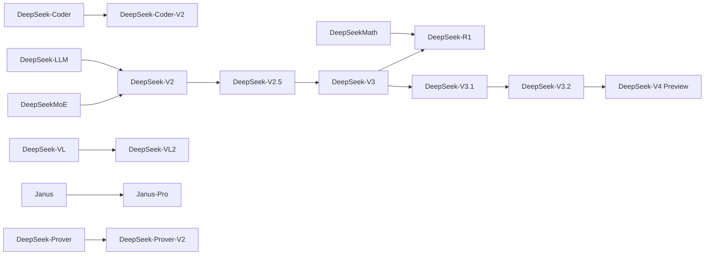

DeepSeek 很容易被单独理解成“一个很会推理的模型”，但它其实是一整条模型谱系：代码模型、通用语言模型、数学模型、MoE 架构、多模态理解、形式化证明、推理模型，以及面向工具调用和 agent 工作流的新一代 API 模型。

如果只看一个名字，很容易错过它真正的主线：DeepSeek 一直在做两件事。

第一，降低大模型训练和推理的单位成本。MoE、MLA、FP8、稀疏注意力、长上下文优化，都是围绕“更便宜地跑更大的模型”展开。

第二，把模型能力从“会聊天”推向“会做事”。代码、数学、形式化证明、长推理、函数调用、工具使用和多步 agent 任务，构成了它从 2023 到 2026 的演进方向。

## 一张总览表

下表按公开发布时间梳理主要系列。参数量口径里，MoE 模型写成“总参数 / 激活参数”。上下文长度以公开资料或官方 API 文档为准；少数模型没有完整公开上下文规格，会标注为未公开。

| 时间 | 模型系列 | 参数量与上下文 | 输入与输出 | 主要特点 |
| --- | --- | --- | --- | --- |
| 2023-11 | DeepSeek-Coder | 1.3B、5.7B、6.7B、33B；16K | 代码/文本 -> 代码/文本；支持 FIM | 第一代代码模型，强调代码补全、仓库级理解和编程问答 |
| 2023-11 | DeepSeek-LLM | 7B、67B；4K | 文本/对话 -> 文本 | 通用中英语言模型，提供 Base 与 Chat 版本 |
| 2024-01 | DeepSeekMoE | 16.4B 总参数，约 2.7B-2.8B 激活；4K | 文本/对话 -> 文本 | 早期 MoE 探索，使用细粒度专家与共享专家来提升计算效率 |
| 2024-02 | DeepSeekMath | 7B；4K | 数学题/文本/代码 -> 解答与推理 | 面向数学推理，后续影响了 R1 的强化学习路线 |
| 2024-03 | DeepSeek-VL | 1.3B、7B；4K | 图像+文本 -> 文本 | 第一代视觉语言模型，覆盖 OCR、图表、网页、PDF 和自然图像理解 |
| 2024-05 | DeepSeek-V2 | 236B / 21B；128K；Lite 为 16B / 2.4B、32K | 文本/代码/对话 -> 文本/代码 | MLA + DeepSeekMoE，显著降低 KV cache 与推理成本 |
| 2024-06 | DeepSeek-Coder-V2 | 236B / 21B；Lite 16B / 2.4B；128K | 代码/文本 -> 代码/文本；支持 FIM | 从 V2 继续训练，扩展编程语言覆盖，代码与数学能力增强 |
| 2024-08 | DeepSeek-Prover-V1.5 | 7B；上下文未完整公开 | Lean 4 形式化命题 -> Lean 证明 | 专用定理证明模型，结合 proof assistant feedback 与搜索 |
| 2024-09 / 12 | DeepSeek-V2.5 / V2.5-1210 | 236B 级；上下文沿 V2 系列 | 文本/代码 -> 文本/代码；支持函数调用、JSON、FIM | 合并通用对话和代码能力，适合 API 与工程场景 |
| 2024-10 / 11 | Janus / JanusFlow | 1.3B；4K | 图像+文本 -> 文本；文本 -> 图像 | 统一多模态理解与生成，开始探索文生图能力 |
| 2024-11 | R1-Lite-Preview | 参数与上下文未完整公开 | 文本 -> 推理过程与答案 | R1 前身，展示长推理能力 |
| 2024-12 | DeepSeek-VL2 | Tiny/Small/Full 激活参数约 1.0B、2.8B、4.5B；4K | 图像+文本 -> 文本/定位框 | MoE 视觉语言模型，增强 OCR、文档、表格、图表理解和 visual grounding |
| 2024-12 | DeepSeek-V3 | 671B / 37B；128K | 文本/代码/对话 -> 文本/代码 | 大规模 MoE 通用模型，使用 FP8、MLA、MTP 等技术降低训练与推理成本 |
| 2025-01 | DeepSeek-R1 / R1-Zero | 671B / 37B；128K；蒸馏版 1.5B、7B、8B、14B、32B、70B | 文本/数学/代码 -> 长推理与答案 | 正式推理模型；R1-Zero 展示纯 RL 路线，R1 加入 cold-start 与多阶段训练 |
| 2025-01 | Janus-Pro | 1B、7B；4K | 图像+文本 -> 文本；文本 -> 图像 | 提升统一多模态理解和图像生成的稳定性 |
| 2025-04 | DeepSeek-Prover-V2 | 7B、671B；7B 扩展到 32K，671B 基于 V3-Base | Lean 4 命题/数学文本 -> Lean 证明 | 用大模型分解数学命题，再转成形式化证明任务 |
| 2025-05 | DeepSeek-R1-0528 | R1 架构延续；128K API 语境 | 文本 -> 推理与答案；支持 JSON/函数调用 | R1 更新版，降低幻觉，增强代码、前端任务和工具相关能力 |
| 2025-08 / 09 | DeepSeek-V3.1 / Terminus | V3 架构延续；API 128K | 文本/工具调用上下文 -> 文本/工具调用 | 一个模型支持 thinking 与 non-thinking 双模式，强化 agent 任务 |
| 2025-09 / 12 | DeepSeek-V3.2-Exp / V3.2 / Speciale | 约 685B 级；V3.x 长上下文 | 文本/对话/工具调用 -> 文本/工具调用；Speciale 偏纯推理 | 引入稀疏注意力与 thinking in tool-use，提升长上下文和 agent 效率 |
| 2025-11 | DeepSeek-Math-V2 | 约 685B；基于 V3.2-Exp-Base | 数学文本 -> 严谨证明/推理 | 自验证数学推理，强调高难度证明能力 |
| 2026-04 | DeepSeek-V4 Preview | V4-Pro 1.6T / 49B；V4-Flash 284B / 13B；1M 上下文，最大输出 384K | 文本/对话 -> 文本；API 支持 thinking/non-thinking、JSON、工具调用、FIM 等 | 当前 API 主推代际；Pro 强能力，Flash 低成本快速 |

## 第一阶段：从代码模型和通用 LLM 起步

DeepSeek 的公开模型故事从 DeepSeek-Coder 和 DeepSeek-LLM 开始。

DeepSeek-Coder 是很关键的一步。它不是单纯的聊天模型，而是从一开始就把代码作为核心对象：补全、解释、调试、跨文件上下文、FIM 中间补全。这个方向后来延伸到 Coder-V2，也解释了为什么 DeepSeek 后来的通用模型经常在代码任务上有不错表现。

DeepSeek-LLM 则是通用底座。7B 和 67B 两个规模覆盖本地部署、研究实验和在线服务。它的上下文长度不算长，只有 4K，但它奠定了中英双语、推理、代码、数学等基础能力。

这个阶段的 DeepSeek 还没有真正出圈，但路线已经很清楚：不是只做聊天，而是围绕可验证任务建立能力，比如代码能跑、数学能验、证明能检查。

## 第二阶段：MoE 和数学推理成为主轴

2024 年初的 DeepSeekMoE 是后续 V 系列的预演。MoE 的核心思想是：模型总参数可以很大，但每个 token 推理时只激活其中一部分专家。这样既能获得大模型容量，又能控制推理成本。

DeepSeekMoE 的设计重点在两处：

1. 更细粒度地切分专家，让路由更灵活。
2. 引入共享专家，保留跨样本、跨任务的通用能力。

随后发布的 DeepSeekMath 把另一条路线推到前台：数学推理。DeepSeekMath 使用大量数学相关语料继续训练，并引入 GRPO 一类强化学习方法。这一点后来非常重要，因为 DeepSeek-R1 的成功不是凭空出现的，它有 DeepSeekMath、Prover、V3 等多条支线铺垫。

## 第三阶段：V2 把成本问题打穿了一层

DeepSeek-V2 是整个系列的分水岭。

它的两个关键词是 MLA 和 DeepSeekMoE。MLA 主要解决注意力机制里的 KV cache 成本问题，DeepSeekMoE 则继续解决“模型容量很大但单次激活可控”的问题。V2 的 236B 总参数、21B 激活参数和 128K 上下文，显示出 DeepSeek 开始正式进入“大模型但低推理成本”的技术路线。

DeepSeek-Coder-V2 是 V2 路线在代码领域的强化版。它继承了 V2 的 MoE 架构，同时继续扩大代码数据和编程语言覆盖。相比第一代 Coder，它不只是“更会补全”，而是更接近一个通用的软件工程助手：能写代码、读代码、解释错误、处理长上下文里的工程信息。

V2.5 则把通用对话和代码模型进一步合并。这个合并很现实：真实产品里，用户不会严格区分“我现在在问代码”还是“我现在在问通用问题”。一个好用的 API 模型需要在解释、规划、写代码、调用工具之间自然切换。

## 第四阶段：多模态与形式化证明是两条支线

DeepSeek-VL、VL2、Janus、Janus-Pro 属于多模态线。

VL 系列偏视觉理解：看图、OCR、表格、图表、文档、网页截图。VL2 引入 MoE 后，进一步提升了视觉语言任务的效率和能力。Janus 系列则更偏统一多模态：同一套框架同时处理图像理解和图像生成。Janus-Pro 继续提升理解与生成质量。

Prover 系列则是另一种“硬核可验证任务”。它不是一般数学问答，而是面向 Lean 4 的形式化证明。形式化证明的特点是答案可以被 proof assistant 检查，错就是错，对就是对。这种任务对模型推理、搜索、分解问题和符号表达都有很高要求。

这两条支线看似不在主干上，但它们分别补上了两个重要方向：

1. 多模态让模型能处理真实世界材料，而不仅是纯文本。
2. 形式化证明让模型面对高度可验证、低容错的推理任务。

## 第五阶段：V3 和 R1 让 DeepSeek 进入大众视野

DeepSeek-V3 和 DeepSeek-R1 是最有代表性的两次跃迁。

V3 是一个 671B 总参数、37B 激活参数的 MoE 模型，使用 14.8T token 训练，并引入 FP8、MLA、MTP 等技术。它的意义不只是“参数更大”，而是把高能力和低成本的叙事结合了起来。大模型不再只比谁更大，也比谁能更便宜、更稳定地服务大量请求。

R1 则把推理能力推到前台。R1-Zero 展示了纯强化学习也能诱发长推理行为；正式 R1 则加入 cold-start 数据和多阶段训练，让模型更可用、更稳定。R1 的蒸馏版也很重要：1.5B 到 70B 的一组小模型，让更多开发者能在本地或私有环境里尝试推理模型。

这也是 DeepSeek 真正破圈的原因：它把“高强度推理”和“可负担成本”放在了一起。

## 第六阶段：V3.1、V3.2 到 V4，模型开始面向 Agent 工作流

2025 年下半年以后，DeepSeek 的主线从“聊天模型”和“推理模型”逐渐转向“能不能在工具环境里可靠工作”。

V3.1 的一个重要变化是双模式：thinking 和 non-thinking。也就是说，同一个模型可以根据任务需要，在快速回答和深度推理之间切换。V3.2 进一步强调工具使用场景中的 thinking，也就是模型不只是给出答案，还要能在调用工具、读取结果、修正计划之间保持推理能力。

到 V4 Preview，API 侧的方向更加明显：

| 模型 | 定位 | 参数与上下文 | 适合任务 |
| --- | --- | --- | --- |
| V4-Pro | 强能力模型 | 1.6T 总参数 / 49B 激活；1M 上下文 | 复杂推理、长上下文、代码、agent、多步任务 |
| V4-Flash | 高性价比模型 | 284B 总参数 / 13B 激活；1M 上下文 | 快速问答、摘要、轻量代码、批量处理 |

这一代的关键词已经不是单纯“聊天”，而是长上下文、工具调用、结构化输出、FIM、推理模式切换和 agent 场景。

## 输入输出形态的演进

DeepSeek 的输入输出能力大致经历了四个层次。

| 层次 | 代表模型 | 输入 | 输出 | 意义 |
| --- | --- | --- | --- | --- |
| 文本与代码 | DeepSeek-LLM、Coder、V2、V3 | 文本、代码、对话、长上下文 | 文本、代码、解释、补全 | 基础生产力场景 |
| 推理 | DeepSeekMath、R1、Math-V2 | 数学题、代码问题、复杂文本任务 | 推理过程、证明思路、答案 | 解决需要多步思考的问题 |
| 多模态 | VL、VL2、Janus、Janus-Pro | 图像+文本，部分支持文本生图 | 文本理解结果，或图像 | 处理截图、文档、图表、图片和生成任务 |
| 工具与 Agent | V2.5、R1-0528、V3.1、V3.2、V4 | 对话、工具定义、函数调用上下文、长上下文 | JSON、函数调用、工具使用计划、最终答案 | 从回答问题走向执行工作流 |

这个变化很值得注意。很多人评估模型时还停留在“回答是否聪明”，但现代模型越来越多地被嵌入软件系统。真正重要的问题变成：

- 能不能稳定输出 JSON？
- 能不能正确选择工具？
- 能不能在工具调用失败后修正？
- 能不能处理很长的上下文而不丢关键约束？
- 能不能在需要时深度推理，在不需要时快速回答？

DeepSeek 后期模型的设计明显是在回应这些工程问题。

## DeepSeek 系列的技术关键词

### MoE

MoE 是 DeepSeek 的核心路线之一。它允许模型拥有很大的总参数规模，但每次推理只激活一部分参数。这样既提升容量，也降低单位 token 成本。

### MLA

MLA 主要服务于长上下文和推理效率。KV cache 是大模型推理成本里的关键项，尤其在长上下文和高并发服务里非常昂贵。DeepSeek 从 V2 开始突出 MLA，说明它很早就把服务成本当作核心问题。

### FP8

V3 使用 FP8 训练相关技术，代表 DeepSeek 在训练效率上的工程投入。低精度不是简单地“省显存”，而是涉及数值稳定性、算子实现和训练系统整体设计。

### 强化学习推理

DeepSeekMath、R1-Zero、R1 到 Math-V2，构成了一条很清晰的强化学习推理路线。DeepSeek 的重点不是只让模型模仿答案，而是让模型在可验证任务上学会探索、检查和修正。

### 长上下文与稀疏注意力

V3.2 与 V4 之后，长上下文能力变得更重要。长上下文不是把窗口拉大就完事，还要让模型在成本、注意力分配和关键信息提取上保持可用。稀疏注意力就是这个方向的一部分。

## 怎么选择 DeepSeek 模型

如果把 DeepSeek 系列当作工具箱，可以这样粗略选择：

| 需求 | 更适合的系列 |
| --- | --- |
| 本地代码补全、代码解释 | DeepSeek-Coder、DeepSeek-Coder-V2、R1 蒸馏代码相关模型 |
| 通用聊天、摘要、问答 | DeepSeek-LLM、V2.5、V3、V4-Flash |
| 复杂代码、数学、长推理 | R1、R1-0528、V3.2、V4-Pro |
| 长文档、长仓库、复杂上下文 | V2、V3、V3.2、V4 |
| 图像理解、OCR、文档截图 | DeepSeek-VL、DeepSeek-VL2 |
| 文生图或统一多模态实验 | Janus、Janus-Pro |
| Lean 证明、形式化数学 | DeepSeek-Prover、DeepSeek-Prover-V2 |
| Agent、函数调用、结构化输出 | V2.5、R1-0528、V3.1、V3.2、V4 |

在工程上，最实用的判断不是“哪个模型最大”，而是：

1. 任务是否需要深度推理。
2. 上下文是否真的很长。
3. 是否需要稳定 JSON 或函数调用。
4. 是否有代码、数学、视觉、证明等专用需求。
5. 成本和延迟是否比极限能力更重要。

很多任务并不需要最强的 Pro 模型。摘要、分类、轻量问答、批量处理，更适合低成本快速模型。相反，复杂调试、数学证明、多步骤 agent 工作流，才值得切到 reasoning 或 Pro 级模型。

## 一个简化的演进图

这张图不是完整依赖关系，而是帮助理解路线：代码、通用 LLM、MoE、数学推理、多模态和形式化证明，最终汇入更强的推理与工具使用模型。

## 结语

DeepSeek 系列最值得看的地方，不只是某个单点模型有多强，而是它的演进策略很连贯：用 MoE 和 MLA 控制成本，用代码和数学建立可验证能力，用 R1 把推理推到大众视野，再用 V3.1、V3.2、V4 把推理能力接进工具调用和 agent 工作流。

如果说 2023 年的 DeepSeek 更像“代码和通用模型的开源玩家”，那么 2026 年的 DeepSeek 已经变成了一套完整的模型产品线：有快模型，有强模型，有推理模型，有多模态模型，也有面向形式化证明和 agent 的专用路线。

这条线的核心问题也越来越明确：未来的大模型竞争，不只是“谁会说”，而是“谁能稳定、便宜、长时间地做复杂工作”。

## 参考资料

- [DeepSeek-Coder](https://github.com/deepseek-ai/DeepSeek-Coder)
- [DeepSeek-LLM](https://github.com/deepseek-ai/DeepSeek-LLM)
- [DeepSeek-MoE](https://github.com/deepseek-ai/DeepSeek-MoE)
- [DeepSeek-Math](https://github.com/deepseek-ai/DeepSeek-Math)
- [DeepSeek-VL](https://github.com/deepseek-ai/DeepSeek-VL)
- [DeepSeek-V2](https://github.com/deepseek-ai/DeepSeek-V2)
- [DeepSeek-Coder-V2](https://github.com/deepseek-ai/DeepSeek-Coder-V2)
- [DeepSeek-V3](https://github.com/deepseek-ai/DeepSeek-V3)
- [DeepSeek-R1](https://github.com/deepseek-ai/DeepSeek-R1)
- [DeepSeek-VL2](https://github.com/deepseek-ai/DeepSeek-VL2)
- [Janus](https://github.com/deepseek-ai/Janus)
- [DeepSeek API Docs](https://api-docs.deepseek.com/)
- [DeepSeek API Pricing and Models](https://api-docs.deepseek.com/quick_start/pricing)
