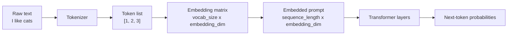

People often describe an LLM prompt as a **token list**. That is true at the API boundary: text becomes a sequence of token IDs.

But inside the model, that list does not stay a list for long. The first major transformation turns each token ID into a vector. After that lookup, the model is no longer working with a plain list like:

```text
[1, 2, 3]
```

It is working with a matrix shaped like:

```text
sequence length x embedding dimension
```

That distinction is small, but it clears up a lot of confusion about how LLMs actually process text.

## Table of contents

## The short version

The pipeline looks like this:

```text
text
-> tokens
-> token IDs
-> embedded vectors
-> transformer layers
-> output token probabilities
```

Or more compactly:

```text
"I like cats"
-> ["I", "like", "cats"]
-> [1, 2, 3]
-> matrix of vectors
```

The key relationship:

- **Tokenization** turns text into discrete pieces.
- **Token IDs** name those pieces as integers.
- **The embedding matrix** maps each token ID to a learned vector.
- **The embedded prompt** is the matrix produced by looking up all token IDs.

So when someone says "the model reads a token list," they are describing the input at one level. At the model-computation level, the token list quickly becomes a matrix.

## Tokenization: text becomes discrete pieces

A tokenizer is the part of the system that turns raw text into units the model can index.

For a tiny toy tokenizer, imagine this vocabulary:

| ID | Token |
|---:|-------|
| 0 | `<pad>` |
| 1 | `I` |
| 2 | `like` |
| 3 | `cats` |
| 4 | `dogs` |

If the input text is:

```text
I like cats
```

the tokenizer might produce:

```text
["I", "like", "cats"]
```

Then those tokens are converted to token IDs:

```text
[1, 2, 3]
```

This is the **token list** people talk about online. It is a sequence of integers.

Real tokenizers are more complicated. They often split text into word pieces, byte pieces, punctuation, whitespace-sensitive units, or other subword fragments. But the essential idea is the same:

```text
text -> token IDs
```

The model does not directly consume the string. It consumes the IDs.

## The embedding matrix: the learned lookup table

The model has a learned table called an **embedding matrix**. Each row corresponds to one token in the vocabulary.

If our toy vocabulary has 5 tokens and each embedding has 3 dimensions, the embedding matrix has shape:

\[
5 \times 3
\]

Here is a complete toy embedding matrix:

\[
E =
\begin{bmatrix}
0.00 & 0.00 & 0.00 \\
0.90 & 0.10 & 0.30 \\
0.20 & 0.80 & 0.50 \\
0.70 & 0.40 & 0.90 \\
0.60 & 0.30 & 0.85
\end{bmatrix}
\]

The rows line up with the vocabulary:

| Token ID | Token | Embedding row |
|---:|-------|---------------|
| 0 | `<pad>` | \([0.00, 0.00, 0.00]\) |
| 1 | `I` | \([0.90, 0.10, 0.30]\) |
| 2 | `like` | \([0.20, 0.80, 0.50]\) |
| 3 | `cats` | \([0.70, 0.40, 0.90]\) |
| 4 | `dogs` | \([0.60, 0.30, 0.85]\) |

The numbers here are invented, but the structure is real. In an actual LLM, the matrix is learned during training and is much larger.

For example, a model might have:

\[
100{,}000 \times 4{,}096
\]

That means:

- 100,000 possible token IDs
- each token represented by a 4,096-dimensional vector

## From token list to embedded prompt matrix

Now return to our input:

```text
I like cats
```

After tokenization:

\[
[1, 2, 3]
\]

To embed this sequence, the model performs a row lookup:

\[
E[1] =
\begin{bmatrix}
0.90 & 0.10 & 0.30
\end{bmatrix}
\]

\[
E[2] =
\begin{bmatrix}
0.20 & 0.80 & 0.50
\end{bmatrix}
\]

\[
E[3] =
\begin{bmatrix}
0.70 & 0.40 & 0.90
\end{bmatrix}
\]

The embedded prompt becomes:

\[
\begin{bmatrix}
0.90 & 0.10 & 0.30 \\
0.20 & 0.80 & 0.50 \\
0.70 & 0.40 & 0.90
\end{bmatrix}
\]

The shape is:

\[
3 \times 3
\]

In this toy example:

- 3 tokens in the input
- 3 numbers per token vector

In a real model, a prompt with 8,192 tokens and embedding dimension 4,096 would become:

\[
8{,}192 \times 4{,}096
\]

This is the embedded input matrix the transformer layers operate on.

## Two different matrices people blur together

There are two related matrices here, and they are easy to confuse.

| Name | Shape | What it means |
|------|-------|---------------|
| Embedding matrix | `vocab_size x embedding_dim` | The learned lookup table for all possible tokens |
| Embedded prompt matrix | `sequence_length x embedding_dim` | The vectors for this specific prompt |

The embedding matrix is part of the model's parameters.

The embedded prompt matrix is created fresh for each input by selecting rows from the embedding matrix.

In notation:

\[
\text{token IDs} = [1, 2, 3]
\]

\[
\text{embedded prompt} =
\begin{bmatrix}
E[1] \\
E[2] \\
E[3]
\end{bmatrix}
\]

So the token list is not wrong. It is just not the whole story.

## Why "token list" is still a useful phrase

The phrase "token list" is common because many practical concerns happen before the embedding lookup.

For example:

- API pricing is often based on token count.
- Context windows are measured in tokens.
- Prompt length limits are measured in tokens.
- Streaming output is often discussed token by token.
- Tokenization affects how different languages, symbols, and code snippets are counted.

So at the product and API level, a prompt really does behave like a token list.

But at the model-computation level, that list is only the index sequence used to pull rows from the embedding matrix.

## Initial embeddings vs contextual representations

There is one more important nuance.

The vector pulled from the embedding matrix is the token's **initial embedding**. It is not yet the full contextual meaning of that token in this specific sentence.

For example:

```text
river bank
bank account
```

The token `bank` may start from the same embedding row in both cases. But after the transformer layers process surrounding context, its internal representation changes.

That means there are several stages:

```text
token ID
-> initial token embedding
-> contextual representation after layer 1
-> contextual representation after layer 2
-> ...
-> final representation used to predict the next token
```

So an embedding lookup gives the model a starting point. The transformer layers then reshape those vectors using context.

## Retrieval embeddings are related, but not identical

The word "embedding" also appears in search and RAG systems.

In that setting, an embedding model might turn a whole sentence, paragraph, or document chunk into one vector:

```text
"I like cats"
-> [0.13, -0.42, 0.88, ...]
```

That vector is then stored in a vector database and compared with other vectors by similarity.

This is related to token embeddings, but not the same surface:

| Concept | Common use |
|---------|------------|
| Token embedding | Internal LLM representation for each token |
| Text/document embedding | Search, retrieval, clustering, recommendations |
| Embedding matrix | Learned model table mapping token IDs to vectors |

All three involve vectors, but they show up at different layers of the system.

## A compact mental model

Here is the whole thing as a flow:



And the important shape change:

```text
[1, 2, 3]
```

becomes:

```text
[
  [0.90, 0.10, 0.30],
  [0.20, 0.80, 0.50],
  [0.70, 0.40, 0.90]
]
```

The first is a list of IDs.

The second is a matrix of vectors.

## Common confusions

### "Is a token an embedding?"

No.

A token is a discrete unit, usually represented by an integer ID.

An embedding is a vector of numbers associated with that token.

```text
token: "cats"
token ID: 3
embedding: [0.70, 0.40, 0.90]
```

### "Is the prompt itself a matrix?"

At the text/API level, no. The prompt is text, then token IDs.

Inside the model, yes. After embedding lookup, the prompt is represented as a matrix:

```text
sequence_length x embedding_dimension
```

### "Is the embedding matrix the same as the context window?"

No.

The context window is the maximum number of tokens the model can process in one sequence.

The embedding matrix is the model's learned lookup table for token IDs.

### "Does each word have one fixed meaning vector?"

Not in modern transformer models.

The initial token embedding is fixed after training, but the contextual representation changes depending on surrounding tokens.

## TL;DR

A prompt starts as text, becomes a token list, and then becomes a matrix.

The cleanest version:

```text
text -> token IDs -> embedding lookup -> matrix of vectors
```

Or:

\[
\text{embedded prompt shape} =
\text{sequence length} \times \text{embedding dimension}
\]

So social media is not wrong to talk about "token lists." That is the convenient outer interface. But essentially, once the LLM begins computation, the token list has been transformed into a matrix of vectors.
