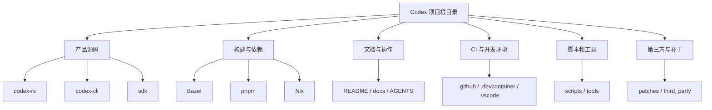

读一个真实项目的源码时，第一步不是马上钻进某个函数，而是先看根目录。根目录会告诉你：这个项目主要用什么语言写，怎么构建，怎么发布，文档放在哪里，CI 怎样跑，哪些目录是产品代码，哪些只是辅助工具。

Codex 这个仓库的根目录一共有 **45 个一级条目**。它不是一个单一 Rust crate，也不是一个单一 npm 包，而是一个包含 Rust 主体、npm CLI 包、Python/TypeScript SDK、Bazel/Nix/pnpm 工具链、CI 发布配置和项目文档的源码仓库。🧭

## 先看大结构

可以先把根目录分成几层：

其中，最重要的源码入口是 `codex-rs`。它承载 CLI、TUI、核心 Agent、协议、app server、沙箱执行、MCP、认证、测试和发布配置。`codex-cli` 更像 npm 分发层，负责把 `codex` 命令暴露给用户。`sdk` 则放 Python 和 TypeScript SDK。

## 最重要的三个源码目录

| 目录 | 作用 |
| --- | --- |
| `codex-rs` | 主体 Rust 工作区，包含 Codex CLI/TUI/core/app-server/sandbox/MCP 等真实产品逻辑。 |
| `codex-cli` | npm 包目录，提供 `@openai/codex` 包和 `codex` JS 启动器，以及打包辅助脚本。 |
| `sdk` | Codex SDK 区域，包含 Python SDK、Python runtime 包、TypeScript SDK、示例、文档和测试。 |

如果目标是学习 Codex 的 Agent 实现，应该优先进入 `codex-rs`。根目录里很多配置都围绕它服务：Bazel 规则、Rust 工具链、测试启动器、格式化脚本、发布脚本和补丁系统。

## 根目录速查表 📌

下面按根目录条目逐一说明，只解释一级文件和一级文件夹。

| 名称 | 类型 | 说明 |
| --- | --- | --- |
| `.bazelignore` | 文件 | 告诉 Bazel 忽略 `.git` 和 Rust 构建产物，避免扫描到无关 BUILD 文件或临时输出。 |
| `.bazelrc` | 文件 | Bazel 的核心配置，管理平台、缓存、runfiles、CI、远程构建、Clippy、V8 和系统差异。 |
| `.bazelversion` | 文件 | 固定 Bazel/Bazelisk 版本为 `9.0.0`，让本地和 CI 使用一致的构建工具版本。 |
| `.codespellignore` | 文件 | codespell 的自定义忽略词表，用来放终端名和项目里故意保留的特殊拼写。 |
| `.codespellrc` | 文件 | 拼写检查配置，定义跳过文件、隐藏文件检查、忽略正则和项目专用词。 |
| `.codex` | 文件夹 | 仓库内的 Codex 自动化配置，包含环境设置和面向 review、PR、测试、V8、TUI 的技能。 |
| `.devcontainer` | 文件夹 | Dev Container 开发环境，包含 Dockerfile、防火墙、安装、初始化和 post-start 脚本。 |
| `.git` | 文件夹 | Git 元数据目录，保存对象、引用、索引、配置和 hooks，用于分支、历史和提交。 |
| `.gitattributes` | 文件 | 标记生成的协议 schema，让 GitHub Linguist 正确识别生成文件。 |
| `.github` | 文件夹 | GitHub 自动化目录，包含 CODEOWNERS、issue 模板、Actions、CI、发布、签名和脚本。 |
| `.gitignore` | 文件 | 忽略依赖、构建输出、缓存、日志、环境文件、编辑器文件、系统文件和临时包。 |
| `.markdownlint-cli2.yaml` | 文件 | Markdownlint 配置，目前针对 TUI 文档设置 100 列行宽规则。 |
| `.npmrc` | 文件 | pnpm/npm 安装策略，设置 hoist、peer dependency 行为和 workspace 包优先级。 |
| `.prettierignore` | 文件 | 指定 Prettier 不处理的路径，包括构建输出、依赖目录、锁文件和 prompt 类文档。 |
| `.prettierrc.toml` | 文件 | Prettier 格式规则，设置 80 列、2 空格、分号、尾随逗号和文本换行策略。 |
| `.vscode` | 文件夹 | VS Code 工作区配置，包含推荐扩展、调试启动项和编辑器设置。 |
| `AGENTS.md` | 文件 | 面向 Agent 的仓库指令，涵盖 Rust 风格、测试、Bazel/Cargo、review、TUI 和安全约束。 |
| `BUILD.bazel` | 文件 | 根 Bazel 包，定义本地平台、Windows 测试工具链、RBE alias 和导出的根支持文件。 |
| `CHANGELOG.md` | 文件 | 不在仓库内维护完整日志，而是把 changelog 指向 GitHub Releases 页面。 |
| `LICENSE` | 文件 | Apache License 2.0 正文，说明使用、修改、分发、专利和贡献相关条款。 |
| `MODULE.bazel` | 文件 | Bazel 模块定义，声明依赖、工具链、补丁、Rust crate 导入、macOS SDK 和 V8 配置。 |
| `MODULE.bazel.lock` | 文件 | Bazel 锁文件，固定外部模块解析结果和 registry hash，保证 Bazel 构建可复现。 |
| `NOTICE` | 文件 | 项目归属和第三方代码声明，记录 OpenAI Codex 与 Ratatui 派生代码的版权信息。 |
| `README.md` | 文件 | 仓库首页文档，介绍 Codex CLI、安装方式、IDE/app/web 区别、文档入口和许可证。 |
| `SECURITY.md` | 文件 | 安全策略，说明漏洞报告入口，并链接到 Codex 审批、沙箱和安全边界文档。 |
| `announcement_tip.toml` | 文件 | TUI 公告配置，根据版本、日期和目标 app 决定是否显示测试或升级提示。 |
| `cliff.toml` | 文件 | git-cliff 配置，用 Conventional Commits 生成按功能、修复、发布等分组的 changelog。 |
| `codex-cli` | 文件夹 | npm 分发包目录，提供 `@openai/codex`、`codex` 命令入口和打包/容器辅助脚本。 |
| `codex-rs` | 文件夹 | 主 Rust 工作区，是理解 Codex Agent、CLI、TUI、core、协议、沙箱和测试的核心入口。 |
| `defs.bzl` | 文件 | Bazel Starlark 公共宏，封装 Rust crate、跨平台二进制、链接参数、测试启动器和 runfiles。 |
| `docs` | 文件夹 | 项目文档目录，包含安装、认证、配置、沙箱、exec、技能、slash commands、CLA 和贡献指南。 |
| `flake.lock` | 文件 | Nix 锁文件，固定 `nixpkgs` 和 `rust-overlay` 的版本与 hash，保证 Nix 环境可复现。 |
| `flake.nix` | 文件 | Nix 包和 dev shell 定义，配置 Rust、OpenSSL、clang/libclang，并接入 `codex-rs` 构建。 |
| `justfile` | 文件 | 任务入口，封装运行 Codex、格式化、修复、测试、Bazel 构建、发布、schema 生成和日志查看。 |
| `package.json` | 文件 | 根 npm 包配置，主要用于仓库维护：Prettier、schema 生成、pnpm 版本和依赖覆盖。 |
| `patches` | 文件夹 | Bazel、LLVM、V8、Rust rules、zstd、aws-lc、ring、Windows 链接等外部依赖补丁。 |
| `pnpm-lock.yaml` | 文件 | pnpm 锁文件，固定根工具、`codex-cli`、responses proxy 和 TypeScript SDK 的 JS/TS 依赖。 |
| `pnpm-workspace.yaml` | 文件 | pnpm workspace 定义，声明包列表和供应链策略，例如依赖发布时间、构建信任和 exotic 依赖限制。 |
| `rbe.bzl` | 文件 | Bazel 远程构建平台规则，根据主机架构生成带固定容器镜像的 Linux RBE platform。 |
| `scripts` | 文件夹 | 自动化脚本目录，覆盖格式化、安装、打包、README TOC、Bazel lock 检查、mock server 和发布暂存。 |
| `sdk` | 文件夹 | SDK 总目录，包含 Python SDK/runtime、TypeScript SDK、文档、示例、测试和构建配置。 |
| `third_party` | 文件夹 | 第三方支持文件，目前包括 V8 Bazel/libcxx 配置和 WezTerm 许可证归属。 |
| `tools` | 文件夹 | 开发工具目录，目前主要是 argument-comment Rust lint、Bazel aspect、wrapper 和测试。 |
| `workspace_root_test_launcher.bat.tpl` | 文件 | Windows Bazel 测试启动器模板，用于解析 runfiles、进入工作区根目录、过滤和分片 libtest。 |
| `workspace_root_test_launcher.sh.tpl` | 文件 | Bash Bazel 测试启动器模板，用于解析 runfiles、设置环境、进入工作区根目录、过滤和分片测试。 |

## 从根目录读出项目分工

这个根目录最明显的信号是：**Codex 的主实现是 Rust，但仓库不是纯 Rust 仓库**。

`codex-rs` 是主体，`codex-cli` 负责 npm 分发，`sdk` 给外部语言使用者提供 API 层，`scripts` 和 `tools` 给开发与发布流程服务。`docs`、`README.md`、`AGENTS.md` 则负责把使用方式、贡献方式和 Agent 工作规则写清楚。

构建系统也不是单一工具：

| 工具链 | 根目录线索 | 用途 |
| --- | --- | --- |
| Bazel | `.bazelrc`, `.bazelversion`, `MODULE.bazel`, `BUILD.bazel`, `defs.bzl` | 跨平台构建、测试、CI、远程执行和发布产物。 |
| Cargo/Rust | `codex-rs` | 主产品逻辑、CLI、TUI、core、协议、执行和沙箱。 |
| pnpm/npm | `package.json`, `pnpm-workspace.yaml`, `pnpm-lock.yaml`, `codex-cli` | JS/TS 工具、npm CLI 包和 TypeScript SDK。 |
| Nix | `flake.nix`, `flake.lock` | 可复现开发环境和 Codex Rust 包构建。 |
| just | `justfile` | 给开发者提供统一命令入口，避免记复杂命令。 |

## 一个适合源码阅读的路线 🧩

如果只是想学习 Codex 源码，不需要一开始把 45 个条目全部深入。可以按下面顺序读：

1. 先看 `README.md`，确认项目定位和安装/文档入口。
2. 再看 `AGENTS.md`，理解这个仓库对 Agent 和贡献者的工作约束。
3. 进入 `codex-rs`，从 Rust 主体开始建立心智模型。
4. 需要运行、测试或构建时，再回来看 `justfile`、`.bazelrc`、`MODULE.bazel`。
5. 需要理解发布和分发时，再看 `codex-cli`、`sdk`、`scripts`、`.github`。
6. 遇到平台或依赖问题时，再查 `patches`、`third_party`、`rbe.bzl`。

这条路线的重点是先抓住主干，再补周边。否则很容易在 CI、Bazel、SDK、补丁和发布脚本之间迷路。

## 总结

Codex 根目录像一张项目地图。`codex-rs` 是核心城市，`codex-cli` 和 `sdk` 是对外入口，Bazel/pnpm/Nix/just 是道路系统，`.github` 和 `scripts` 是自动化基础设施，`docs` 和 `AGENTS.md` 是阅读说明书，`patches` 与 `third_party` 则处理跨平台和外部依赖的现实问题。

理解这张地图之后，再去读 `codex-rs/core`、CLI、TUI、工具调用、沙箱和 app-server，就会更容易知道自己站在哪一层，也更容易判断一个文件是产品逻辑、构建配置、开发工具，还是发布辅助。✨
