上一篇看的是 Codex 项目根目录。这一篇继续往下走，进入 `codex-rs`。如果说项目根目录是一张全仓库地图，那么 `codex-rs` 就是 Codex CLI 的主体城区：CLI、TUI、core、工具调用、沙箱、模型 API、协议、状态存储、MCP、插件、技能、扩展和测试支持，大部分都在这里。🧭

这次只解释 `codex-rs` 下面的**一级文件和一级文件夹**，不递归展开每个 crate 的内部文件。这个目录一共有 **108 个直接条目**，其中多数是 Cargo workspace member，也就是一个个拆开的 Rust crate。

## 先建立整体模型

`codex-rs` 不是一个单体 crate，而是一个 Rust workspace。它通过根部的 `Cargo.toml` 把很多功能拆成小 crate：核心逻辑放在 `core`，终端 UI 放在 `tui`，命令入口放在 `cli`，协议类型放在 `protocol`，HTTP/API 层放在 `codex-api` 和 `codex-client`，沙箱和执行相关逻辑又拆成 `exec`、`exec-server`、`sandboxing`、`linux-sandbox`、`windows-sandbox-rs` 等。

可以先用下面这张图理解分层：

```mermaid
flowchart TD
    A[codex-rs] --> B[入口层]
    A --> C[核心 Agent 层]
    A --> D[协议与 API 层]
    A --> E[执行与沙箱层]
    A --> F[扩展能力]
    A --> G[状态与存储]
    A --> H[工具链与配置]

    B --> B1[cli]
    B --> B2[tui]
    B --> B3[exec]

    C --> C1[core]
    C --> C2[core-api]
    C --> C3[prompts]
    C --> C4[features]

    D --> D1[protocol]
    D --> D2[codex-api]
    D --> D3[codex-client]
    D --> D4[app-server-protocol]

    E --> E1[exec-server]
    E --> E2[sandboxing]
    E --> E3[linux-sandbox]
    E --> E4[windows-sandbox-rs]

    F --> F1[ext]
    F --> F2[plugin]
    F --> F3[skills]
    F --> F4[codex-mcp]

    G --> G1[rollout]
    G --> G2[state]
    G --> G3[thread-store]
    G --> G4[message-history]
```

## 最值得先看的目录

如果目标是学习 Codex Agent 的实现，不建议从 108 个条目平均用力。可以先看这几个：

| 入口 | 为什么重要 |
| --- | --- |
| `cli` | `codex` 命令入口，负责命令解析和把控制权交给不同运行模式。 |
| `tui` | 终端交互界面，处理聊天窗口、审批、快捷键、渲染、会话恢复等用户体验。 |
| `core` | Agent 主体逻辑，包含 session、turn、模型调用、工具执行、MCP、沙箱、安全和上下文处理。 |
| `protocol` | Core、TUI、app-server 共享的数据结构和事件协议，是理解模块边界的关键。 |
| `tools` | 模型可见工具的定义、调用、输出、动态工具和 MCP 工具适配。 |
| `exec-server` | 执行进程与文件系统访问的 JSON-RPC 服务，是执行层的重要边界。 |
| `sandboxing` | 跨平台沙箱策略和 manager，连接 Seatbelt、Bubblewrap、Landlock 等实现。 |

一句话概括：**先读 `cli -> core -> protocol/tools -> exec/sandboxing -> tui`，会比直接在所有 crate 里乱跳更容易建立心智模型。**

## 一级条目速查表 📌

下面是 `codex-rs` 根部的 108 个直接条目。

| 名称 | 类型 | 说明 |
| --- | --- | --- |
| `.cargo` | 文件夹 | Cargo 本地配置，包含 Windows 链接栈大小、静态 CRT 相关 rustflags，以及 cargo-audit 忽略项。 |
| `.config` | 文件夹 | 测试运行配置，主要是 nextest 的重试、慢测试超时、串行测试组和 Windows 重型测试规则。 |
| `.github` | 文件夹 | `codex-rs` 范围内的 GitHub 自动化，目前主要放 Cargo audit 工作流。 |
| `.gitignore` | 文件 | 忽略 Rust 构建输出，例如 `target/`、`target-*` 和 devcontainer 使用的 target 目录。 |
| `BUILD.bazel` | 文件 | `codex-rs` 的 Bazel 包文件，导出 workspace 文件和 `clippy.toml` 给上层 Bazel 规则使用。 |
| `Cargo.lock` | 文件 | Rust 依赖锁文件，固定整个 workspace 的依赖版本，保证 Cargo 构建可复现。 |
| `Cargo.toml` | 文件 | Cargo workspace 主清单，列出成员 crate、共享版本、edition、依赖、lint 和 workspace 配置。 |
| `README.md` | 文件 | 极简 README，指向 Codex CLI 官方文档入口。 |
| `agent-graph-store` | 文件夹 | 存储无关的 agent 父子拓扑 crate，用于记录线程派生 agent 的关系和边状态。 |
| `agent-identity` | 文件夹 | 处理 agent 身份密钥、JWT、JWKS、任务注册和任务级授权 header。 |
| `analytics` | 文件夹 | 定义 analytics 事件、facts、reducer、accepted line 指纹和事件发送客户端。 |
| `ansi-escape` | 文件夹 | ANSI 转 TUI 的小工具 crate，包装 `ansi-to-tui` 一类能力。 |
| `app-server` | 文件夹 | Rich client 背后的 app-server，处理 JSON-RPC、thread、config、tool、watcher 和消息分发。 |
| `app-server-client` | 文件夹 | 共享的 app-server 客户端，用于 CLI 等 Rust 交互界面和 app-server 风格 thread 通信。 |
| `app-server-daemon` | 文件夹 | 实验性的 app-server daemon，负责远程控制、托管安装、设置和更新循环。 |
| `app-server-protocol` | 文件夹 | app-server JSON-RPC 协议类型、experimental API 元数据、schema fixture 和导出逻辑。 |
| `app-server-test-client` | 文件夹 | 用于本地运行和调试 `codex app-server` 的测试客户端和 quickstart 代码。 |
| `app-server-transport` | 文件夹 | app-server 传输层共享结构，尤其是 outgoing message 的包装。 |
| `apply-patch` | 文件夹 | Codex patch 解析、调用、流式解析和 `apply_patch` 独立可执行文件支持。 |
| `arg0` | 文件夹 | 实现 arg0 分发技巧，让一个二进制在不同名字下扮演 sandbox、apply_patch 等多个角色。 |
| `async-utils` | 文件夹 | 小型 async 工具 crate，目前提供 future 与 cancellation token 组合的辅助方法。 |
| `aws-auth` | 文件夹 | AWS 认证 helper，包含配置和 SigV4 签名，用于 AWS 后端模型提供方。 |
| `backend-client` | 文件夹 | Codex backend 客户端，处理账号、配置 bundle、云任务、rate limit 和 usage 等响应类型。 |
| `bwrap` | 文件夹 | Bubblewrap 的 Rust 包装二进制，连接 vendored Bubblewrap 源码和 Linux 沙箱构建。 |
| `chatgpt` | 文件夹 | 面向 ChatGPT/Codex 一方 API 的 crate，包含任务、workspace settings、connectors 和命令应用。 |
| `cli` | 文件夹 | `codex` 主命令 crate，包含入口、命令解析、login、doctor、MCP、plugin、app 和 sandbox setup。 |
| `clippy.toml` | 文件 | Clippy 规则配置，限制 TUI 颜色 API、允许测试中的 expect/unwrap，并调大错误体积阈值。 |
| `cloud-config` | 文件夹 | 云端配置服务 crate，负责拉取、缓存、刷新、验证和加载 cloud config bundle。 |
| `cloud-tasks` | 文件夹 | 云任务 CLI/app 逻辑，包含创建任务、环境检测、diff 显示、UI 和后端初始化。 |
| `cloud-tasks-client` | 文件夹 | 云任务 backend HTTP 客户端，定义任务相关 API、请求和响应类型。 |
| `cloud-tasks-mock-client` | 文件夹 | 云任务 mock client，用于 debug 或测试场景。 |
| `code-mode` | 文件夹 | Code mode 服务 crate，包含工具描述、请求响应结构和执行服务。 |
| `codex-api` | 文件夹 | Codex/OpenAI typed API 层，构建在 `codex-client` 之上，处理 responses、files、search、images 等。 |
| `codex-backend-openapi-models` | 文件夹 | 从 OpenAPI 生成的 backend model 类型，被更高层 backend client 复用。 |
| `codex-client` | 文件夹 | 通用 HTTP transport 层，封装 request、response、retry、SSE、custom CA 和 Cloudflare cookie。 |
| `codex-experimental-api-macros` | 文件夹 | proc-macro crate，为 experimental API 字段或 variant 派生 metadata。 |
| `codex-mcp` | 文件夹 | MCP runtime 和连接管理，处理 tool、auth elicitation、RMCP client、apps 和 server 集成。 |
| `collaboration-mode-templates` | 文件夹 | 协作模式模板 crate，为 runtime 和 UI 提供内置模板内容。 |
| `config` | 文件夹 | 配置系统核心 crate，处理 TOML 类型、严格解析、层合并、schema、MCP、hooks、plugins 和 profile。 |
| `config.md` | 文件 | 迁移提示文件，说明配置文档已经移动到仓库根目录的 `docs/config.md`。 |
| `connectors` | 文件夹 | connector 元数据与过滤逻辑，包括目录缓存、可访问性判断和 merge。 |
| `context-fragments` | 文件夹 | 模型上下文片段抽象，用于定义可控大小的 user/developer context fragment。 |
| `core` | 文件夹 | Codex 业务核心：session、turn、模型调用、工具执行、MCP、沙箱、安全、上下文和 rollout。 |
| `core-api` | 文件夹 | 面向外部调用者的 core facade，重新导出 thread management 和配置相关稳定 API。 |
| `core-plugins` | 文件夹 | 插件管理 crate，处理 manifest、loader、marketplace、安装状态、远程 bundle、发现和开关。 |
| `core-skills` | 文件夹 | 技能管理 crate，负责发现、加载、渲染、注入技能和处理技能调用辅助逻辑。 |
| `default.nix` | 文件 | Nix 构建定义，为 `codex-rs` 配置 Rust、OpenSSL、clang/libclang、Cargo lock hash 和包元数据。 |
| `deny.toml` | 文件 | `cargo-deny` 策略，检查 advisory、license、重复依赖，并记录经过审查的安全例外。 |
| `docs` | 文件夹 | `codex-rs` 内部文档，包含 Bazel、Codex MCP interface 和 protocol v1。 |
| `exec` | 文件夹 | `codex exec` 非交互执行 crate，包含 CLI 参数、事件处理、人类可读和 JSONL 输出。 |
| `exec-server` | 文件夹 | JSON-RPC 执行服务，负责进程启动、PTY、远程/本地文件系统和环境管理。 |
| `execpolicy` | 文件夹 | 当前 exec policy 引擎，用 prefix-based Starlark 规则决定命令是否需要审批。 |
| `execpolicy-legacy` | 文件夹 | 旧版 exec policy 引擎，用于遗留路径和兼容性校验。 |
| `ext` | 文件夹 | 扩展组目录，包含 extension API、goal、guardian、image generation、memories、skills 和 web search。 |
| `external-agent-migration` | 文件夹 | 外部 agent 配置迁移工具，导入 hooks、subagents、commands 和 MCP 设置到 Codex。 |
| `external-agent-sessions` | 文件夹 | 外部 agent 会话迁移工具，解析、验证、去重并导入历史 session。 |
| `features` | 文件夹 | 中央 feature flag 注册表，定义 feature 阶段、实验菜单、legacy key 和有效 feature set 解析。 |
| `feedback` | 文件夹 | 反馈收集 crate，维护诊断附件、结构化标签、日志 ring buffer 和上传相关数据。 |
| `file-search` | 文件夹 | 快速 fuzzy file search 工具，使用 gitignore-aware 遍历和 fuzzy matcher。 |
| `file-system` | 文件夹 | 抽象文件系统访问 trait 和 sandbox context，使本地/远程文件操作走统一边界。 |
| `file-watcher` | 文件夹 | 文件监听 crate，用于观察 workspace 或配置变化并通知上层服务。 |
| `git-utils` | 文件夹 | Git 工具 crate，处理 branch、default branch、patch、repo baseline、平台差异和常见操作。 |
| `hooks` | 文件夹 | 生命周期 hook 系统，覆盖 tool use、permission request、compaction、session start、stop 等事件。 |
| `install-context` | 文件夹 | 检测 Codex 安装方式和包布局，例如 standalone、npm、bun、brew 或其它运行环境。 |
| `keyring-store` | 文件夹 | Keyring 抽象层和默认实现，供 auth/secrets 代码安全存储敏感值。 |
| `linux-sandbox` | 文件夹 | Linux sandbox 可执行文件和库，整合 Bubblewrap、Landlock 与相关 helper。 |
| `lmstudio` | 文件夹 | LM Studio 本地模型 provider 客户端 crate。 |
| `login` | 文件夹 | 登录认证 crate，包含 device-code、PKCE、token data、auth server 和 auth 环境 telemetry。 |
| `mcp-server` | 文件夹 | Codex MCP server，处理 tool runner、审批、message processor、patch 和 exec 请求。 |
| `memories` | 文件夹 | Memory 功能组，包含 read/write memory crate 和 memory 子系统说明。 |
| `message-history` | 文件夹 | 全局消息历史持久化层，负责 append-only `history.jsonl`、原子追加、裁剪和读取。 |
| `model-provider` | 文件夹 | 运行时 model provider 抽象，处理 provider 创建、auth provider、account state 和 capabilities。 |
| `model-provider-info` | 文件夹 | 内置和用户自定义 model provider 注册表，校验 URL、认证、header 和 retry 设置。 |
| `models-manager` | 文件夹 | 模型 metadata 和 preset 管理器，包含 cache、config、协作模式 preset 和刷新策略。 |
| `network-proxy` | 文件夹 | 本地网络策略代理，用于 sandboxed session 的 HTTP/SOCKS、MITM hook、证书和 policy enforcement。 |
| `ollama` | 文件夹 | Ollama 本地 provider 客户端，处理 URL、pull、line buffer、parser 和 client。 |
| `otel` | 文件夹 | OpenTelemetry 集成 crate，提供 log/trace/metric exporter、OTLP 配置、targets 和 trace context。 |
| `plugin` | 文件夹 | 小型共享 plugin 类型 crate，包含 plugin id、load outcome 和 plugin 边界数据。 |
| `process-hardening` | 文件夹 | pre-main 进程加固工具，例如禁用 core dump 和应用更安全的进程默认行为。 |
| `prompts` | 文件夹 | Prompt 中央仓库，保存 agents、permissions、apply_patch、review、compact、goals、realtime 等 prompt。 |
| `protocol` | 文件夹 | Core、TUI、app-server 共享协议类型，包含事件、权限、items、models、errors 和 user input。 |
| `realtime-webrtc` | 文件夹 | Realtime conversation 相关的 native WebRTC 支持 crate。 |
| `response-debug-context` | 文件夹 | 从 API/transport 错误里提取 request id、Cloudflare ray、auth error code 和安全 telemetry 文本。 |
| `responses-api-proxy` | 文件夹 | 严格的 `/v1/responses` 本地代理，注入受保护 API key，并支持 dump 和 shutdown。 |
| `rmcp-client` | 文件夹 | RMCP client 集成，包含 OAuth、stdio launcher、HTTP adapter、in-process transport 和 elicitation。 |
| `rollout` | 文件夹 | Session rollout 存储、搜索、压缩和 SQLite 状态逻辑，围绕 JSONL session record 工作。 |
| `rollout-trace` | 文件夹 | 本地 rollout trace bundle，用于调试 prompt、inference、MCP、tool dispatch、compaction 和 raw event。 |
| `rust-toolchain.toml` | 文件 | 固定 Rust toolchain 为 `1.95.0`，并安装 `clippy`、`rustfmt`、`rust-src`。 |
| `rustfmt.toml` | 文件 | Rustfmt 配置，使用 edition 2024，并设置 import granularity 为 item。 |
| `sandboxing` | 文件夹 | 跨平台 sandbox manager 和 policy transform，连接 Seatbelt、Bubblewrap、Landlock 和只读默认策略。 |
| `scripts` | 文件夹 | `codex-rs` 辅助脚本，目前包含 Windows setup 脚本。 |
| `secrets` | 文件夹 | Secret manager，包含本地后端、keyring 集成、scope/name、redaction 和环境 ID 生成。 |
| `shell-command` | 文件夹 | Shell 命令解析和 shell 检测工具，覆盖 Bash、PowerShell 等 shell 行为。 |
| `shell-escalation` | 文件夹 | Unix shell escalation 协议和 `codex-execve-wrapper` helper。 |
| `skills` | 文件夹 | 内置 system skills 安装器，把 embedded skills 写入 `CODEX_HOME/skills/.system` 并维护 marker。 |
| `state` | 文件夹 | SQLite runtime state，管理 rollout、logs、goals、memories、backfill、telemetry 和 thread metadata。 |
| `stdio-to-uds` | 文件夹 | 把 stdio MCP server 暴露成 Unix domain socket 的 bridge。 |
| `terminal-detection` | 文件夹 | 终端检测工具，用于 telemetry 和 TUI 选择，识别终端应用和 multiplexer。 |
| `test-binary-support` | 文件夹 | 测试支持 crate，服务于需要 arg0 风格 setup 的二进制测试。 |
| `thread-manager-sample` | 文件夹 | `ThreadManager` 示例二进制：启动 thread，提交一个 user turn，打印最终 assistant message。 |
| `thread-store` | 文件夹 | Thread 存储边界，定义 `ThreadStore` trait，以及 local、live、in-memory 实现。 |
| `tools` | 文件夹 | 模型可见工具支持 crate，包含 tool definition、schema、call、output、discovery、MCP 和 executor。 |
| `tui` | 文件夹 | 终端 UI crate，包含 app state、聊天组件、markdown、审批、keymap、会话恢复、diff 和更新提示。 |
| `uds` | 文件夹 | 跨平台 async Unix domain socket helper，包含 private socket dir、listener、stream 和 stale path 检查。 |
| `utils` | 文件夹 | 工具 crate 集合，覆盖 path、CLI 参数、PTY、cache、image、plugin、fuzzy match、template、输出截断等。 |
| `v8-poc` | 文件夹 | Bazel 接线的 V8 proof-of-concept crate，用于未来 V8 实验，暴露版本和 sandbox 检查。 |
| `vendor` | 文件夹 | vendored 第三方源码，目前主要是 Bubblewrap，以及对应 Bazel 构建支持。 |
| `windows-sandbox-rs` | 文件夹 | Windows sandbox 实现，处理 ACL、token、desktop/process、WFP 网络、DPAPI、日志和 setup helper。 |

## 读源码时可以怎么分组

面对 108 个条目，最重要的是分组，而不是背名字。

| 分组 | 代表目录 |
| --- | --- |
| 用户入口 | `cli`, `tui`, `exec`, `app-server` |
| Agent 核心 | `core`, `core-api`, `prompts`, `protocol`, `features` |
| 工具系统 | `tools`, `apply-patch`, `file-search`, `shell-command`, `hooks` |
| 执行与沙箱 | `exec-server`, `sandboxing`, `linux-sandbox`, `windows-sandbox-rs`, `bwrap` |
| 模型与后端 | `codex-api`, `codex-client`, `backend-client`, `model-provider`, `model-provider-info` |
| MCP 与扩展 | `codex-mcp`, `mcp-server`, `rmcp-client`, `ext`, `plugin`, `skills` |
| 状态与历史 | `rollout`, `state`, `thread-store`, `message-history`, `agent-graph-store` |
| 本地/云能力 | `cloud-tasks`, `cloud-config`, `network-proxy`, `ollama`, `lmstudio`, `realtime-webrtc` |
| 开发工具链 | `Cargo.toml`, `Cargo.lock`, `BUILD.bazel`, `rust-toolchain.toml`, `clippy.toml`, `deny.toml` |

## 推荐阅读路线 🧩

如果目标是学习 Codex 的 Agent 架构，可以按这个顺序读：

1. 先看 `Cargo.toml`，确认 workspace member 和 crate 依赖边界。
2. 看 `cli`，理解 `codex` 命令如何进入不同模式。
3. 看 `core`，重点抓 session、turn、模型调用、工具调用和上下文构造。
4. 看 `protocol` 和 `tools`，理解 core 与 UI、app-server、模型工具之间怎样交换数据。
5. 看 `exec-server`、`sandboxing`、`linux-sandbox`、`windows-sandbox-rs`，理解命令执行和权限边界。
6. 看 `tui`，把底层事件和用户可见交互连接起来。
7. 再看 `app-server`、`codex-mcp`、`ext`、`plugin`、`skills`，理解更外层的集成能力。

这个顺序的好处是：先抓主链路，再补周边。Codex 的复杂度不是来自某一个巨大文件，而是来自很多小 crate 共同维护清晰边界。

## 总结

`codex-rs` 是 Codex CLI 的 Rust 主体。它把 Agent 系统拆成很多小而专门的 crate：入口、核心、协议、工具、执行、沙箱、状态、模型、MCP、插件、技能和扩展，各自有明确边界。✨

读这个目录时，不要被 108 个条目吓到。先把它看成一张分层地图：`cli/tui` 是入口，`core` 是心脏，`protocol/tools` 是沟通语言，`exec/sandboxing` 是行动边界，`state/rollout/thread-store` 是记忆和历史，`ext/plugin/skills/mcp` 是扩展能力。这样再深入源码时，就能知道自己正在读的是哪一层、解决什么问题。
