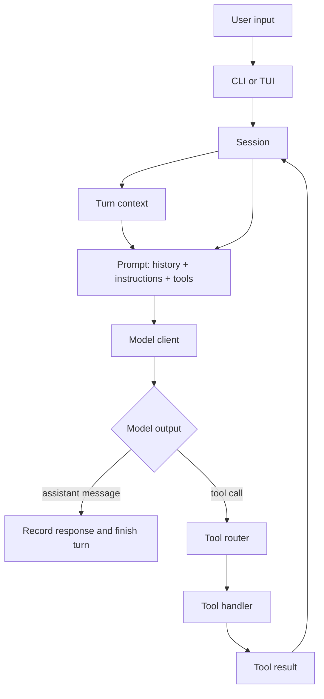

Codex CLI is a useful codebase to study if you want to understand AI agents from implementation, not just from diagrams. It is a real coding agent that runs locally, reads and edits files, executes commands, asks for approvals, applies sandbox policy, streams events back to a UI, and keeps enough session state to continue multi-step work.

The important decision is not "which branch should I read?" The better decision is: **pick one stable release tag and stay there long enough to build a mental model.**

For example, if your installed CLI says:

```bash
codex --version
```

```text
codex-cli 0.139.0
```

then use the matching release tag:

```bash
git clone https://github.com/openai/codex.git
cd codex
git fetch --tags
git checkout rust-v0.139.0
```

That tag points to a reproducible snapshot. In the version I inspected for this guide, `rust-v0.139.0` maps to commit:

```text
a7dff904308535e965aee87680c1fc5ef1d19eec
```

Do not start with `main` if your goal is learning. `main` moves. Old branches may be incomplete. Very early releases may be smaller, but they can teach an architecture that has already changed. A recent stable release is the best compromise: it is close to what people use, but still frozen enough for notes, diagrams, and repeated reading.

## What Makes Codex Worth Reading

Codex CLI is not only a wrapper around a model call. The open-source repository contains several pieces that a production-grade coding agent needs:

| Agent concern | Where to start |
| --- | --- |
| CLI command dispatch | `codex-rs/cli/src/main.rs` |
| Terminal UI | `codex-rs/tui/` |
| Session and turn state | `codex-rs/core/src/session/` |
| Model API client | `codex-rs/core/src/client.rs` |
| Prompt and tool request construction | `codex-rs/core/src/session/turn.rs` |
| Tool planning and registry | `codex-rs/core/src/tools/spec_plan.rs` |
| Tool call parsing and dispatch | `codex-rs/core/src/tools/router.rs` |
| Parallel tool execution and cancellation | `codex-rs/core/src/tools/parallel.rs` |
| Shell execution | `codex-rs/core/src/exec.rs` |
| Tool handlers | `codex-rs/core/src/tools/handlers/` |
| Project instructions | `codex-rs/core/src/agents_md.rs` |
| Sandboxing | `codex-rs/core/src/sandboxing/`, `codex-rs/linux-sandbox/`, `codex-rs/windows-sandbox-rs/` |
| File patching | `codex-rs/apply-patch/`, `codex-rs/core/src/tools/handlers/apply_patch.rs` |
| App server protocol | `codex-rs/app-server/`, `codex-rs/app-server-protocol/` |

If you are learning "AI agents," the most important folder is `codex-rs/core/`. The UI, installer, SDK, cloud task client, app server, and platform-specific packaging are useful later, but they are not the first layer to understand.

## A Simple Mental Model

The core loop of a coding agent looks like this:



This loop is the thing to keep in your head while reading the source. Everything else is a support system around it: authentication, configuration, sandboxing, UI rendering, streaming, logs, tests, app integration, and packaging.

## Start at the CLI, But Do Not Stay There

The root README explains that Codex CLI is a coding agent that runs locally on your computer. It also shows the official install paths: shell installer, PowerShell installer, npm, Homebrew, and GitHub release binaries.

Code reading starts at:

```text
codex-rs/cli/src/main.rs
```

This file defines the top-level command structure: interactive mode, `exec`, `review`, `login`, `logout`, `mcp`, `plugin`, `app-server`, `doctor`, `sandbox`, `apply`, `resume`, `fork`, `cloud`, and other commands.

The mistake is trying to understand the whole command surface first. Do not do that. For agent learning, use `main.rs` only to answer:

1. How does the executable decide which mode to run?
2. What crate owns interactive terminal behavior?
3. What crate owns non-interactive execution?
4. Where does control pass into the core agent machinery?

Once you can answer those, move to `codex-rs/core/`.

## The Session Is the Agent's Long-Lived State

Start here:

```text
codex-rs/core/src/session/session.rs
```

This file defines the session context: thread id, installation id, event channel, agent status, active turn, input queue, configured model provider, collaboration mode, base instructions, user instructions, approval policy, sandbox permissions, workspace roots, Codex home, session source, and dynamic tools.

This is an important lesson: a practical agent is not just "prompt in, answer out." It needs a durable container for:

- conversation and thread state
- active task state
- pending user input
- permission profile
- workspace roots
- model and provider configuration
- instruction sources
- services such as model clients, plugins, MCP, and tool managers

If you are building your own agent, this is usually where toy examples collapse. They do not have a serious session model.

## The Turn Loop Is the Heart of the Agent

The next file to read is:

```text
codex-rs/core/src/session/turn.rs
```

The function to study is `run_turn`. Its comment describes the loop clearly: the model can respond with function calls or with an assistant message. When the model asks for a tool call, Codex executes the tool and sends the output back to the model in the next sampling request. When the model sends only a final message, the turn can complete.

That is the agent loop in its most compact form:

```text
build prompt
send prompt to model
read model stream
if tool call:
    execute tool
    append tool result to history
    ask model again
else:
    finish turn
```

In the real code, this becomes more complicated because Codex also handles compaction, hooks, skills, plugins, connectors, pending input, retries, turn metadata, event emission, diff tracking, and cancellation. Those details matter, but do not let them hide the core shape.

Another useful function in the same file is `build_prompt`. It combines:

- prompt input
- model-visible tool specs
- whether parallel tool calls are allowed
- base instructions
- personality
- optional output schema

This is a good reminder that tools are part of the prompt contract. The model cannot call a tool that the system did not expose.

## The Model Client Is a Transport Layer, Not the Agent

Read:

```text
codex-rs/core/src/client.rs
```

This file is about talking to model provider APIs. It manages provider setup, authentication, request headers, streaming, WebSocket reuse, fallback behavior, telemetry, retry behavior, and turn-scoped client sessions.

This distinction matters. The model client is essential, but it is not the agent by itself. The agent emerges from the combination of:

1. session state
2. instruction loading
3. prompt construction
4. model streaming
5. tool dispatch
6. tool result reinjection
7. approval and sandbox policy
8. UI or protocol events

When people say "agent," they often mean only the model. In code, the model is only one component.

## Tools Are Planned Before the Model Sees Them

Read:

```text
codex-rs/core/src/tools/spec_plan.rs
codex-rs/core/src/tools/router.rs
codex-rs/core/src/tools/parallel.rs
```

`spec_plan.rs` decides which tools exist for a turn and which specs are visible to the model. It combines core tools, MCP tools, plugin tools, dynamic tools, web search, image generation, code mode tools, and multi-agent tools.

`router.rs` converts model output items into internal `ToolCall` values. It handles ordinary function calls, tool search calls, and custom tool calls, then dispatches them through the registry.

`parallel.rs` controls actual tool call runtime. It decides whether a tool can run in parallel, serializes tools that need exclusive access, handles cancellation, and converts failures into model-readable tool outputs.

This is one of the best parts of the codebase to study. A useful agent needs a strict boundary between:

- tool schema exposed to the model
- internal tool registry
- per-tool execution rules
- cancellation behavior
- output returned to the model

Without that boundary, an agent becomes hard to secure and hard to debug.

## Shell Execution Is Where Agent Safety Becomes Concrete

Read:

```text
codex-rs/core/src/exec.rs
codex-rs/core/src/tools/handlers/unified_exec/
codex-rs/core/src/tools/handlers/shell/
codex-rs/core/src/sandboxing/
codex-rs/linux-sandbox/
codex-rs/windows-sandbox-rs/
```

Coding agents are powerful because they can run commands. They are risky for the same reason.

Codex has to answer practical questions:

- What command will run?
- What directory will it run in?
- What environment variables are available?
- Can it access the network?
- Which filesystem paths are readable or writable?
- Does the user need to approve it?
- What happens if the command times out?
- How much output should be retained?
- How should cancellation work?

That is why shell execution is not a tiny helper function. It is a policy surface.

If you only read one safety-related path, read the execution flow from the tool handler into `exec.rs`, then into sandbox selection. This shows how an agent moves from "the model wants to run a command" to "the process is allowed, denied, sandboxed, timed out, and summarized."

## Instructions Are Also Code

Read:

```text
codex-rs/core/src/agents_md.rs
```

Codex uses `AGENTS.md` files as project-level instructions. The code discovers instruction files from the project root down to the current working directory, loads them in order, applies size limits, handles global instructions, and records provenance.

This is another production detail that toy agents often skip. In a real repository, the user prompt is not enough. The agent needs durable project guidance:

- how to run tests
- where important code lives
- style conventions
- commands to avoid
- review expectations
- package-specific rules

The interesting idea is not just "read a Markdown file." The important idea is instruction hierarchy: global guidance, project guidance, nested guidance, current prompt, and tool outputs all compete for context.

## What to Ignore on the First Pass

Codex is large. If your goal is learning the agent pattern, ignore these areas at first:

- installer scripts
- release packaging
- npm wrapper details
- Homebrew or platform distribution
- SDK bindings
- app server protocol
- cloud task client
- telemetry plumbing
- UI rendering details
- terminal keybindings
- platform-specific desktop app integration
- every test snapshot

These are real product concerns, but they are not the first layer. Read them after you understand the session-turn-tool loop.

## A Practical Study Plan

Use this order:

1. Read `README.md` to understand what the CLI claims to be.
2. Run `codex --version` and check out the matching `rust-v...` tag.
3. Skim `codex-rs/cli/src/main.rs` to see command dispatch.
4. Read `codex-rs/core/src/session/session.rs` for long-lived state.
5. Read `codex-rs/core/src/tasks/regular.rs` to see how a regular task starts a turn.
6. Read `codex-rs/core/src/session/turn.rs` until you can explain `run_turn`.
7. Read `codex-rs/core/src/client.rs` as the model transport layer.
8. Read `codex-rs/core/src/tools/spec_plan.rs` and `router.rs` for tool exposure and dispatch.
9. Read one concrete handler, such as shell execution or apply patch.
10. Read `agents_md.rs` to understand instruction loading.
11. Only then explore the TUI or app-server layers.

The goal is not to memorize every file. The goal is to draw the loop from user input to model call to tool result to follow-up model call.

## What This Teaches About AI Agents

Codex CLI demonstrates that an AI agent is less like a single algorithm and more like a runtime.

An agent runtime needs:

| Layer | Purpose |
| --- | --- |
| State | Keeps thread, turn, history, active task, and pending input coherent. |
| Context | Turns files, instructions, environment, and user messages into model input. |
| Model client | Sends requests, streams responses, retries, and handles provider details. |
| Tool system | Exposes safe capabilities to the model and dispatches actual work. |
| Policy | Applies approval, sandbox, filesystem, network, and timeout rules. |
| Event stream | Lets the UI, CLI, app server, or SDK observe what is happening. |
| Persistence | Allows resume, fork, archive, diffs, and history reconstruction. |

That is why reading source code is valuable. Blog posts about agents often show the loop in ten lines. Real agent code shows the hard parts: permissions, cancellation, context pressure, retries, streaming, partial failure, user interruption, and platform differences.

## The Release Choice Matters

There is a real tradeoff between older and newer code:

- Older code may be smaller.
- Newer code reflects current design.
- Pre-release code may be unstable.
- `main` may change while you are reading.

For learning, choose a recent stable release tag. If you want to match your installed behavior, use the tag that corresponds to `codex --version`. If you only want a textbook snapshot, pick the latest stable release, avoid alpha tags, and keep your notes tied to that tag.

For example:

```text
codex-cli 0.139.0 -> rust-v0.139.0
```

Use GitHub releases to confirm the tag and commit before studying.

## Final Takeaway

If you want to learn AI agents through Codex source code, do not begin by reading every branch. Begin with one stable release tag and follow the core loop:

```text
CLI input -> session -> turn -> prompt -> model stream -> tool call -> tool result -> next prompt
```

That path teaches the central idea: a coding agent is not just a language model. It is a model surrounded by state, tools, policy, sandboxing, events, and persistence. Codex is useful because those pieces are visible in a real open-source implementation.

## Further Reading

- [Codex CLI documentation](https://developers.openai.com/codex/cli)
- [Codex open-source components](https://developers.openai.com/codex/open-source)
- [openai/codex repository](https://github.com/openai/codex)
- [openai/codex releases](https://github.com/openai/codex/releases)
- [`rust-v0.139.0` release tag](https://github.com/openai/codex/releases/tag/rust-v0.139.0)
