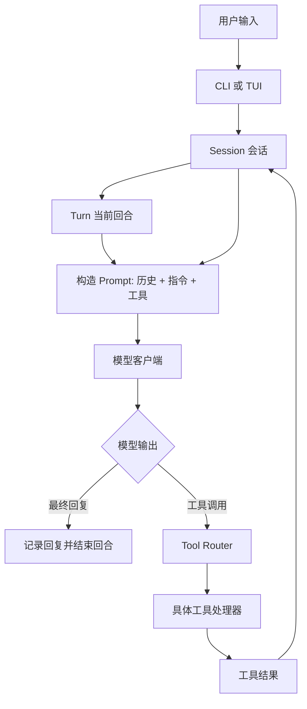

如果想学习 AI Agent，只看概念图很容易停在表面。真正有价值的是读一个真实可用的 Agent 代码库：它怎样接收用户输入，怎样组织上下文，怎样调用模型，怎样处理工具调用，怎样执行命令，怎样做权限审批和沙箱隔离，怎样把结果流式返回给用户。

Codex CLI 是一个适合阅读的例子。它是 OpenAI 开源的本地编码 Agent，源码在 `openai/codex` 仓库中，许可证是 Apache 2.0。它不是一个十几行的 demo，而是一个真实产品级 Agent：可以读写文件、运行命令、管理会话、执行工具、处理审批、维护上下文，并把执行过程展示给 CLI 或 TUI。

但开始读之前，先解决一个关键问题：**不要随便读某个 branch，也不要直接读不断变化的 `main`。应该选择一个稳定 release tag，把它当作你的教材。**

## 先确定要读哪个版本

最直接的方法是看本机安装的 Codex CLI 版本：

```bash
codex --version
```

如果输出是：

```text
codex-cli 0.139.0
```

那么对应的源码 tag 通常是：

```text
rust-v0.139.0
```

可以这样取代码：

```bash
git clone https://github.com/openai/codex.git
cd codex
git fetch --tags
git checkout rust-v0.139.0
```

在前面的源码检查里，`rust-v0.139.0` 对应的 commit 是：

```text
a7dff904308535e965aee87680c1fc5ef1d19eec
```

如果你的版本是 `0.140.0-alpha.16`，那就找类似：

```bash
git checkout rust-v0.140.0-alpha.16
```

不过，学习时更推荐稳定版本，而不是 alpha 或其他预发布版本。

## 为什么不要从 branch 开始

Codex 仓库里有很多 branch，每个 branch 又有很多 commit。直接从 branch 开始读，会遇到几个问题：

| 选择 | 问题 |
| --- | --- |
| `main` | 会持续变化，你今天做的笔记明天可能对不上代码。 |
| 随机 branch | 可能是实验分支、未完成分支，结构不一定稳定。 |
| 很早的旧版本 | 代码可能更简单，但架构可能已经过时。 |
| alpha 版本 | 更接近新功能，但稳定性和文档对应关系更弱。 |
| 稳定 release tag | 最适合学习：固定、可复现、对应真实发布版本。 |

所以更好的策略是：**选择一个近期稳定 tag，然后只读这个 tag。**

学习源码时，最怕一边读一边换版本。AI Agent 的代码本来就有很多层：CLI、TUI、会话、模型客户端、工具系统、审批、沙箱、补丁、配置、插件、MCP、云任务等。如果版本还在变，就很难建立稳定的心智模型。

## 先建立一个简单模型

Codex CLI 的核心可以先理解成一个循环：



这就是 Agent 的核心：

```text
用户输入
-> 构造上下文
-> 调用模型
-> 如果模型要调用工具，就执行工具
-> 把工具结果放回上下文
-> 再次调用模型
-> 直到模型给出最终回复
```

真实代码会复杂很多，因为还要处理权限、沙箱、取消、重试、上下文压缩、流式事件、文件 diff、用户中途输入、插件和工具注册。但读源码时要始终抓住这个主循环。

## 源码阅读入口

从仓库结构看，最重要的几个部分是：

| 关注点 | 阅读入口 |
| --- | --- |
| CLI 命令分发 | `codex-rs/cli/src/main.rs` |
| 终端 UI | `codex-rs/tui/` |
| 会话和回合状态 | `codex-rs/core/src/session/` |
| 模型 API 客户端 | `codex-rs/core/src/client.rs` |
| Prompt 和工具请求构造 | `codex-rs/core/src/session/turn.rs` |
| 工具规划和注册表 | `codex-rs/core/src/tools/spec_plan.rs` |
| 工具调用解析和分发 | `codex-rs/core/src/tools/router.rs` |
| 并行工具执行和取消 | `codex-rs/core/src/tools/parallel.rs` |
| Shell 命令执行 | `codex-rs/core/src/exec.rs` |
| 具体工具处理器 | `codex-rs/core/src/tools/handlers/` |
| 项目指令加载 | `codex-rs/core/src/agents_md.rs` |
| 沙箱相关 | `codex-rs/core/src/sandboxing/`, `codex-rs/linux-sandbox/`, `codex-rs/windows-sandbox-rs/` |
| 文件 patch | `codex-rs/apply-patch/`, `codex-rs/core/src/tools/handlers/apply_patch.rs` |
| App server 协议 | `codex-rs/app-server/`, `codex-rs/app-server-protocol/` |

如果目标是学习 AI Agent，第一阶段重点放在：

```text
codex-rs/core/
```

不要一开始就陷进安装器、发布脚本、SDK、云任务客户端、app-server 协议、TUI 渲染细节里。那些都重要，但不是第一层。

## 第一步：看 CLI 怎样把控制权交出去

阅读：

```text
codex-rs/cli/src/main.rs
```

这个文件定义了顶层命令结构，比如 interactive、`exec`、`review`、`login`、`logout`、`mcp`、`plugin`、`app-server`、`doctor`、`sandbox`、`apply`、`resume`、`fork`、`cloud` 等。

读这个文件时，不要试图理解所有命令。你只需要回答几个问题：

1. `codex` 这个可执行文件怎样解析命令？
2. 交互式 TUI 由哪个 crate 负责？
3. 非交互执行由哪个 crate 负责？
4. 控制流什么时候进入 `codex-rs/core/`？

CLI 层不是 Agent 的核心。它更像入口和路由器。真正的 Agent 逻辑在 core。

## 第二步：理解 Session

阅读：

```text
codex-rs/core/src/session/session.rs
```

`Session` 是 Agent 的长期状态容器。它包含 thread id、installation id、事件通道、agent 状态、active turn、输入队列、模型 provider、协作模式、基础指令、用户指令、审批策略、权限配置、workspace roots、Codex home、session source、dynamic tools 等。

这说明一个现实中的 Agent 不只是：

```text
prompt -> model -> answer
```

它必须维护很多状态：

- 当前会话和线程
- 当前正在运行的任务
- 用户中途追加的输入
- 模型和 provider 配置
- 权限和沙箱配置
- workspace 根目录
- 系统指令、项目指令、用户指令
- 插件、MCP、工具管理器等服务

如果你以后自己写 Agent，`Session` 这一层非常值得参考。很多 toy agent 做不长任务，原因就是没有严肃的会话模型。

## 第三步：理解 Turn Loop

阅读：

```text
codex-rs/core/src/tasks/regular.rs
codex-rs/core/src/session/turn.rs
```

`regular.rs` 展示普通任务怎样启动一个 turn。真正核心的是 `turn.rs` 里的 `run_turn`。

`run_turn` 的注释很关键：模型每次采样可能返回两类东西：

- assistant message：直接给用户的回复
- function/tool call：要求系统执行某个工具

如果模型返回工具调用，Codex 会执行工具，把工具结果写回上下文，然后再次请求模型。直到模型不再要求工具调用，而是给出最终回复。

可以把它简化成：

```text
build prompt
send prompt to model
read model stream
if tool call:
    execute tool
    append tool result to history
    ask model again
else:
    finish turn
```

这就是 AI Agent 的最核心结构。

`turn.rs` 里还有一个很值得看的函数：`build_prompt`。它会把这些内容组合起来：

- prompt input
- model-visible tool specs
- 是否支持 parallel tool calls
- base instructions
- personality
- output schema

这说明工具不是模型“凭空知道”的。系统必须先决定哪些工具对模型可见，再把工具 spec 放进请求里。

## 第四步：把模型客户端和 Agent 本体分开看

阅读：

```text
codex-rs/core/src/client.rs
```

这个文件负责和模型 provider API 通信，包括鉴权、provider 选择、请求头、streaming、WebSocket 复用、fallback、telemetry、retry，以及 turn-scoped client session。

这里要注意一个判断：**模型客户端不是 Agent 本体。**

Agent 是这些东西合在一起产生的：

1. Session 状态
2. 指令加载
3. Prompt 构造
4. 模型流式响应
5. 工具分发
6. 工具结果回填
7. 审批和沙箱策略
8. CLI/TUI/app-server 事件流

模型只是其中一层。很多人说 Agent，其实只是在说模型；但从源码看，Agent 更像一个 runtime。

## 第五步：理解工具系统

阅读：

```text
codex-rs/core/src/tools/spec_plan.rs
codex-rs/core/src/tools/router.rs
codex-rs/core/src/tools/parallel.rs
codex-rs/core/src/tools/handlers/
```

`spec_plan.rs` 决定一个 turn 里有哪些工具，以及哪些工具 spec 对模型可见。它会组合 core tools、MCP tools、plugin tools、dynamic tools、web search、image generation、code mode tools、multi-agent tools 等。

`router.rs` 把模型输出解析成内部的 `ToolCall`，再通过 registry 分发。

`parallel.rs` 控制工具运行时：哪些工具可以并行，哪些工具必须串行，取消时如何处理，失败时怎样变成模型可读的工具输出。

这部分很能体现产品级 Agent 和 demo 的差异。一个真实 Agent 需要清楚地区分：

- 暴露给模型的工具 schema
- 内部工具 registry
- 每个工具的执行规则
- 并行和串行策略
- 取消和失败处理
- 返回给模型的工具结果

否则工具系统很快会变得不可控。

## 第六步：重点读 Shell 执行和沙箱

阅读：

```text
codex-rs/core/src/exec.rs
codex-rs/core/src/tools/handlers/unified_exec/
codex-rs/core/src/tools/handlers/shell/
codex-rs/core/src/sandboxing/
codex-rs/linux-sandbox/
codex-rs/windows-sandbox-rs/
```

编码 Agent 强大的地方在于它能运行命令；风险也来自这里。

Codex 必须回答很多具体问题：

- 要执行什么命令？
- 在哪个目录执行？
- 允许哪些环境变量？
- 能不能访问网络？
- 哪些路径可读？
- 哪些路径可写？
- 是否需要用户审批？
- 命令超时怎么办？
- 输出太多怎么办？
- 用户取消时怎样终止？

所以 shell execution 不是一个简单 helper，而是一个安全边界。

如果只读一条安全相关路径，可以从工具 handler 追到 `exec.rs`，再追到 sandbox 选择。这样能看到 Codex 怎样从“模型想运行命令”走到“这个命令被允许、拒绝、审批、沙箱化、超时或汇总”。

## 第七步：不要忽略指令加载

阅读：

```text
codex-rs/core/src/agents_md.rs
```

Codex 会用 `AGENTS.md` 作为项目级指令。它会从项目根目录到当前目录按层级发现指令文件，按顺序加载，应用大小限制，并记录来源。

这很重要。真实代码仓库里的 Agent 不应该只依赖用户当前输入。它还需要长期有效的项目规则：

- 测试命令
- 代码风格
- 哪些命令不能运行
- 哪些目录有特殊规则
- review 标准
- package 级别的约定

这里真正值得学习的是 instruction hierarchy：全局指令、项目指令、子目录指令、当前用户 prompt、工具输出，都会共同影响模型上下文。

## 第一轮可以先忽略什么

Codex 仓库很大。第一轮阅读时，可以先忽略这些内容：

- installer scripts
- release packaging
- npm wrapper
- Homebrew 分发
- SDK bindings
- cloud task client
- app-server protocol
- telemetry plumbing
- TUI 渲染细节
- terminal keybindings
- platform-specific desktop integration
- 大量 snapshot tests

不是说这些不重要，而是它们会干扰你抓主线。

第一轮目标只有一个：理解这条链路。

```text
CLI input -> session -> turn -> prompt -> model stream -> tool call -> tool result -> next prompt
```

## 推荐阅读顺序

可以按这个顺序读：

1. `README.md`：确认 Codex CLI 是什么、怎样安装、怎样运行。
2. `codex --version`：找到本机版本。
3. GitHub release tag：切到对应 `rust-v...` tag。
4. `codex-rs/cli/src/main.rs`：看命令分发。
5. `codex-rs/core/src/session/session.rs`：看长期会话状态。
6. `codex-rs/core/src/tasks/regular.rs`：看普通任务怎样启动 turn。
7. `codex-rs/core/src/session/turn.rs`：重点理解 `run_turn`。
8. `codex-rs/core/src/client.rs`：看模型 API transport。
9. `codex-rs/core/src/tools/spec_plan.rs`：看工具如何对模型可见。
10. `codex-rs/core/src/tools/router.rs`：看模型工具调用如何被解析和分发。
11. `codex-rs/core/src/tools/parallel.rs`：看工具执行、并发和取消。
12. `codex-rs/core/src/exec.rs`：看命令执行。
13. `codex-rs/core/src/agents_md.rs`：看项目指令加载。

每读一个文件，都问一个问题：

```text
这个文件在 Agent loop 里扮演什么角色？
```

如果回答不出来，就说明你可能读偏了。

## Codex 源码能教什么

通过 Codex CLI 源码，可以看到一个 Agent runtime 至少需要这些层：

| 层 | 作用 |
| --- | --- |
| State | 管理 thread、turn、history、active task、pending input。 |
| Context | 把文件、指令、环境、用户输入组织成模型上下文。 |
| Model client | 负责请求、流式响应、重试、provider 细节。 |
| Tool system | 向模型暴露能力，并把工具调用路由到真实执行。 |
| Policy | 管理审批、沙箱、文件系统、网络、超时。 |
| Event stream | 让 CLI、TUI、app server 或 SDK 观察执行过程。 |
| Persistence | 支持 resume、fork、archive、diff 和历史恢复。 |

这也是为什么读源码比只看概念文章更有价值。概念文章通常会把 Agent loop 画得很简单；真实源码会暴露困难的部分：权限、取消、上下文压力、重试、流式事件、失败处理、用户打断、跨平台差异。

## 关于开源边界

前面对 Codex 开源状态的讨论里，有几个结论：

- Codex CLI 是开源的。
- `openai/codex` 仓库使用 Apache 2.0 许可证。
- Apache 2.0 允许商业使用、修改、再分发，也可以集成到闭源产品里，但需要保留许可证和相关 notice。
- IDE extension 和 Codex web 在官方开源组件表里不是开源组件。
- Codex App Server 是开源组件，但桌面 App 本身没有作为完整开源 app 列在表里。
- Codex cloud/web 服务不是开源；但 cloud 使用的 universal base environment 有开源仓库。

对源码学习来说，重点是：**Codex CLI 的核心实现可以读，可以按 release tag 固定版本来研究。**

## 总结

如果目标是通过 Codex 学习 AI Agent，不要从“哪个 branch 最新”开始，也不要从“源码里所有文件都读一遍”开始。

更好的路径是：

```text
选择稳定 release tag
-> 从 CLI 入口确认控制流
-> 进入 core
-> 理解 Session
-> 理解 Turn Loop
-> 理解 Model Client
-> 理解 Tool Router
-> 理解 Exec 和 Sandbox
-> 理解 AGENTS.md 指令加载
```

最后你会发现：AI Agent 不是一个模型调用，而是一个 runtime。模型只是核心组件之一。真正让 Agent 能完成真实任务的，是围绕模型建立起来的状态、上下文、工具、权限、沙箱、事件和持久化系统。

这就是 Codex CLI 源码最值得学习的地方。

## 进一步阅读

- [Codex CLI documentation](https://developers.openai.com/codex/cli)
- [Codex open-source components](https://developers.openai.com/codex/open-source)
- [openai/codex repository](https://github.com/openai/codex)
- [openai/codex releases](https://github.com/openai/codex/releases)
- [`rust-v0.139.0` release tag](https://github.com/openai/codex/releases/tag/rust-v0.139.0)
