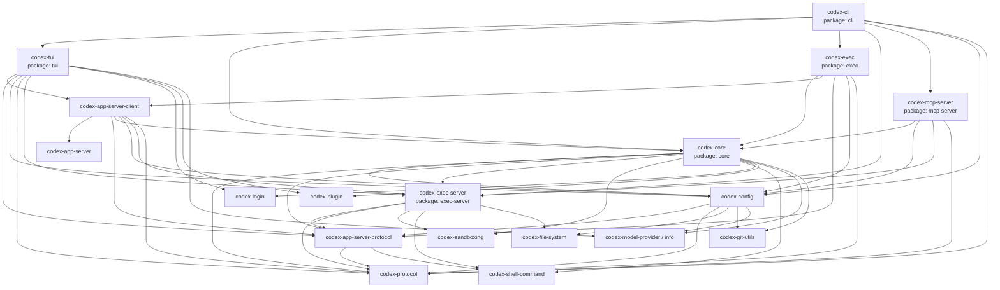

Rust 项目刚开始看起来只有 `Cargo.toml` 和 `src/main.rs`，但项目变大之后，很快会遇到四个容易混在一起的概念：**workspace**、**package**、**Cargo.toml** 和 **crate**。这篇笔记用 Codex 的 Rust 源码做例子，把这些词放回它们真正的位置。🦀

## 先把概念摆正

可以先记住这个层级：

```text
workspace
  contains one or more packages

package
  is described by one Cargo.toml
  contains one or more crates / targets

crate
  is one compilation unit
  can be a library crate or a binary crate
```

更具体地说：

| 概念 | 含义 | 常见文件或位置 |
| --- | --- | --- |
| `Cargo.toml` | Cargo manifest，可以描述一个 package、一个 workspace，或者两者同时描述 | `Cargo.toml` |
| package | Cargo 管理的代码包，有名字、版本、依赖等元数据 | 某个带 `Cargo.toml` 的目录 |
| crate | Rust 的编译单元，可以产出库或可执行文件 | `src/lib.rs`、`src/main.rs`、`src/bin/*.rs` |
| workspace | 一组一起管理的 package | 根目录的 `Cargo.toml` 里有 `[workspace]` |

一个小项目可能只有一个 package：

```text
my-app/
  Cargo.toml
  src/
    main.rs      # binary crate
    lib.rs       # library crate, optional
```

而一个大项目通常会用 workspace：

```text
repo/
  Cargo.toml          # workspace manifest
  crates/
    core/
      Cargo.toml      # package
      src/lib.rs      # crate
    cli/
      Cargo.toml      # package
      src/main.rs     # crate
```

这里要注意一个细节：**crate 不是“一个源文件”，也不是简单等同于“一个二进制文件”**。crate 是一次编译的单位。binary crate 会产出可执行文件，library crate 会产出库。一个 crate 可以由 crate root 加上多个 module 组成，比如 `src/main.rs` 通过 `mod config;` 引入 `src/config.rs`。

## Git repo 和 Cargo package 的关系

Git repo 和 Cargo package 不是同一层概念。

一个 repo 可以只有一个 package：

```text
repo/
  Cargo.toml
  src/main.rs
```

也可以有多个 package，通常用 workspace 管起来：

```text
repo/
  Cargo.toml
  crates/a/Cargo.toml
  crates/b/Cargo.toml
```

但反过来，一个 package 通常不会横跨多个 git repo。Cargo 期望 package 的 manifest 和源码在同一个包目录树里。如果要使用另一个 repo 里的代码，通常是把它作为依赖引入：

```toml
[dependencies]
some_lib = { git = "https://github.com/example/some_lib" }
```

这表示 `some_lib` 是另一个 package 依赖，而不是当前 package 的一部分。

## Codex 源码里的 workspace

Codex 的 Rust 源码位于 `codex-rs/`。这个目录下的 `Cargo.toml` 是 workspace root manifest，里面有 `[workspace]`，并列出了很多成员 package，例如：

```toml
[workspace]
members = [
    "cli",
    "core",
    "tui",
    "mcp-server",
    "protocol",
    "config",
    # ...
]
```

所以 Codex Rust 代码不是“一个巨大 package”，而是一个 **Cargo workspace**。workspace 负责把这些 package 放在一起管理，并集中声明一些共享设置，例如版本、edition、license、workspace dependencies 等。📦

在 Codex 里，概念对应关系大致是：

| Cargo 概念 | Codex 源码中的例子 |
| --- | --- |
| workspace | `codex-rs/Cargo.toml` |
| package | `codex-rs/cli/`、`codex-rs/core/`、`codex-rs/tui/`、`codex-rs/mcp-server/` |
| package manifest | `codex-rs/cli/Cargo.toml`、`codex-rs/core/Cargo.toml` |
| binary crate | `codex-rs/cli/src/main.rs` 产出 `codex` |
| library crate | `codex-rs/cli/src/lib.rs` 产出 `codex_cli` |

## `codex-cli` package

`codex-rs/cli/Cargo.toml` 定义了一个 package：

```toml
[package]
name = "codex-cli"

[[bin]]
name = "codex"
path = "src/main.rs"

[lib]
name = "codex_cli"
path = "src/lib.rs"
```

这说明 `cli` 这个 package 里至少有两个 crate：

- `codex`：binary crate，从 `src/main.rs` 开始编译，最终产出命令行程序。
- `codex_cli`：library crate，从 `src/lib.rs` 开始编译，提供可被其他 crate 复用的代码。

这也是 package 和 crate 最容易混淆的地方：`codex-cli` 是 package 名，`codex` 是 binary crate 名，`codex_cli` 是 library crate 名。

## `codex-core` package

`codex-rs/core/Cargo.toml` 定义了核心 package：

```toml
[package]
name = "codex-core"

[lib]
name = "codex_core"
path = "src/lib.rs"

[[bin]]
name = "codex-write-config-schema"
path = "src/bin/config_schema.rs"
```

所以 `codex-core` 这个 package 也不只是一个 crate。它有一个核心 library crate `codex_core`，还额外定义了一个小的 binary crate `codex-write-config-schema`。

## `codex-tui` 和 `codex-mcp-server`

同样的模式也出现在其他 package 里：

- `codex-rs/tui/` 是 package `codex-tui`，包含 TUI 相关代码。
- `codex-rs/mcp-server/` 是 package `codex-mcp-server`，包含 MCP server 相关代码。

这些 package 之间通过 Cargo dependencies 互相连接。比如 `codex-cli` 依赖 `codex-core`、`codex-tui`、`codex-config`、`codex-protocol` 等 workspace package。也就是说，Codex 的顶层命令行入口并不是把所有逻辑都写在一个 crate 里，而是把功能拆成多个 package，再由 Cargo workspace 组合起来。

## 简化依赖图 🗺️

下面是一个简化后的内部依赖图。箭头表示“依赖于”。为了让图可读，这里省略了很多较小的 utility package 和外部依赖，比如 `tokio`、`serde`、`clap`。



从这个图可以看出一个粗略分层：

```text
用户入口层
  codex-cli
  codex-tui
  codex-exec
  codex-mcp-server

核心行为层
  codex-core
  codex-exec-server
  codex-app-server-client/server

共享基础层
  codex-config
  codex-protocol
  codex-app-server-protocol
  sandboxing / shell / model / plugin / git utils
```

`codex-cli` 更像总入口：它负责把不同运行模式串起来。`codex-core` 更像核心引擎：很多实际行为和业务逻辑会汇聚到这里。`codex-protocol` 和 `codex-config` 则更偏底层共享能力：很多上层 package 都需要它们。

## 怎么读这类 Rust 大仓库

读一个 Cargo workspace 时，可以按这个顺序看：

1. 先看 workspace root 的 `Cargo.toml`，确认有哪些 `members`。
2. 再挑一个入口 package，例如 `cli/`，看它自己的 `Cargo.toml`。
3. 找到 `[[bin]]` 和 `[lib]`，确认这个 package 产出哪些 crate。
4. 看 `[dependencies]`，理解它依赖哪些内部 package。
5. 顺着 `src/main.rs` 或 `src/lib.rs` 进入代码。

这个顺序比直接在 `src/` 里乱跳更稳，因为 Cargo manifest 已经告诉你项目的边界、入口和依赖方向。

## 小结

Rust/Cargo 的这几个概念可以这样记：

- **workspace** 是多个 package 的管理边界。
- **package** 是由一个 `Cargo.toml` 描述的发布和依赖单位。
- **crate** 是编译单位，可以是 binary crate，也可以是 library crate。
- **Cargo.toml** 是 manifest，可以描述 package，也可以描述 workspace。

映射到 Codex 源码里：

- `codex-rs/Cargo.toml` 是 workspace manifest。
- `cli/`、`core/`、`tui/`、`mcp-server/` 等目录是 package。
- `cli/src/main.rs`、`cli/src/lib.rs`、`core/src/lib.rs` 等是 crate root。
- package 之间的依赖关系写在各自的 `Cargo.toml` 里。

一旦把这几个层次分清楚，Codex 这样的 Rust 大型仓库就不再是一堆目录，而是一个由 Cargo workspace 组织起来的 package graph。✨

## 参考资料

- [The Cargo Book: Glossary](https://doc.rust-lang.org/cargo/appendix/glossary.html)
- [The Cargo Book: Workspaces](https://doc.rust-lang.org/cargo/reference/workspaces.html)
- [The Cargo Book: Cargo Targets](https://doc.rust-lang.org/cargo/reference/cargo-targets.html)
