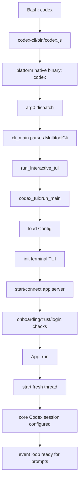

这篇文章整理一次对 Codex CLI 启动流程的源码阅读：从用户在 Bash 中输入 `codex` 开始，一直到 TUI 完成初始化、后端 session 就绪、可以接收用户提示词为止。

分析只基于源码路径、模块和函数关系，不依赖外部经验。重点不是“CLI 一般会怎样启动”，而是这个项目里的 `codex` 命令实际经过了哪些代码路径。

## 总览 🧭

默认交互路径可以概括为：



如果用户执行的是 `codex exec`、`codex login`、`codex mcp` 等子命令，流程会在顶层 CLI 分发阶段转向对应子命令。本文聚焦默认的交互式 TUI 路径，也就是直接执行 `codex`。

## 1. 包入口：从 `codex` 到 Node 启动器

源码入口定义在 `codex-cli/package.json`：

```json
{
  "bin": {
    "codex": "bin/codex.js"
  }
}
```

这说明包安装后，`codex` 命令会进入 `codex-cli/bin/codex.js`。Bash 如何查找 PATH 不属于 Codex 源码范围；源码能确认的是，Codex 自己暴露的命令入口就是这个 Node 脚本。

`bin/codex.js` 的职责很明确：

- 根据 `process.platform` 和 `process.arch` 计算目标平台 triple。
- 从平台映射表中选择对应的原生包。
- 查找 `vendor/<target-triple>/bin/codex`。
- 使用 `spawn(...)` 启动真正的 Rust 可执行文件。

它还会继承 stdio，并转发 `SIGINT`、`SIGTERM`、`SIGHUP` 等信号。传给 Rust 进程的数据主要包括：

- `process.argv.slice(2)`：用户传入的 CLI 参数。
- `process.env`：环境变量。
- `CODEX_MANAGED_BY_NPM` 或 `CODEX_MANAGED_BY_BUN`：包管理器来源信息。
- `CODEX_MANAGED_PACKAGE_ROOT`：包根路径信息。

继续执行的条件是：当前平台受支持，并且原生 `codex` 二进制存在。

## 2. Rust CLI 入口：`arg0_dispatch_or_else`

Rust CLI 的二进制入口在 `codex-rs/cli/src/main.rs`。`main()` 不直接解析业务参数，而是先调用：

```rust
arg0_dispatch_or_else(...)
```

这个函数来自 `codex-rs/arg0/src/lib.rs`。它先处理一些特殊调用模式，例如：

- `codex-execve-wrapper`
- `codex-linux-sandbox`
- `apply_patch` / `applypatch`
- 文件系统 helper
- core apply-patch helper

这些 helper 通过 `argv0` 或特殊参数分流。如果当前调用只是普通的 `codex`，这些分支不会消费流程，启动会继续进入正常 CLI。

这一层还会调用 `load_dotenv()` 读取 Codex home 下的 `.env`，但会过滤掉以 `CODEX_` 开头的 key。源码里的顺序很关键：dotenv 加载发生在线程和 Tokio runtime 创建之前，因为环境变量修改需要尽量早完成。

继续执行的条件是：当前进程没有被 helper 分支接管。

## 3. 准备 helper 别名和 Tokio runtime

普通 `codex` 调用继续后，`arg0` 层会调用 `prepare_path_env_var_with_aliases(...)`。

它可能创建临时符号链接，让同一个可执行文件可以通过不同的名字被调用，例如：

- `apply_patch`
- `applypatch`
- `codex-linux-sandbox`
- `codex-execve-wrapper`

随后，这个临时目录会被加入 `PATH`。这样后续子进程或工具只需要按名字调用 helper，就可以回到同一个二进制，由 `arg0_dispatch` 重新分流。

之后，源码会创建一个名为 `codex-main` 的线程，并为它设置 16 MiB stack，再在线程中构建 Tokio 多线程 runtime。传入主流程的数据是：

```rust
Arg0DispatchPaths {
    codex_self_exe,
    codex_linux_sandbox_exe,
    main_execve_wrapper_exe,
}
```

继续执行的条件是：runtime 创建成功，并且主 future 被执行。

## 4. 顶层 CLI 解析：`MultitoolCli`

真正的 CLI 解析发生在 `codex-rs/cli/src/main.rs` 的 `cli_main(...)`。

核心结构是 `MultitoolCli`，它包含：

- 全局 config overrides。
- feature toggles。
- remote options。
- `interactive: TuiCli`。
- `subcommand: Option<Subcommand>`。

这里会先把 feature toggle 折叠进 config overrides，再检查一些不支持的参数组合，例如 strict config 和 profile 的组合限制。

如果存在子命令，流程会进入对应分支。默认交互路径的关键条件是：

```rust
subcommand == None
```

满足这个条件时，`cli_main` 会把 root 层的 config flags 合并进 `interactive.config_overrides`，然后调用：

```rust
run_interactive_tui(...)
```

## 5. 进入交互式 TUI 包装层

`run_interactive_tui(...)` 仍然在 `codex-rs/cli/src/main.rs` 中。它不是 TUI 本体，而是 CLI 到 TUI 的保护层。

这一层做几件事：

- 标准化初始 prompt 的换行，把 CRLF/CR 统一成 LF。
- 读取 terminal 信息。
- 如果 terminal 是 dumb terminal，则根据 stdin/stderr 是否为 terminal 决定拒绝或提示确认。
- 解析 `--remote` 和 `--remote-auth-token-env`。
- 创建 `start_tui` closure，真正调用 `codex_tui::run_main(...)`。

remote 解析有明确条件：

- `--remote-auth-token-env` 只能和 `--remote` 一起使用。
- token env 必须存在且非空。
- remote endpoint 只允许符合源码约束的地址形式。

这一层还包了一圈本地 state DB 启动错误处理。如果 DB 被锁或损坏，会给出提示或尝试 repair，然后重试 TUI 启动。

继续执行的条件是：terminal 和 remote 检查通过，并且 `codex_tui::run_main(...)` 能继续启动。

## 6. TUI 主启动：把 CLI 输入变成 Config 输入 ⚙️

TUI 主函数在 `codex-rs/tui/src/lib.rs`：

```rust
codex_tui::run_main(...)
```

它首先把 CLI 参数翻译成配置构建所需的数据。例如：

- `--dangerously-bypass-approvals-and-sandbox` 会变成 full access sandbox 和 never approval。
- `--web-search` 会写入 `web_search = "live"` override。
- CLI 里的 sandbox、approval、model、provider、cwd、add-dir 等会进入 `ConfigOverrides`。
- `-c` 参数会通过 `CliConfigOverrides::parse_overrides` 解析。
- `find_codex_home()` 会解析 Codex home。

继续执行的条件是：CLI overrides 能正确解析，并且 Codex home 能找到。

## 7. 选择 app-server 目标

TUI 并不直接把所有请求发给 core session。它会先选择一个 app-server 目标：

- `Embedded`：在当前进程内启动 app server。
- `LocalDaemon`：复用本地 daemon。
- `Remote`：连接显式 remote endpoint。

相关逻辑在 `codex-rs/tui/src/lib.rs` 的 `AppServerTarget`、`maybe_probe_default_daemon_socket(...)` 和 `app_server_target_for_launch(...)`。

复用本地 daemon 有前置条件：CLI overrides 必须为空、loader overrides 必须是默认值、不能是 strict config，并且不能带某些不可重放的启动 override。否则会走 embedded。

默认情况下，没有显式 remote 且不能复用 daemon 时，会使用 embedded app server。

继续执行的条件是：app-server target 被确定。

## 8. 加载配置：从 bootstrap TOML 到完整 `Config`

配置加载分两层。

第一层是 bootstrap TOML。TUI 会根据 app-server target 选择 cwd 和环境来源，然后调用：

```rust
load_config_toml_or_exit(...)
```

之后会创建 cloud config bundle loader，并处理 OSS provider 选择。如果用户使用 `--oss`，源码会根据 CLI/config 中的 provider 信息决定是否需要交互式选择。

第二层是完整 `Config`：

```rust
load_config_or_exit(...)
```

它最终进入 `codex-rs/core/src/config/mod.rs` 的 `ConfigBuilder::build()`。`ConfigBuilder` 会合并：

- Codex home 下的配置。
- cwd/project 配置。
- CLI overrides。
- harness overrides。
- loader overrides。
- cloud config bundle。
- strict config 规则。

继续执行的条件是：完整 `Config` 构建成功。否则 TUI 会打印错误并退出。

## 9. 初始化运行期服务

拿到 `Config` 后，TUI 会初始化一批运行期服务：

- 删除 legacy TUI log。
- 初始化 OpenTelemetry provider。
- 记录进程启动信息。
- embedded 模式下初始化本地 state DB。
- 运行 personality migration，必要时重新加载配置。
- 检查 exec-policy warning。
- 设置 residency requirement。
- 校验 `--add-dir`。
- 对本地 workspace 执行 login restrictions。
- 初始化 tracing、feedback、log DB 等。

这里的条件很直接：任何强制检查失败都会中止启动；state DB 启动失败则返回上一层 repair 流程。

## 10. 初始化终端 UI

接着进入 `run_ratatui_app(...)`，并调用 `tui::init()`。

终端初始化逻辑在 `codex-rs/tui/src/tui.rs`，主要做：

- 检查 stdin/stdout 是 terminal。
- 启用 raw mode。
- 启用 bracketed paste。
- 启用键盘增强和 focus change。
- 清理终端输入缓冲。
- 安装 panic hook，确保异常时恢复终端。
- 创建 Crossterm backend 和 `CustomTerminal`。

随后构造 `Tui::new(...)`，内部会建立 frame requester、event broker、通知后端、颜色缓存等 UI 基础设施。

继续执行的条件是：终端模式设置成功。

## 11. 启动或连接 app server

TUI 通过 `start_app_server(...)` 获取 app-server client。

embedded 路径会调用：

```rust
start_embedded_app_server(...)
```

它构造 `InProcessClientStartArgs`，包含：

- `Arg0DispatchPaths`
- `Config`
- CLI overrides
- loader overrides
- strict config
- cloud config bundle
- state DB
- environment manager
- config warnings
- session source
- client name/version

然后进入 `codex-rs/app-server-client/src/lib.rs` 的：

```rust
InProcessAppServerClient::start(...)
```

remote/local daemon 路径则通过 endpoint 连接已有 app server。

继续执行的条件是：embedded app server 启动成功，或 remote/local daemon 连接成功。

## 12. embedded app server 的初始化握手

embedded app server 的实际启动在 `codex-rs/app-server/src/in_process.rs`。

流程是：

1. `start_uninitialized(...)` 创建 runtime、channel、auth manager、analytics client、message processor 等。
2. client 发送 `ClientRequest::Initialize`。
3. 初始化成功后发送 `ClientNotification::Initialized`。
4. client 侧启动 worker loop，用于处理 request、notification、response 和 event。

这一步完成后，TUI 拿到的是一个已经完成初始化握手的 app-server client。

继续执行的条件是：initialize request 成功。

## 13. Trust、登录和 onboarding

在正式创建会话前，TUI 会检查是否需要 onboarding。

相关逻辑包括：

- `should_show_trust_screen(...)`
- `get_login_status(...)`
- `should_show_onboarding(...)`
- `run_onboarding_app(...)`

如果当前 provider 需要 OpenAI auth，TUI 会通过 app server 读取 account 状态。若项目 trust 未设置，或登录状态不满足要求，就进入 onboarding。

继续执行的条件是：不需要 onboarding，或者用户完成 onboarding。若用户退出 onboarding，app server 会被关闭，启动流程结束。

## 14. 选择会话模式：fresh、resume、fork

接下来 TUI 决定打开哪种会话：

- 默认：`SessionSelection::StartFresh`
- `resume`：恢复已有 thread
- `fork`：从已有 thread fork

resume/fork 可能需要通过 app server 列出 thread、读取 thread，或打开 picker。它们还可能根据历史 thread 的 cwd 重新解析配置。

默认交互启动继续走 `StartFresh`。

继续执行的条件是：resume/fork 目标存在，或者默认 fresh session 被选中。

## 15. Bootstrap：读取账号和模型信息

进入主 App 前，TUI 会调用：

```rust
AppServerSession::bootstrap(...)
```

它会向 app server 发送：

- `GetAccount`
- `ModelList { include_hidden: true }`

然后选择默认模型，保存可用模型列表，并返回 `AppServerBootstrap`，里面包含 account、auth mode、plan、default model、available models 等信息。

继续执行的条件是：bootstrap 完成；某些启动 prompt 场景下 bootstrap 可以被延后到 `App::run` 内部。

## 16. 构造主 App 和 ChatWidget 💬

主循环入口是 `codex-rs/tui/src/app.rs` 的：

```rust
App::run(...)
```

它会创建：

- `app_event_tx/rx`
- `AppEventSender`
- model catalog
- telemetry context
- workspace command runner
- `ChatWidget`
- TUI event stream
- app-server event stream

对于 fresh session，`App::run` 会调用：

```rust
spawn_startup_thread_start(...)
```

同时设置：

```rust
chat_widget.set_queue_submissions_until_session_configured(true)
```

这表示 UI 可以先出现，但用户提交会被排队，直到后端 primary session 配置完成。

继续执行的条件是：App 状态构造完成，并且第一帧被调度。

## 17. 向 app server 请求创建 thread

fresh session 会通过 app server 创建新 thread。请求参数来自前面加载好的配置，包括：

- cwd
- model
- approval policy
- sandbox / permission profile
- workspace roots
- reasoning effort
- service tier
- collaboration mode
- personality

请求进入 `codex-rs/app-server/src/message_processor.rs`，再到 `codex-rs/app-server/src/request_processors/thread_processor.rs`。

thread processor 会：

1. 重新加载带 request overrides 的配置。
2. 解析环境和 dynamic tools。
3. 调用 `thread_manager.start_thread_with_options(...)`。
4. 最终进入 core 的 `Codex::spawn(...)`。

继续执行的条件是：app server 接收 thread start 请求并开始创建 core session。

## 18. Core session 初始化

core session 的关键代码在：

- `codex-rs/core/src/thread_manager.rs`
- `codex-rs/core/src/session/mod.rs`
- `codex-rs/core/src/session/session.rs`

`Codex::spawn(...)` 会准备真正的对话 session，包括：

- 加载 AGENTS/user instructions。
- 加载 exec policy。
- 解析 model 和 model provider。
- 解析 base instructions。
- 初始化 dynamic tools。
- 构建 `SessionConfiguration`。
- 创建 MCP manager、exec manager、hooks、rollout trace、auth/model managers、environment manager 等服务。

源码要求 core 发出的第一个事件必须是：

```rust
EventMsg::SessionConfigured
```

`thread_manager` 会读取第一个事件并校验它。如果第一个事件不是 `SessionConfigured`，thread 启动失败。

继续执行的条件是：core session 成功创建，并且第一个事件是 `SessionConfigured`。

## 19. thread 创建结果回到 TUI

app server 收到 core session 配置完成后，会构造 `ThreadStartResponse`，其中包含：

- thread id
- session config
- model/provider
- cwd
- workspace roots
- instruction sources
- approval policy
- sandbox / permission profile
- reasoning settings

它还会发送 `ServerNotification::ThreadStarted`。

TUI 侧收到 startup thread 结果后，会调用：

```rust
handle_startup_thread_started(...)
```

然后进入：

```rust
enqueue_primary_thread_session(...)
```

这一步会设置 `primary_thread_id`，把 session config 安装进 `ChatWidget`，回放 startup turns，并取消“等待 session 配置”的提交队列。

继续执行的条件是：primary thread 被设置，ChatWidget 不再因为 session 未配置而排队。

## 20. 准备接收用户提示词 ✅

最后，`App::run` 进入主事件循环。它同时监听：

- app 内部事件。
- active thread 事件。
- terminal keyboard/paste/draw/resize 事件。
- app-server 事件。

用户输入的路径是：

```text
terminal event
-> App event handler
-> ChatWidget
-> AppCommand::UserTurn
-> App::handle_event
-> app_server.turn_start / turn_steer
```

因此，从源码角度看，Codex “准备好接收用户提示词”的条件不是单纯 TUI 已经画出来，而是：

- 主事件循环已经运行。
- primary thread 已经创建并配置。
- `ChatWidget` 已解除 session-configured 前的提交排队。
- 用户输入可以被转换成 `UserTurn` 并提交给 app server。

如果命令行启动时已经带了初始 prompt，它会在 primary session 配置完成后自动提交。否则，TUI 会等待用户在输入框里键入并提交提示词。

## 小结

Codex CLI 的启动不是一个简单的“打开 TUI”过程，而是一条分层清晰的链路：

| 阶段 | 主要职责 |
|---|---|
| Node launcher | 选择并启动平台原生 Rust 二进制 |
| arg0 dispatch | 处理 helper alias、dotenv、PATH alias、runtime |
| CLI parser | 区分交互模式和子命令 |
| TUI startup | 解析配置、选择 app-server target、初始化终端 |
| app server | 提供前端和 core session 之间的协议层 |
| core session | 创建真正的 Codex 对话运行时 |
| App event loop | 接收键盘输入并把用户提示词提交给后端 |

这条链路里最关键的 readiness 边界是 `SessionConfigured`：只有 core session 发出这个事件，app server 才能返回 thread 创建结果，TUI 才会设置 primary thread，`ChatWidget` 才会停止排队输入。也就是说，Codex 真正“可接收提示词”的时刻，发生在终端 UI 初始化之后、后端 session 配置完成之后。
