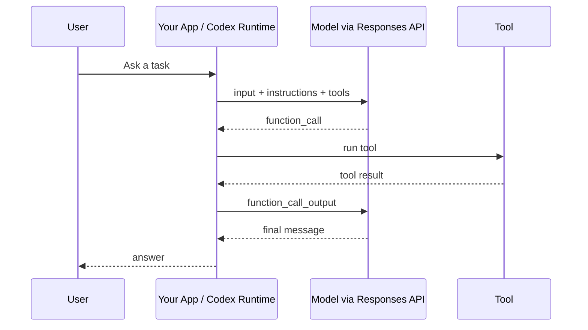
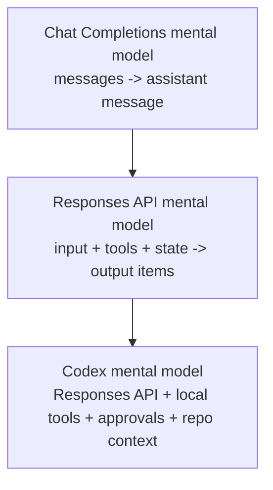

如果你已经用过 Chat Completions API，再去读 Responses API 文档，很容易有一种感觉：字段太多、概念太散、示例太长，不知道哪些是核心，哪些只是高级选项。

这篇文章不试图复述官方文档。它的目标只有一个：帮你建立一个能理解 Codex 的 Responses API 心智模型。🧭

## 先说结论

Responses API 不是“新版 Chat Completions”这么简单。

更准确地说，它是一个更适合 **agent 工作流** 的模型接口：

```text
instructions + input + tools + conversation state + reasoning settings
  -> model work
  -> output items: message / function_call / reasoning / ...
```

如果 Chat Completions 的核心是：

```text
messages -> assistant message
```

那么 Responses API 的核心更像是：

```text
structured input -> model produces structured output items -> app may run tools -> continue
```

Codex 关心的正是后者。

## 从 Chat Completions 到 Responses API

Chat Completions 里的基本请求通常长这样：

```json
{
  "model": "...",
  "messages": [
    { "role": "system", "content": "..." },
    { "role": "user", "content": "..." }
  ]
}
```

它的心智模型很直接：你给模型一组聊天消息，模型返回一条 assistant 消息。

Responses API 仍然可以表达类似的聊天输入，但它不再把“一轮聊天”当作唯一中心。它把一次模型调用建模成一个更通用的 **response object**：

```json
{
  "model": "gpt-4.1-mini",
  "input": "Hi!"
}
```

返回值也不是只有一段文本，而是一个 response 对象，其中 `output` 是一个数组。数组里的 item 可能是普通消息，也可能是工具调用、reasoning item，或者其他结构化输出。

这就是第一个重要转变：

| Chat Completions | Responses API |
| --- | --- |
| 以 `messages` 为中心 | 以 `response` 为中心 |
| 输出主要是一条 assistant message | 输出是多个 typed output items |
| 工具调用像聊天的附加能力 | 工具调用是 agent 循环的一等公民 |
| 更像“对话接口” | 更像“模型工作接口” |

## 最小心智模型：一次 Response 里发生了什么

你可以把一次 Responses API 调用拆成五块：

```text
1. instructions：高优先级行为指导
2. input：这次用户或系统给模型的新输入
3. tools：模型可用的工具
4. state：上一轮 response 或 conversation 状态
5. settings：reasoning、stream、store、text.format 等控制项
```

模型返回的不是“纯文本”，而是：

```text
response.output = [
  message,
  function_call,
  reasoning,
  ...
]
```

普通聊天时，你只看到 `message`。但 Codex 这样的 agent 更关心 `function_call` 和工具结果回传。

## `instructions` 和 `input`：不要混在一起

在 Chat Completions 里，你可能习惯把 system message、user message 全部塞进 `messages`。

Responses API 里更清晰的分工是：

- `instructions`：告诉模型“你应该怎样行动”
- `input`：告诉模型“这次要处理什么”

例如：

```json
{
  "model": "gpt-4.1-mini",
  "instructions": "Always answer in uppercase.",
  "input": "Hi!"
}
```

这和 Codex 很相关。Codex 的行为不是只由用户一句 prompt 决定的，它还会受到系统指令、开发者指令、仓库里的 `AGENTS.md`、当前任务上下文等影响。

你可以把这些都理解成会进入模型上下文的“指导层”。

## `input` 不只是字符串

Responses API 的 `input` 可以是简单字符串：

```json
"input": "Hi!"
```

也可以是消息数组：

```json
"input": [
  {
    "role": "user",
    "content": "Hi!"
  }
]
```

还可以进一步变成 typed content：

```json
"input": [
  {
    "role": "user",
    "content": [
      {
        "type": "input_text",
        "text": "Hi!"
      }
    ]
  }
]
```

一开始这看起来很啰嗦，但它解决了一个问题：真实 agent 输入不只有文字。

Codex 可能要把这些东西都喂给模型：

- 用户任务
- 文件片段
- 搜索结果
- shell 命令输出
- patch 结果
- approval 状态
- 历史对话
- 工具返回值

所以 Responses API 需要 typed input，而不是只靠一串聊天文本。

## Conversation state：不用每次都重发全部上下文

Responses API 支持用 `previous_response_id` 继续上一轮：

```json
{
  "model": "gpt-4.1-mini",
  "previous_response_id": "resp_...",
  "input": "What did I just say?"
}
```

心智模型是：

```text
response A
   ↓ previous_response_id
response B
   ↓ previous_response_id
response C
```

这不是 Codex 的全部线程实现细节，但概念上很接近：Codex 需要维护一个连续的工作会话，而不是每次都把世界从零开始描述一遍。

## 工具调用：理解 Codex 的关键

如果你只记一个 Responses API 概念，请记这个：**tool calling 是 agent 的核心循环**。

普通模型只能生成文本。工具调用让模型可以说：

> 我需要调用这个工具，并传入这些参数。

例如你给模型一个工具：

```json
"tools": [
  {
    "type": "function",
    "name": "get_weather",
    "description": "Get the current weather for a city.",
    "parameters": {
      "type": "object",
      "properties": {
        "city": { "type": "string" }
      },
      "required": ["city"],
      "additionalProperties": false
    },
    "strict": true
  }
]
```

模型不会真的执行 `get_weather`。它会返回一个 `function_call`：

```json
{
  "type": "function_call",
  "name": "get_weather",
  "arguments": "{\"city\":\"Paris\"}",
  "call_id": "call_..."
}
```

然后你的程序执行工具，再把结果发回去：

```json
{
  "type": "function_call_output",
  "call_id": "call_...",
  "output": "Paris weather: 18 C and cloudy."
}
```

最后模型基于工具结果生成最终回答。

完整循环是：



这就是 Codex 的主干，只是 Codex 的工具不是 `get_weather`，而是更像：

- 搜索文件
- 读取文件
- 运行 shell 命令
- 应用 patch
- 更新计划
- 请求用户批准
- 返回最终总结

## Function tools 和 built-in tools 不一样

Responses API 里有两类工具容易混淆：

| 类型 | 谁执行 | 例子 |
| --- | --- | --- |
| function tools | 你的应用执行 | `get_weather`、查数据库、调用内部 API |
| built-in tools | OpenAI 提供运行时 | web search、file search、code interpreter 等 |

Function tool 的模式是：

```text
model asks -> your app runs -> your app sends result back
```

Built-in tool 的模式更像：

```text
model asks -> OpenAI tool runtime runs -> model continues
```

学习 Codex 时，优先理解 function tool 的循环，因为它最像 Codex 调用本地工具的方式。

## Streaming：为什么 Codex 能边想边显示进度

Responses API 可以 `stream: true`。这时返回的不是一个完整 JSON，而是一串事件：

```text
event: response.created
event: response.output_item.added
event: response.output_text.delta
event: response.output_text.done
event: response.completed
```

这对 Codex 很重要，因为用户体验不是“等半分钟后突然出现一坨结果”，而是：

- 正在思考
- 准备调用工具
- 正在运行命令
- 收到命令输出
- 正在编辑文件
- 最终总结

Streaming 让这些状态可以被 CLI、IDE 或 UI 实时展示出来。

## Reasoning：知道概念即可

Responses API 支持 reasoning 相关设置，例如：

```json
"reasoning": {
  "effort": "low"
}
```

对 Codex 来说，reasoning 很重要，因为写代码、调试、规划修改通常比普通问答更需要推理。

但初学时不用纠结所有细节。你只需要知道：

- reasoning model 可能返回 `reasoning` output item
- usage 里可能有 `reasoning_tokens`
- 更高 reasoning effort 通常意味着更多时间和 token
- reasoning summary 可能出现，但不是每个简单请求都会有

## 哪些概念先别管 🧹

为了理解 Codex，你不需要一次记住全部 Responses API 参数。

可以暂时放低优先级的有：

- 删除 response
- metadata
- background mode
- temperature / top_p / penalties
- audio input/output
- 复杂的 truncation 策略
- 大部分内置工具细节
- response retrieval 的所有管理接口

这些都可能有用，但不是理解 Codex 的入口。

## 建议的阅读顺序

如果你已经读过官方文档但觉得太长，可以按这个顺序重新读：

1. **Create response**
   先看 `model`、`input`、`instructions`、`output`。

2. **Input and output items**
   重点看 typed input、message output、function_call output。

3. **Conversation state**
   理解 `previous_response_id` 或类似状态续接机制。

4. **Function calling**
   重点掌握 `tools`、`function_call`、`call_id`、`function_call_output`。

5. **Streaming**
   看懂事件流即可，不必背所有事件名。

6. **Reasoning**
   理解 effort、reasoning item、reasoning token。

7. **其他高级能力**
   structured output、built-in tools、background、metadata 等按需学习。

## 把它映射回 Codex

最终你可以用一句话理解 Codex 和 Responses API 的关系：

> Responses API 提供模型交互协议；Codex 是构建在这个协议上的代码 agent 运行时。

Codex 不是简单地“问模型一句话”。它更像这个循环：

```text
用户任务
  -> Codex 收集仓库上下文和指令
  -> 通过 Responses API 发给模型
  -> 模型请求工具调用
  -> Codex 执行命令、读文件、写 patch 或请求批准
  -> Codex 把工具结果发回模型
  -> 循环，直到模型给出最终回答
```

这也是为什么只懂 Chat Completions 会觉得 Codex 很难理解。Chat Completions 的心智模型是“聊天”；Codex 的心智模型是“模型驱动的工具循环”。

## 最后记这张图



你不需要背完 Responses API 的每个字段。先抓住这五个词就够了：

```text
instructions
input/output items
conversation state
tool calls
streaming
```

如果这些概念通了，再去读官方文档，很多细节就会自动归位。Codex 也会从“一个神秘的代码助手”，变成一个更容易分析的 agent runtime。✨
