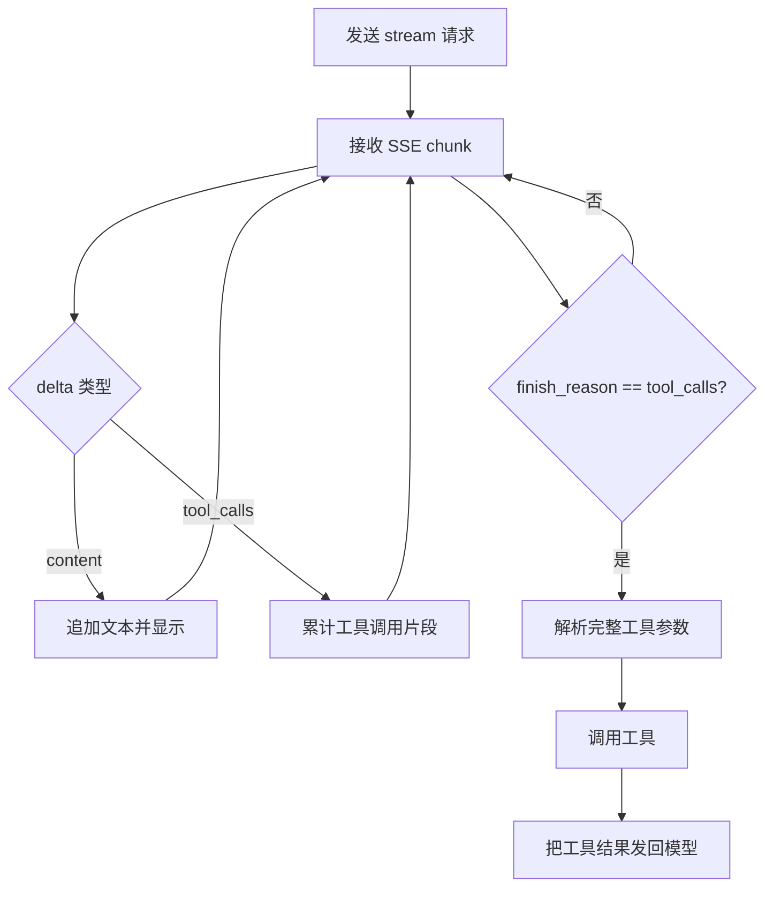

## 为什么要先理解 SSE？ 🌊

在 Chat Completions API 中，如果请求里设置了 `stream: true`，返回值不再是一次性完成的完整 JSON，而是一串通过 SSE（Server-Sent Events）传回来的事件。

在网络层面，它大致长这样：

```text
data: {"id":"chatcmpl_...","object":"chat.completion.chunk",...}

data: {"id":"chatcmpl_...","object":"chat.completion.chunk",...}

data: [DONE]
```

`data: [DONE]` 之前的每个 `data:` 都是一段 JSON。应用程序真正要处理的，是这些 JSON chunk 里的 `choices[].delta`。

## 非流式与流式的核心差异

非流式返回里，最终答案通常放在 `message` 中：

```json
{
  "message": {
    "role": "assistant",
    "content": "Hello there."
  }
}
```

流式返回里，模型不会一次给出完整 `message`，而是不断给出增量 `delta`：

```json
{ "delta": { "role": "assistant" } }
{ "delta": { "content": "Hello" } }
{ "delta": { "content": " there" } }
{ "delta": { "content": "." } }
{ "delta": {} }
```

所以流式处理的基本心智模型是：**不要等待完整消息，而是把每个 chunk 的 delta 折叠成最终消息。**

## 文本输出：看到 content 就追加显示

如果 `delta` 中包含 `content`，它就是模型返回文本的一小段。客户端应该把它追加到当前文本后面，并可以立即显示给用户。

```python
text = ""

for chunk in stream:
    delta = chunk.choices[0].delta

    if delta.content:
        text += delta.content
        display(text)
```

这也是流式输出看起来像“逐字出现”的原因：界面并不是等模型说完，而是在每个文本片段到达时更新显示。

## 工具调用：看到 tool_calls 要先累计 🧩

当模型决定调用工具时，`delta` 里可能不会出现 `content`，而是出现 `tool_calls`。

一个工具调用的参数也可能被拆成多个 chunk：

```json
{
  "delta": {
    "tool_calls": [
      {
        "index": 0,
        "id": "call_abc",
        "type": "function",
        "function": {
          "name": "get_weather",
          "arguments": "{\"city\":\"San"
        }
      }
    ]
  }
}
```

后续 chunk 可能继续补全参数：

```json
{
  "delta": {
    "tool_calls": [
      {
        "index": 0,
        "function": {
          "arguments": " Francisco\"}"
        }
      }
    ]
  }
}
```

因此，程序不能在第一次看到 `tool_calls` 时就立刻调用工具。那时参数可能还是半截 JSON，直接解析会失败，或者得到不完整的调用。

正确做法是：按照 `tool_calls[].index` 收集每个工具调用的碎片，持续拼接 `function.arguments`，直到这一轮流式输出结束，并且 `finish_reason` 表明工具调用已经完成。

## 不要只看第一个 SSE 事件

一个常见误解是：检查第一个 SSE event，如果 `delta` 有 `content` 就当作文本输出，如果有 `tool_calls` 就走工具调用。

这个判断太早了。

第一个 chunk 很可能只是角色信息：

```json
{
  "delta": {
    "role": "assistant"
  }
}
```

它既没有 `content`，也没有 `tool_calls`。而且，模型也可能先输出一些文本，再进入工具调用。因此，逻辑不应该只依赖第一个 SSE event，而应该处理整个 stream。

## 推荐的处理流程 ✅

可以把逻辑理解成一个小型状态机：

```python
text = ""
tool_calls = {}

for chunk in stream:
    choice = chunk.choices[0]
    delta = choice.delta

    if delta.content:
        text += delta.content
        display(text)

    if delta.tool_calls:
        collect_tool_call_parts(tool_calls, delta.tool_calls)

    if choice.finish_reason == "tool_calls":
        calls = build_complete_tool_calls(tool_calls)
        call_tools(calls)
```

关键点有三个：

- 处理每一个 chunk，而不是只看第一个 chunk。
- `delta.content` 到达时可以立即追加显示。
- `delta.tool_calls` 到达时只累计，不立即执行工具。

## 什么时候真正调用工具？

工具调用应该发生在模型完成这一轮 tool call 输出之后。

判断信号通常是该 choice 的：

```json
"finish_reason": "tool_calls"
```

此时可以认为工具调用的结构已经完整：工具名、工具 ID、参数片段都已经收集完。然后应用程序再解析参数、调用真实工具，并把工具结果作为下一轮消息发回模型。

也就是说，完整流程是：



## 一句话总结

SSE streaming 下的 Call Tool 逻辑不是“看第一个事件决定分支”，而是“持续消费所有 chunk”：有 `content` 就显示，有 `tool_calls` 就累计，直到 `finish_reason == "tool_calls"` 后再调用工具。这样既能保留流式文本体验，也能避免对半截工具参数过早执行。 ✨
