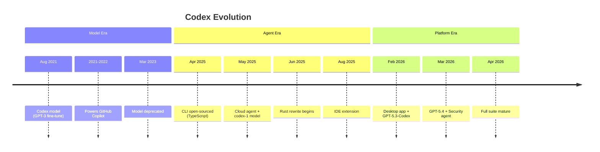

# OpenAI Codex: From Code Model to AI Agent Ecosystem

## 🧭 Context

This document captures research on OpenAI Codex as part of a broader study of popular AI code agents. The goal is to understand how production AI agents are designed and evolved — lessons to inform building a custom AI code agent.

> **Study path**: Aider (articles, completed) → **Codex (this document)** → more agents to follow.

---

## 📛 Naming: What "Codex" Actually Means

"Codex" is an overloaded name at OpenAI. It has referred to three distinct things over time:

| Name | What It Is | Status |
|------|-----------|--------|
| **Codex (2021 model)** | Fine-tuned GPT-3 for code, trained on 159GB of Python from 54M GitHub repos | ❌ Deprecated (Mar 2023) |
| **codex-1 (2025 model)** | o3 variant optimized for software engineering | ✅ Active (succeeded by GPT-5.x-Codex) |
| **Codex (2025+ agent)** | Full AI code agent platform — CLI, Cloud, App, IDE extension | ✅ Active |

When people say "Codex" today, they almost always mean the **agent platform**, not the original 2021 model.

---

## 📅 Development History

The evolution of Codex tells the story of AI moving from **autocomplete → agent → platform**:

### Era 1: The Model (2021–2023)

| Date | Event |
|------|-------|
| Aug 2021 | **Codex model launched** — fine-tuned GPT-3, API private beta |
| 2021–2022 | Powers **GitHub Copilot** — inline code completion era |
| Mar 2023 | **Codex model deprecated** — Copilot moves to GPT-4, name goes dormant |

### Era 2: The Agent is Born (2025)

| Date | Event |
|------|-------|
| Apr 16, 2025 | **Codex CLI open-sourced** — TypeScript/Node terminal agent |
| May 16, 2025 | **Codex Cloud launched** — research preview, powered by codex-1 (o3-based) |
| Jun 3, 2025 | Codex Cloud available to ChatGPT Plus users |
| Jun 2025 | **Rust rewrite** of CLI begins, beta released |
| Aug 28, 2025 | **IDE extension launched** — VS Code, Cursor, Windsurf |
| Sep 2025 | GPT-5-Codex model available via API |

### Era 3: Full Platform (Late 2025–2026)

| Date | Event |
|------|-------|
| Dec 2025 | GPT-5.2 released (400K context window) |
| Jan 14, 2026 | GPT-5.2-Codex — optimized for agentic workflows |
| Feb 5, 2026 | **Desktop app launched** (macOS) + GPT-5.3-Codex |
| Feb 12, 2026 | GPT-5.3-Codex-Spark — low-latency variant |
| Mar 4, 2026 | Desktop app on Windows |
| Mar 5, 2026 | GPT-5.4 — flagship model with computer use |
| Mar 2026 | **Codex Security** — dedicated vulnerability-finding agent |
| Apr 2026 | CLI is 95.6% Rust. Full suite: App, CLI, IDE, Cloud |



### The Big Picture

```
2021  Completion    → predict the next token
2023  Conversation  → understand and respond to instructions
2025  Agency        → plan, use tools, execute autonomously
2026  Platform      → multi-model, multi-interface, multi-agent
```

Each step added a capability layer: **completion → conversation → agency → platform**.

---

## 🔀 The Four Interfaces: Comprehensive Comparison

### Basics

| | 🖥️ Desktop App | 🧩 IDE Extension | ⌨️ CLI | ☁️ Cloud |
|---|---|---|---|---|
| **Released** | Feb 5, 2026 | Aug 28, 2025 | Apr 16, 2025 | May 16, 2025 |
| **Open Source** | No | No | ✅ Yes (Apache 2.0) | No |
| **Built With** | Electron + Rust core | TypeScript (VS Code ext) | Rust (rewritten from TS) | OpenAI infra |
| **Platform** | macOS, Windows | macOS, Linux (Win experimental) | macOS, Linux (Win experimental) | Web browser |
| **Runs On** | Local machine | Local machine | Local machine | OpenAI cloud containers |
| **Pricing** | ChatGPT Plus ($20/mo)+ | ChatGPT Plus ($20/mo)+ | Free tool + API key or plan | ChatGPT Plus ($20/mo)+ |

### Execution Model

| | 🖥️ Desktop App | 🧩 IDE Extension | ⌨️ CLI | ☁️ Cloud |
|---|---|---|---|---|
| **Code execution** | Local, sandboxed | Local | Local, sandboxed | Cloud container |
| **Internet access** | Yes | Yes (web search) | Yes (web search) | ❌ Disabled by default during agent phase |
| **Sandbox** | Built-in worktree isolation | Editor-level | Configurable (workspace-write / full-access) | Fully isolated, network-restricted |
| **Parallel tasks** | ✅ Multi-agent side by side | ❌ Single thread | ❌ Single session | ✅ Multiple tasks in parallel |

### Feature Matrix

| Feature | 🖥️ App | 🧩 IDE | ⌨️ CLI | ☁️ Cloud |
|---|:---:|:---:|:---:|:---:|
| Read/edit/run code | ✅ | ✅ | ✅ | ✅ |
| Git integration | Built-in | Via editor | Via terminal | Auto-clone, proposes PRs |
| Worktree support | ✅ Built-in | ❌ | Manual | Auto per task |
| Web search | ✅ | ✅ | ✅ | ❌ (offline default) |
| Image input | ✅ | ✅ Drag & drop | ❌ | ✅ |
| MCP / Plugins | ✅ | ✅ | ✅ | Limited |
| Skills | ✅ | ✅ | ✅ | ❌ |
| Automations / Cron | ✅ | ❌ | ❌ | ❌ |
| Subagents | ✅ | ❌ | ✅ | ✅ |
| Terminal reading | N/A | ✅ | N/A (is terminal) | N/A |
| AGENTS.md | ✅ | ✅ | ✅ | ✅ |
| Model selection | ✅ | ✅ | ✅ | ✅ |
| Native PR proposals | Via git | Via git | Via git | ✅ Built for async PRs |
| Review pane / diff UI | ✅ | Via editor | Terminal diff | ✅ Web review UI |
| Secrets management | ❌ | ❌ | ❌ | ✅ Encrypted, setup-phase only |

### Best For

| | 🖥️ Desktop App | 🧩 IDE Extension | ⌨️ CLI | ☁️ Cloud |
|---|---|---|---|---|
| **Ideal user** | Power users managing multiple agents | Devs who live in VS Code | Terminal-native devs | Async delegation |
| **Analogy** | Command center | Copilot on steroids | Claude Code / Aider equivalent | Junior dev in background |
| **Strength** | Multi-agent orchestration + automations | Inline context from open files | Lightweight, scriptable, open source | Fire-and-forget parallel tasks |

---

## 🏗️ Architecture Highlights

### Desktop App (Electron + Rust)

The architecture spans three process layers:

- **Electron/React**: windowing, ProseMirror editor, OAuth2 authentication
- **Rust core**: the actual intelligence — agent loop, sandboxing, tool execution
- **70-method IPC API** surface between layers
- Built-in automation/cron system for scheduled background tasks

### CLI (Rust)

- Originally TypeScript/Node → rewritten in Rust (95.6% as of Apr 2026)
- Reasons for rewrite: zero-dependency install, native security bindings, lower memory (no GC)
- Sandboxing modes: `workspace-write` (default, scoped) and `danger-full-access`
- MCP support for extensibility via `~/.codex/config.toml`

### Cloud

- Two-phase runtime: **setup** (network-enabled, installs deps) → **agent** (offline by default)
- Each task runs in isolated container with repo pre-loaded
- Container state cached up to 12 hours
- Secrets encrypted separately, available only during setup phase, removed before agent runs

---

## 🔑 Models Powering Codex

| Model | Released | Notes |
|-------|----------|-------|
| codex-1 | May 2025 | o3 variant optimized for SWE |
| codex-mini-latest | 2025 | Smaller model for CLI, $1.50/M input tokens |
| GPT-5-Codex | Sep 2025 | First GPT-5 variant for code |
| GPT-5.2-Codex | Jan 2026 | Context compaction, SWE-Bench Pro 56.4% |
| GPT-5.3-Codex | Feb 2026 | Improved performance |
| GPT-5.3-Codex-Spark | Feb 2026 | Low-latency variant for real-time coding |
| GPT-5.4 | Mar 2026 | Flagship, native computer use |
| GPT-5.4 mini | Mar 2026 | Available across all Codex surfaces |

---

## 💡 Lessons for Building an AI Code Agent

From studying Codex's evolution, several design principles emerge:

1. **Start with CLI** — Codex started as a simple terminal tool. CLI-first is the fastest way to iterate on an agent loop without UI complexity.

2. **Tool use is the core** — The agent's power comes from its tools (file read/write, bash, git, web search), not just the model. Design the tool layer carefully.

3. **Sandboxing matters early** — Codex invested in sandboxing from day one. Letting an agent run code without guardrails is a non-starter for real usage.

4. **Extensibility via protocol** — MCP (Model Context Protocol) became the standard plugin mechanism. Building on open protocols beats proprietary plugin systems.

5. **The CLI is the open-source part** — For studying how agents actually work, the Codex CLI source code (Rust, Apache 2.0) is the primary learning resource.

6. **Model-agent separation** — The agent layer is model-aware but model-independent in design. The same agent framework ran on codex-1, GPT-5, GPT-5.2, GPT-5.3, and GPT-5.4 — swapping models without rewriting the agent.

---

## 🔗 References

- [Codex CLI — GitHub][codex-gh]
- [Codex Developer Docs][codex-docs]
- [Codex App Features][app-features]
- [Codex IDE Extension][ide-docs]
- [Codex Cloud Environments][cloud-envs]
- [Codex Sandboxing][sandbox]
- [Codex Pricing][pricing]
- [Introducing Codex — OpenAI Blog][intro-blog]
- [Unrolling the Codex Agent Loop — OpenAI Blog][agent-loop]
- [Codex CLI Rust Rewrite — InfoQ][rust-rewrite]
- [Codex Architecture — Jiwei Yuan][arch-blog]

[codex-gh]: https://github.com/openai/codex
[codex-docs]: https://developers.openai.com/codex
[app-features]: https://developers.openai.com/codex/app/features
[ide-docs]: https://developers.openai.com/codex/ide
[cloud-envs]: https://developers.openai.com/codex/cloud/environments
[sandbox]: https://developers.openai.com/codex/concepts/sandboxing
[pricing]: https://developers.openai.com/codex/pricing
[intro-blog]: https://openai.com/index/introducing-codex/
[agent-loop]: https://openai.com/index/unrolling-the-codex-agent-loop/
[rust-rewrite]: https://www.infoq.com/news/2025/06/codex-cli-rust-native-rewrite/
[arch-blog]: https://yuanjiwei.com/20250215-architecture-behind-codex/
